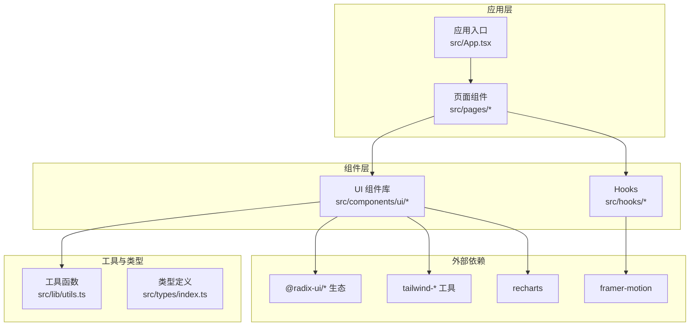
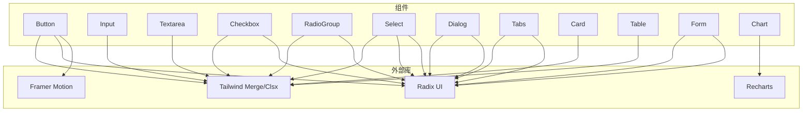
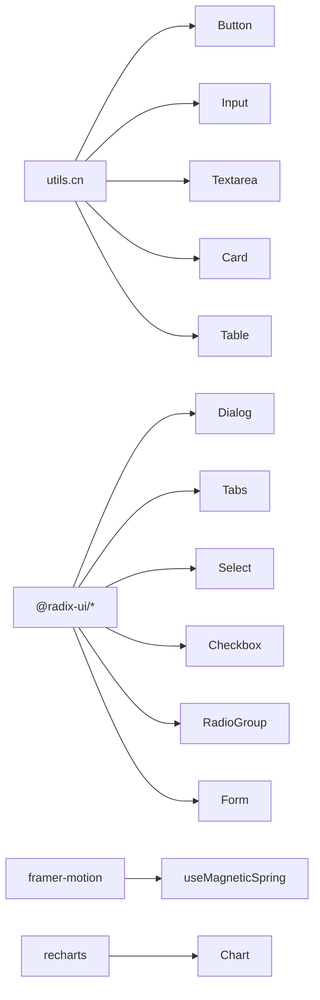

# API 参考文档

<cite>
**本文档引用的文件**
- [README.md](file://README.md)
- [package.json](file://package.json)
- [src/types/index.ts](file://src/types/index.ts)
- [src/lib/utils.ts](file://src/lib/utils.ts)
- [src/hooks/use-mobile.ts](file://src/hooks/use-mobile.ts)
- [src/hooks/useMagneticSpring.ts](file://src/hooks/useMagneticSpring.ts)
- [src/components/ui/button.tsx](file://src/components/ui/button.tsx)
- [src/components/ui/input.tsx](file://src/components/ui/input.tsx)
- [src/components/ui/form.tsx](file://src/components/ui/form.tsx)
- [src/components/ui/dialog.tsx](file://src/components/ui/dialog.tsx)
- [src/components/ui/select.tsx](file://src/components/ui/select.tsx)
- [src/components/ui/card.tsx](file://src/components/ui/card.tsx)
- [src/components/ui/table.tsx](file://src/components/ui/table.tsx)
- [src/components/ui/chart.tsx](file://src/components/ui/chart.tsx)
- [src/components/ui/tabs.tsx](file://src/components/ui/tabs.tsx)
- [src/components/ui/textarea.tsx](file://src/components/ui/textarea.tsx)
- [src/components/ui/checkbox.tsx](file://src/components/ui/checkbox.tsx)
- [src/components/ui/radio-group.tsx](file://src/components/ui/radio-group.tsx)
</cite>

## 目录
1. [简介](#简介)
2. [项目结构](#项目结构)
3. [核心组件](#核心组件)
4. [架构总览](#架构总览)
5. [详细组件分析](#详细组件分析)
6. [依赖关系分析](#依赖关系分析)
7. [性能考虑](#性能考虑)
8. [故障排除指南](#故障排除指南)
9. [结论](#结论)
10. [附录](#附录)

## 简介
本项目是一个基于 React + TypeScript + Vite 的前端应用模板，集成了大量现代化 UI 组件与工具函数，旨在提供一致的组件 API、可复用的 Hook、以及完善的类型定义。本文档面向开发者与集成者，系统性地梳理所有公开组件、Hook、工具函数的接口规范、参数与返回值、事件与回调、错误处理与性能特征，并给出使用示例与迁移建议。

## 项目结构
项目采用按功能分层的组织方式：组件位于 src/components/ui 下，通用 Hook 放在 src/hooks，工具函数位于 src/lib，类型定义在 src/types，页面入口在 src/pages。核心依赖通过 package.json 管理，UI 基于 Radix UI、Tailwind CSS、Framer Motion、Recharts 等生态。

图表来源
- [package.json:13-60](file://package.json#L13-L60)
- [src/components/ui/button.tsx:1-63](file://src/components/ui/button.tsx#L1-L63)
- [src/hooks/use-mobile.ts:1-20](file://src/hooks/use-mobile.ts#L1-L20)
- [src/hooks/useMagneticSpring.ts:1-33](file://src/hooks/useMagneticSpring.ts#L1-L33)
- [src/lib/utils.ts:1-7](file://src/lib/utils.ts#L1-L7)

章节来源
- [package.json:1-84](file://package.json#L1-L84)
- [README.md:1-74](file://README.md#L1-L74)

## 核心组件
本节概述所有公开组件的职责与对外 API，包括 props、事件、回调与样式扩展点。

- Button（按钮）
  - 功能：基础按钮，支持变体与尺寸变体，支持作为语义标签渲染。
  - 关键 props
    - className: 字符串，用于扩展样式
    - variant: 枚举，默认 default；可选值见下文
    - size: 枚举，默认 default；可选值见下文
    - asChild: 布尔，是否以子元素包装渲染
    - 其余继承自原生 button
  - 变体 variant：default、destructive、outline、secondary、ghost、link
  - 尺寸 size：default、sm、lg、icon、icon-sm、icon-lg
  - 数据属性：data-slot="button"，data-variant，data-size
  - 事件与回调：支持原生 button 的 onClick 等事件
  - 复杂度与性能：无状态组件，渲染开销极低
  - 章节来源
    - [src/components/ui/button.tsx:39-60](file://src/components/ui/button.tsx#L39-L60)

- Input（输入框）
  - 功能：基础输入框，支持类型与无障碍属性
  - 关键 props
    - className: 字符串，用于扩展样式
    - type: 字符串，原生 input 类型
    - 其余继承自原生 input
  - 数据属性：data-slot="input"
  - 事件与回调：支持原生 input 的 onChange、onFocus、onBlur 等
  - 章节来源
    - [src/components/ui/input.tsx:5-19](file://src/components/ui/input.tsx#L5-L19)

- Textarea（多行文本）
  - 功能：多行文本输入
  - 关键 props
    - className: 字符串，用于扩展样式
    - 其余继承自原生 textarea
  - 数据属性：data-slot="textarea"
  - 章节来源
    - [src/components/ui/textarea.tsx:5-16](file://src/components/ui/textarea.tsx#L5-L16)

- Checkbox（复选框）
  - 功能：受控或非受控复选框
  - 关键 props
    - className: 字符串，用于扩展样式
    - 其余继承自 @radix-ui/react-checkbox.Root
  - 数据属性：data-slot="checkbox"
  - 章节来源
    - [src/components/ui/checkbox.tsx:9-30](file://src/components/ui/checkbox.tsx#L9-L30)

- RadioGroup（单选组）
  - 功能：单选按钮组
  - 关键 props
    - className: 字符串，用于扩展样式
    - 其余继承自 @radix-ui/react-radio-group.Root
  - 子组件：RadioGroupItem
  - 数据属性：data-slot="radio-group"/"radio-group-item"
  - 章节来源
    - [src/components/ui/radio-group.tsx:9-43](file://src/components/ui/radio-group.tsx#L9-L43)

- Select（选择器）
  - 功能：下拉选择，支持分组、滚动按钮、图标等
  - 关键 props
    - size: 枚举，"sm"|"default"，默认 "default"
    - 其余继承自 @radix-ui/react-select.*
  - 子组件：SelectTrigger、SelectContent、SelectItem、SelectLabel、SelectSeparator、SelectScrollUpButton、SelectScrollDownButton、SelectValue、SelectGroup
  - 数据属性：data-slot="select-*"
  - 章节来源
    - [src/components/ui/select.tsx:25-175](file://src/components/ui/select.tsx#L25-L175)

- Dialog（对话框）
  - 功能：模态对话框，支持门户、覆盖层、标题与描述
  - 关键 props
    - showCloseButton: 布尔，是否显示关闭按钮，默认 true
    - 其余继承自 @radix-ui/react-dialog.*
  - 子组件：Dialog、DialogTrigger、DialogPortal、DialogOverlay、DialogContent、DialogHeader、DialogFooter、DialogTitle、DialogDescription、DialogClose
  - 数据属性：data-slot="dialog-*"
  - 章节来源
    - [src/components/ui/dialog.tsx:7-141](file://src/components/ui/dialog.tsx#L7-L141)

- Tabs（选项卡）
  - 功能：选项卡容器与触发器
  - 关键 props：全部继承自 @radix-ui/react-tabs.*
  - 子组件：Tabs、TabsList、TabsTrigger、TabsContent
  - 数据属性：data-slot="tabs-*"
  - 章节来源
    - [src/components/ui/tabs.tsx:8-64](file://src/components/ui/tabs.tsx#L8-L64)

- Card（卡片）
  - 功能：卡片容器，支持头部、标题、描述、内容、底部与操作区
  - 子组件：Card、CardHeader、CardTitle、CardDescription、CardContent、CardFooter、CardAction
  - 数据属性：data-slot="card-*"
  - 章节来源
    - [src/components/ui/card.tsx:5-82](file://src/components/ui/card.tsx#L5-L82)

- Table（表格）
  - 功能：响应式表格容器与单元格
  - 子组件：Table、TableHeader、TableBody、TableFooter、TableRow、TableHead、TableCell、TableCaption
  - 数据属性：data-slot="table-*"
  - 章节来源
    - [src/components/ui/table.tsx:5-103](file://src/components/ui/table.tsx#L5-L103)

- Form（表单体系）
  - 功能：基于 react-hook-form 的表单上下文与字段封装
  - 子组件：Form、FormField、FormItem、FormLabel、FormControl、FormDescription、FormMessage
  - Hook：useFormField
  - 数据属性：data-slot="form-*"
  - 章节来源
    - [src/components/ui/form.tsx:19-167](file://src/components/ui/form.tsx#L19-L167)

- Chart（图表）
  - 功能：基于 Recharts 的响应式图表容器与主题化样式注入
  - 关键 props
    - config: ChartConfig，用于颜色与图例配置
    - 其余继承自原生 div
  - 子组件：ChartContainer、ChartTooltip、ChartTooltipContent、ChartLegend、ChartLegendContent、ChartStyle
  - Hook：useChart
  - 数据属性：data-slot="chart"
  - 章节来源
    - [src/components/ui/chart.tsx:37-357](file://src/components/ui/chart.tsx#L37-L357)

## 架构总览
下图展示组件与外部依赖的关系，以及数据流与控制流的关键节点。

图表来源
- [src/components/ui/button.tsx:1-63](file://src/components/ui/button.tsx#L1-L63)
- [src/components/ui/input.tsx:1-22](file://src/components/ui/input.tsx#L1-L22)
- [src/components/ui/textarea.tsx:1-19](file://src/components/ui/textarea.tsx#L1-L19)
- [src/components/ui/checkbox.tsx:1-33](file://src/components/ui/checkbox.tsx#L1-L33)
- [src/components/ui/radio-group.tsx:1-46](file://src/components/ui/radio-group.tsx#L1-L46)
- [src/components/ui/select.tsx:1-189](file://src/components/ui/select.tsx#L1-L189)
- [src/components/ui/dialog.tsx:1-142](file://src/components/ui/dialog.tsx#L1-L142)
- [src/components/ui/tabs.tsx:1-67](file://src/components/ui/tabs.tsx#L1-L67)
- [src/components/ui/card.tsx:1-93](file://src/components/ui/card.tsx#L1-L93)
- [src/components/ui/table.tsx:1-115](file://src/components/ui/table.tsx#L1-L115)
- [src/components/ui/form.tsx:1-168](file://src/components/ui/form.tsx#L1-L168)
- [src/components/ui/chart.tsx:1-358](file://src/components/ui/chart.tsx#L1-L358)

## 详细组件分析

### Button（按钮）API
- 组件签名
  - 参数：继承原生 button，额外支持 variant、size、asChild、className
  - 返回：React 元素
- 变体与尺寸
  - variant：default、destructive、outline、secondary、ghost、link
  - size：default、sm、lg、icon、icon-sm、icon-lg
- 数据属性
  - data-slot="button"，data-variant，data-size
- 事件与回调
  - onClick、onMouseDown、onPointerMove 等原生事件可用
- 使用要点
  - asChild 可将渲染节点替换为 Slot，便于组合其他元素
  - className 与样式工具函数 cn 组合使用
- 章节来源
  - [src/components/ui/button.tsx:39-60](file://src/components/ui/button.tsx#L39-L60)

### Input（输入框）API
- 组件签名
  - 参数：继承原生 input，支持 type 与 className
  - 返回：React 元素
- 数据属性
  - data-slot="input"
- 无障碍与状态
  - 支持 aria-invalid 状态与聚焦环样式
- 章节来源
  - [src/components/ui/input.tsx:5-19](file://src/components/ui/input.tsx#L5-L19)

### Textarea（多行文本）API
- 组件签名
  - 参数：继承原生 textarea，支持 className
  - 返回：React 元素
- 数据属性
  - data-slot="textarea"
- 章节来源
  - [src/components/ui/textarea.tsx:5-16](file://src/components/ui/textarea.tsx#L5-L16)

### Checkbox（复选框）API
- 组件签名
  - 参数：继承 @radix-ui/react-checkbox.Root，支持 className
  - 返回：React 元素
- 数据属性
  - data-slot="checkbox"
- 章节来源
  - [src/components/ui/checkbox.tsx:9-30](file://src/components/ui/checkbox.tsx#L9-L30)

### RadioGroup（单选组）API
- 组件签名
  - 参数：继承 @radix-ui/react-radio-group.Root，支持 className
  - 返回：React 元素
- 子组件
  - RadioGroupItem：继承 @radix-ui/react-radio-group.Item
- 数据属性
  - data-slot="radio-group"/"radio-group-item"
- 章节来源
  - [src/components/ui/radio-group.tsx:9-43](file://src/components/ui/radio-group.tsx#L9-L43)

### Select（选择器）API
- 组件签名
  - SelectTrigger：支持 size="sm"|"default"
  - SelectContent：支持 position、align
  - 其余继承 @radix-ui/react-select.*
- 数据属性
  - data-slot="select-*"
- 章节来源
  - [src/components/ui/select.tsx:25-175](file://src/components/ui/select.tsx#L25-L175)

### Dialog（对话框）API
- 组件签名
  - DialogContent：支持 showCloseButton
  - 其余继承 @radix-ui/react-dialog.*
- 数据属性
  - data-slot="dialog-*"
- 章节来源
  - [src/components/ui/dialog.tsx:47-79](file://src/components/ui/dialog.tsx#L47-L79)

### Tabs（选项卡）API
- 组件签名
  - Tabs、TabsList、TabsTrigger、TabsContent：全部继承 @radix-ui/react-tabs.*
- 数据属性
  - data-slot="tabs-*"
- 章节来源
  - [src/components/ui/tabs.tsx:8-64](file://src/components/ui/tabs.tsx#L8-L64)

### Card（卡片）API
- 组件签名
  - Card、CardHeader、CardTitle、CardDescription、CardContent、CardFooter、CardAction
- 数据属性
  - data-slot="card-*"
- 章节来源
  - [src/components/ui/card.tsx:5-82](file://src/components/ui/card.tsx#L5-L82)

### Table（表格）API
- 组件签名
  - Table、TableHeader、TableBody、TableFooter、TableRow、TableHead、TableCell、TableCaption
- 数据属性
  - data-slot="table-*"
- 章节来源
  - [src/components/ui/table.tsx:5-103](file://src/components/ui/table.tsx#L5-L103)

### Form（表单体系）API
- 组件签名
  - Form、FormField、FormItem、FormLabel、FormControl、FormDescription、FormMessage
- Hook
  - useFormField：提供 id、name、aria 描述与错误信息
- 数据属性
  - data-slot="form-*"
- 错误处理
  - useFormField 在非 FormField 上下文中抛出错误
- 章节来源
  - [src/components/ui/form.tsx:32-167](file://src/components/ui/form.tsx#L32-L167)

### Chart（图表）API
- 组件签名
  - ChartContainer：接收 config 并注入主题色
  - ChartTooltipContent：支持指示器类型、标签格式化、隐藏标签/指示器
  - ChartLegendContent：支持垂直对齐与图标隐藏
  - useChart：在 ChartContainer 内部使用
- 类型
  - ChartConfig：键到 { label?, icon?, color? | theme? } 的映射
- 数据属性
  - data-slot="chart"
- 章节来源
  - [src/components/ui/chart.tsx:37-357](file://src/components/ui/chart.tsx#L37-L357)

## 依赖关系分析
- 组件与工具函数
  - 所有 UI 组件均依赖 cn 工具函数进行类名合并
- 组件与外部库
  - Dialog、Tabs、Select、Checkbox、RadioGroup 等依赖 Radix UI
  - Button、Input、Textarea、Card、Table 等依赖 Tailwind 工具链
  - Chart 依赖 Recharts
  - useMagneticSpring 依赖 Framer Motion
- 依赖版本与范围
  - package.json 中声明了各依赖版本，建议遵循官方兼容性
- 章节来源
  - [package.json:13-60](file://package.json#L13-L60)
  - [src/lib/utils.ts:1-7](file://src/lib/utils.ts#L1-L7)

图表来源
- [src/lib/utils.ts:4-6](file://src/lib/utils.ts#L4-L6)
- [src/components/ui/button.tsx:5](file://src/components/ui/button.tsx#L5)
- [src/components/ui/input.tsx:3](file://src/components/ui/input.tsx#L3)
- [src/components/ui/textarea.tsx:3](file://src/components/ui/textarea.tsx#L3)
- [src/components/ui/card.tsx:3](file://src/components/ui/card.tsx#L3)
- [src/components/ui/table.tsx:3](file://src/components/ui/table.tsx#L3)
- [src/components/ui/dialog.tsx:2](file://src/components/ui/dialog.tsx#L2)
- [src/components/ui/tabs.tsx:4](file://src/components/ui/tabs.tsx#L4)
- [src/components/ui/select.tsx:2](file://src/components/ui/select.tsx#L2)
- [src/components/ui/checkbox.tsx:4](file://src/components/ui/checkbox.tsx#L4)
- [src/components/ui/radio-group.tsx:4](file://src/components/ui/radio-group.tsx#L4)
- [src/hooks/useMagneticSpring.ts:1](file://src/hooks/useMagneticSpring.ts#L1)
- [src/components/ui/chart.tsx:4](file://src/components/ui/chart.tsx#L4)

## 性能考虑
- 渲染路径
  - 大多数组件为纯函数组件，渲染成本低
  - Button、Input、Textarea 等基础组件仅做样式拼接与属性透传
- 动画与交互
  - useMagneticSpring 使用 useMotionValue 与 useSpring，适合轻量指针跟随动画
  - 建议避免在高频事件中创建新对象，如 onPointerMove 回调已通过 useCallback 缓存
- 样式合并
  - cn 工具函数基于 clsx 与 tailwind-merge，减少冲突类名带来的重绘
- 图表
  - ChartContainer 通过主题注入减少运行时样式计算
- 章节来源
  - [src/hooks/useMagneticSpring.ts:13-29](file://src/hooks/useMagneticSpring.ts#L13-L29)
  - [src/lib/utils.ts:4-6](file://src/lib/utils.ts#L4-L6)
  - [src/components/ui/chart.tsx:37-70](file://src/components/ui/chart.tsx#L37-L70)

## 故障排除指南
- useFormField 抛错
  - 现象：在非 FormField 上下文中调用 useFormField
  - 处理：确保在 Form、FormField 包裹范围内使用
  - 章节来源
    - [src/components/ui/form.tsx:52-54](file://src/components/ui/form.tsx#L52-L54)

- useChart 抛错
  - 现象：在 ChartContainer 外部调用 useChart
  - 处理：将组件置于 ChartContainer 内部
  - 章节来源
    - [src/components/ui/chart.tsx:30-32](file://src/components/ui/chart.tsx#L30-L32)

- Dialog 关闭按钮未显示
  - 现象：showCloseButton=false 或条件不满足
  - 处理：确认 DialogContent 的 showCloseButton 默认为 true，且未被覆盖
  - 章节来源
    - [src/components/ui/dialog.tsx:50-76](file://src/components/ui/dialog.tsx#L50-L76)

- Select 滚动按钮无效
  - 现象：内容不足时滚动按钮不可见
  - 处理：确保内容超出视口高度，滚动按钮会自动出现
  - 章节来源
    - [src/components/ui/select.tsx:141-175](file://src/components/ui/select.tsx#L141-L175)

## 结论
本项目提供了统一、类型安全且可扩展的 UI 组件与工具函数集合。通过清晰的 API 设计、完备的数据属性与无障碍支持，以及对第三方生态的良好集成，能够满足现代前端应用的常见需求。建议在实际使用中遵循组件的上下文要求与 Hook 的使用约束，以获得最佳的开发体验与运行性能。

## 附录

### Hook API 规范

- useIsMobile
  - 参数：无
  - 返回：布尔值，表示是否为移动端断点
  - 行为：初始化时检测窗口宽度，监听媒体查询变化
  - 使用约束：首次调用可能返回 undefined，需在客户端渲染后使用
  - 章节来源
    - [src/hooks/use-mobile.ts:5-19](file://src/hooks/use-mobile.ts#L5-L19)

- useMagneticSpring
  - 参数
    - strength: 数值，默认 0.42
  - 返回
    - ref: 对应 HTMLButtonElement 的引用
    - x/y: Framer Motion 的 motionValue，已通过 spring 过滤
    - onPointerMove: 指针移动回调，更新 x/y
    - onPointerLeave: 指针离开回调，重置 x/y
  - 使用约束：需要在客户端环境使用；ref 必须指向按钮元素
  - 章节来源
    - [src/hooks/useMagneticSpring.ts:6-32](file://src/hooks/useMagneticSpring.ts#L6-L32)

### 工具函数 API 规范

- cn(...inputs: ClassValue[]): string
  - 输入：任意数量的类名或条件类名
  - 输出：合并后的最终类名字符串
  - 行为：基于 clsx 合并，再由 tailwind-merge 去重与冲突解决
  - 性能特征：O(n) 时间复杂度，n 为输入数量
  - 章节来源
    - [src/lib/utils.ts:4-6](file://src/lib/utils.ts#L4-L6)

### 类型定义与枚举

- ChartConfig
  - 定义：键到 { label?, icon?, color? | theme? } 的映射
  - 用途：为图表系列提供标签与颜色配置
  - 章节来源
    - [src/components/ui/chart.tsx:11-19](file://src/components/ui/chart.tsx#L11-L19)

- 通用数据属性
  - 所有组件均提供 data-slot 属性，便于测试与调试
  - 章节来源
    - [src/components/ui/button.tsx:52-58](file://src/components/ui/button.tsx#L52-L58)
    - [src/components/ui/dialog.tsx:34-76](file://src/components/ui/dialog.tsx#L34-L76)
    - [src/components/ui/select.tsx:34-84](file://src/components/ui/select.tsx#L34-L84)
    - [src/components/ui/form.tsx:76-156](file://src/components/ui/form.tsx#L76-L156)
    - [src/components/ui/chart.tsx:54-68](file://src/components/ui/chart.tsx#L54-L68)

### 版本兼容性与迁移指南
- React 与 React DOM
  - 当前依赖版本：^19.2.0
  - 建议：升级前先检查 Hooks 与 Context 的行为变更
- Radix UI
  - 当前依赖版本：@radix-ui/* 系列
  - 建议：升级时核对数据属性与样式类名变更
- Framer Motion
  - 当前依赖版本：^12.38.0
  - 建议：升级时关注 useMotionValue/useSpring 的 API 变更
- Recharts
  - 当前依赖版本：^2.15.4
  - 建议：升级时核对 Tooltip/Legend 的 payload 结构
- Tailwind 工具
  - 当前依赖：clsx、tailwind-merge
  - 建议：升级时核对类名合并策略与冲突处理
- 章节来源
  - [package.json:50-60](file://package.json#L50-L60)

### 使用示例与最佳实践
- Button
  - 示例路径：[src/components/ui/button.tsx:39-60](file://src/components/ui/button.tsx#L39-L60)
  - 最佳实践：优先使用 asChild 组合语义元素；通过 variant/size 控制外观
- useMagneticSpring
  - 示例路径：[src/hooks/useMagneticSpring.ts:6-32](file://src/hooks/useMagneticSpring.ts#L6-L32)
  - 最佳实践：在客户端组件中使用；避免在服务端渲染期间调用
- Form
  - 示例路径：[src/components/ui/form.tsx:32-167](file://src/components/ui/form.tsx#L32-L167)
  - 最佳实践：在 FormField 内部使用 useFormField；合理设置 aria-* 属性
- Chart
  - 示例路径：[src/components/ui/chart.tsx:37-357](file://src/components/ui/chart.tsx#L37-L357)
  - 最佳实践：在 ChartContainer 内部使用 useChart；为每个系列提供 label/icon/color/theme