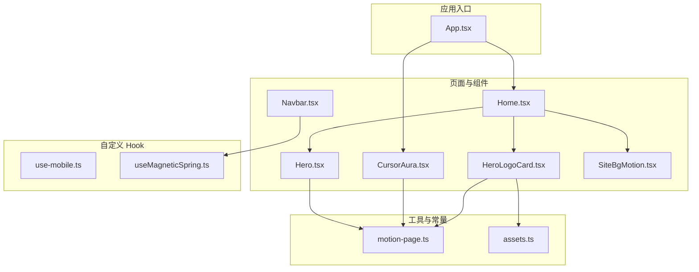
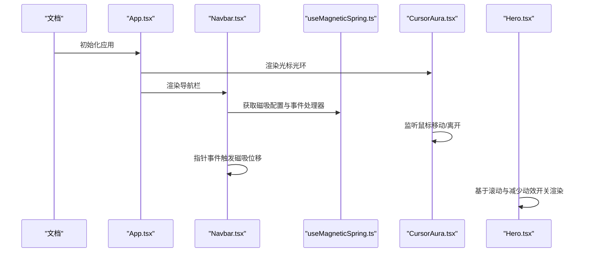
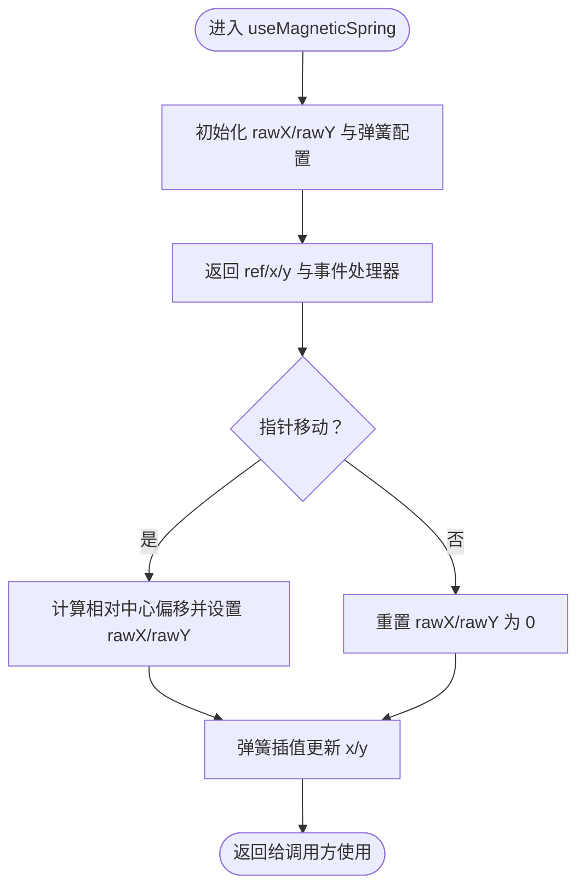
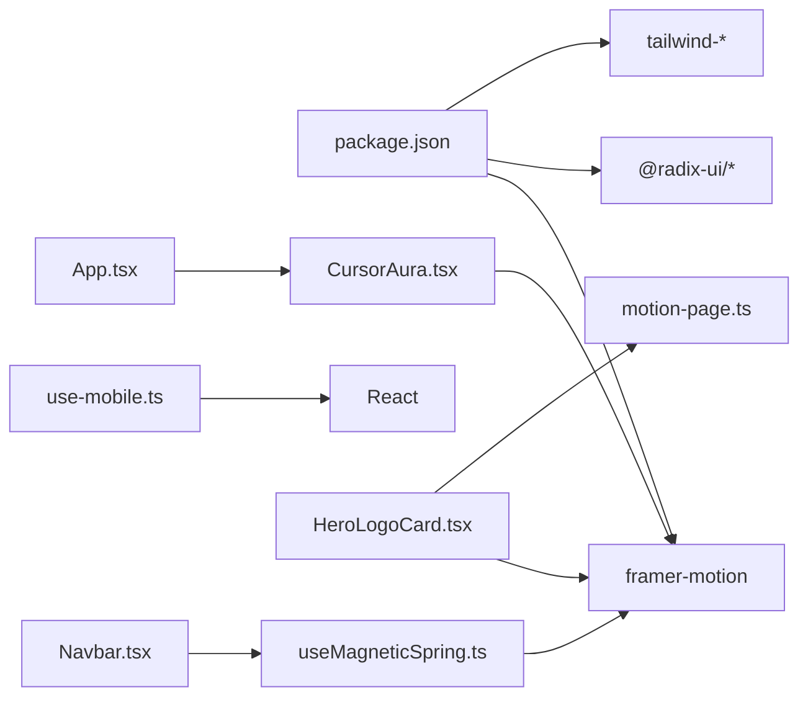

# Hook API

<cite>
**本文引用的文件**
- [use-mobile.ts](file://src/hooks/use-mobile.ts)
- [useMagneticSpring.ts](file://src/hooks/useMagneticSpring.ts)
- [CursorAura.tsx](file://src/components/CursorAura.tsx)
- [Navbar.tsx](file://src/components/Navbar.tsx)
- [Hero.tsx](file://src/components/Hero.tsx)
- [HeroLogoCard.tsx](file://src/components/HeroLogoCard.tsx)
- [SiteBgMotion.tsx](file://src/components/SiteBgMotion.tsx)
- [App.tsx](file://src/App.tsx)
- [motion-page.ts](file://src/utils/motion-page.ts)
- [assets.ts](file://src/constants/assets.ts)
- [package.json](file://package.json)
</cite>

## 目录
1. [简介](#简介)
2. [项目结构](#项目结构)
3. [核心组件与 Hook 概览](#核心组件与-hook-概览)
4. [架构总览](#架构总览)
5. [详细组件与 Hook 分析](#详细组件与-hook-分析)
6. [依赖关系分析](#依赖关系分析)
7. [性能考量](#性能考量)
8. [故障排查指南](#故障排查指南)
9. [结论](#结论)
10. [附录：使用示例与最佳实践](#附录使用示例与最佳实践)

## 简介
本文件为 MinLL 项目的 Hook API 完整文档，聚焦于自定义 Hook 的参数、返回值、使用约束、功能作用、适用场景、性能特征、依赖项、副作用与清理机制，并提供组合使用模式、与其他 Hook 的交互关系、状态管理与内存泄漏防护、错误处理与调试技巧。内容基于仓库中实际实现进行归纳总结，避免臆测。

## 项目结构
MinLL 使用 React + TypeScript + Vite 构建，动画与交互由 Framer Motion 提供。Hook 主要位于 src/hooks，UI 组件位于 src/components，工具函数与常量位于 src/utils 与 src/constants。

图表来源
- [App.tsx:1-70](file://src/App.tsx#L1-L70)
- [Home.tsx:1-15](file://src/pages/Home.tsx#L1-L15)
- [Hero.tsx:1-316](file://src/components/Hero.tsx#L1-L316)
- [Navbar.tsx:1-111](file://src/components/Navbar.tsx#L1-L111)
- [CursorAura.tsx:1-69](file://src/components/CursorAura.tsx#L1-L69)
- [HeroLogoCard.tsx:1-152](file://src/components/HeroLogoCard.tsx#L1-L152)
- [SiteBgMotion.tsx:1-60](file://src/components/SiteBgMotion.tsx#L1-L60)
- [use-mobile.ts:1-20](file://src/hooks/use-mobile.ts#L1-L20)
- [useMagneticSpring.ts:1-33](file://src/hooks/useMagneticSpring.ts#L1-L33)
- [motion-page.ts:1-184](file://src/utils/motion-page.ts#L1-L184)
- [assets.ts:1-24](file://src/constants/assets.ts#L1-L24)

章节来源
- [App.tsx:1-70](file://src/App.tsx#L1-L70)
- [Home.tsx:1-15](file://src/pages/Home.tsx#L1-L15)

## 核心组件与 Hook 概览
- useIsMobile：检测设备是否为移动端，返回布尔值；适用于响应式布局与交互降级。
- useMagneticSpring：为按钮等元素提供磁吸跟随效果，返回 ref、x/y 变换值与事件处理器；适用于需要指针跟随与悬停反馈的交互。

章节来源
- [use-mobile.ts:1-20](file://src/hooks/use-mobile.ts#L1-L20)
- [useMagneticSpring.ts:1-33](file://src/hooks/useMagneticSpring.ts#L1-L33)

## 架构总览
下图展示应用启动后关键组件与 Hook 的协作关系，以及动画与输入事件的流向。

图表来源
- [App.tsx:1-70](file://src/App.tsx#L1-L70)
- [Navbar.tsx:1-111](file://src/components/Navbar.tsx#L1-L111)
- [useMagneticSpring.ts:1-33](file://src/hooks/useMagneticSpring.ts#L1-L33)
- [CursorAura.tsx:1-69](file://src/components/CursorAura.tsx#L1-L69)
- [Hero.tsx:1-316](file://src/components/Hero.tsx#L1-L316)

## 详细组件与 Hook 分析

### useIsMobile Hook
- 功能作用
  - 基于媒体查询与窗口宽度判断是否为移动端，用于条件渲染与交互降级。
- 参数与返回
  - 参数：无
  - 返回：布尔值（移动端时为真）
- 使用约束
  - 首次渲染可能返回未定义，调用方需在消费处做容错处理。
- 适用场景
  - 移动端专用 UI、简化交互、禁用高开销动画。
- 性能特征
  - 仅在挂载时添加监听器，卸载时清理；计算成本低。
- 依赖与副作用
  - 依赖 window.matchMedia 与 resize；内部通过事件监听器与清理函数管理生命周期。
- 错误处理与调试
  - 若 SSR 环境中 window 不存在，需在外层做兜底或延迟到客户端执行。
- 组合与交互
  - 与 useReducedMotion 协作可实现“减少动效 + 移动端降级”的双重降级策略。

章节来源
- [use-mobile.ts:1-20](file://src/hooks/use-mobile.ts#L1-L20)

### useMagneticSpring Hook
- 功能作用
  - 计算指针相对元素中心的偏移，结合弹簧动画产生自然的跟随效果；提供 ref 与事件处理器以绑定到 DOM 节点。
- 参数与返回
  - strength：磁吸强度，默认值见实现；可选。
  - 返回：对象包含 ref、x、y 与 onPointerMove/onPointerLeave 回调。
- 使用约束
  - 返回的 ref 需绑定到 HTMLButtonElement 或等效节点；回调需在受控环境下启用/禁用。
- 适用场景
  - 导航 Logo、按钮、卡片标题等需要指针跟随的交互元素。
- 性能特征
  - 使用 useMotionValue + useSpring，帧内计算由 Framer Motion 管理；建议控制强度与频率，避免过度抖动。
- 依赖与副作用
  - 依赖 framer-motion 的 useMotionValue/useSpring/useCallback/useRef；事件处理中使用 requestAnimationFrame 风格的 set，注意清理。
- 错误处理与调试
  - 当 ref 为空时直接返回，避免空引用；可通过日志定位回调未触发的问题。
- 组合与交互
  - 与 useReducedMotion 结合，在减少动效模式下禁用回调，保持一致性。

图表来源
- [useMagneticSpring.ts:1-33](file://src/hooks/useMagneticSpring.ts#L1-L33)

章节来源
- [useMagneticSpring.ts:1-33](file://src/hooks/useMagneticSpring.ts#L1-L33)
- [Navbar.tsx:1-111](file://src/components/Navbar.tsx#L1-L111)

### CursorAura 组件（与 Hook 关系）
- 功能作用
  - 在鼠标移动时平滑跟随光标位置，提供视觉引导；支持系统减少动效设置。
- 参数与返回
  - 作为组件直接渲染，不接收 props；内部通过 useMotionValue/useSpring/useReducedMotion 管理状态。
- 使用约束
  - 需在顶层容器中渲染，避免被裁剪；减少动效时完全不渲染。
- 适用场景
  - 鼠标指示、焦点提示、增强可访问性。
- 性能特征
  - 使用 requestAnimationFrame 降低事件节流成本；减少动效时直接返回空。
- 依赖与副作用
  - 依赖 window 事件与 RAF；卸载时取消 RAF 与事件监听。
- 错误处理与调试
  - 减少动效时直接返回，避免无效渲染；若不出现，检查顶层容器是否正确挂载。

章节来源
- [CursorAura.tsx:1-69](file://src/components/CursorAura.tsx#L1-L69)
- [App.tsx:1-70](file://src/App.tsx#L1-L70)

### HeroLogoCard 组件（与 Hook 关系）
- 功能作用
  - 基于指针位置计算 3D 倾斜，配合弹簧动画与多层阴影，营造立体视觉。
- 参数与返回
  - 作为组件直接渲染，内部通过 useMotionValue/useSpring/useReducedMotion 管理状态。
- 使用约束
  - 需确保容器尺寸有效，避免除零或 NaN；减少动效时禁用动画。
- 适用场景
  - 品牌展示、产品卡片、头像区域等强调交互感的区域。
- 性能特征
  - 使用 useSpring 与 requestAnimationFrame 风格更新，建议限制更新频率。
- 依赖与副作用
  - 依赖 pointer 事件与 RAF；卸载时清理事件与 RAF。

章节来源
- [HeroLogoCard.tsx:1-152](file://src/components/HeroLogoCard.tsx#L1-L152)

### SiteBgMotion 组件（与 Hook 关系）
- 功能作用
  - 渲染背景动态 blob 与噪点闪烁，营造氛围；支持系统减少动效设置。
- 参数与返回
  - 作为组件直接渲染，内部通过 useReducedMotion 控制是否渲染。
- 使用约束
  - 减少动效时直接返回空，避免渲染开销。
- 适用场景
  - 背景装饰、全屏展示页。
- 性能特征
  - 无限循环动画，减少动效时完全跳过。

章节来源
- [SiteBgMotion.tsx:1-60](file://src/components/SiteBgMotion.tsx#L1-L60)

### Hero 组件（与 Hook 关系）
- 功能作用
  - 基于滚动与字符分段动画构建主视觉，支持系统减少动效设置。
- 参数与返回
  - 作为组件直接渲染，内部通过 useScroll/useTransform/useReducedMotion 管理状态。
- 使用约束
  - 减少动效时禁用复杂动画，保证可读性与性能。
- 适用场景
  - 首屏主标题、标语、描述等关键信息展示。
- 性能特征
  - 复杂动画与滚动联动，减少动效时显著降载。

章节来源
- [Hero.tsx:1-316](file://src/components/Hero.tsx#L1-L316)

### motion-page 工具（与 Hook 关系）
- 功能作用
  - 提供多种动画变体与过渡配置，统一动效风格；与 useReducedMotion 协作实现降级。
- 参数与返回
  - 输入：reducedMotion（布尔）、可选参数（如模糊像素、位移等）
  - 输出：Framer Motion Variants/Transition 对象
- 使用约束
  - 传入 reducedMotion 以决定是否启用动画；数值型参数需满足动画期望范围。
- 适用场景
  - 字符逐字动画、块级元素入场、徽章弹出等。
- 性能特征
  - 通过统一配置减少重复计算；减少动效时返回空动画对象。

章节来源
- [motion-page.ts:1-184](file://src/utils/motion-page.ts#L1-L184)

## 依赖关系分析
- 运行时依赖
  - React 19、Framer Motion 12、Radix UI、Tailwind 系列等。
- 自定义 Hook 与第三方库
  - useMagneticSpring 依赖 framer-motion 的 useMotionValue/useSpring/useCallback/useRef。
  - useIsMobile 依赖 window.matchMedia 与 window 事件。
- 组件与 Hook 的耦合
  - Navbar 与 useMagneticSpring 强耦合；HeroLogoCard 与 motion-page 配置强耦合；App 与 CursorAura 存在全局事件依赖。

图表来源
- [package.json:1-84](file://package.json#L1-L84)
- [useMagneticSpring.ts:1-33](file://src/hooks/useMagneticSpring.ts#L1-L33)
- [use-mobile.ts:1-20](file://src/hooks/use-mobile.ts#L1-L20)
- [Navbar.tsx:1-111](file://src/components/Navbar.tsx#L1-L111)
- [HeroLogoCard.tsx:1-152](file://src/components/HeroLogoCard.tsx#L1-L152)
- [motion-page.ts:1-184](file://src/utils/motion-page.ts#L1-L184)
- [CursorAura.tsx:1-69](file://src/components/CursorAura.tsx#L1-L69)
- [App.tsx:1-70](file://src/App.tsx#L1-L70)

章节来源
- [package.json:1-84](file://package.json#L1-L84)

## 性能考量
- 减少动效优先
  - 通过 useReducedMotion 判定，直接跳过复杂动画与无限循环，显著降低 CPU/GPU 压力。
- 事件节流与 RAF
  - 光标跟随与指针更新采用 requestAnimationFrame 风格，避免高频同步更新导致掉帧。
- 内存泄漏防护
  - 所有事件监听器均在卸载时清理；useEffect 的清理函数必须成对出现。
- 动画配置
  - 使用统一的弹簧配置与过渡曲线，避免过度夸张的动画参数引发卡顿。
- SSR 注意
  - useIsMobile 依赖 window，SSR 环境需做兜底或延迟到客户端执行。

## 故障排查指南
- 指针跟随无效
  - 检查 useMagneticSpring 返回的 ref 是否正确绑定到目标节点；确认回调在减少动效模式下被禁用。
- 光标光环不显示
  - 确认顶层容器已渲染 CursorAura；检查减少动效设置；确认事件监听是否被清理。
- 指针倾斜异常
  - 检查容器尺寸是否有效；确认 pointer 事件类型为 mouse；减少动效模式下会禁用动画。
- 滚动动画不生效
  - 确认 useScroll/useTransform 的源与目标一致；减少动效模式下会禁用动画。
- SSR 报错
  - useIsMobile 在服务端不可用，需在客户端执行或提供默认值。

章节来源
- [useMagneticSpring.ts:1-33](file://src/hooks/useMagneticSpring.ts#L1-L33)
- [CursorAura.tsx:1-69](file://src/components/CursorAura.tsx#L1-L69)
- [HeroLogoCard.tsx:1-152](file://src/components/HeroLogoCard.tsx#L1-L152)
- [Hero.tsx:1-316](file://src/components/Hero.tsx#L1-L316)
- [use-mobile.ts:1-20](file://src/hooks/use-mobile.ts#L1-L20)

## 结论
MinLL 的 Hook API 设计围绕“可组合 + 可降级”展开：useMagneticSpring 提供轻量级的指针跟随能力，useIsMobile 提供基础的响应式判定。二者与 Framer Motion 的动画体系深度协作，辅以 useReducedMotion 实现无障碍与性能平衡。通过统一的动画配置与严格的副作用清理，整体具备良好的可维护性与可扩展性。

## 附录：使用示例与最佳实践
- 使用 useMagneticSpring
  - 将返回的 ref 绑定到目标元素，将 onPointerMove/onPointerLeave 作为事件处理器使用；在减少动效模式下禁用回调。
  - 示例路径参考：[Navbar.tsx:59-106](file://src/components/Navbar.tsx#L59-L106)
- 使用 useIsMobile
  - 在消费处对首次未定义状态做容错；根据结果切换 UI 或禁用动画。
  - 示例路径参考：[use-mobile.ts:5-18](file://src/hooks/use-mobile.ts#L5-L18)
- 组合模式
  - Navbar + useMagneticSpring：导航 Logo 的磁吸跟随与缩放反馈。
  - HeroLogoCard + motion-page：指针驱动的 3D 倾斜与多层阴影。
  - App + CursorAura：全局光标跟随。
- 最佳实践
  - 始终在减少动效模式下禁用复杂动画。
  - 事件监听器务必在清理函数中移除。
  - 使用统一的弹簧配置与过渡曲线，避免过度夸张的参数。
  - SSR 环境中对依赖 window 的 Hook 做兜底或延迟执行。