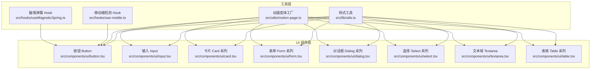
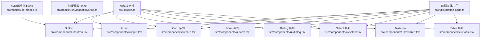
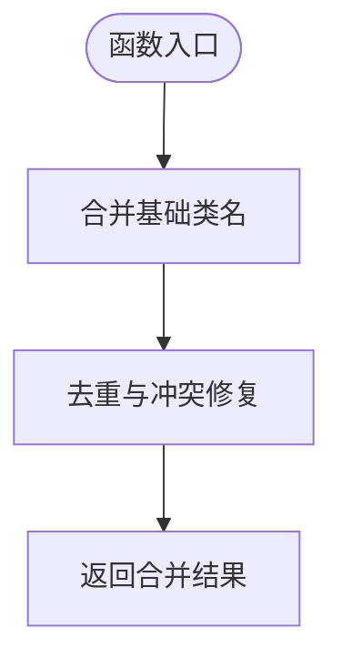
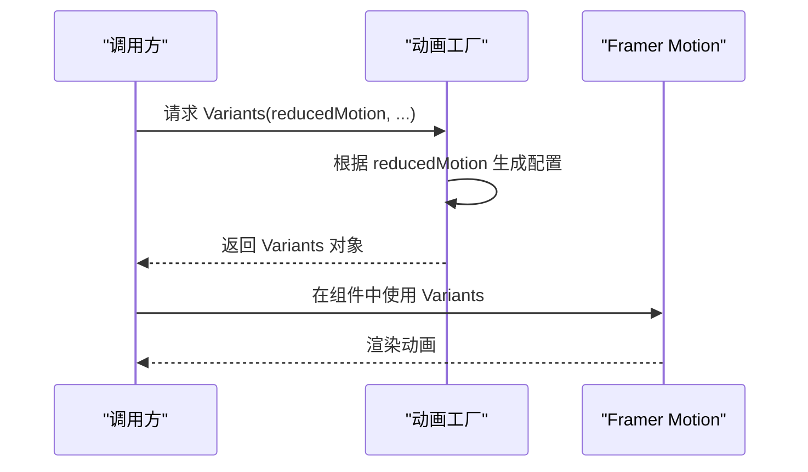
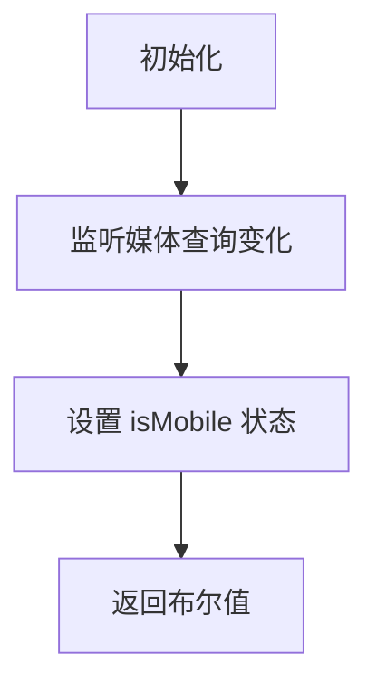
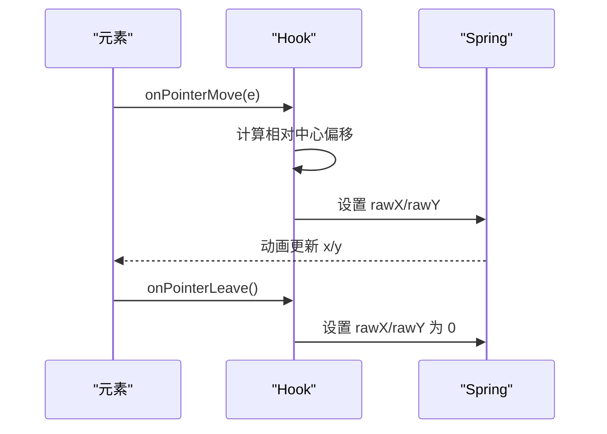
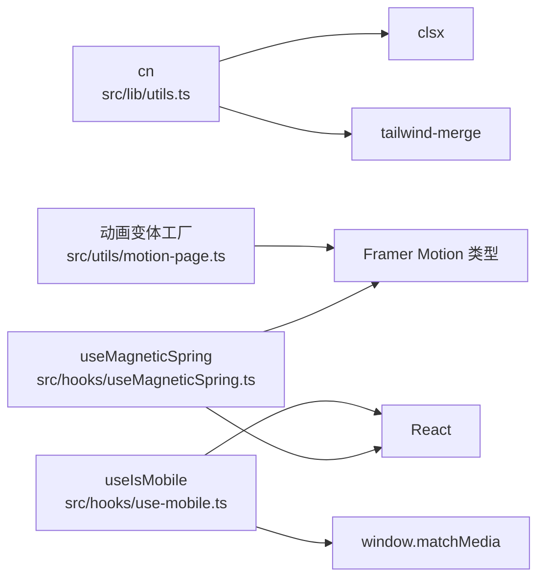

# 工具函数 API

<cite>
**本文引用的文件**
- [src/lib/utils.ts](file://src/lib/utils.ts)
- [src/utils/motion-page.ts](file://src/utils/motion-page.ts)
- [src/hooks/use-mobile.ts](file://src/hooks/use-mobile.ts)
- [src/hooks/useMagneticSpring.ts](file://src/hooks/useMagneticSpring.ts)
- [src/components/ui/button.tsx](file://src/components/ui/button.tsx)
- [src/components/ui/input.tsx](file://src/components/ui/input.tsx)
- [src/components/ui/card.tsx](file://src/components/ui/card.tsx)
- [src/components/ui/form.tsx](file://src/components/ui/form.tsx)
- [src/components/ui/label.tsx](file://src/components/ui/label.tsx)
- [src/components/ui/dialog.tsx](file://src/components/ui/dialog.tsx)
- [src/components/ui/select.tsx](file://src/components/ui/select.tsx)
- [src/components/ui/textarea.tsx](file://src/components/ui/textarea.tsx)
- [src/components/ui/table.tsx](file://src/components/ui/table.tsx)
</cite>

## 目录
1. [简介](#简介)
2. [项目结构](#项目结构)
3. [核心组件](#核心组件)
4. [架构总览](#架构总览)
5. [详细组件分析](#详细组件分析)
6. [依赖分析](#依赖分析)
7. [性能考虑](#性能考虑)
8. [故障排查指南](#故障排查指南)
9. [结论](#结论)
10. [附录](#附录)

## 简介
本文件面向 MinLL 项目的“工具函数 API”，系统化梳理与记录以下内容：
- 工具函数的输入参数、返回值类型与异常处理
- 函数功能、典型使用场景与性能特征
- 完整的 TypeScript 类型定义与泛型约束说明
- 实际调用示例、参数组合与返回值解析指引
- 边界条件、错误情况与兼容性要求
- 内部实现原理与算法复杂度分析
- 单元测试与集成测试模式建议

本项目中与“工具函数”最直接相关的是：
- 样式合并工具：用于合并 Tailwind CSS 类名
- 动画变体工厂：基于 Framer Motion 的可复用动画配置
- 响应式 Hook：移动端断点检测
- 指针磁吸弹簧 Hook：基于 Framer Motion 的交互行为
- UI 组件库中的通用样式工具：统一通过 cn 合并类名

## 项目结构
MinLL 采用按功能分层的组织方式，工具函数主要分布在如下位置：
- 样式工具：src/lib/utils.ts
- 动画变体工厂：src/utils/motion-page.ts
- 响应式与交互 Hook：src/hooks/use-mobile.ts、src/hooks/useMagneticSpring.ts
- UI 组件：src/components/ui/*.tsx（大量组件通过 cn 调用样式工具）

图表来源
- [src/lib/utils.ts:1-7](file://src/lib/utils.ts#L1-L7)
- [src/utils/motion-page.ts:1-184](file://src/utils/motion-page.ts#L1-L184)
- [src/hooks/use-mobile.ts:1-20](file://src/hooks/use-mobile.ts#L1-L20)
- [src/hooks/useMagneticSpring.ts:1-33](file://src/hooks/useMagneticSpring.ts#L1-L33)
- [src/components/ui/button.tsx:1-63](file://src/components/ui/button.tsx#L1-L63)
- [src/components/ui/input.tsx:1-22](file://src/components/ui/input.tsx#L1-L22)
- [src/components/ui/card.tsx:1-93](file://src/components/ui/card.tsx#L1-L93)
- [src/components/ui/form.tsx:1-168](file://src/components/ui/form.tsx#L1-L168)
- [src/components/ui/dialog.tsx:1-142](file://src/components/ui/dialog.tsx#L1-L142)
- [src/components/ui/select.tsx:1-189](file://src/components/ui/select.tsx#L1-L189)
- [src/components/ui/textarea.tsx:1-19](file://src/components/ui/textarea.tsx#L1-L19)
- [src/components/ui/table.tsx:1-115](file://src/components/ui/table.tsx#L1-L115)

章节来源
- [src/lib/utils.ts:1-7](file://src/lib/utils.ts#L1-L7)
- [src/utils/motion-page.ts:1-184](file://src/utils/motion-page.ts#L1-L184)
- [src/hooks/use-mobile.ts:1-20](file://src/hooks/use-mobile.ts#L1-L20)
- [src/hooks/useMagneticSpring.ts:1-33](file://src/hooks/useMagneticSpring.ts#L1-L33)
- [src/components/ui/button.tsx:1-63](file://src/components/ui/button.tsx#L1-L63)
- [src/components/ui/input.tsx:1-22](file://src/components/ui/input.tsx#L1-L22)
- [src/components/ui/card.tsx:1-93](file://src/components/ui/card.tsx#L1-L93)
- [src/components/ui/form.tsx:1-168](file://src/components/ui/form.tsx#L1-L168)
- [src/components/ui/dialog.tsx:1-142](file://src/components/ui/dialog.tsx#L1-L142)
- [src/components/ui/select.tsx:1-189](file://src/components/ui/select.tsx#L1-L189)
- [src/components/ui/textarea.tsx:1-19](file://src/components/ui/textarea.tsx#L1-L19)
- [src/components/ui/table.tsx:1-115](file://src/components/ui/table.tsx#L1-L115)

## 核心组件
本节聚焦于“工具函数 API”的核心能力与接口契约。

- cn（样式合并）
  - 输入参数：可变数量的类名值（ClassValue[]）
  - 返回值类型：字符串（合并后的类名）
  - 异常处理：无显式抛错；内部依赖 clsx 与 tailwind-merge 的合并策略
  - 功能作用：合并并去重 Tailwind 类名，避免冲突与重复
  - 使用场景：UI 组件统一通过 cn 合并变体与自定义类名
  - 性能特征：线性时间复杂度 O(n)，n 为传入类名数量
  - 兼容性：依赖 clsx 与 tailwind-merge 版本
  - 示例路径：[src/lib/utils.ts:4-6](file://src/lib/utils.ts#L4-L6)

- contentStaggerVariants（内容级交错动画）
  - 输入参数：reducedMotion（布尔）——是否启用减少动画
  - 返回值类型：Variants（Framer Motion 变体对象）
  - 异常处理：无显式抛错；根据 reducedMotion 返回不同配置
  - 功能作用：为子元素提供交错出现的动画序列
  - 使用场景：段落、列表项等批量元素的逐个入场
  - 性能特征：配置生成 O(1)，渲染时受子元素数量影响
  - 示例路径：[src/utils/motion-page.ts:6-16](file://src/utils/motion-page.ts#L6-L16)

- cinematicRevealVariants（电影感显现动画）
  - 输入参数：reducedMotion（布尔）、blurPx（数字）、y（可选数字）
  - 返回值类型：Variants（Framer Motion 变体对象）
  - 异常处理：无显式抛错；根据 reducedMotion 返回不同配置
  - 功能作用：透明度+位移+模糊的复合显现效果
  - 使用场景：标题、横幅、封面等强调性元素
  - 性能特征：配置生成 O(1)，渲染时受滤镜与变换影响
  - 示例路径：[src/utils/motion-page.ts:19-46](file://src/utils/motion-page.ts#L19-L46)

- fadeUpItemVariants（淡入上浮子项）
  - 输入参数：reducedMotion（布尔）
  - 返回值类型：Variants（Framer Motion 变体对象）
  - 异常处理：无显式抛错；内部委托 cinematicRevealVariants
  - 功能作用：子项淡入并轻微上浮
  - 使用场景：菜单项、列表条目
  - 示例路径：[src/utils/motion-page.ts:48-50](file://src/utils/motion-page.ts#L48-L50)

- headlineAccentVariants（标题强调动画）
  - 输入参数：reducedMotion（布尔）
  - 返回值类型：Variants（Framer Motion 变体对象）
  - 异常处理：无显式抛错；内部委托 cinematicRevealVariants
  - 功能作用：标题强调字符的电影感显现
  - 使用场景：主标题、副标题强调
  - 示例路径：[src/utils/motion-page.ts:52-54](file://src/utils/motion-page.ts#L52-L54)

- badgeSpringVariants（徽标弹跳动画）
  - 输入参数：reducedMotion（布尔）
  - 返回值类型：Variants（Framer Motion 变体对象）
  - 异常处理：无显式抛错；根据 reducedMotion 返回不同配置
  - 功能作用：徽标从缩放与旋转状态弹出到稳定态
  - 使用场景：标签、徽章、提示
  - 示例路径：[src/utils/motion-page.ts:56-75](file://src/utils/motion-page.ts#L56-L75)

- logoRevealVariants（标志显现动画）
  - 输入参数：reducedMotion（布尔）
  - 返回值类型：Variants（Framer Motion 变体对象）
  - 异常处理：无显式抛错；根据 reducedMotion 返回不同配置
  - 功能作用：标志从偏移与旋转中显现
  - 使用场景：品牌标识、Logo
  - 示例路径：[src/utils/motion-page.ts:77-98](file://src/utils/motion-page.ts#L77-L98)

- heroShellVariants（英雄壳体动画）
  - 输入参数：reducedMotion（布尔）
  - 返回值类型：Variants（Framer Motion 变体对象）
  - 异常处理：无显式抛错；根据 reducedMotion 返回不同配置
  - 功能作用：整体壳体的淡入与缩放
  - 使用场景：首页 Hero 区域
  - 示例路径：[src/utils/motion-page.ts:100-113](file://src/utils/motion-page.ts#L100-L113)

- charRevealBoldVariants（粗体字符翻转）
  - 输入参数：reducedMotion（布尔）
  - 返回值类型：Variants（Framer Motion 变体对象）
  - 异常处理：无显式抛错；reducedMotion 时直接返回稳定态
  - 功能作用：每个字符独立翻转上浮
  - 使用场景：强调标题字符
  - 示例路径：[src/utils/motion-page.ts:116-143](file://src/utils/motion-page.ts#L116-L143)

- charRevealSoftVariants（柔和字符显现）
  - 输入参数：reducedMotion（布尔）
  - 返回值类型：Variants（Framer Motion 变体对象）
  - 异常处理：无显式抛错；reducedMotion 时直接返回稳定态
  - 功能作用：字符柔和翻转上浮
  - 使用场景：正文、欢迎语
  - 示例路径：[src/utils/motion-page.ts:146-172](file://src/utils/motion-page.ts#L146-L172)

- h1BlockVariants（标题块交错）
  - 输入参数：reducedMotion（布尔）
  - 返回值类型：Variants（Framer Motion 变体对象）
  - 异常处理：无显式抛错；根据 reducedMotion 返回不同配置
  - 功能作用：标题块内子元素交错出现
  - 使用场景：大标题区域
  - 示例路径：[src/utils/motion-page.ts:174-183](file://src/utils/motion-page.ts#L174-L183)

- useIsMobile（移动端断点检测）
  - 输入参数：无
  - 返回值类型：布尔（是否移动端）
  - 异常处理：无显式抛错；初始化阶段可能返回 undefined，随后稳定为布尔
  - 功能作用：监听窗口尺寸变化，判断是否移动端
  - 使用场景：响应式布局、移动端专用 UI
  - 性能特征：事件监听 O(1)，状态更新 O(1)
  - 示例路径：[src/hooks/use-mobile.ts:5-19](file://src/hooks/use-mobile.ts#L5-L19)

- useMagneticSpring（指针磁吸弹簧）
  - 输入参数：strength（可选数字，默认 0.42）
  - 返回值类型：包含 ref、x、y、onPointerMove、onPointerLeave 的对象
  - 异常处理：无显式抛错；当 ref 为空时移动回调直接返回
  - 功能作用：根据鼠标位置计算偏移，并以弹簧动画跟随
  - 使用场景：按钮磁吸、悬浮交互
  - 性能特征：每次指针移动 O(1)，弹簧计算 O(1)
  - 示例路径：[src/hooks/useMagneticSpring.ts:6-32](file://src/hooks/useMagneticSpring.ts#L6-L32)

章节来源
- [src/lib/utils.ts:4-6](file://src/lib/utils.ts#L4-L6)
- [src/utils/motion-page.ts:6-16](file://src/utils/motion-page.ts#L6-L16)
- [src/utils/motion-page.ts:19-46](file://src/utils/motion-page.ts#L19-L46)
- [src/utils/motion-page.ts:48-50](file://src/utils/motion-page.ts#L48-L50)
- [src/utils/motion-page.ts:52-54](file://src/utils/motion-page.ts#L52-L54)
- [src/utils/motion-page.ts:56-75](file://src/utils/motion-page.ts#L56-L75)
- [src/utils/motion-page.ts:77-98](file://src/utils/motion-page.ts#L77-L98)
- [src/utils/motion-page.ts:100-113](file://src/utils/motion-page.ts#L100-L113)
- [src/utils/motion-page.ts:116-143](file://src/utils/motion-page.ts#L116-L143)
- [src/utils/motion-page.ts:146-172](file://src/utils/motion-page.ts#L146-L172)
- [src/utils/motion-page.ts:174-183](file://src/utils/motion-page.ts#L174-L183)
- [src/hooks/use-mobile.ts:5-19](file://src/hooks/use-mobile.ts#L5-L19)
- [src/hooks/useMagneticSpring.ts:6-32](file://src/hooks/useMagneticSpring.ts#L6-L32)

## 架构总览
下图展示工具函数在系统中的角色与调用关系：

图表来源
- [src/lib/utils.ts:4-6](file://src/lib/utils.ts#L4-L6)
- [src/utils/motion-page.ts:1-184](file://src/utils/motion-page.ts#L1-L184)
- [src/hooks/use-mobile.ts:1-20](file://src/hooks/use-mobile.ts#L1-L20)
- [src/hooks/useMagneticSpring.ts:1-33](file://src/hooks/useMagneticSpring.ts#L1-L33)
- [src/components/ui/button.tsx:1-63](file://src/components/ui/button.tsx#L1-L63)
- [src/components/ui/input.tsx:1-22](file://src/components/ui/input.tsx#L1-L22)
- [src/components/ui/card.tsx:1-93](file://src/components/ui/card.tsx#L1-L93)
- [src/components/ui/form.tsx:1-168](file://src/components/ui/form.tsx#L1-L168)
- [src/components/ui/dialog.tsx:1-142](file://src/components/ui/dialog.tsx#L1-L142)
- [src/components/ui/select.tsx:1-189](file://src/components/ui/select.tsx#L1-L189)
- [src/components/ui/textarea.tsx:1-19](file://src/components/ui/textarea.tsx#L1-L19)
- [src/components/ui/table.tsx:1-115](file://src/components/ui/table.tsx#L1-L115)

## 详细组件分析

### cn（样式合并）API
- 类型定义与约束
  - 参数：...inputs: ClassValue[]
  - 返回：string
- 功能与使用场景
  - 将多个类名值合并为一个字符串，自动去重与冲突修复
  - UI 组件通过 cn 统一应用变体与自定义类名
- 边界条件与错误
  - 当传入空参数时，返回空字符串
  - 非法类名会被忽略或保留，具体取决于底层库策略
- 性能与复杂度
  - 时间复杂度：O(n)
  - 空间复杂度：O(n)
- 示例路径
  - [src/lib/utils.ts:4-6](file://src/lib/utils.ts#L4-L6)

图表来源
- [src/lib/utils.ts:4-6](file://src/lib/utils.ts#L4-L6)

章节来源
- [src/lib/utils.ts:4-6](file://src/lib/utils.ts#L4-L6)

### 动画变体工厂 API
- 类型定义与约束
  - Variants：来自 Framer Motion 的类型
  - reducedMotion：布尔，控制是否启用减少动画
  - blurPx/y：数字，控制模糊像素与位移
- 功能与使用场景
  - 提供可复用的动画配置，覆盖标题、徽标、字符等常见场景
- 边界条件与错误
  - reducedMotion 为 true 时，返回稳定态配置
  - blurPx/y 为负数时，可能导致视觉异常，需在调用侧保证正值
- 性能与复杂度
  - 配置生成 O(1)，渲染时受子元素数量与滤镜影响
- 示例路径
  - [src/utils/motion-page.ts:6-16](file://src/utils/motion-page.ts#L6-L16)
  - [src/utils/motion-page.ts:19-46](file://src/utils/motion-page.ts#L19-L46)
  - [src/utils/motion-page.ts:56-75](file://src/utils/motion-page.ts#L56-L75)
  - [src/utils/motion-page.ts:77-98](file://src/utils/motion-page.ts#L77-L98)
  - [src/utils/motion-page.ts:116-143](file://src/utils/motion-page.ts#L116-L143)
  - [src/utils/motion-page.ts:146-172](file://src/utils/motion-page.ts#L146-L172)
  - [src/utils/motion-page.ts:174-183](file://src/utils/motion-page.ts#L174-L183)

图表来源
- [src/utils/motion-page.ts:6-16](file://src/utils/motion-page.ts#L6-L16)
- [src/utils/motion-page.ts:19-46](file://src/utils/motion-page.ts#L19-L46)
- [src/utils/motion-page.ts:56-75](file://src/utils/motion-page.ts#L56-L75)
- [src/utils/motion-page.ts:77-98](file://src/utils/motion-page.ts#L77-L98)
- [src/utils/motion-page.ts:116-143](file://src/utils/motion-page.ts#L116-L143)
- [src/utils/motion-page.ts:146-172](file://src/utils/motion-page.ts#L146-L172)
- [src/utils/motion-page.ts:174-183](file://src/utils/motion-page.ts#L174-L183)

章节来源
- [src/utils/motion-page.ts:6-16](file://src/utils/motion-page.ts#L6-L16)
- [src/utils/motion-page.ts:19-46](file://src/utils/motion-page.ts#L19-L46)
- [src/utils/motion-page.ts:56-75](file://src/utils/motion-page.ts#L56-L75)
- [src/utils/motion-page.ts:77-98](file://src/utils/motion-page.ts#L77-L98)
- [src/utils/motion-page.ts:116-143](file://src/utils/motion-page.ts#L116-L143)
- [src/utils/motion-page.ts:146-172](file://src/utils/motion-page.ts#L146-L172)
- [src/utils/motion-page.ts:174-183](file://src/utils/motion-page.ts#L174-L183)

### useIsMobile（移动端断点检测）API
- 类型定义与约束
  - 返回：boolean（最终稳定值）
  - 初始化阶段可能返回 undefined
- 功能与使用场景
  - 监听窗口尺寸变化，判断是否移动端
- 边界条件与错误
  - SSR 环境下初始值可能为 undefined，需在客户端渲染后稳定
- 性能与复杂度
  - 事件监听 O(1)，状态更新 O(1)
- 示例路径
  - [src/hooks/use-mobile.ts:5-19](file://src/hooks/use-mobile.ts#L5-L19)

图表来源
- [src/hooks/use-mobile.ts:5-19](file://src/hooks/use-mobile.ts#L5-L19)

章节来源
- [src/hooks/use-mobile.ts:5-19](file://src/hooks/use-mobile.ts#L5-L19)

### useMagneticSpring（指针磁吸弹簧）API
- 类型定义与约束
  - strength：number（默认 0.42）
  - 返回：{ ref, x, y, onPointerMove, onPointerLeave }
- 功能与使用场景
  - 计算鼠标相对元素中心的偏移，以弹簧动画跟随
- 边界条件与错误
  - ref 为空时，onPointerMove 直接返回
- 性能与复杂度
  - 每次指针移动 O(1)，弹簧计算 O(1)
- 示例路径
  - [src/hooks/useMagneticSpring.ts:6-32](file://src/hooks/useMagneticSpring.ts#L6-L32)

图表来源
- [src/hooks/useMagneticSpring.ts:6-32](file://src/hooks/useMagneticSpring.ts#L6-L32)

章节来源
- [src/hooks/useMagneticSpring.ts:6-32](file://src/hooks/useMagneticSpring.ts#L6-L32)

### UI 组件中的样式工具调用
- Button/Input/Card/Form/Dialog/Select/Textarea/Table 等组件均通过 cn 合并类名
- 这些组件不直接暴露工具函数 API，但展示了 cn 的典型用法与扩展方式
- 示例路径
  - [src/components/ui/button.tsx:56](file://src/components/ui/button.tsx#L56)
  - [src/components/ui/input.tsx:10](file://src/components/ui/input.tsx#L10)
  - [src/components/ui/card.tsx:9](file://src/components/ui/card.tsx#L9)
  - [src/components/ui/form.tsx:16](file://src/components/ui/form.tsx#L16)
  - [src/components/ui/dialog.tsx:38](file://src/components/ui/dialog.tsx#L38)
  - [src/components/ui/select.tsx:37](file://src/components/ui/select.tsx#L37)
  - [src/components/ui/textarea.tsx:9](file://src/components/ui/textarea.tsx#L9)
  - [src/components/ui/table.tsx:13](file://src/components/ui/table.tsx#L13)

章节来源
- [src/components/ui/button.tsx:56](file://src/components/ui/button.tsx#L56)
- [src/components/ui/input.tsx:10](file://src/components/ui/input.tsx#L10)
- [src/components/ui/card.tsx:9](file://src/components/ui/card.tsx#L9)
- [src/components/ui/form.tsx:16](file://src/components/ui/form.tsx#L16)
- [src/components/ui/dialog.tsx:38](file://src/components/ui/dialog.tsx#L38)
- [src/components/ui/select.tsx:37](file://src/components/ui/select.tsx#L37)
- [src/components/ui/textarea.tsx:9](file://src/components/ui/textarea.tsx#L9)
- [src/components/ui/table.tsx:13](file://src/components/ui/table.tsx#L13)

## 依赖分析
- cn 依赖：clsx、tailwind-merge
- 动画变体工厂依赖：Framer Motion 的 Variants 与 Transition 类型
- useIsMobile 依赖：window.matchMedia、React.useEffect/useState
- useMagneticSpring 依赖：Framer Motion 的 useMotionValue、useSpring、React 回调

图表来源
- [src/lib/utils.ts:1-2](file://src/lib/utils.ts#L1-L2)
- [src/utils/motion-page.ts:1](file://src/utils/motion-page.ts#L1)
- [src/hooks/use-mobile.ts:1](file://src/hooks/use-mobile.ts#L1)
- [src/hooks/useMagneticSpring.ts:1](file://src/hooks/useMagneticSpring.ts#L1)

章节来源
- [src/lib/utils.ts:1-2](file://src/lib/utils.ts#L1-L2)
- [src/utils/motion-page.ts:1](file://src/utils/motion-page.ts#L1)
- [src/hooks/use-mobile.ts:1](file://src/hooks/use-mobile.ts#L1)
- [src/hooks/useMagneticSpring.ts:1](file://src/hooks/useMagneticSpring.ts#L1)

## 性能考虑
- cn：合并操作线性于类名数量，适合在组件渲染时频繁调用
- 动画变体工厂：配置生成 O(1)，渲染性能取决于子元素数量与滤镜开销
- useIsMobile：媒体查询监听一次，状态更新 O(1)
- useMagneticSpring：指针移动事件频繁，但计算与动画更新均为 O(1)

## 故障排查指南
- cn 合并异常
  - 症状：类名冲突导致样式异常
  - 排查：确认 tailwind-merge 的版本与规则
  - 参考：[src/lib/utils.ts:4-6](file://src/lib/utils.ts#L4-L6)
- 动画不生效
  - 症状：reducedMotion 为 true 时无动画
  - 排查：确认传入参数与 Framer Motion 版本
  - 参考：[src/utils/motion-page.ts:6-16](file://src/utils/motion-page.ts#L6-L16)
- 移动端判断不稳定
  - 症状：SSR 初始值为 undefined
  - 排查：确保在客户端渲染后再读取结果
  - 参考：[src/hooks/use-mobile.ts:5-19](file://src/hooks/use-mobile.ts#L5-L19)
- 磁吸效果异常
  - 症状：ref 为空或偏移异常
  - 排查：确认 ref 是否正确传递与元素尺寸
  - 参考：[src/hooks/useMagneticSpring.ts:6-32](file://src/hooks/useMagneticSpring.ts#L6-L32)

章节来源
- [src/lib/utils.ts:4-6](file://src/lib/utils.ts#L4-L6)
- [src/utils/motion-page.ts:6-16](file://src/utils/motion-page.ts#L6-L16)
- [src/hooks/use-mobile.ts:5-19](file://src/hooks/use-mobile.ts#L5-L19)
- [src/hooks/useMagneticSpring.ts:6-32](file://src/hooks/useMagneticSpring.ts#L6-L32)

## 结论
本文件系统化梳理了 MinLL 中的工具函数 API，涵盖样式合并、动画变体工厂、响应式与交互 Hook，并结合 UI 组件展示了典型用法。通过明确的类型定义、边界条件与性能特征，开发者可以安全地在项目中复用这些工具函数，构建一致且高性能的用户界面。

## 附录
- 单元测试建议
  - cn：验证类名合并、冲突修复、空参数返回空字符串
  - 动画变体工厂：验证 reducedMotion 下的配置差异、blurPx/y 的视觉一致性
  - useIsMobile：验证 SSR 初始值、窗口尺寸变化后的状态更新
  - useMagneticSpring：验证偏移计算、ref 为空时的行为、弹簧动画稳定性
- 集成测试模式
  - 在真实 DOM 环境中运行，模拟窗口尺寸变化与指针事件
  - 使用测试框架（如 Vitest + React Testing Library）验证组件渲染与动画表现