# 类型定义

<cite>
**本文引用的文件**
- [src/types/index.ts](file://src/types/index.ts)
- [src/constants/assets.ts](file://src/constants/assets.ts)
- [src/lib/utils.ts](file://src/lib/utils.ts)
- [src/hooks/use-mobile.ts](file://src/hooks/use-mobile.ts)
- [src/hooks/useMagneticSpring.ts](file://src/hooks/useMagneticSpring.ts)
- [src/components/ui/button.tsx](file://src/components/ui/button.tsx)
- [src/components/ui/input.tsx](file://src/components/ui/input.tsx)
- [src/components/ui/form.tsx](file://src/components/ui/form.tsx)
- [src/components/ui/dialog.tsx](file://src/components/ui/dialog.tsx)
- [src/components/ui/select.tsx](file://src/components/ui/select.tsx)
- [src/components/ui/table.tsx](file://src/components/ui/table.tsx)
- [src/components/ui/tabs.tsx](file://src/components/ui/tabs.tsx)
- [src/i18n/index.ts](file://src/i18n/index.ts)
- [src/i18n/zh-CN.ts](file://src/i18n/zh-CN.ts)
- [src/App.tsx](file://src/App.tsx)
</cite>

## 目录
1. [简介](#简介)
2. [项目结构](#项目结构)
3. [核心类型与接口](#核心类型与接口)
4. [架构总览](#架构总览)
5. [详细组件类型分析](#详细组件类型分析)
6. [依赖关系分析](#依赖关系分析)
7. [性能考量](#性能考量)
8. [故障排查指南](#故障排查指南)
9. [结论](#结论)
10. [附录](#附录)

## 简介
本文件系统性梳理 MinLL 项目的类型定义与使用模式，覆盖共享域类型、UI 组件类型、表单类型、资源路径类型、工具函数类型以及国际化类型等。文档重点说明：
- 每个类型的用途、字段含义与约束条件
- 类型继承关系、泛型使用与条件类型
- 类型推导示例、类型守卫与类型断言的使用场景
- 常量类型的定义、资源路径类型与配置类型
- 类型的安全性保证、编译时检查与运行时验证
- 类型扩展模式与第三方类型声明的集成方法

## 项目结构
MinLL 的类型相关代码主要分布在以下位置：
- src/types：共享域类型入口（当前为空，用于后续扩展）
- src/constants：资源路径常量与工具函数
- src/lib：通用工具函数（含类型推导）
- src/hooks：React Hook 类型与返回值类型
- src/components/ui：基于 Radix UI 和 Framer Motion 的 UI 组件类型
- src/i18n：国际化键值与映射类型
- src/App.tsx：全局事件处理与样式变量设置

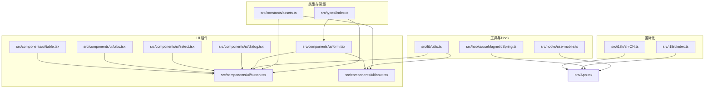

图表来源
- [src/types/index.ts:1-3](file://src/types/index.ts#L1-L3)
- [src/constants/assets.ts:1-24](file://src/constants/assets.ts#L1-L24)
- [src/lib/utils.ts:1-7](file://src/lib/utils.ts#L1-L7)
- [src/hooks/use-mobile.ts:1-20](file://src/hooks/use-mobile.ts#L1-L20)
- [src/hooks/useMagneticSpring.ts:1-33](file://src/hooks/useMagneticSpring.ts#L1-L33)
- [src/components/ui/button.tsx:1-63](file://src/components/ui/button.tsx#L1-L63)
- [src/components/ui/input.tsx:1-22](file://src/components/ui/input.tsx#L1-L22)
- [src/components/ui/form.tsx:1-168](file://src/components/ui/form.tsx#L1-L168)
- [src/components/ui/dialog.tsx:1-142](file://src/components/ui/dialog.tsx#L1-L142)
- [src/components/ui/select.tsx:1-189](file://src/components/ui/select.tsx#L1-L189)
- [src/components/ui/table.tsx:1-115](file://src/components/ui/table.tsx#L1-L115)
- [src/components/ui/tabs.tsx:1-67](file://src/components/ui/tabs.tsx#L1-L67)
- [src/i18n/index.ts](file://src/i18n/index.ts)
- [src/i18n/zh-CN.ts](file://src/i18n/zh-CN.ts)
- [src/App.tsx:1-70](file://src/App.tsx#L1-L70)

章节来源
- [src/types/index.ts:1-3](file://src/types/index.ts#L1-L3)
- [src/constants/assets.ts:1-24](file://src/constants/assets.ts#L1-L24)
- [src/lib/utils.ts:1-7](file://src/lib/utils.ts#L1-L7)
- [src/hooks/use-mobile.ts:1-20](file://src/hooks/use-mobile.ts#L1-L20)
- [src/hooks/useMagneticSpring.ts:1-33](file://src/hooks/useMagneticSpring.ts#L1-L33)
- [src/components/ui/button.tsx:1-63](file://src/components/ui/button.tsx#L1-L63)
- [src/components/ui/input.tsx:1-22](file://src/components/ui/input.tsx#L1-L22)
- [src/components/ui/form.tsx:1-168](file://src/components/ui/form.tsx#L1-L168)
- [src/components/ui/dialog.tsx:1-142](file://src/components/ui/dialog.tsx#L1-L142)
- [src/components/ui/select.tsx:1-189](file://src/components/ui/select.tsx#L1-L189)
- [src/components/ui/table.tsx:1-115](file://src/components/ui/table.tsx#L1-L115)
- [src/components/ui/tabs.tsx:1-67](file://src/components/ui/tabs.tsx#L1-L67)
- [src/i18n/index.ts](file://src/i18n/index.ts)
- [src/i18n/zh-CN.ts](file://src/i18n/zh-CN.ts)
- [src/App.tsx:1-70](file://src/App.tsx#L1-L70)

## 核心类型与接口
本节对项目中出现的类型进行分类归纳，并给出用途、字段含义与约束。

- 资源路径类型与常量
  - 资源解析函数 publicUrl：接收字符串文件名，结合环境变量 BASE_URL 生成完整资源路径。约束：输入应为 public 目录下的相对路径；输出为字符串。
  - 品牌与背景图片常量：通过 publicUrl 计算并导出品牌 LOGO 与站点背景图的最终 URL。
  - 王座照与全身照数组常量：每项包含 name、src、label 字段，使用 as const 确保字面量级别的类型推断，避免宽化类型。
  - 约束与安全：使用 as const 提升字面量精度；在构建或部署时确保 BASE_URL 正确配置，否则可能导致资源 404。

- 工具函数类型
  - cn(...inputs: ClassValue[]): 返回合并后的 CSS 类名字符串。ClassValue 来自 clsx，支持字符串、对象、数组与条件值。约束：输入可变参数，输出为字符串。
  - 安全性：cn 对重复类名进行去重与合并，减少运行时样式冲突风险。

- 移动端检测 Hook 类型
  - useIsMobile(): 返回布尔值，内部使用 matchMedia 与窗口尺寸监听，初始状态可能为 undefined，最终返回布尔值。约束：依赖浏览器环境；在 SSR 场景需注意初始状态处理。
  - 使用场景：根据设备宽度切换布局或交互行为。

- 磁力弹簧 Hook 类型
  - useMagneticSpring(strength?: number)：返回 ref、x、y、onPointerMove、onPointerLeave。其中 ref 为 HTMLButtonElement 的引用，x/y 由 useMotionValue 与 useSpring 提供，strength 控制偏移强度。约束：依赖 Framer Motion 与 React；仅在按钮元素上生效。
  - 使用场景：为按钮添加指针跟随的弹性位移效果。

- UI 组件类型
  - Button：基于 VariantProps 与原生 button 属性组合，支持 variant 与 size 变体，asChild 支持语义化渲染。约束：className 与原生属性兼容；variant/size 限定集合。
  - Input：基于原生 input 属性，统一焦点与无效态样式。约束：type 与原生一致。
  - Dialog：基于 @radix-ui/react-dialog 的包装，支持 Portal、Overlay、Content、Header/Footer、Title/Description、Close 等子组件。约束：showCloseButton 为可选布尔值。
  - Select：基于 @radix-ui/react-select 的包装，支持 Trigger 的 size 变体（sm/default）。约束：size 限定集合。
  - Table：表格容器与行、头、单元格等子组件，统一样式与交互。约束：容器负责横向滚动。
  - Tabs：基于 @radix-ui/react-tabs 的包装，支持 List、Trigger、Content。约束：样式与交互由数据属性驱动。

- 表单类型
  - FormFieldContextValue<TFieldValues,TName>：泛型上下文，承载字段名称。约束：TFieldValues 为表单字段值集合，TName 为字段路径。
  - useFormField：从上下文中读取字段状态与 ID，返回 id、name、formItemId、formDescriptionId、formMessageId 与字段状态。约束：必须在 FormField 内部使用。
  - Form、FormItem、FormLabel、FormControl、FormDescription、FormMessage：表单组合部件，统一无障碍与错误提示。约束：FormItem 内部使用 useId 生成唯一 ID。

- 国际化类型
  - i18n 键值与映射：通过 index.ts 导出键到翻译文本的映射，zh-CN.ts 定义中文翻译。约束：键名需保持一致，避免运行时查找失败。

- 应用层类型
  - App 中的鼠标与触摸事件处理：setSpotlight(clientX, clientY) 设置 CSS 变量 --spot-x 与 --spot-y；中心定位与窗口尺寸变化监听。约束：依赖 DOM API 与 RAF；需在卸载时清理事件与 RAF。

章节来源
- [src/constants/assets.ts:1-24](file://src/constants/assets.ts#L1-L24)
- [src/lib/utils.ts:1-7](file://src/lib/utils.ts#L1-L7)
- [src/hooks/use-mobile.ts:1-20](file://src/hooks/use-mobile.ts#L1-L20)
- [src/hooks/useMagneticSpring.ts:1-33](file://src/hooks/useMagneticSpring.ts#L1-L33)
- [src/components/ui/button.tsx:1-63](file://src/components/ui/button.tsx#L1-L63)
- [src/components/ui/input.tsx:1-22](file://src/components/ui/input.tsx#L1-L22)
- [src/components/ui/form.tsx:1-168](file://src/components/ui/form.tsx#L1-L168)
- [src/components/ui/dialog.tsx:1-142](file://src/components/ui/dialog.tsx#L1-L142)
- [src/components/ui/select.tsx:1-189](file://src/components/ui/select.tsx#L1-L189)
- [src/components/ui/table.tsx:1-115](file://src/components/ui/table.tsx#L1-L115)
- [src/components/ui/tabs.tsx:1-67](file://src/components/ui/tabs.tsx#L1-L67)
- [src/i18n/index.ts](file://src/i18n/index.ts)
- [src/i18n/zh-CN.ts](file://src/i18n/zh-CN.ts)
- [src/App.tsx:1-70](file://src/App.tsx#L1-L70)

## 架构总览
下图展示类型在应用中的分布与依赖关系，帮助理解类型如何贯穿常量、工具、Hook、UI 组件与国际化模块。

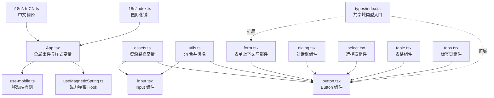

图表来源
- [src/App.tsx:1-70](file://src/App.tsx#L1-L70)
- [src/hooks/use-magnetic-spring.ts](file://src/hooks/useMagneticSpring.ts)
- [src/hooks/use-mobile.ts:1-20](file://src/hooks/use-mobile.ts#L1-L20)
- [src/constants/assets.ts:1-24](file://src/constants/assets.ts#L1-L24)
- [src/lib/utils.ts:1-7](file://src/lib/utils.ts#L1-L7)
- [src/components/ui/button.tsx:1-63](file://src/components/ui/button.tsx#L1-L63)
- [src/components/ui/input.tsx:1-22](file://src/components/ui/input.tsx#L1-L22)
- [src/components/ui/form.tsx:1-168](file://src/components/ui/form.tsx#L1-L168)
- [src/components/ui/dialog.tsx:1-142](file://src/components/ui/dialog.tsx#L1-L142)
- [src/components/ui/select.tsx:1-189](file://src/components/ui/select.tsx#L1-L189)
- [src/components/ui/table.tsx:1-115](file://src/components/ui/table.tsx#L1-L115)
- [src/components/ui/tabs.tsx:1-67](file://src/components/ui/tabs.tsx#L1-L67)
- [src/i18n/index.ts](file://src/i18n/index.ts)
- [src/i18n/zh-CN.ts](file://src/i18n/zh-CN.ts)
- [src/types/index.ts:1-3](file://src/types/index.ts#L1-L3)

## 详细组件类型分析

### Button 组件类型
- 组合类型：Button 的 props 结合了原生 button 属性与 VariantProps，支持 variant 与 size 两种变体，以及 asChild 语义化渲染。
- 约束与安全：variant/size 限定集合，避免非法值；asChild 通过 Slot 渲染，提升可访问性。
- 使用建议：优先使用变体与尺寸枚举，避免硬编码样式字符串。

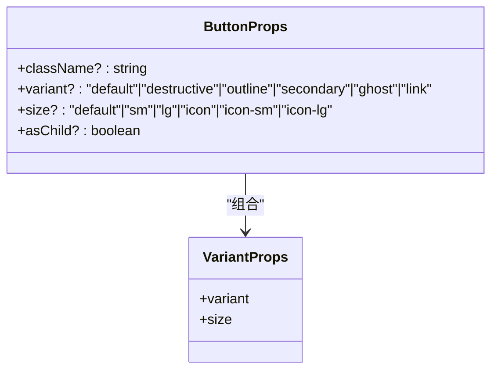

图表来源
- [src/components/ui/button.tsx:39-60](file://src/components/ui/button.tsx#L39-L60)

章节来源
- [src/components/ui/button.tsx:1-63](file://src/components/ui/button.tsx#L1-L63)

### Input 组件类型
- 组合类型：基于原生 input 属性，统一焦点与无效态样式，支持 aria-* 属性与无障碍提示。
- 约束与安全：type 与原生一致；样式通过 cn 合并，避免冲突。

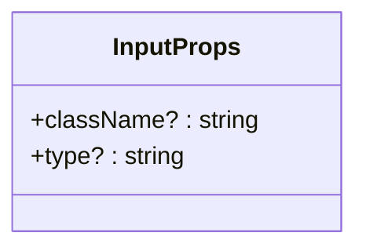

图表来源
- [src/components/ui/input.tsx:5-19](file://src/components/ui/input.tsx#L5-L19)

章节来源
- [src/components/ui/input.tsx:1-22](file://src/components/ui/input.tsx#L1-L22)

### 表单上下文与部件类型
- 泛型上下文：FormFieldContextValue<TFieldValues,TName> 通过泛型约束字段集合与字段路径，确保类型安全。
- useFormField：从上下文中读取字段状态与 ID，返回标准化的标识符与状态，便于无障碍与错误提示。
- 约束与安全：必须在 FormField 内部使用，否则抛出错误；FormItem 内部使用 useId 生成唯一 ID。

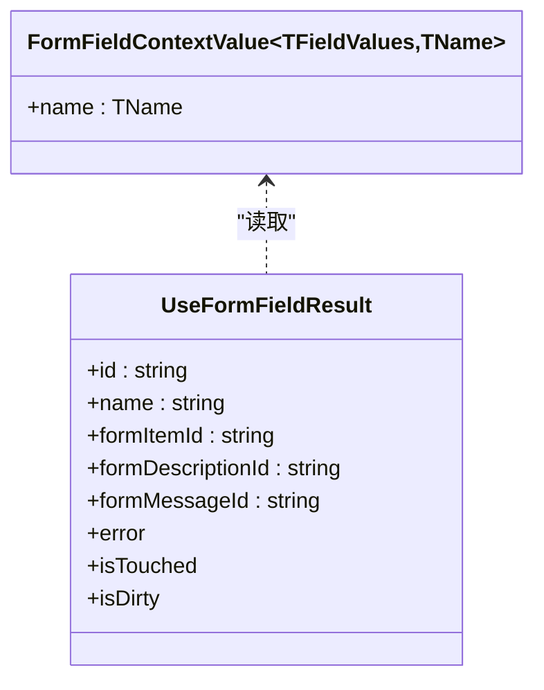

图表来源
- [src/components/ui/form.tsx:21-66](file://src/components/ui/form.tsx#L21-L66)

章节来源
- [src/components/ui/form.tsx:1-168](file://src/components/ui/form.tsx#L1-L168)

### Dialog 组件类型
- 组合类型：DialogRoot、Trigger、Portal、Overlay、Content、Header/Footer、Title/Description、Close 等子组件均基于 @radix-ui/react-dialog 的原生属性封装。
- 约束与安全：showCloseButton 为可选布尔值；Portal 与 Overlay 确保模态层正确挂载与遮罩。

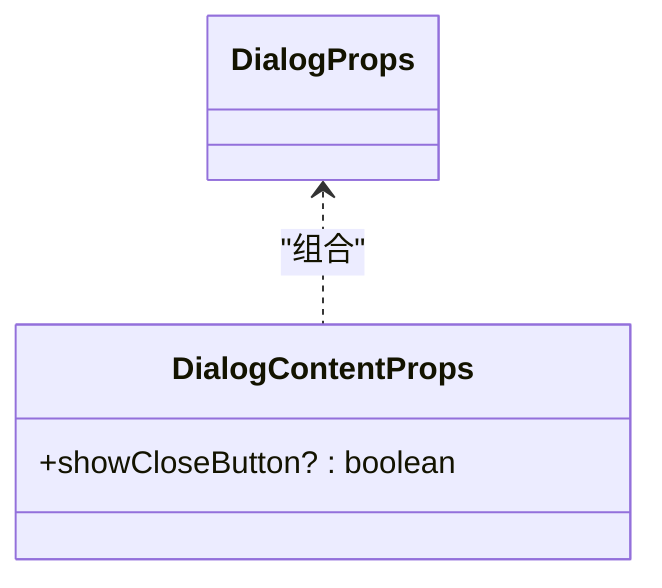

图表来源
- [src/components/ui/dialog.tsx:7-79](file://src/components/ui/dialog.tsx#L7-L79)

章节来源
- [src/components/ui/dialog.tsx:1-142](file://src/components/ui/dialog.tsx#L1-L142)

### Select 组件类型
- 组合类型：SelectRoot、Trigger（支持 size）、Content、Viewport、Item、Label、Separator、ScrollUp/DownButton 等子组件。
- 约束与安全：Trigger 的 size 限定集合；Portal 与 Viewport 确保滚动与对齐。

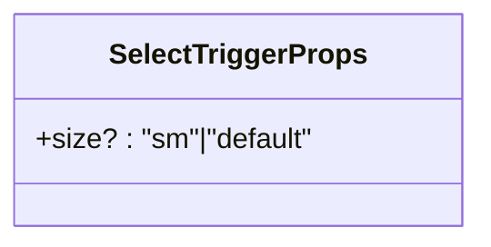

图表来源
- [src/components/ui/select.tsx:25-49](file://src/components/ui/select.tsx#L25-L49)

章节来源
- [src/components/ui/select.tsx:1-189](file://src/components/ui/select.tsx#L1-L189)

### Table 组件类型
- 组合类型：Table 容器、TableHeader、TableBody、TableFooter、TableRow、TableHead、TableCell、TableCaption。
- 约束与安全：容器负责横向滚动；行与单元格统一样式与交互。

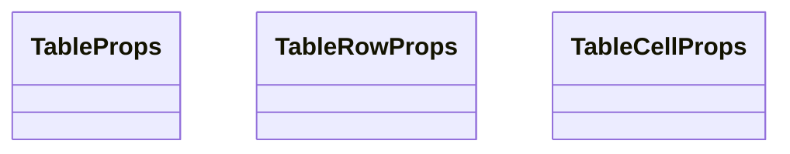

图表来源
- [src/components/ui/table.tsx:5-114](file://src/components/ui/table.tsx#L5-L114)

章节来源
- [src/components/ui/table.tsx:1-115](file://src/components/ui/table.tsx#L1-L115)

### Tabs 组件类型
- 组合类型：TabsRoot、List、Trigger、Content 基于 @radix-ui/react-tabs 封装。
- 约束与安全：样式与交互由数据属性驱动，确保一致性。

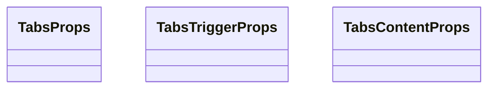

图表来源
- [src/components/ui/tabs.tsx:8-66](file://src/components/ui/tabs.tsx#L8-L66)

章节来源
- [src/components/ui/tabs.tsx:1-67](file://src/components/ui/tabs.tsx#L1-L67)

### 资源路径与常量类型
- publicUrl：将 public 目录下的相对路径与 BASE_URL 拼接，形成最终资源 URL。
- THRONE_PHOTOS/FULLBODY_PHOTOS：每项包含 name、src、label 字段，使用 as const 确保字面量类型，避免宽化。
- 约束与安全：BASE_URL 必须正确配置；name 与 label 为字面量，便于类型推导与运行时校验。

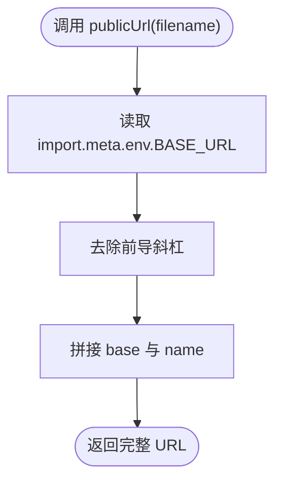

图表来源
- [src/constants/assets.ts:2-6](file://src/constants/assets.ts#L2-L6)

章节来源
- [src/constants/assets.ts:1-24](file://src/constants/assets.ts#L1-L24)

### 工具函数类型
- cn(...inputs: ClassValue[]): 合并类名，支持字符串、对象、数组与条件值。约束：输入可变参数，输出为字符串。
- 约束与安全：去重与合并逻辑减少运行时样式冲突风险。

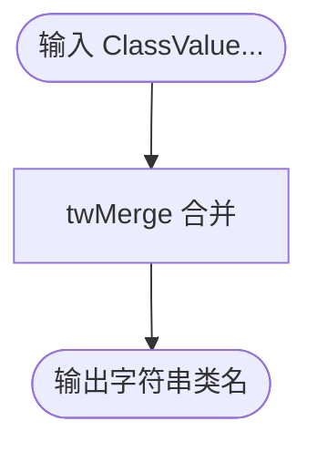

图表来源
- [src/lib/utils.ts:4-6](file://src/lib/utils.ts#L4-L6)

章节来源
- [src/lib/utils.ts:1-7](file://src/lib/utils.ts#L1-L7)

### Hook 类型
- useIsMobile：返回布尔值，初始可能为 undefined，最终返回布尔值。约束：依赖浏览器环境。
- useMagneticSpring：返回 ref、x、y、onPointerMove、onPointerLeave。约束：依赖 Framer Motion 与 React；仅在按钮元素上生效。
- 约束与安全：在 SSR 场景需注意初始状态处理；在卸载时清理事件与 RAF。

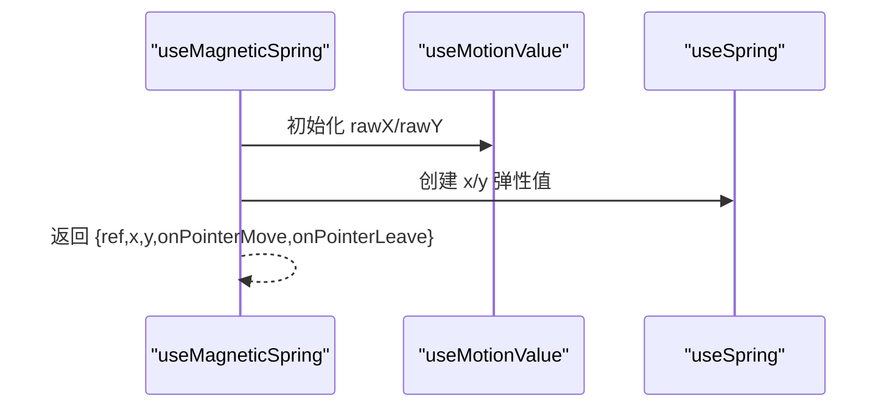

图表来源
- [src/hooks/useMagneticSpring.ts:6-32](file://src/hooks/useMagneticSpring.ts#L6-L32)

章节来源
- [src/hooks/use-mobile.ts:1-20](file://src/hooks/use-mobile.ts#L1-L20)
- [src/hooks/useMagneticSpring.ts:1-33](file://src/hooks/useMagneticSpring.ts#L1-L33)

### 国际化类型
- i18n 键值与映射：index.ts 导出键到翻译文本的映射，zh-CN.ts 定义中文翻译。约束：键名需保持一致。
- 约束与安全：键名不匹配会导致运行时查找失败；建议通过工具生成或集中管理键名。

章节来源
- [src/i18n/index.ts](file://src/i18n/index.ts)
- [src/i18n/zh-CN.ts](file://src/i18n/zh-CN.ts)

### 应用层类型
- App：全局事件处理与样式变量设置。约束：依赖 DOM API 与 RAF；需在卸载时清理事件与 RAF。
- 约束与安全：在服务端渲染场景需避免直接操作 DOM；可采用条件渲染或延迟初始化。

章节来源
- [src/App.tsx:1-70](file://src/App.tsx#L1-L70)

## 依赖关系分析
- 类型耦合与内聚
  - Button、Input、Dialog、Select、Table、Tabs 等组件均依赖 cn 工具函数，确保样式一致性与可维护性。
  - 表单部件依赖 react-hook-form 的泛型上下文，确保字段类型安全。
  - 资源路径常量依赖 BASE_URL，影响组件渲染与资源加载。
- 外部依赖与集成
  - @radix-ui/react-*：为 UI 组件提供语义化与无障碍基础。
  - framer-motion：为磁力弹簧与动画提供支持。
  - clsx 与 tailwind-merge：为类名合并提供类型安全与去重能力。
- 潜在循环依赖
  - 当前未发现直接循环依赖；类型入口文件为空，便于后续扩展而不引入耦合。

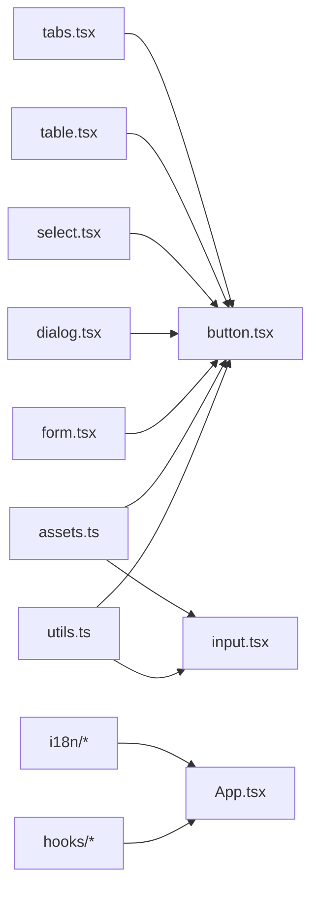

图表来源
- [src/lib/utils.ts:1-7](file://src/lib/utils.ts#L1-L7)
- [src/components/ui/button.tsx:1-63](file://src/components/ui/button.tsx#L1-L63)
- [src/components/ui/input.tsx:1-22](file://src/components/ui/input.tsx#L1-L22)
- [src/constants/assets.ts:1-24](file://src/constants/assets.ts#L1-L24)
- [src/components/ui/form.tsx:1-168](file://src/components/ui/form.tsx#L1-L168)
- [src/components/ui/dialog.tsx:1-142](file://src/components/ui/dialog.tsx#L1-L142)
- [src/components/ui/select.tsx:1-189](file://src/components/ui/select.tsx#L1-L189)
- [src/components/ui/table.tsx:1-115](file://src/components/ui/table.tsx#L1-L115)
- [src/components/ui/tabs.tsx:1-67](file://src/components/ui/tabs.tsx#L1-L67)
- [src/hooks/use-mobile.ts:1-20](file://src/hooks/use-mobile.ts#L1-L20)
- [src/hooks/useMagneticSpring.ts:1-33](file://src/hooks/useMagneticSpring.ts#L1-L33)
- [src/i18n/index.ts](file://src/i18n/index.ts)
- [src/i18n/zh-CN.ts](file://src/i18n/zh-CN.ts)
- [src/App.tsx:1-70](file://src/App.tsx#L1-L70)

章节来源
- [src/lib/utils.ts:1-7](file://src/lib/utils.ts#L1-L7)
- [src/components/ui/button.tsx:1-63](file://src/components/ui/button.tsx#L1-L63)
- [src/components/ui/input.tsx:1-22](file://src/components/ui/input.tsx#L1-L22)
- [src/constants/assets.ts:1-24](file://src/constants/assets.ts#L1-L24)
- [src/components/ui/form.tsx:1-168](file://src/components/ui/form.tsx#L1-L168)
- [src/components/ui/dialog.tsx:1-142](file://src/components/ui/dialog.tsx#L1-L142)
- [src/components/ui/select.tsx:1-189](file://src/components/ui/select.tsx#L1-L189)
- [src/components/ui/table.tsx:1-115](file://src/components/ui/table.tsx#L1-L115)
- [src/components/ui/tabs.tsx:1-67](file://src/components/ui/tabs.tsx#L1-L67)
- [src/hooks/use-mobile.ts:1-20](file://src/hooks/use-mobile.ts#L1-L20)
- [src/hooks/useMagneticSpring.ts:1-33](file://src/hooks/useMagneticSpring.ts#L1-L33)
- [src/i18n/index.ts](file://src/i18n/index.ts)
- [src/i18n/zh-CN.ts](file://src/i18n/zh-CN.ts)
- [src/App.tsx:1-70](file://src/App.tsx#L1-L70)

## 性能考量
- 类名合并：cn 通过 twMerge 合并类名，减少重复与冲突，降低样式计算开销。
- 动画与事件：useMagneticSpring 使用 useMotionValue 与 useSpring，配合 RAF 优化指针移动响应；在卸载时清理事件与 RAF，避免内存泄漏。
- 资源路径：publicUrl 在构建时确定 BASE_URL，避免运行时拼接开销。
- 表单上下文：useFormField 通过上下文读取字段状态，减少重复查询与 DOM 访问。

## 故障排查指南
- 资源 404
  - 现象：图片或静态资源无法加载。
  - 排查：确认 BASE_URL 是否正确配置；检查 public 目录下文件名是否与常量一致。
  - 参考：资源解析函数与常量定义。
- 表单错误提示缺失
  - 现象：表单字段错误信息未显示。
  - 排查：确认 useFormField 在 FormField 内部使用；检查无障碍属性与 aria-* 属性。
  - 参考：表单上下文与部件类型。
- 移动端样式异常
  - 现象：移动端布局错乱。
  - 排查：确认 useIsMobile 初始状态处理；在 SSR 场景避免直接操作 DOM。
  - 参考：移动端检测 Hook。
- 磁力弹簧无响应
  - 现象：按钮无跟随效果。
  - 排查：确认元素为 HTMLButtonElement；检查 onPointerMove/onPointerLeave 绑定；在卸载时清理事件。
  - 参考：磁力弹簧 Hook。

章节来源
- [src/constants/assets.ts:1-24](file://src/constants/assets.ts#L1-L24)
- [src/components/ui/form.tsx:45-66](file://src/components/ui/form.tsx#L45-L66)
- [src/hooks/use-mobile.ts:1-20](file://src/hooks/use-mobile.ts#L1-L20)
- [src/hooks/useMagneticSpring.ts:1-33](file://src/hooks/useMagneticSpring.ts#L1-L33)

## 结论
MinLL 的类型体系以“明确约束 + 编译时检查 + 运行时验证”为核心设计原则，通过：
- 资源路径常量与 as const 提升字面量精度
- cn 工具函数保障类名合并的一致性
- 泛型上下文确保表单字段类型安全
- Hook 的生命周期管理避免内存泄漏
- UI 组件的变体与尺寸枚举限制非法值
实现类型安全与可维护性的平衡。建议后续在 src/types/index.ts 中逐步补充共享域类型，完善第三方类型声明与扩展模式。

## 附录
- 类型扩展模式
  - 在 src/types/index.ts 中新增共享域类型，如枚举、联合类型、条件类型与泛型接口，遵循“先扩展、后使用”的原则。
  - 与第三方库集成时，优先通过类型声明文件（.d.ts）声明模块类型，避免污染源码。
- 类型守卫与断言
  - 在运行时对资源路径进行非空与格式校验，必要时使用类型断言确保后续流程的类型安全。
  - 对表单字段状态进行守卫，避免在错误上下文中访问属性。
- 最佳实践
  - 使用 as const 与字面量类型提升推导精度
  - 通过变体与尺寸枚举替代硬编码字符串
  - 在 SSR 场景谨慎处理 DOM 操作与事件绑定