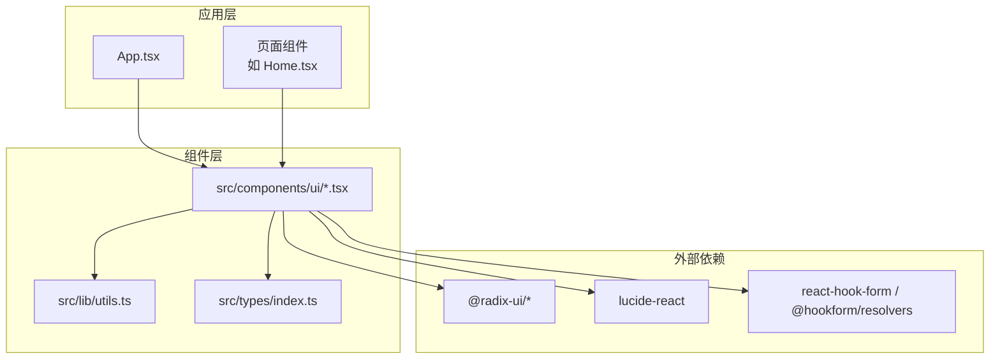
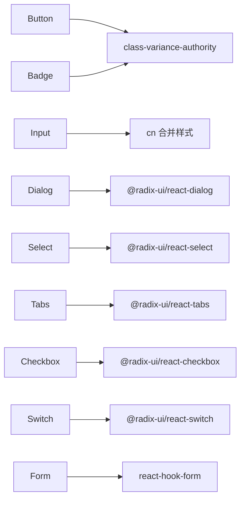

# 组件 API

<cite>
**本文引用的文件**
- [README.md](file://README.md)
- [package.json](file://package.json)
- [src/types/index.ts](file://src/types/index.ts)
- [src/lib/utils.ts](file://src/lib/utils.ts)
- [src/components/ui/button.tsx](file://src/components/ui/button.tsx)
- [src/components/ui/input.tsx](file://src/components/ui/input.tsx)
- [src/components/ui/dialog.tsx](file://src/components/ui/dialog.tsx)
- [src/components/ui/form.tsx](file://src/components/ui/form.tsx)
- [src/components/ui/select.tsx](file://src/components/ui/select.tsx)
- [src/components/ui/tabs.tsx](file://src/components/ui/tabs.tsx)
- [src/components/ui/card.tsx](file://src/components/ui/card.tsx)
- [src/components/ui/table.tsx](file://src/components/ui/table.tsx)
- [src/components/ui/badge.tsx](file://src/components/ui/badge.tsx)
- [src/components/ui/avatar.tsx](file://src/components/ui/avatar.tsx)
- [src/components/ui/checkbox.tsx](file://src/components/ui/checkbox.tsx)
- [src/components/ui/switch.tsx](file://src/components/ui/switch.tsx)
</cite>

## 目录
1. [简介](#简介)
2. [项目结构](#项目结构)
3. [核心组件](#核心组件)
4. [架构总览](#架构总览)
5. [详细组件分析](#详细组件分析)
6. [依赖关系分析](#依赖关系分析)
7. [性能考量](#性能考量)
8. [故障排查指南](#故障排查指南)
9. [结论](#结论)
10. [附录](#附录)

## 简介
本文件为 MinLL 项目的组件 API 文档，聚焦于 src/components/ui 下的通用 UI 组件，系统性记录各组件的 props 接口、默认值、类型约束、事件回调、插槽与嵌套使用方式，并补充可访问性、样式定制与主题支持说明。文档同时给出组件间通信模式与数据流的解释，帮助开发者在受控/非受控场景下正确使用组件。

## 项目结构
MinLL 使用 React + TypeScript + Vite 构建，UI 组件集中于 src/components/ui，采用 Radix UI 原子能力与 Tailwind 样式工具链，结合 class-variance-authority 实现变体风格控制。共享类型定义位于 src/types/index.ts，通用样式合并工具位于 src/lib/utils.ts。



图表来源
- [package.json:13-60](file://package.json#L13-L60)
- [src/lib/utils.ts](file://src/lib/utils.ts)
- [src/types/index.ts:1-3](file://src/types/index.ts#L1-L3)

章节来源
- [README.md:1-74](file://README.md#L1-L74)
- [package.json:1-84](file://package.json#L1-L84)
- [src/types/index.ts:1-3](file://src/types/index.ts#L1-L3)

## 核心组件
本节概述本次文档覆盖的核心组件及其职责与共同特性（如变体系统、可访问性标记、数据槽 data-slot）。

- 按钮 Button：支持多种变体与尺寸，可作为容器渲染（asChild），具备焦点可见边框与错误态样式。
- 输入 Input：基础输入封装，统一焦点环、禁用态与错误态视觉。
- 对话框 Dialog：基于 Radix UI 的对话框体系，提供触发器、内容、标题、描述、页眉/页脚等子组件。
- 表单 Form：集成 react-hook-form，提供 Form、FormField、FormItem、FormLabel、FormControl、FormDescription、FormMessage 等上下文化组件。
- 选择器 Select：支持分组、标签、滚动按钮、弹出层定位与对齐，提供大小与位置变体。
- 标签页 Tabs：提供根容器、列表、触发器与内容区。
- 卡片 Card：卡片容器及头部/标题/描述/内容/底部等分区。
- 表格 Table：表格容器与表头/体/脚、行、单元格、标题、说明等。
- 徽章 Badge：语义化标签，支持变体与 asChild。
- 头像 Avatar：头像根容器、图片与占位。
- 复选框 Checkbox：受控/非受控均可，支持错误态。
- 开关 Switch：受控/非受控均可，支持错误态。

章节来源
- [src/components/ui/button.tsx:1-63](file://src/components/ui/button.tsx#L1-L63)
- [src/components/ui/input.tsx:1-22](file://src/components/ui/input.tsx#L1-L22)
- [src/components/ui/dialog.tsx:1-142](file://src/components/ui/dialog.tsx#L1-L142)
- [src/components/ui/form.tsx:1-168](file://src/components/ui/form.tsx#L1-L168)
- [src/components/ui/select.tsx:1-189](file://src/components/ui/select.tsx#L1-L189)
- [src/components/ui/tabs.tsx:1-67](file://src/components/ui/tabs.tsx#L1-L67)
- [src/components/ui/card.tsx:1-93](file://src/components/ui/card.tsx#L1-L93)
- [src/components/ui/table.tsx:1-115](file://src/components/ui/table.tsx#L1-L115)
- [src/components/ui/badge.tsx:1-47](file://src/components/ui/badge.tsx#L1-L47)
- [src/components/ui/avatar.tsx:1-52](file://src/components/ui/avatar.tsx#L1-L52)
- [src/components/ui/checkbox.tsx:1-33](file://src/components/ui/checkbox.tsx#L1-L33)
- [src/components/ui/switch.tsx:1-32](file://src/components/ui/switch.tsx#L1-L32)

## 架构总览
以下类图展示 UI 组件与底层库的关系，以及组件内部的数据槽与变体系统。

```mermaid
classDiagram
class Button {
+variant : "default"|"destructive"|"outline"|"secondary"|"ghost"|"link"
+size : "default"|"sm"|"lg"|"icon"|"icon-sm"|"icon-lg"
+asChild : boolean
+className : string
}
class Input {
+type : string
+className : string
}
class Dialog {
+open : boolean
+onOpenChange : (open : boolean) => void
}
class Form {
+resolver : any
+defaultValues : any
}
class Select {
+value : string
+onValueChange : (value : string) => void
}
class Tabs {
+value : string
+onValueChange : (value : string) => void
}
class Card {
+className : string
}
class Table {
+className : string
}
class Badge {
+variant : "default"|"secondary"|"destructive"|"outline"
+asChild : boolean
+className : string
}
class Avatar {
+className : string
}
class Checkbox {
+checked : boolean
+onCheckedChange : (checked : boolean) => void
}
class Switch {
+checked : boolean
+onCheckedChange : (checked : boolean) => void
}
Button --> "Radix Slot" : "asChild"
Dialog --> "@radix-ui/react-dialog" : "委托"
Form --> "react-hook-form" : "集成"
Select --> "@radix-ui/react-select" : "委托"
Tabs --> "@radix-ui/react-tabs" : "委托"
Checkbox --> "@radix-ui/react-checkbox" : "委托"
Switch --> "@radix-ui/react-switch" : "委托"
```

图表来源
- [src/components/ui/button.tsx:39-60](file://src/components/ui/button.tsx#L39-L60)
- [src/components/ui/input.tsx:5-19](file://src/components/ui/input.tsx#L5-L19)
- [src/components/ui/dialog.tsx:7-11](file://src/components/ui/dialog.tsx#L7-L11)
- [src/components/ui/form.tsx:19-43](file://src/components/ui/form.tsx#L19-L43)
- [src/components/ui/select.tsx:7-11](file://src/components/ui/select.tsx#L7-L11)
- [src/components/ui/tabs.tsx:8-19](file://src/components/ui/tabs.tsx#L8-L19)
- [src/components/ui/card.tsx:5-16](file://src/components/ui/card.tsx#L5-L16)
- [src/components/ui/table.tsx:5-18](file://src/components/ui/table.tsx#L5-L18)
- [src/components/ui/badge.tsx:28-44](file://src/components/ui/badge.tsx#L28-L44)
- [src/components/ui/avatar.tsx:6-20](file://src/components/ui/avatar.tsx#L6-L20)
- [src/components/ui/checkbox.tsx:9-30](file://src/components/ui/checkbox.tsx#L9-L30)
- [src/components/ui/switch.tsx:8-29](file://src/components/ui/switch.tsx#L8-L29)

## 详细组件分析

### Button（按钮）
- 类型与变体
  - 变体 variant：default、destructive、outline、secondary、ghost、link
  - 尺寸 size：default、sm、lg、icon、icon-sm、icon-lg
  - asChild：是否以子元素容器渲染
- 属性
  - className: string
  - variant: 指定样式变体，默认 default
  - size: 指定尺寸，默认 default
  - asChild: 是否透传为子节点容器，默认 false
  - 其余继承自原生 button 的属性
- 默认值与行为
  - 默认变体与尺寸通过变体系统设定；禁用态自动添加不可交互与透明度样式
- 可访问性与样式
  - 内置焦点可见边框与环形高亮；错误态通过 aria-invalid 控制
  - 支持 data-slot="button" 与 data-variant、data-size 用于测试与调试
- 使用建议
  - 作为链接使用时可配合 asChild 渲染 a 标签
  - 图标按钮建议使用 icon/icon-sm/icon-lg 尺寸

章节来源
- [src/components/ui/button.tsx:7-37](file://src/components/ui/button.tsx#L7-L37)
- [src/components/ui/button.tsx:39-60](file://src/components/ui/button.tsx#L39-L60)

### Input（输入）
- 属性
  - className: string
  - type: string（原生 input type）
  - 其余继承自原生 input 的属性
- 默认值与行为
  - 无固定默认值；统一聚焦环、禁用态与错误态视觉
- 可访问性与样式
  - 错误态通过 aria-invalid 控制；支持 data-slot="input"
- 使用建议
  - 与 Form 组件配合时，建议通过 FormControl 提供无障碍关联

章节来源
- [src/components/ui/input.tsx:5-19](file://src/components/ui/input.tsx#L5-L19)

### Dialog（对话框）
- 根组件与触发器
  - Dialog：根容器，继承 Radix UI Root 所有属性
  - DialogTrigger：触发器，继承 Trigger
  - DialogPortal：传送门，继承 Portal
  - DialogOverlay：遮罩层，继承 Overlay
  - DialogClose：关闭按钮，继承 Close
- 内容与布局
  - DialogContent：内容区，支持 showCloseButton 控制是否显示关闭按钮
- 标题与描述
  - DialogTitle、DialogDescription：标题与描述
- 页眉与页脚
  - DialogHeader、DialogFooter：布局容器
- 属性要点
  - open、onOpenChange：受控/非受控切换
  - showCloseButton：默认 true
  - data-slot 覆盖：content、overlay、trigger、portal 等
- 生命周期与状态管理
  - 由 Radix UI 管理打开/关闭状态；通过 onOpenChange 切换
- 使用建议
  - 建议始终提供 DialogTitle 与 DialogDescription，提升可访问性
  - 关闭按钮应包含可读的 sr-only 文本

章节来源
- [src/components/ui/dialog.tsx:7-141](file://src/components/ui/dialog.tsx#L7-L141)

### Form（表单）
- 上下文与组合
  - Form：FormProvider 包装
  - FormField：Controller 包装，注入字段名上下文
  - FormItem：FormItemContext，生成唯一 ID
  - FormLabel：Label，绑定到对应表单项
  - FormControl：Slot，设置 aria-describedby 与 aria-invalid
  - FormDescription：辅助说明文本
  - FormMessage：错误信息展示
- 属性与回调
  - Form：resolver、defaultValues
  - FormField：name、control、rules、shouldUnregister 等（来自 react-hook-form）
  - useFormField：返回 id、name、formItemId、formDescriptionId、formMessageId、error 等
- 受控/非受控
  - 通过 react-hook-form 的 Controller 与 useFormContext 实现受控
- 可访问性
  - 自动设置 aria-invalid、aria-describedby，错误信息以文本形式呈现
- 使用建议
  - 必须在 FormField 内部使用 FormControl，确保无障碍属性正确绑定

章节来源
- [src/components/ui/form.tsx:19-167](file://src/components/ui/form.tsx#L19-L167)

### Select（选择器）
- 组合组件
  - Select、SelectTrigger、SelectValue、SelectContent、SelectLabel、SelectItem、SelectSeparator、SelectScrollUpButton、SelectScrollDownButton、SelectGroup
- 属性要点
  - SelectTrigger 支持 size："sm"|"default"
  - SelectContent 支持 position（item-aligned|popper）与 align
  - SelectValue 用于显示当前值
- 受控/非受控
  - 通过 value/onValueChange 实现受控
- 可访问性
  - 通过 Radix UI 提供键盘导航与屏幕阅读器支持
- 使用建议
  - 长列表建议启用滚动按钮与 popper 定位

章节来源
- [src/components/ui/select.tsx:7-188](file://src/components/ui/select.tsx#L7-L188)

### Tabs（标签页）
- 组件
  - Tabs、TabsList、TabsTrigger、TabsContent
- 属性
  - Tabs：className
  - TabsList：className
  - TabsTrigger：className
  - TabsContent：className
- 受控/非受控
  - 通过 value/onValueChange 控制当前激活项
- 使用建议
  - 触发器与内容需一一对应，保持名称一致

章节来源
- [src/components/ui/tabs.tsx:8-66](file://src/components/ui/tabs.tsx#L8-L66)

### Card（卡片）
- 组件
  - Card、CardHeader、CardTitle、CardDescription、CardAction、CardContent、CardFooter
- 属性
  - className: string
- 使用建议
  - CardHeader 支持右侧操作区布局，便于复杂卡片排版

章节来源
- [src/components/ui/card.tsx:5-92](file://src/components/ui/card.tsx#L5-L92)

### Table（表格）
- 组件
  - Table、TableHeader、TableBody、TableFooter、TableRow、TableHead、TableCell、TableCaption
- 属性
  - className: string
- 使用建议
  - 表格容器自动处理横向滚动，适合宽表场景

章节来源
- [src/components/ui/table.tsx:5-114](file://src/components/ui/table.tsx#L5-L114)

### Badge（徽章）
- 属性
  - variant: "default"|"secondary"|"destructive"|"outline"
  - asChild: boolean
  - className: string
- 默认值
  - variant 默认 default
- 使用建议
  - 作为容器渲染时可配合 asChild

章节来源
- [src/components/ui/badge.tsx:28-44](file://src/components/ui/badge.tsx#L28-L44)

### Avatar（头像）
- 组件
  - Avatar、AvatarImage、AvatarFallback
- 属性
  - className: string
- 使用建议
  - 建议提供 fallback 以增强失败场景体验

章节来源
- [src/components/ui/avatar.tsx:6-51](file://src/components/ui/avatar.tsx#L6-L51)

### Checkbox（复选框）
- 属性
  - checked: boolean
  - onCheckedChange: (checked: boolean) => void
  - className: string
- 默认值
  - 无固定默认值，由父级受控
- 使用建议
  - 与 Form 组件配合时，建议通过 Controller 管理状态

章节来源
- [src/components/ui/checkbox.tsx:9-30](file://src/components/ui/checkbox.tsx#L9-L30)

### Switch（开关）
- 属性
  - checked: boolean
  - onCheckedChange: (checked: boolean) => void
  - className: string
- 默认值
  - 无固定默认值，由父级受控
- 使用建议
  - 适合布尔配置项的快速切换

章节来源
- [src/components/ui/switch.tsx:8-29](file://src/components/ui/switch.tsx#L8-L29)

## 依赖关系分析
- 组件依赖
  - Button、Badge：使用 class-variance-authority 与 cn 合并样式
  - Dialog、Select、Tabs、Checkbox、Switch：依赖 @radix-ui/react-* 原子组件
  - Form：依赖 react-hook-form 与 @hookform/resolvers
  - Input：依赖 cn 工具
- 数据流
  - 受控组件通过 props.value 与 onXxx 回调实现双向绑定
  - 非受控组件通过 ref 或内部状态管理（如 Tabs、Dialog）



图表来源
- [src/components/ui/button.tsx:3-5](file://src/components/ui/button.tsx#L3-L5)
- [src/components/ui/badge.tsx:3-5](file://src/components/ui/badge.tsx#L3-L5)
- [src/components/ui/input.tsx:3-4](file://src/components/ui/input.tsx#L3-L4)
- [src/components/ui/dialog.tsx:1-2](file://src/components/ui/dialog.tsx#L1-L2)
- [src/components/ui/select.tsx:1-2](file://src/components/ui/select.tsx#L1-L2)
- [src/components/ui/tabs.tsx:3-4](file://src/components/ui/tabs.tsx#L3-L4)
- [src/components/ui/checkbox.tsx:3-4](file://src/components/ui/checkbox.tsx#L3-L4)
- [src/components/ui/switch.tsx:3-4](file://src/components/ui/switch.tsx#L3-L4)
- [src/components/ui/form.tsx:6-14](file://src/components/ui/form.tsx#L6-L14)

章节来源
- [package.json:13-60](file://package.json#L13-L60)

## 性能考量
- 变体系统与样式合并
  - 使用 class-variance-authority 与 cn 合并样式，避免运行时复杂计算，减少重绘
- 动画与过渡
  - Dialog、Select、Tabs 等组件使用 Radix UI 的动画钩子，建议在低端设备上谨慎使用复杂动画
- 表单性能
  - Form 组件通过 react-hook-form 管理状态，建议合理拆分表单域，避免全量重渲染

## 故障排查指南
- 表单无障碍问题
  - 确保 FormControl 正确包裹输入组件，并提供 aria-describedby 与 aria-invalid
- 对话框焦点问题
  - 确保 DialogContent 内部存在可聚焦元素，或显式设置初始焦点
- 选择器滚动异常
  - 长列表建议启用 SelectScrollUpButton/SelectScrollDownButton，并检查 viewport 尺寸
- 受控状态不更新
  - 确认 onXxx 回调已正确传递给受控组件，且父组件已更新对应状态

章节来源
- [src/components/ui/form.tsx:107-123](file://src/components/ui/form.tsx#L107-L123)
- [src/components/ui/dialog.tsx:56-78](file://src/components/ui/dialog.tsx#L56-L78)
- [src/components/ui/select.tsx:141-175](file://src/components/ui/select.tsx#L141-L175)

## 结论
MinLL 的 UI 组件以 Radix UI 为基础，结合 class-variance-authority 与 Tailwind 实现一致的视觉与交互体验。通过 data-slot、aria-* 属性与 react-hook-form 集成，组件在可访问性与开发效率之间取得平衡。遵循本文档的接口定义与使用建议，可在不同场景下稳定地组合与扩展组件。

## 附录
- TypeScript 类型与工具
  - 共享类型定义位于 src/types/index.ts，当前为空对象占位，后续可扩展领域模型
  - 样式工具函数 cn 位于 src/lib/utils.ts，用于安全合并类名
- 参考配置
  - 项目使用 Vite + React + TypeScript，ESLint 配置建议开启类型感知规则

章节来源
- [src/types/index.ts:1-3](file://src/types/index.ts#L1-L3)
- [src/lib/utils.ts](file://src/lib/utils.ts)
- [README.md:18-72](file://README.md#L18-L72)