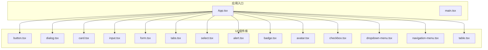
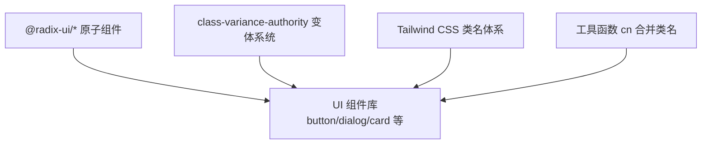
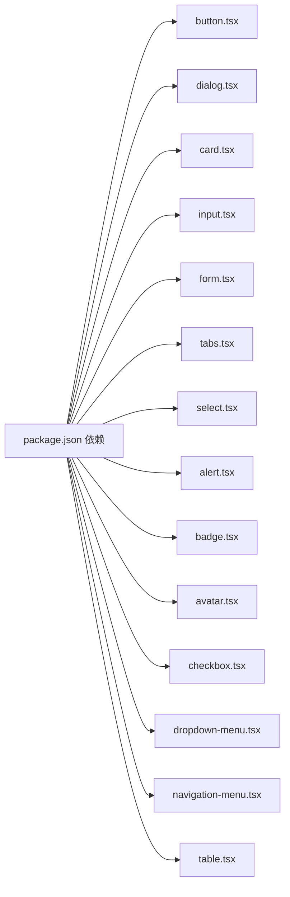

# UI 组件库

<cite>
**本文引用的文件**
- [README.md](file://README.md)
- [package.json](file://package.json)
- [src/components/ui/button.tsx](file://src/components/ui/button.tsx)
- [src/components/ui/dialog.tsx](file://src/components/ui/dialog.tsx)
- [src/components/ui/card.tsx](file://src/components/ui/card.tsx)
- [src/components/ui/input.tsx](file://src/components/ui/input.tsx)
- [src/components/ui/form.tsx](file://src/components/ui/form.tsx)
- [src/components/ui/tabs.tsx](file://src/components/ui/tabs.tsx)
- [src/components/ui/select.tsx](file://src/components/ui/select.tsx)
- [src/components/ui/alert.tsx](file://src/components/ui/alert.tsx)
- [src/components/ui/badge.tsx](file://src/components/ui/badge.tsx)
- [src/components/ui/avatar.tsx](file://src/components/ui/avatar.tsx)
- [src/components/ui/checkbox.tsx](file://src/components/ui/checkbox.tsx)
- [src/components/ui/dropdown-menu.tsx](file://src/components/ui/dropdown-menu.tsx)
- [src/components/ui/navigation-menu.tsx](file://src/components/ui/navigation-menu.tsx)
- [src/components/ui/table.tsx](file://src/components/ui/table.tsx)
</cite>

## 目录
1. [简介](#简介)
2. [项目结构](#项目结构)
3. [核心组件](#核心组件)
4. [架构总览](#架构总览)
5. [组件详解](#组件详解)
6. [依赖关系分析](#依赖关系分析)
7. [性能与可访问性](#性能与可访问性)
8. [故障排查指南](#故障排查指南)
9. [结论](#结论)
10. [附录：使用示例与最佳实践](#附录使用示例与最佳实践)

## 简介
本文件为 MinLL 项目的 UI 组件库文档，聚焦于 src/components/ui 下的组件实现与使用说明。这些组件以 Radix UI 为基础，结合 Tailwind CSS 与 class-variance-authority（CVA）实现一致的视觉风格、可组合的结构以及良好的可访问性。文档覆盖组件外观、行为、交互模式、属性与事件、插槽与自定义选项、响应式与无障碍合规、状态与动画、样式与主题定制、跨浏览器与性能优化、组件组合与集成方式，并提供基于 Radix UI 的可访问性设计原则。

## 项目结构
MinLL 使用 Vite + React + TypeScript 构建，UI 组件集中于 src/components/ui，采用按功能分层的组织方式，便于复用与维护。组件广泛依赖 Radix UI 原子能力，通过数据属性与类名约定统一状态与交互。

图表来源
- [src/components/ui/button.tsx](file://src/components/ui/button.tsx)
- [src/components/ui/dialog.tsx](file://src/components/ui/dialog.tsx)
- [src/components/ui/card.tsx](file://src/components/ui/card.tsx)
- [src/components/ui/input.tsx](file://src/components/ui/input.tsx)
- [src/components/ui/form.tsx](file://src/components/ui/form.tsx)
- [src/components/ui/tabs.tsx](file://src/components/ui/tabs.tsx)
- [src/components/ui/select.tsx](file://src/components/ui/select.tsx)
- [src/components/ui/alert.tsx](file://src/components/ui/alert.tsx)
- [src/components/ui/badge.tsx](file://src/components/ui/badge.tsx)
- [src/components/ui/avatar.tsx](file://src/components/ui/avatar.tsx)
- [src/components/ui/checkbox.tsx](file://src/components/ui/checkbox.tsx)
- [src/components/ui/dropdown-menu.tsx](file://src/components/ui/dropdown-menu.tsx)
- [src/components/ui/navigation-menu.tsx](file://src/components/ui/navigation-menu.tsx)
- [src/components/ui/table.tsx](file://src/components/ui/table.tsx)

章节来源
- [README.md:1-74](file://README.md#L1-L74)
- [package.json:1-84](file://package.json#L1-L84)

## 核心组件
本节概述关键组件的职责与典型用法，便于快速定位与组合使用。

- 按钮 Button：支持多种变体与尺寸，可透传原生按钮属性；支持 asChild 以嵌入链接等语义元素。
- 对话框 Dialog：基于 @radix-ui/react-dialog，提供触发器、内容、标题、描述、页眉/页脚等子组件。
- 卡片 Card：容器型布局组件，支持标题、描述、操作区、内容与页脚。
- 输入 Input：基础输入控件，内置焦点与无效态样式。
- 表单 Form：基于 react-hook-form 与 Radix Label，提供表单项上下文、标签、控制、描述与错误消息。
- 标签页 Tabs：基于 @radix-ui/react-tabs，提供列表、触发器与内容区域。
- 选择 Select：下拉选择，支持组、标签、项、滚动按钮、图标与对齐/位置配置。
- 警告 Alert：信息提示容器，支持默认与破坏性样式。
- 徽章 Badge：轻量标签，支持多种变体与 asChild。
- 头像 Avatar：头像容器与图像/回退占位。
- 复选框 Checkbox：基于 @radix-ui/react-checkbox，含指示器。
- 下拉菜单 DropdownMenu：支持普通项、复选/单选项、分组、子菜单、快捷键等。
- 导航菜单 NavigationMenu：多级导航，支持视口与指示器。
- 表格 Table：表格容器与各子元素，支持响应式滚动与悬停/选中态。

章节来源
- [src/components/ui/button.tsx:1-63](file://src/components/ui/button.tsx#L1-L63)
- [src/components/ui/dialog.tsx:1-142](file://src/components/ui/dialog.tsx#L1-L142)
- [src/components/ui/card.tsx:1-93](file://src/components/ui/card.tsx#L1-L93)
- [src/components/ui/input.tsx:1-22](file://src/components/ui/input.tsx#L1-L22)
- [src/components/ui/form.tsx:1-168](file://src/components/ui/form.tsx#L1-L168)
- [src/components/ui/tabs.tsx:1-67](file://src/components/ui/tabs.tsx#L1-L67)
- [src/components/ui/select.tsx:1-189](file://src/components/ui/select.tsx#L1-L189)
- [src/components/ui/alert.tsx:1-67](file://src/components/ui/alert.tsx#L1-L67)
- [src/components/ui/badge.tsx:1-47](file://src/components/ui/badge.tsx#L1-L47)
- [src/components/ui/avatar.tsx:1-52](file://src/components/ui/avatar.tsx#L1-L52)
- [src/components/ui/checkbox.tsx:1-33](file://src/components/ui/checkbox.tsx#L1-L33)
- [src/components/ui/dropdown-menu.tsx:1-256](file://src/components/ui/dropdown-menu.tsx#L1-L256)
- [src/components/ui/navigation-menu.tsx:1-169](file://src/components/ui/navigation-menu.tsx#L1-L169)
- [src/components/ui/table.tsx:1-115](file://src/components/ui/table.tsx#L1-L115)

## 架构总览
组件库以“原子能力 + 组合容器”的方式构建，Radix UI 提供可访问性与状态管理，Tailwind/CVA 提供样式与变体系统，utils 中的 cn 统一合并类名。组件通过 data-slot 与 data-* 属性暴露内部节点，便于主题与样式覆盖。

图表来源
- [src/components/ui/button.tsx:1-63](file://src/components/ui/button.tsx#L1-L63)
- [src/components/ui/dialog.tsx:1-142](file://src/components/ui/dialog.tsx#L1-L142)
- [src/components/ui/card.tsx:1-93](file://src/components/ui/card.tsx#L1-L93)
- [src/components/ui/form.tsx:1-168](file://src/components/ui/form.tsx#L1-L168)
- [src/components/ui/select.tsx:1-189](file://src/components/ui/select.tsx#L1-L189)
- [src/components/ui/dropdown-menu.tsx:1-256](file://src/components/ui/dropdown-menu.tsx#L1-L256)
- [src/components/ui/navigation-menu.tsx:1-169](file://src/components/ui/navigation-menu.tsx#L1-L169)
- [src/components/ui/table.tsx:1-115](file://src/components/ui/table.tsx#L1-L115)

## 组件详解

### 按钮 Button
- 视觉与行为
  - 支持默认、破坏性、描边、次级、幽静、链接等变体，以及默认、小、大、图标、图标-小、图标-大等尺寸。
  - 聚焦时显示 ring 边框与 ring 颜色的可见环，无效态通过 aria-invalid 映射到破坏性样式。
  - 支持 asChild 将渲染节点替换为 Slot，便于在链接等场景复用按钮样式。
- 关键属性
  - className: 自定义类名
  - variant: 变体字符串
  - size: 尺寸字符串
  - asChild: 是否作为子节点渲染
  - 其余透传至原生 button
- 插槽与自定义
  - 通过 data-slot="button"、data-variant、data-size 暴露内部节点与状态，便于主题覆盖
- 动画与过渡
  - 过渡属性包含颜色与阴影变化，聚焦态 ring 动画由 Radix 控制
- 无障碍与响应式
  - 保持原生按钮语义，支持键盘操作与屏幕阅读器识别
- 性能与组合
  - 通过 CVA 与 cn 合并类名，避免多余重排

章节来源
- [src/components/ui/button.tsx:1-63](file://src/components/ui/button.tsx#L1-L63)

### 对话框 Dialog
- 结构与交互
  - Root/Trigger/Portal/Overlay/Content/Close/Title/Description/Header/Footer 组成完整对话框体系
  - 内容区域支持是否显示关闭按钮的开关
  - 打开/关闭时具备淡入/淡出与缩放动画
- 关键属性
  - DialogContent: showCloseButton（是否显示关闭按钮）
  - Overlay/Content: className 透传
  - Close: 默认包含关闭图标与仅读辅助文本
- 无障碍
  - 使用 Radix Dialog 的可访问性基座，自动处理焦点陷阱与隐藏背景
- 动画与过渡
  - data-state 控制进入/退出动画序列

章节来源
- [src/components/ui/dialog.tsx:1-142](file://src/components/ui/dialog.tsx#L1-L142)

### 卡片 Card
- 结构
  - Card/CardHeader/CardTitle/CardDescription/CardAction/CardContent/CardFooter
  - Header 支持带动作区的网格布局，Footer 支持边框线上的间距控制
- 样式与主题
  - 基于 Tailwind 类名与容器查询，适配不同断点下的布局
- 无障碍
  - 语义化 div 容器，建议在需要时添加 role 与标题层级

章节来源
- [src/components/ui/card.tsx:1-93](file://src/components/ui/card.tsx#L1-L93)

### 输入 Input
- 行为与样式
  - 内置聚焦 ring 与无效态样式，支持 placeholder、selection 等伪类
  - 支持 type 透传与禁用态
- 无障碍
  - 保持原生 input 语义，配合 Form/Label 使用更佳

章节来源
- [src/components/ui/input.tsx:1-22](file://src/components/ui/input.tsx#L1-L22)

### 表单 Form
- 上下文与钩子
  - FormProvider、FormField、useFormField、FormItem、FormLabel、FormControl、FormDescription、FormMessage
  - 自动注入 aria-describedby、aria-invalid 与 id 关联
- 错误展示
  - 当存在错误时，消息元素会显示错误信息或 children
- 无障碍
  - 严格遵循 Label/Control/Description/Message 的可访问性结构

章节来源
- [src/components/ui/form.tsx:1-168](file://src/components/ui/form.tsx#L1-L168)

### 标签页 Tabs
- 结构
  - Tabs/TabsList/TabsTrigger/TabsContent
  - 触发器激活态具备边框与阴影变化
- 无障碍
  - 基于 Radix Tabs，自动处理键盘导航与 ARIA 属性

章节来源
- [src/components/ui/tabs.tsx:1-67](file://src/components/ui/tabs.tsx#L1-L67)

### 选择 Select
- 结构与特性
  - Root/Group/Value/Trigger/Content/Viewport/Label/Item/ItemIndicator/Separator/ScrollUpButton/ScrollDownButton
  - Trigger 支持大小（sm/default），Content 支持 popper 或 item-aligned 两种定位策略
  - Item 包含勾选指示器与文本
- 无障碍
  - 通过 Radix Select 提供键盘导航与屏幕阅读器支持
- 动画与过渡
  - 打开/关闭具备淡入/淡出与缩放动画

章节来源
- [src/components/ui/select.tsx:1-189](file://src/components/ui/select.tsx#L1-L189)

### 警告 Alert
- 样式
  - 支持默认与破坏性两种变体，破坏性变体将文本与描述映射为破坏性色彩
- 结构
  - Alert/AlertTitle/AlertDescription

章节来源
- [src/components/ui/alert.tsx:1-67](file://src/components/ui/alert.tsx#L1-L67)

### 徽章 Badge
- 变体与渲染
  - 支持 default/secondary/destructive/outline 四种变体，支持 asChild
- 无障碍
  - 作为非交互元素，建议配合工具提示或额外语义说明

章节来源
- [src/components/ui/badge.tsx:1-47](file://src/components/ui/badge.tsx#L1-L47)

### 头像 Avatar
- 结构
  - Avatar/AvatarImage/AvatarFallback
- 无障碍
  - 建议为头像提供替代文本（alt）

章节来源
- [src/components/ui/avatar.tsx:1-52](file://src/components/ui/avatar.tsx#L1-L52)

### 复选框 Checkbox
- 行为
  - 基于 Radix Checkbox，支持选中态指示器
- 无障碍
  - 保持原生复选框语义，支持键盘切换

章节来源
- [src/components/ui/checkbox.tsx:1-33](file://src/components/ui/checkbox.tsx#L1-L33)

### 下拉菜单 DropdownMenu
- 结构与变体
  - 支持普通项、复选/单选项、分组、标签、分隔符、快捷键、子菜单等
  - 支持 inset 缩进与 destructive 样式
- 动画与过渡
  - 打开/关闭具备淡入/淡出与滑入滑出动画
- 无障碍
  - 基于 Radix DropdownMenu，提供键盘导航与 ARIA 支持

章节来源
- [src/components/ui/dropdown-menu.tsx:1-256](file://src/components/ui/dropdown-menu.tsx#L1-L256)

### 导航菜单 NavigationMenu
- 结构
  - Root/List/Item/Trigger/Content/Viewport/Link/Indicator
  - Trigger 内部包含下箭头图标，打开时旋转
- 动画与过渡
  - 支持从侧边滑入与淡入等动画
- 无障碍
  - 基于 Radix NavigationMenu，提供多级导航与键盘支持

章节来源
- [src/components/ui/navigation-menu.tsx:1-169](file://src/components/ui/navigation-menu.tsx#L1-L169)

### 表格 Table
- 结构
  - Table/TableHeader/TableBody/TableFooter/TableRow/TableHead/TableCell/TableCaption
  - 容器提供横向滚动，行具备 hover 与 selected 状态
- 响应式
  - 在移动端可通过横向滚动查看内容

章节来源
- [src/components/ui/table.tsx:1-115](file://src/components/ui/table.tsx#L1-L115)

## 依赖关系分析
组件库依赖 Radix UI 原子组件与相关生态，同时结合 Tailwind 与 CVA 实现一致的视觉与交互体验。

图表来源
- [package.json:13-60](file://package.json#L13-L60)

章节来源
- [package.json:13-60](file://package.json#L13-L60)

## 性能与可访问性
- 可访问性设计原则（基于 Radix UI）
  - 所有交互组件均基于 Radix UI 原子组件，确保键盘可达、焦点管理、ARIA 属性与屏幕阅读器支持。
  - 表单组件通过 useFormField 自动注入 aria-describedby 与 aria-invalid，减少样板代码。
  - 对话框、下拉菜单、导航菜单等复杂组件均内置焦点陷阱与背景遮罩。
- 响应式设计
  - 组件普遍使用 Tailwind 工具类，支持在不同断点下的布局调整；表格容器提供横向滚动。
- 样式与主题
  - 通过 CVA 与 cn 合并类名，支持在不改变组件结构的前提下进行主题覆盖。
  - 组件暴露 data-slot 与 data-* 属性，便于主题系统按需覆盖。
- 动画与过渡
  - 大量使用 Radix 动画与 Tailwind 过渡类，保证流畅与一致的用户体验。
- 跨浏览器兼容性
  - 依赖现代浏览器的 CSS Grid、Flexbox、CSS 变量与现代 JavaScript 特性；建议在目标环境中进行兼容性测试。
- 性能优化建议
  - 避免在渲染路径中进行昂贵计算，优先使用 memo 与 useMemo/useCallback。
  - 合理拆分大型组件，按需加载动态导入重型子树。
  - 使用虚拟化处理长列表（如表格/下拉列表）。

## 故障排查指南
- 表单错误未显示
  - 确认已在 FormField 中正确包裹受控组件，并使用 FormControl 注入 aria-describedby 与 aria-invalid。
  - 检查 useFormField 返回的 formMessageId 与 formDescriptionId 是否正确拼接。
- 对话框无法关闭或背景不可点击
  - 确保 DialogOverlay 与 Portal 正确渲染，且 DialogTrigger 与 DialogClose 的绑定无误。
- 下拉菜单定位异常
  - 检查 SelectTrigger 的 size 与 Content 的 position/align 设置，必要时切换为 popper 模式。
- 复选框/单选框状态不一致
  - 确认受控与非受控模式的一致性，避免直接修改受控组件的内部状态。
- 导航菜单内容溢出
  - 检查 viewport 开关与内容宽度设置，必要时限制内容最大宽度或使用滚动条。

章节来源
- [src/components/ui/form.tsx:107-123](file://src/components/ui/form.tsx#L107-L123)
- [src/components/ui/dialog.tsx:56-78](file://src/components/ui/dialog.tsx#L56-L78)
- [src/components/ui/select.tsx:57-85](file://src/components/ui/select.tsx#L57-L85)
- [src/components/ui/checkbox.tsx:14-29](file://src/components/ui/checkbox.tsx#L14-L29)
- [src/components/ui/navigation-menu.tsx:88-100](file://src/components/ui/navigation-menu.tsx#L88-L100)

## 结论
MinLL 的 UI 组件库以 Radix UI 为核心，结合 Tailwind 与 CVA，提供了高可组合性、强可访问性与良好视觉一致性的组件集合。通过清晰的结构、明确的数据属性与类名约定，开发者可以轻松实现主题定制、响应式布局与无障碍合规。建议在实际项目中遵循本文档的属性与组合模式，并结合性能与可访问性最佳实践，持续优化用户体验。

## 附录：使用示例与最佳实践
- 组合模式
  - 表单：Form + FormField + FormItem + FormLabel + FormControl + FormDescription + FormMessage
  - 对话框：Dialog + DialogTrigger + DialogPortal + DialogOverlay + DialogContent + DialogTitle + DialogDescription + DialogFooter
  - 下拉菜单：DropdownMenu + DropdownMenuTrigger + DropdownMenuPortal + DropdownMenuContent + DropdownMenuItem/DropdownMenuCheckboxItem/DropdownMenuRadioItem
  - 导航菜单：NavigationMenu + NavigationMenuList + NavigationMenuItem + NavigationMenuTrigger + NavigationMenuContent + NavigationMenuLink
- 主题与样式
  - 使用 data-slot 与 data-* 属性进行细粒度覆盖，避免全局污染
  - 通过 CVA 变体扩展新的样式族，保持一致性
- 无障碍
  - 为所有交互元素提供语义化标签与描述，确保键盘可达与屏幕阅读器友好
- 性能
  - 对长列表与复杂内容使用懒加载与虚拟化
  - 合理拆分组件，避免不必要的重渲染