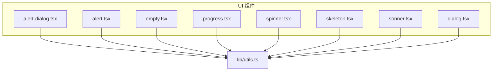
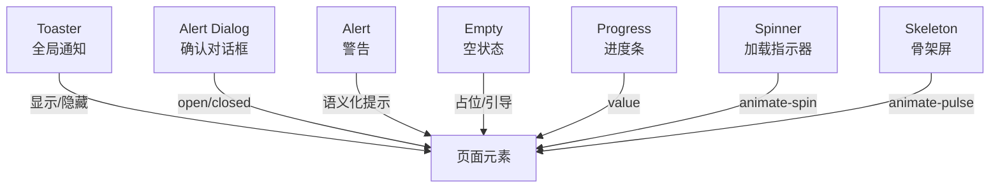
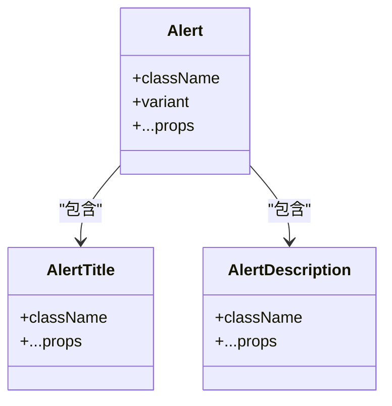
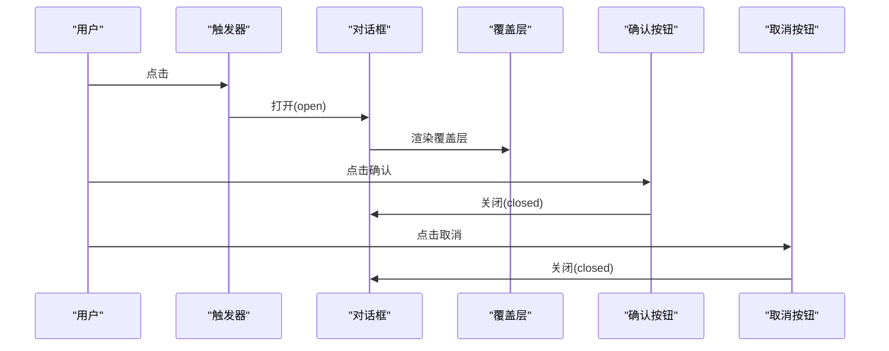
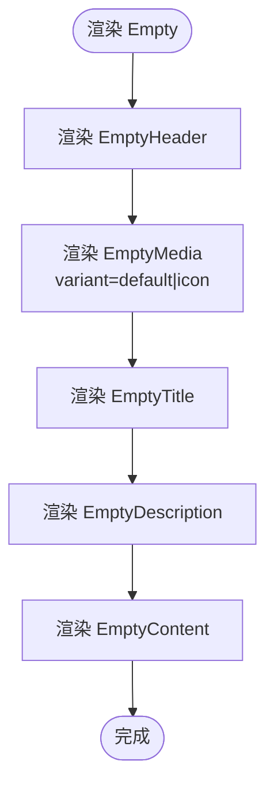
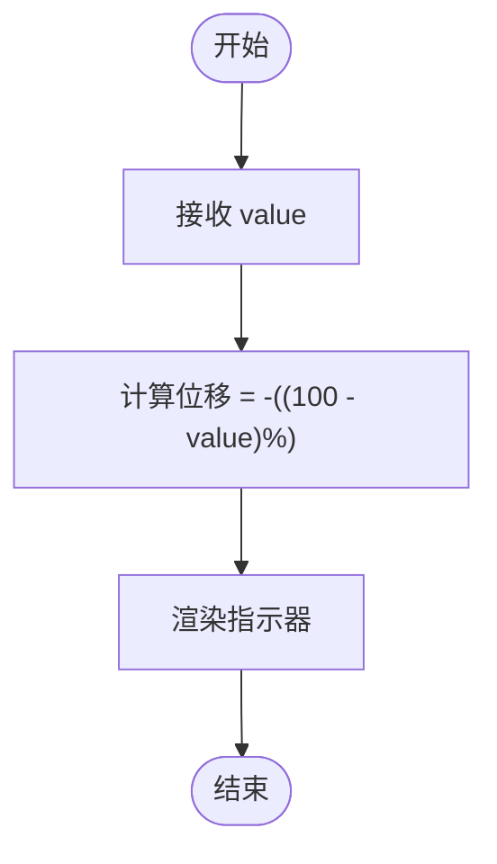
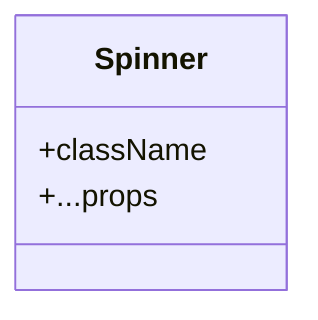
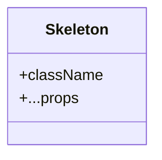
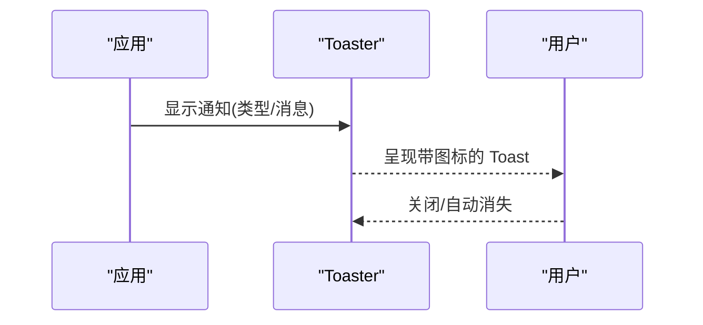
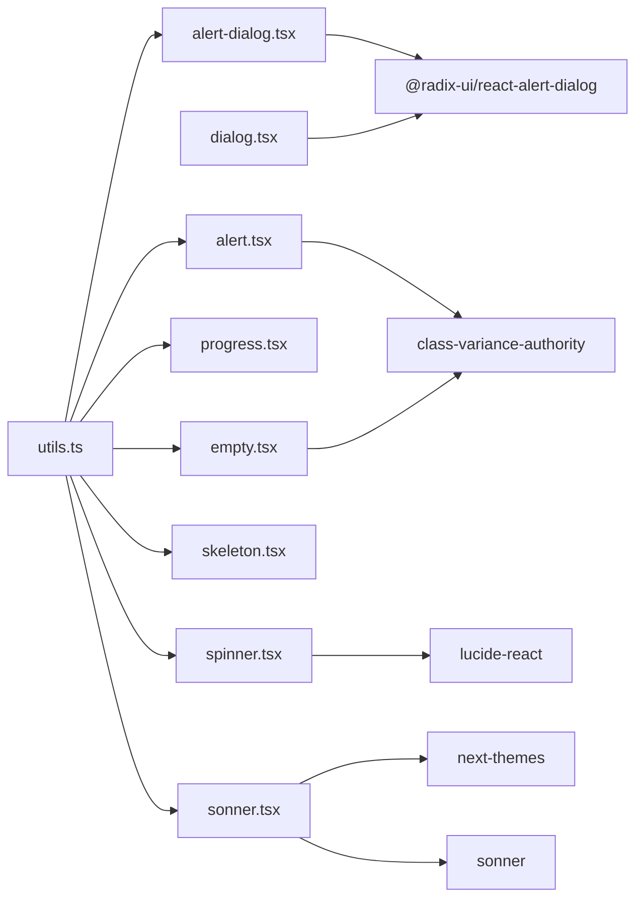

# 反馈组件

<cite>
**本文引用的文件**
- [src/components/ui/alert-dialog.tsx](file://src/components/ui/alert-dialog.tsx)
- [src/components/ui/alert.tsx](file://src/components/ui/alert.tsx)
- [src/components/ui/empty.tsx](file://src/components/ui/empty.tsx)
- [src/components/ui/progress.tsx](file://src/components/ui/progress.tsx)
- [src/components/ui/spinner.tsx](file://src/components/ui/spinner.tsx)
- [src/components/ui/skeleton.tsx](file://src/components/ui/skeleton.tsx)
- [src/components/ui/sonner.tsx](file://src/components/ui/sonner.tsx)
- [src/lib/utils.ts](file://src/lib/utils.ts)
- [src/components/ui/dialog.tsx](file://src/components/ui/dialog.tsx)
</cite>

## 目录
1. [简介](#简介)
2. [项目结构](#项目结构)
3. [核心组件](#核心组件)
4. [架构总览](#架构总览)
5. [详细组件分析](#详细组件分析)
6. [依赖关系分析](#依赖关系分析)
7. [性能考量](#性能考量)
8. [故障排查指南](#故障排查指南)
9. [结论](#结论)
10. [附录：使用示例与最佳实践](#附录使用示例与最佳实践)

## 简介
本章节面向 MinLL 项目的“反馈与交互”组件，系统化梳理以下组件的视觉外观、行为与交互模式：警告（Alert）、确认对话框（Alert Dialog）、空状态（Empty）、进度条（Progress）、加载指示器（Spinner）、骨架屏（Skeleton）以及全局通知（Toaster）。文档将从组件职责、属性与事件、状态与生命周期、动画与无障碍性等方面进行说明，并提供可直接定位到源码的路径指引，便于快速查阅与集成。

## 项目结构
反馈与交互组件主要位于 src/components/ui 目录下，采用按功能分层组织，每个组件以独立文件导出，便于按需引入与组合使用。通用工具函数 cn 用于合并与合并 Tailwind 类名，确保样式一致性与可维护性。

图表来源
- [src/components/ui/alert-dialog.tsx](file://src/components/ui/alert-dialog.tsx)
- [src/components/ui/alert.tsx](file://src/components/ui/alert.tsx)
- [src/components/ui/empty.tsx](file://src/components/ui/empty.tsx)
- [src/components/ui/progress.tsx](file://src/components/ui/progress.tsx)
- [src/components/ui/spinner.tsx](file://src/components/ui/spinner.tsx)
- [src/components/ui/skeleton.tsx](file://src/components/ui/skeleton.tsx)
- [src/components/ui/sonner.tsx](file://src/components/ui/sonner.tsx)
- [src/components/ui/dialog.tsx](file://src/components/ui/dialog.tsx)
- [src/lib/utils.ts](file://src/lib/utils.ts)

章节来源
- [src/lib/utils.ts:1-7](file://src/lib/utils.ts#L1-L7)

## 核心组件
- 警告（Alert）
  - 角色：向用户传达重要信息，支持默认与破坏性两种语义变体。
  - 关键子组件：标题、描述。
  - 属性要点：className、variant（default/destructive）。
  - 无障碍：容器具备 role="alert"，提升读屏可达性。
- 确认对话框（Alert Dialog）
  - 角色：在用户执行高风险操作前进行二次确认。
  - 关键子组件：触发器、覆盖层、内容区、头部、尾部、标题、描述、确认按钮、取消按钮。
  - 动画：基于 Radix UI 的 open/closed 状态切换，内置淡入淡出与缩放动画。
- 空状态（Empty）
  - 角色：在数据为空或无结果时提供友好提示与引导。
  - 关键子组件：EmptyHeader、EmptyMedia（含 variant/icon）、EmptyTitle、EmptyDescription、EmptyContent。
  - 行为：居中布局、响应式内边距、可选图标背景。
- 进度条（Progress）
  - 角色：展示任务完成进度。
  - 属性要点：className、value（数值百分比）。
  - 行为：根据 value 计算指示器位移，实现平滑过渡。
- 加载指示器（Spinner）
  - 角色：表示异步加载中的占位状态。
  - 属性要点：className。
  - 无障碍：role="status"、aria-label="Loading"。
- 骨架屏（Skeleton）
  - 角色：在内容加载前提供占位，改善感知性能。
  - 属性要点：className。
- 全局通知（Toaster）
  - 角色：统一展示成功、信息、警告、错误与加载等通知。
  - 图标：success/info/warning/error/loading 对应不同图标。
  - 主题：通过 next-themes 获取当前主题，动态适配。

章节来源
- [src/components/ui/alert.tsx:1-67](file://src/components/ui/alert.tsx#L1-L67)
- [src/components/ui/alert-dialog.tsx:1-156](file://src/components/ui/alert-dialog.tsx#L1-L156)
- [src/components/ui/empty.tsx:1-105](file://src/components/ui/empty.tsx#L1-L105)
- [src/components/ui/progress.tsx:1-30](file://src/components/ui/progress.tsx#L1-L30)
- [src/components/ui/spinner.tsx:1-17](file://src/components/ui/spinner.tsx#L1-L17)
- [src/components/ui/skeleton.tsx:1-14](file://src/components/ui/skeleton.tsx#L1-L14)
- [src/components/ui/sonner.tsx:1-39](file://src/components/ui/sonner.tsx#L1-L39)

## 架构总览
反馈组件围绕“状态驱动 + 动画过渡 + 无障碍语义”的设计原则构建，内部通过 Radix UI 提供可访问的状态机，外部通过 cn 合并样式，确保一致的视觉与交互体验。

图表来源
- [src/components/ui/sonner.tsx:1-39](file://src/components/ui/sonner.tsx#L1-L39)
- [src/components/ui/alert-dialog.tsx:1-156](file://src/components/ui/alert-dialog.tsx#L1-L156)
- [src/components/ui/alert.tsx:1-67](file://src/components/ui/alert.tsx#L1-L67)
- [src/components/ui/empty.tsx:1-105](file://src/components/ui/empty.tsx#L1-L105)
- [src/components/ui/progress.tsx:1-30](file://src/components/ui/progress.tsx#L1-L30)
- [src/components/ui/spinner.tsx:1-17](file://src/components/ui/spinner.tsx#L1-L17)
- [src/components/ui/skeleton.tsx:1-14](file://src/components/ui/skeleton.tsx#L1-L14)

## 详细组件分析

### 警告（Alert）
- 组件职责
  - 以语义化方式向用户传递信息，支持默认与破坏性两类。
  - 内置标题与描述子组件，便于组合使用。
- 属性与事件
  - 外层 div 支持 className 与 variant（default/destructive）。
  - 子组件 AlertTitle、AlertDescription 仅接受 className 与原生属性。
- 状态与生命周期
  - 基于父级容器渲染；未内置内部状态，由调用方控制显示/隐藏。
- 动画与无障碍
  - 容器设置 role="alert"，提升读屏可达性。
- 使用建议
  - 破坏性警告用于错误或危险操作提示，避免滥用。
  - 描述文本建议简洁明确，必要时提供链接指向帮助文档。

图表来源
- [src/components/ui/alert.tsx:1-67](file://src/components/ui/alert.tsx#L1-L67)

章节来源
- [src/components/ui/alert.tsx:1-67](file://src/components/ui/alert.tsx#L1-L67)

### 确认对话框（Alert Dialog）
- 组件职责
  - 在关键操作前进行二次确认，防止误操作。
- 子组件与职责
  - 触发器、覆盖层、内容区、头部、尾部、标题、描述、确认按钮、取消按钮。
- 状态与生命周期
  - 基于 Radix UI 的 open/closed 状态切换，内置淡入淡出与缩放动画。
  - Portal 将内容挂载到文档根节点，避免层级与遮挡问题。
- 交互模式
  - 打开：触发器点击后进入 open 状态。
  - 关闭：取消按钮或覆盖层点击后进入 closed 状态。
  - 确认：确认按钮回调后关闭对话框。
- 无障碍
  - 内容区固定居中，焦点管理与键盘交互遵循 Radix UI 默认行为。
- 最佳实践
  - 明确操作后果与撤销成本，提供清晰的标题与描述。
  - 确认按钮使用强调样式，取消按钮使用描边样式。

图表来源
- [src/components/ui/alert-dialog.tsx:1-156](file://src/components/ui/alert-dialog.tsx#L1-L156)

章节来源
- [src/components/ui/alert-dialog.tsx:1-156](file://src/components/ui/alert-dialog.tsx#L1-L156)

### 空状态（Empty）
- 组件职责
  - 在列表、搜索结果为空或资源尚未就绪时，提供友好提示与引导。
- 子组件与职责
  - EmptyHeader、EmptyMedia（支持 default 与 icon 两种变体）、EmptyTitle、EmptyDescription、EmptyContent。
- 行为与样式
  - 居中对齐、响应式内边距、可选图标背景（icon 变体）。
- 无障碍
  - 文本语义清晰，必要时提供可点击的引导链接。
- 最佳实践
  - 提供明确的下一步操作（如“新建”、“刷新”），避免纯文字提示。
  - 图标仅作辅助，不应替代可读文本。

图表来源
- [src/components/ui/empty.tsx:1-105](file://src/components/ui/empty.tsx#L1-L105)

章节来源
- [src/components/ui/empty.tsx:1-105](file://src/components/ui/empty.tsx#L1-L105)

### 进度条（Progress）
- 组件职责
  - 展示任务完成进度，支持数值型进度指示。
- 属性与事件
  - className、value（数值百分比，范围通常为 0-100）。
- 行为与动画
  - 指示器根据 value 计算位移，使用过渡动画实现平滑更新。
- 最佳实践
  - 当进度值不稳定时，建议增加最小阈值或缓冲动画，避免闪烁。
  - 配合加载指示器或空状态，提升复杂流程的可感知性。

图表来源
- [src/components/ui/progress.tsx:1-30](file://src/components/ui/progress.tsx#L1-L30)

章节来源
- [src/components/ui/progress.tsx:1-30](file://src/components/ui/progress.tsx#L1-L30)

### 加载指示器（Spinner）
- 组件职责
  - 表示异步加载中的占位状态，常与骨架屏配合使用。
- 属性与事件
  - className。
- 无障碍
  - role="status"、aria-label="Loading"，提升读屏可达性。
- 最佳实践
  - 在长耗时操作中优先使用骨架屏+Spinner的组合，减少闪烁感。
  - 控制 Spinner 的尺寸与颜色，确保与整体设计一致。

图表来源
- [src/components/ui/spinner.tsx:1-17](file://src/components/ui/spinner.tsx#L1-L17)

章节来源
- [src/components/ui/spinner.tsx:1-17](file://src/components/ui/spinner.tsx#L1-L17)

### 骨架屏（Skeleton）
- 组件职责
  - 在内容加载前提供占位，改善感知性能与滚动流畅度。
- 属性与事件
  - className。
- 动画与样式
  - animate-pulse 实现呼吸式脉动效果。
- 最佳实践
  - 骨架屏形状与真实内容保持一致，避免误导用户。
  - 避免在骨架屏上叠加过多细节，以免影响感知速度。

图表来源
- [src/components/ui/skeleton.tsx:1-14](file://src/components/ui/skeleton.tsx#L1-L14)

章节来源
- [src/components/ui/skeleton.tsx:1-14](file://src/components/ui/skeleton.tsx#L1-L14)

### 全局通知（Toaster）
- 组件职责
  - 统一展示系统级通知，包括成功、信息、警告、错误与加载状态。
- 图标与主题
  - 自定义图标集，主题通过 next-themes 获取，动态适配明暗模式。
- 无障碍
  - 作为全局 Toast 容器，建议结合屏幕阅读器测试，确保消息可读。
- 最佳实践
  - 控制通知数量与时长，避免频繁弹窗造成干扰。
  - 成功/错误类通知应提供明确的操作反馈与后续步骤。

图表来源
- [src/components/ui/sonner.tsx:1-39](file://src/components/ui/sonner.tsx#L1-L39)

章节来源
- [src/components/ui/sonner.tsx:1-39](file://src/components/ui/sonner.tsx#L1-L39)

## 依赖关系分析
- 组件间耦合
  - 各反馈组件彼此独立，通过 cn 工具函数统一样式拼接，降低耦合度。
  - Alert Dialog 依赖 Radix UI 的状态机与 Portal，确保可访问性与层级正确性。
  - Toaster 依赖 next-themes 与 sonner，负责全局通知的呈现与主题适配。
- 外部依赖
  - Radix UI：提供可访问的状态机与动画过渡。
  - lucide-react：提供图标库，用于 Spinner、Toaster 等组件。
  - class-variance-authority：用于 Alert、EmptyMedia 等组件的变体样式管理。
- 潜在循环依赖
  - 未发现组件间的循环导入；样式通过 cn 合并，避免运行时循环。

图表来源
- [src/lib/utils.ts:1-7](file://src/lib/utils.ts#L1-L7)
- [src/components/ui/alert-dialog.tsx:1-156](file://src/components/ui/alert-dialog.tsx#L1-L156)
- [src/components/ui/alert.tsx:1-67](file://src/components/ui/alert.tsx#L1-L67)
- [src/components/ui/empty.tsx:1-105](file://src/components/ui/empty.tsx#L1-L105)
- [src/components/ui/progress.tsx:1-30](file://src/components/ui/progress.tsx#L1-L30)
- [src/components/ui/spinner.tsx:1-17](file://src/components/ui/spinner.tsx#L1-L17)
- [src/components/ui/skeleton.tsx:1-14](file://src/components/ui/skeleton.tsx#L1-L14)
- [src/components/ui/sonner.tsx:1-39](file://src/components/ui/sonner.tsx#L1-L39)
- [src/components/ui/dialog.tsx:1-45](file://src/components/ui/dialog.tsx#L1-L45)

章节来源
- [src/components/ui/alert-dialog.tsx:1-156](file://src/components/ui/alert-dialog.tsx#L1-L156)
- [src/components/ui/dialog.tsx:1-45](file://src/components/ui/dialog.tsx#L1-L45)
- [src/components/ui/sonner.tsx:1-39](file://src/components/ui/sonner.tsx#L1-L39)
- [src/components/ui/spinner.tsx:1-17](file://src/components/ui/spinner.tsx#L1-L17)
- [src/components/ui/alert.tsx:1-67](file://src/components/ui/alert.tsx#L1-L67)
- [src/components/ui/empty.tsx:1-105](file://src/components/ui/empty.tsx#L1-L105)
- [src/components/ui/progress.tsx:1-30](file://src/components/ui/progress.tsx#L1-L30)
- [src/components/ui/skeleton.tsx:1-14](file://src/components/ui/skeleton.tsx#L1-L14)
- [src/lib/utils.ts:1-7](file://src/lib/utils.ts#L1-L7)

## 性能考量
- 动画与过渡
  - Alert Dialog 与 Dialog 的动画基于 Radix UI 的状态切换，建议避免在同一时间大量打开/关闭，以减少重绘压力。
- 渲染开销
  - Progress 的指示器使用 CSS transform 与 transition，性能良好；但频繁更新时建议节流/防抖。
  - Skeleton 的 animate-pulse 为轻量动画，适合大面积使用。
- 无障碍与可访问性
  - Spinner 设置 role="status" 与 aria-label，有助于读屏软件识别加载状态。
  - Alert 设置 role="alert"，确保关键信息被优先读取。
- 主题与图标
  - Toaster 的图标与主题通过 next-themes 动态注入 CSS 变量，避免重复渲染。

## 故障排查指南
- 对话框无法关闭
  - 检查是否正确使用了 Portal 与 Overlay，确认触发器与内容区的包裹关系。
  - 章节来源
    - [src/components/ui/alert-dialog.tsx:45-62](file://src/components/ui/alert-dialog.tsx#L45-L62)
- 进度条不更新
  - 确认传入的 value 是否在合理范围内，检查样式计算逻辑。
  - 章节来源
    - [src/components/ui/progress.tsx:6-27](file://src/components/ui/progress.tsx#L6-L27)
- 加载指示器不可见
  - 检查 Spinner 的尺寸与颜色是否与背景对比度不足，确认 role 与 aria-label 是否正确设置。
  - 章节来源
    - [src/components/ui/spinner.tsx:5-14](file://src/components/ui/spinner.tsx#L5-L14)
- 空状态布局错位
  - 检查 EmptyMedia 的 variant 选择与容器宽度限制，确保响应式内边距生效。
  - 章节来源
    - [src/components/ui/empty.tsx:31-59](file://src/components/ui/empty.tsx#L31-L59)
- 全局通知图标不显示
  - 确认 Toaster 的 icons 配置是否正确，主题变量是否已注入。
  - 章节来源
    - [src/components/ui/sonner.tsx:11-36](file://src/components/ui/sonner.tsx#L11-L36)

## 结论
MinLL 的反馈与交互组件以“可访问、可组合、可扩展”为核心设计目标，通过 Radix UI 的状态机与动画系统、Tailwind 的样式工具链以及 class-variance-authority 的变体管理，实现了高一致性与低耦合的组件体系。建议在实际业务中结合具体场景选择合适的反馈组件，并遵循无障碍与性能最佳实践，以提升用户体验与可维护性。

## 附录：使用示例与最佳实践
- 警告（Alert）
  - 使用场景：表单校验失败、网络异常提示、安全提醒。
  - 示例路径：[src/components/ui/alert.tsx:22-35](file://src/components/ui/alert.tsx#L22-L35)
  - 最佳实践：破坏性警告仅用于严重错误；描述文本应包含解决建议或重试入口。
- 确认对话框（Alert Dialog）
  - 使用场景：删除、提交、退出登录等高风险操作。
  - 示例路径：[src/components/ui/alert-dialog.tsx:119-141](file://src/components/ui/alert-dialog.tsx#L119-L141)
  - 最佳实践：标题简短有力，描述说明后果；确认按钮强调，取消按钮柔和。
- 空状态（Empty）
  - 使用场景：搜索无结果、列表为空、首次使用引导。
  - 示例路径：[src/components/ui/empty.tsx:5-16](file://src/components/ui/empty.tsx#L5-L16)
  - 最佳实践：提供明确的下一步操作；icon 变体仅作辅助，文本为主。
- 进度条（Progress）
  - 使用场景：上传、下载、安装包安装进度。
  - 示例路径：[src/components/ui/progress.tsx:6-27](file://src/components/ui/progress.tsx#L6-L27)
  - 最佳实践：避免频繁抖动；大任务建议配合骨架屏。
- 加载指示器（Spinner）
  - 使用场景：请求中、页面切换、模块懒加载。
  - 示例路径：[src/components/ui/spinner.tsx:5-14](file://src/components/ui/spinner.tsx#L5-L14)
  - 最佳实践：与骨架屏搭配；控制尺寸与颜色，确保可读性。
- 骨架屏（Skeleton）
  - 使用场景：列表项、卡片、详情页占位。
  - 示例路径：[src/components/ui/skeleton.tsx:3-11](file://src/components/ui/skeleton.tsx#L3-L11)
  - 最佳实践：形状与真实内容一致；避免过度装饰。
- 全局通知（Toaster）
  - 使用场景：接口成功/失败、系统提示、加载中。
  - 示例路径：[src/components/ui/sonner.tsx:11-36](file://src/components/ui/sonner.tsx#L11-L36)
  - 最佳实践：控制通知频率与时长；错误类通知提供重试或帮助入口。