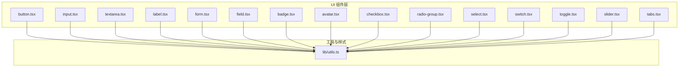
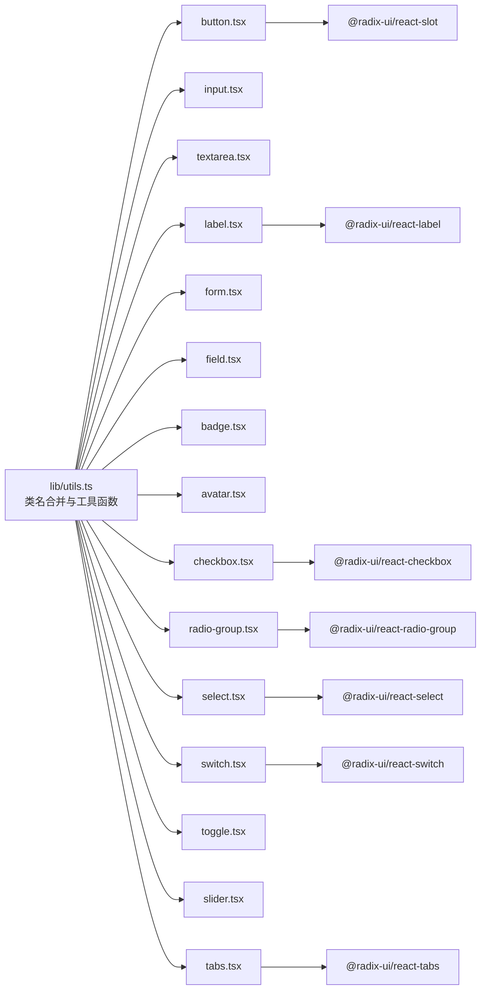
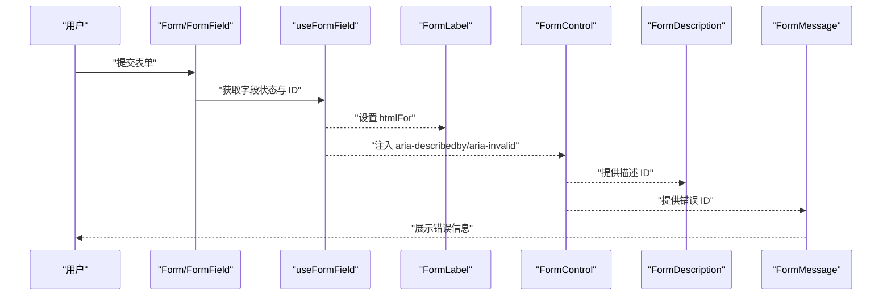
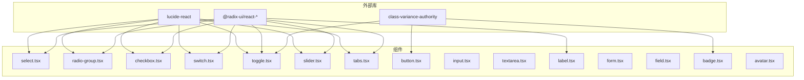

# 基础组件

<cite>
**本文引用的文件**
- [src/components/ui/button.tsx](file://src/components/ui/button.tsx)
- [src/components/ui/input.tsx](file://src/components/ui/input.tsx)
- [src/components/ui/textarea.tsx](file://src/components/ui/textarea.tsx)
- [src/components/ui/label.tsx](file://src/components/ui/label.tsx)
- [src/components/ui/form.tsx](file://src/components/ui/form.tsx)
- [src/components/ui/field.tsx](file://src/components/ui/field.tsx)
- [src/components/ui/badge.tsx](file://src/components/ui/badge.tsx)
- [src/components/ui/avatar.tsx](file://src/components/ui/avatar.tsx)
- [src/components/ui/checkbox.tsx](file://src/components/ui/checkbox.tsx)
- [src/components/ui/radio-group.tsx](file://src/components/ui/radio-group.tsx)
- [src/components/ui/select.tsx](file://src/components/ui/select.tsx)
- [src/components/ui/switch.tsx](file://src/components/ui/switch.tsx)
- [src/components/ui/toggle.tsx](file://src/components/ui/toggle.tsx)
- [src/components/ui/slider.tsx](file://src/components/ui/slider.tsx)
- [src/components/ui/tabs.tsx](file://src/components/ui/tabs.tsx)
- [src/lib/utils.ts](file://src/lib/utils.ts)
</cite>

## 目录
1. [简介](#简介)
2. [项目结构](#项目结构)
3. [核心组件](#核心组件)
4. [架构总览](#架构总览)
5. [详细组件分析](#详细组件分析)
6. [依赖关系分析](#依赖关系分析)
7. [性能与可访问性](#性能与可访问性)
8. [故障排查指南](#故障排查指南)
9. [结论](#结论)
10. [附录：使用示例与最佳实践](#附录使用示例与最佳实践)

## 简介
本章节面向 MinLL 项目的基础 UI 组件，系统梳理按钮、输入框、文本域、标签、表单、徽章、头像、复选框、单选组、选择器、开关、切换按钮、滑块、标签页等常用组件的视觉外观、行为与交互模式；明确各组件的属性（props）、事件处理、状态管理与样式定制方式；提供响应式设计指导与无障碍性支持说明，并总结组件间的组合模式与最佳实践。

## 项目结构
MinLL 的基础 UI 组件集中于 src/components/ui 目录，采用“按功能模块化”的组织方式，每个组件独立封装，统一通过工具函数进行类名合并与样式变体控制。组件普遍以 Radix UI 作为无障碍与语义基础，结合 Tailwind CSS 实现一致的视觉风格与交互反馈。

图表来源
- [src/components/ui/button.tsx](file://src/components/ui/button.tsx)
- [src/components/ui/input.tsx](file://src/components/ui/input.tsx)
- [src/components/ui/textarea.tsx](file://src/components/ui/textarea.tsx)
- [src/components/ui/label.tsx](file://src/components/ui/label.tsx)
- [src/components/ui/form.tsx](file://src/components/ui/form.tsx)
- [src/components/ui/field.tsx](file://src/components/ui/field.tsx)
- [src/components/ui/badge.tsx](file://src/components/ui/badge.tsx)
- [src/components/ui/avatar.tsx](file://src/components/ui/avatar.tsx)
- [src/components/ui/checkbox.tsx](file://src/components/ui/checkbox.tsx)
- [src/components/ui/radio-group.tsx](file://src/components/ui/radio-group.tsx)
- [src/components/ui/select.tsx](file://src/components/ui/select.tsx)
- [src/components/ui/switch.tsx](file://src/components/ui/switch.tsx)
- [src/components/ui/toggle.tsx](file://src/components/ui/toggle.tsx)
- [src/components/ui/slider.tsx](file://src/components/ui/slider.tsx)
- [src/components/ui/tabs.tsx](file://src/components/ui/tabs.tsx)
- [src/lib/utils.ts](file://src/lib/utils.ts)

章节来源
- [src/components/ui/button.tsx](file://src/components/ui/button.tsx)
- [src/components/ui/input.tsx](file://src/components/ui/input.tsx)
- [src/components/ui/textarea.tsx](file://src/components/ui/textarea.tsx)
- [src/components/ui/label.tsx](file://src/components/ui/label.tsx)
- [src/components/ui/form.tsx](file://src/components/ui/form.tsx)
- [src/components/ui/field.tsx](file://src/components/ui/field.tsx)
- [src/components/ui/badge.tsx](file://src/components/ui/badge.tsx)
- [src/components/ui/avatar.tsx](file://src/components/ui/avatar.tsx)
- [src/components/ui/checkbox.tsx](file://src/components/ui/checkbox.tsx)
- [src/components/ui/radio-group.tsx](file://src/components/ui/radio-group.tsx)
- [src/components/ui/select.tsx](file://src/components/ui/select.tsx)
- [src/components/ui/switch.tsx](file://src/components/ui/switch.tsx)
- [src/components/ui/toggle.tsx](file://src/components/ui/toggle.tsx)
- [src/components/ui/slider.tsx](file://src/components/ui/slider.tsx)
- [src/components/ui/tabs.tsx](file://src/components/ui/tabs.tsx)
- [src/lib/utils.ts](file://src/lib/utils.ts)

## 核心组件
本节概述基础组件族的关键能力与共性：
- 可访问性：广泛使用 Radix UI 原子组件，确保键盘导航、焦点管理、ARIA 属性与语义正确性。
- 样式系统：通过 class-variance-authority 定义变体（variant/size），结合 cn 合并工具生成最终类名。
- 交互反馈：统一使用 focus-visible 边框与环形光晕（ring）强调焦点状态；错误态通过 aria-invalid 与 destructivering 高亮。
- 响应式：利用容器查询与断点类实现自适应布局（如 field 的 responsive 方向）。

章节来源
- [src/components/ui/button.tsx](file://src/components/ui/button.tsx)
- [src/components/ui/input.tsx](file://src/components/ui/input.tsx)
- [src/components/ui/textarea.tsx](file://src/components/ui/textarea.tsx)
- [src/components/ui/label.tsx](file://src/components/ui/label.tsx)
- [src/components/ui/form.tsx](file://src/components/ui/form.tsx)
- [src/components/ui/field.tsx](file://src/components/ui/field.tsx)
- [src/components/ui/badge.tsx](file://src/components/ui/badge.tsx)
- [src/components/ui/avatar.tsx](file://src/components/ui/avatar.tsx)
- [src/components/ui/checkbox.tsx](file://src/components/ui/checkbox.tsx)
- [src/components/ui/radio-group.tsx](file://src/components/ui/radio-group.tsx)
- [src/components/ui/select.tsx](file://src/components/ui/select.tsx)
- [src/components/ui/switch.tsx](file://src/components/ui/switch.tsx)
- [src/components/ui/toggle.tsx](file://src/components/ui/toggle.tsx)
- [src/components/ui/slider.tsx](file://src/components/ui/slider.tsx)
- [src/components/ui/tabs.tsx](file://src/components/ui/tabs.tsx)
- [src/lib/utils.ts](file://src/lib/utils.ts)

## 架构总览
下图展示基础组件与工具函数之间的关系，以及与 Radix UI 的集成方式：

图表来源
- [src/lib/utils.ts](file://src/lib/utils.ts)
- [src/components/ui/button.tsx](file://src/components/ui/button.tsx)
- [src/components/ui/input.tsx](file://src/components/ui/input.tsx)
- [src/components/ui/textarea.tsx](file://src/components/ui/textarea.tsx)
- [src/components/ui/label.tsx](file://src/components/ui/label.tsx)
- [src/components/ui/form.tsx](file://src/components/ui/form.tsx)
- [src/components/ui/field.tsx](file://src/components/ui/field.tsx)
- [src/components/ui/badge.tsx](file://src/components/ui/badge.tsx)
- [src/components/ui/avatar.tsx](file://src/components/ui/avatar.tsx)
- [src/components/ui/checkbox.tsx](file://src/components/ui/checkbox.tsx)
- [src/components/ui/radio-group.tsx](file://src/components/ui/radio-group.tsx)
- [src/components/ui/select.tsx](file://src/components/ui/select.tsx)
- [src/components/ui/switch.tsx](file://src/components/ui/switch.tsx)
- [src/components/ui/toggle.tsx](file://src/components/ui/toggle.tsx)
- [src/components/ui/slider.tsx](file://src/components/ui/slider.tsx)
- [src/components/ui/tabs.tsx](file://src/components/ui/tabs.tsx)

## 详细组件分析

### 按钮 Button
- 视觉与行为
  - 支持多种变体（默认、危险、描边、次级、幽灵、链接）与尺寸（默认、小、大、图标等）。
  - 聚焦时显示 ring 光晕与边框高亮；禁用时透明度降低且阻止指针事件。
  - 支持 asChild 使用 Slot 包裹任意元素，便于语义化与可访问性。
- 关键属性（props）
  - className: 自定义类名
  - variant: 变体字符串
  - size: 尺寸字符串
  - asChild: 是否以子节点形式渲染
  - 其余继承自原生 button
- 事件与状态
  - 由原生 button 提供 onClick 等事件；内部不额外绑定状态。
- 样式定制
  - 通过变体与尺寸参数动态生成类名；可叠加自定义类名覆盖。
- 可访问性
  - 使用原生 button，具备默认键盘激活与焦点可见性；配合 asChild 可提升语义。
- 交互示例路径
  - [按钮组件定义](file://src/components/ui/button.tsx)
  - [类名合并工具](file://src/lib/utils.ts)

章节来源
- [src/components/ui/button.tsx](file://src/components/ui/button.tsx)
- [src/lib/utils.ts](file://src/lib/utils.ts)

### 输入框 Input
- 视觉与行为
  - 默认圆角、边框与背景色；聚焦时 ring 光晕与边框高亮；错误态通过 aria-invalid 强调。
  - 支持禁用、占位符、文件输入等原生特性。
- 关键属性（props）
  - className: 自定义类名
  - type: 输入类型（如 text/password/email 等）
  - 其余继承自原生 input
- 事件与状态
  - 由原生 input 提供 onChange/onBlur 等事件；内部不额外绑定状态。
- 样式定制
  - 通过类名叠加实现主题与尺寸微调。
- 可访问性
  - 使用原生 input，具备默认可访问性；建议配合 Form/Field 体系使用。
- 交互示例路径
  - [输入框组件定义](file://src/components/ui/input.tsx)

章节来源
- [src/components/ui/input.tsx](file://src/components/ui/input.tsx)

### 文本域 Textarea
- 视觉与行为
  - 多行文本输入，支持自适应高度与聚焦高亮；错误态通过 aria-invalid 强调。
- 关键属性（props）
  - className: 自定义类名
  - 其余继承自原生 textarea
- 事件与状态
  - 由原生 textarea 提供 onChange/onBlur 等事件；内部不额外绑定状态。
- 样式定制
  - 通过类名叠加实现主题与尺寸微调。
- 可访问性
  - 使用原生 textarea，具备默认可访问性；建议配合 Form/Field 体系使用。
- 交互示例路径
  - [文本域组件定义](file://src/components/ui/textarea.tsx)

章节来源
- [src/components/ui/textarea.tsx](file://src/components/ui/textarea.tsx)

### 标签 Label
- 视觉与行为
  - 默认字体加粗、行高适配；支持分组禁用与 peer 状态联动。
- 关键属性（props）
  - className: 自定义类名
  - 其余继承自 Radix UI Label
- 事件与状态
  - 无内部状态；通过上下文与表单体系联动。
- 样式定制
  - 通过类名叠加实现主题与尺寸微调。
- 可访问性
  - 使用 Radix UI Label，具备默认可访问性；建议与表单控件配合使用。
- 交互示例路径
  - [标签组件定义](file://src/components/ui/label.tsx)

章节来源
- [src/components/ui/label.tsx](file://src/components/ui/label.tsx)

### 表单 Form 与字段 Field
- Form
  - 提供 react-hook-form 的 FormProvider，作为表单根容器。
- FormField
  - 将字段与控制器包装，提供上下文以便 useFormField 获取字段状态与 ID。
- useFormField
  - 返回字段 ID、描述与错误信息 ID，以及当前字段状态。
- FormItem
  - 字段容器，负责生成唯一 ID 并传递给子项。
- FormLabel
  - 与字段关联的标签，错误态自动高亮。
- FormControl
  - 控制器插槽，注入 aria-describedby 与 aria-invalid。
- FormDescription/FormMessage
  - 描述文本与错误消息，错误态高亮。
- Field 体系
  - Field/FieldGroup/FieldSet/FieldLabel/FieldContent/FieldDescription/FieldError/FieldLegend/FieldSeparator/FieldTitle
  - 支持垂直、水平与响应式三种方向；错误态统一高亮；支持分组与分隔线。
- 可访问性
  - 通过 useFormField 注入 aria-* 属性，确保屏幕阅读器可读取描述与错误信息。
- 交互示例路径
  - [表单组件定义](file://src/components/ui/form.tsx)
  - [字段组件定义](file://src/components/ui/field.tsx)

图表来源
- [src/components/ui/form.tsx](file://src/components/ui/form.tsx)
- [src/components/ui/field.tsx](file://src/components/ui/field.tsx)

章节来源
- [src/components/ui/form.tsx](file://src/components/ui/form.tsx)
- [src/components/ui/field.tsx](file://src/components/ui/field.tsx)

### 徽章 Badge
- 视觉与行为
  - 圆角胶囊形状，支持多种变体（默认、次级、危险、描边）。
  - 支持 asChild 渲染为子元素，便于链接等场景。
- 关键属性（props）
  - className: 自定义类名
  - variant: 变体字符串
  - asChild: 是否以子节点形式渲染
  - 其余继承自原生 span
- 事件与状态
  - 由原生 span 提供点击等事件；内部不额外绑定状态。
- 样式定制
  - 通过变体与尺寸参数动态生成类名；可叠加自定义类名覆盖。
- 可访问性
  - 使用原生 span，具备默认可访问性；配合 asChild 提升语义。
- 交互示例路径
  - [徽章组件定义](file://src/components/ui/badge.tsx)

章节来源
- [src/components/ui/badge.tsx](file://src/components/ui/badge.tsx)

### 头像 Avatar
- 视觉与行为
  - 圆形头像容器，支持图片与回退文本；默认禁用溢出与缩放。
- 关键属性（props）
  - Avatar: 根容器
  - AvatarImage: 图片元素
  - AvatarFallback: 回退内容
- 事件与状态
  - 无内部状态；通过图片加载失败触发回退。
- 样式定制
  - 通过类名叠加实现主题与尺寸微调。
- 可访问性
  - 使用 Radix UI Avatar，具备默认可访问性；建议为图片提供 alt。
- 交互示例路径
  - [头像组件定义](file://src/components/ui/avatar.tsx)

章节来源
- [src/components/ui/avatar.tsx](file://src/components/ui/avatar.tsx)

### 复选框 Checkbox
- 视觉与行为
  - 支持选中/未选中状态；选中时填充主色前景；聚焦时 ring 光晕。
- 关键属性（props）
  - className: 自定义类名
  - 其余继承自 Radix UI Checkbox
- 事件与状态
  - 由原生受控/非受控模式提供 onChange 等事件；内部不额外绑定状态。
- 样式定制
  - 通过类名叠加实现主题与尺寸微调。
- 可访问性
  - 使用 Radix UI Checkbox，具备默认可访问性；支持键盘激活与焦点可见性。
- 交互示例路径
  - [复选框组件定义](file://src/components/ui/checkbox.tsx)

章节来源
- [src/components/ui/checkbox.tsx](file://src/components/ui/checkbox.tsx)

### 单选组 RadioGroup
- 视觉与行为
  - 支持一组单选项；选中时显示内圆点；聚焦时 ring 光晕。
- 关键属性（props）
  - RadioGroup: 根容器
  - RadioGroupItem: 单个选项
- 事件与状态
  - 由原生受控/非受控模式提供 onChange 等事件；内部不额外绑定状态。
- 样式定制
  - 通过类名叠加实现主题与尺寸微调。
- 可访问性
  - 使用 Radix UI RadioGroup，具备默认可访问性；支持键盘导航与焦点可见性。
- 交互示例路径
  - [单选组组件定义](file://src/components/ui/radio-group.tsx)

章节来源
- [src/components/ui/radio-group.tsx](file://src/components/ui/radio-group.tsx)

### 选择器 Select
- 视觉与行为
  - 支持触发器、内容面板、滚动按钮、分组、标签与分隔线；支持 popper 或 item 对齐两种定位模式。
- 关键属性（props）
  - Select/SelectTrigger/SelectContent/SelectValue/SelectGroup/SelectLabel/SelectItem/SelectSeparator/SelectScrollUpButton/SelectScrollDownButton
- 事件与状态
  - 由原生受控/非受控模式提供 onChange 等事件；内部不额外绑定状态。
- 样式定制
  - 通过类名叠加实现主题与尺寸微调。
- 可访问性
  - 使用 Radix UI Select，具备默认可访问性；支持键盘导航、滚动与焦点可见性。
- 交互示例路径
  - [选择器组件定义](file://src/components/ui/select.tsx)

章节来源
- [src/components/ui/select.tsx](file://src/components/ui/select.tsx)

### 开关 Switch
- 视觉与行为
  - 支持开/关两种状态；拇指随状态平移；聚焦时 ring 光晕。
- 关键属性（props）
  - className: 自定义类名
  - 其余继承自 Radix UI Switch
- 事件与状态
  - 由原生受控/非受控模式提供 onChange 等事件；内部不额外绑定状态。
- 样式定制
  - 通过类名叠加实现主题与尺寸微调。
- 可访问性
  - 使用 Radix UI Switch，具备默认可访问性；支持键盘激活与焦点可见性。
- 交互示例路径
  - [开关组件定义](file://src/components/ui/switch.tsx)

章节来源
- [src/components/ui/switch.tsx](file://src/components/ui/switch.tsx)

### 切换按钮 Toggle
- 视觉与行为
  - 支持开/关两种状态；默认与描边两种变体；支持多种尺寸。
- 关键属性（props）
  - className: 自定义类名
  - variant: 变体字符串
  - size: 尺寸字符串
  - 其余继承自 Radix UI Toggle
- 事件与状态
  - 由原生受控/非受控模式提供 onChange 等事件；内部不额外绑定状态。
- 样式定制
  - 通过变体与尺寸参数动态生成类名；可叠加自定义类名覆盖。
- 可访问性
  - 使用 Radix UI Toggle，具备默认可访问性；支持键盘激活与焦点可见性。
- 交互示例路径
  - [切换按钮组件定义](file://src/components/ui/toggle.tsx)

章节来源
- [src/components/ui/toggle.tsx](file://src/components/ui/toggle.tsx)

### 滑块 Slider
- 视觉与行为
  - 支持单值与双值滑块；轨道与范围可视化；拇指聚焦时 ring 光晕。
- 关键属性（props）
  - className: 自定义类名
  - defaultValue/value/min/max: 数值范围与初始值
  - 其余继承自 Radix UI Slider
- 事件与状态
  - 由原生受控/非受控模式提供 onChange 等事件；内部不额外绑定状态。
- 样式定制
  - 通过类名叠加实现主题与尺寸微调。
- 可访问性
  - 使用 Radix UI Slider，具备默认可访问性；支持键盘导航与焦点可见性。
- 交互示例路径
  - [滑块组件定义](file://src/components/ui/slider.tsx)

章节来源
- [src/components/ui/slider.tsx](file://src/components/ui/slider.tsx)

### 标签页 Tabs
- 视觉与行为
  - 支持列表与内容区；激活态高亮与阴影；聚焦时 ring 光晕。
- 关键属性（props）
  - Tabs/TabsList/TabsTrigger/TabsContent
- 事件与状态
  - 由原生受控/非受控模式提供 onValueChange 等事件；内部不额外绑定状态。
- 样式定制
  - 通过类名叠加实现主题与尺寸微调。
- 可访问性
  - 使用 Radix UI Tabs，具备默认可访问性；支持键盘导航与焦点可见性。
- 交互示例路径
  - [标签页组件定义](file://src/components/ui/tabs.tsx)

章节来源
- [src/components/ui/tabs.tsx](file://src/components/ui/tabs.tsx)

## 依赖关系分析
- 组件间耦合
  - 大多数组件保持低耦合，仅在表单体系中通过上下文共享字段 ID 与状态。
  - 选择器、单选组、复选框、开关、切换按钮、滑块、标签页均依赖 Radix UI 原子组件。
- 外部依赖
  - class-variance-authority: 用于定义变体与尺寸。
  - @radix-ui/react-*: 用于可访问性与语义。
  - lucide-react: 用于图标。
- 工具函数
  - lib/utils.ts: 提供 cn 等工具函数，统一类名合并与样式拼接。

图表来源
- [src/components/ui/button.tsx](file://src/components/ui/button.tsx)
- [src/components/ui/badge.tsx](file://src/components/ui/badge.tsx)
- [src/components/ui/toggle.tsx](file://src/components/ui/toggle.tsx)
- [src/components/ui/select.tsx](file://src/components/ui/select.tsx)
- [src/components/ui/radio-group.tsx](file://src/components/ui/radio-group.tsx)
- [src/components/ui/checkbox.tsx](file://src/components/ui/checkbox.tsx)
- [src/components/ui/switch.tsx](file://src/components/ui/switch.tsx)
- [src/components/ui/slider.tsx](file://src/components/ui/slider.tsx)
- [src/components/ui/tabs.tsx](file://src/components/ui/tabs.tsx)
- [src/components/ui/label.tsx](file://src/components/ui/label.tsx)

章节来源
- [src/components/ui/button.tsx](file://src/components/ui/button.tsx)
- [src/components/ui/badge.tsx](file://src/components/ui/badge.tsx)
- [src/components/ui/toggle.tsx](file://src/components/ui/toggle.tsx)
- [src/components/ui/select.tsx](file://src/components/ui/select.tsx)
- [src/components/ui/radio-group.tsx](file://src/components/ui/radio-group.tsx)
- [src/components/ui/checkbox.tsx](file://src/components/ui/checkbox.tsx)
- [src/components/ui/switch.tsx](file://src/components/ui/switch.tsx)
- [src/components/ui/slider.tsx](file://src/components/ui/slider.tsx)
- [src/components/ui/tabs.tsx](file://src/components/ui/tabs.tsx)
- [src/components/ui/label.tsx](file://src/components/ui/label.tsx)

## 性能与可访问性
- 性能
  - 组件普遍轻量，避免不必要的重渲染；表单体系通过上下文减少重复计算。
  - 使用 useMemo 优化滑块多 thumb 的渲染（见 Slider）。
- 可访问性
  - 所有交互组件均基于 Radix UI，确保键盘导航、焦点管理与 ARIA 属性正确。
  - 错误态通过 aria-invalid 与 ring 光晕提示，提升可感知性。
  - 表单体系通过 useFormField 自动注入 aria-describedby 与 aria-invalid，确保屏幕阅读器可读取描述与错误信息。
- 响应式设计
  - 字段体系支持 responsive 方向，利用容器查询在中等及以上屏幕宽度下切换为横向布局。
  - 选择器内容区支持 popper 或 item 对齐两种定位模式，适配不同布局需求。

章节来源
- [src/components/ui/slider.tsx](file://src/components/ui/slider.tsx)
- [src/components/ui/field.tsx](file://src/components/ui/field.tsx)
- [src/components/ui/form.tsx](file://src/components/ui/form.tsx)

## 故障排查指南
- 表单错误未显示
  - 检查是否在 Form 中包裹了 FormField；确认 useFormField 是否在正确的上下文中使用。
  - 确认 FormControl 是否正确注入 aria-describedby 与 aria-invalid。
- 焦点与高亮异常
  - 检查是否正确引入 focus-visible ring 类；确认禁用态与错误态类名未被覆盖。
- 选择器定位错位
  - 检查 position 与 align 参数；必要时切换为 popper 模式。
- 复选框/单选组不可选
  - 检查受控/非受控模式是否一致；确认 onChange 事件是否正确绑定。
- 滑块值异常
  - 检查 defaultValue/value/min/max 是否传入数组或数值；确认 orientation 设置正确。

章节来源
- [src/components/ui/form.tsx](file://src/components/ui/form.tsx)
- [src/components/ui/select.tsx](file://src/components/ui/select.tsx)
- [src/components/ui/checkbox.tsx](file://src/components/ui/checkbox.tsx)
- [src/components/ui/radio-group.tsx](file://src/components/ui/radio-group.tsx)
- [src/components/ui/slider.tsx](file://src/components/ui/slider.tsx)

## 结论
MinLL 的基础 UI 组件以 Radix UI 为核心，结合 class-variance-authority 与 Tailwind CSS，实现了高可访问性、一致的视觉风格与良好的可扩展性。表单体系通过上下文与 Hook 提供了完善的错误提示与可访问性支持。组件间通过清晰的职责划分与最小依赖，形成了稳定而灵活的基础 UI 能力集。

## 附录：使用示例与最佳实践
- 组合模式
  - 表单：Form + FormField + FormControl + FormLabel + FormDescription + FormMessage
  - 字段组：Field + FieldGroup + FieldLabel + FieldContent + FieldDescription + FieldError
  - 选择器：Select + SelectTrigger + SelectContent + SelectViewport + SelectItem
  - 单选/复选：RadioGroup + RadioGroupItem 或 Checkbox
- 最佳实践
  - 优先使用表单体系与字段体系，确保可访问性与一致性。
  - 在需要自定义渲染时使用 asChild，但需保证语义正确。
  - 错误态与禁用态需同时考虑视觉与可访问性提示。
  - 使用响应式字段方向在移动端与桌面端提供一致体验。
- 示例路径
  - [按钮使用示例](file://src/components/ui/button.tsx)
  - [输入框使用示例](file://src/components/ui/input.tsx)
  - [文本域使用示例](file://src/components/ui/textarea.tsx)
  - [表单使用示例](file://src/components/ui/form.tsx)
  - [字段使用示例](file://src/components/ui/field.tsx)
  - [选择器使用示例](file://src/components/ui/select.tsx)
  - [单选/复选使用示例](file://src/components/ui/radio-group.tsx)
  - [开关使用示例](file://src/components/ui/switch.tsx)
  - [切换按钮使用示例](file://src/components/ui/toggle.tsx)
  - [滑块使用示例](file://src/components/ui/slider.tsx)
  - [标签页使用示例](file://src/components/ui/tabs.tsx)