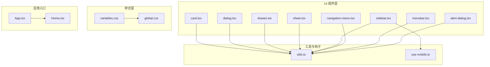
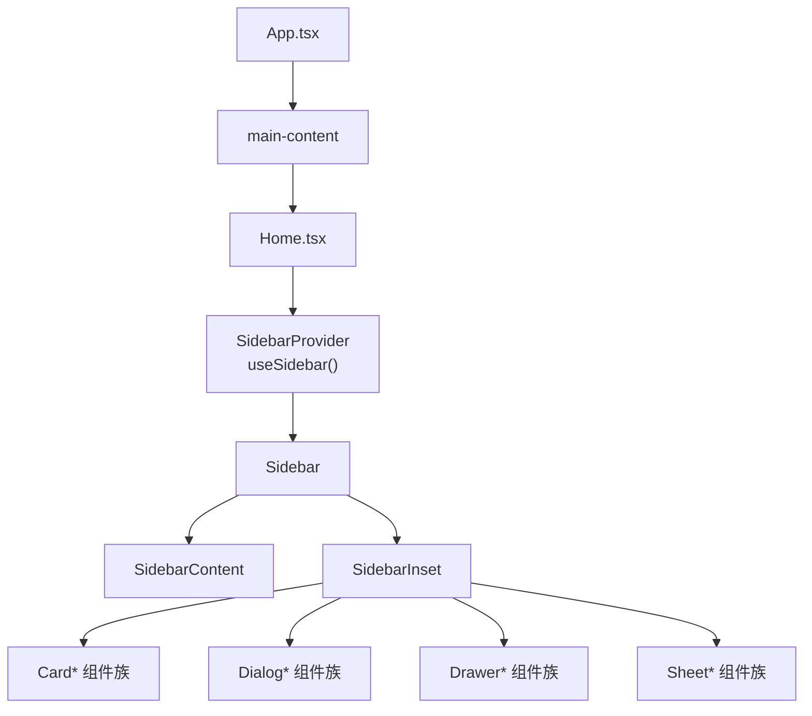
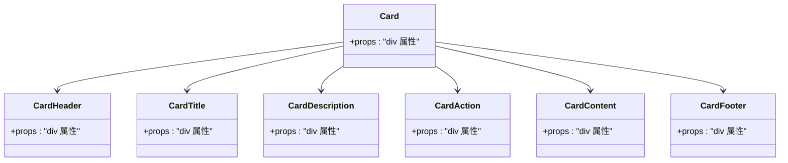
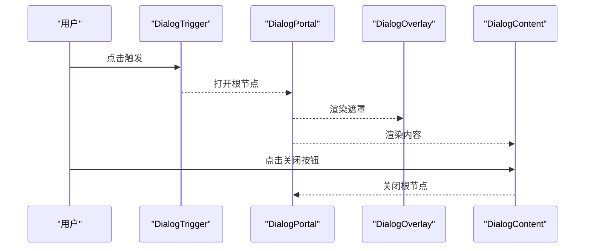
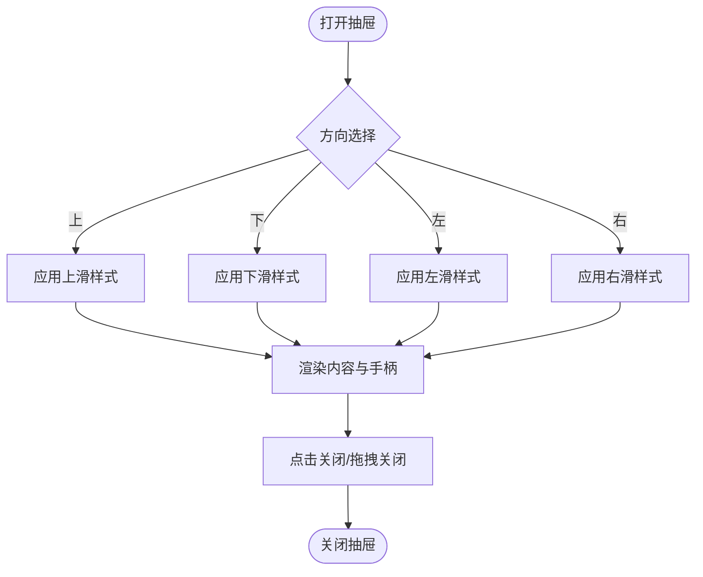
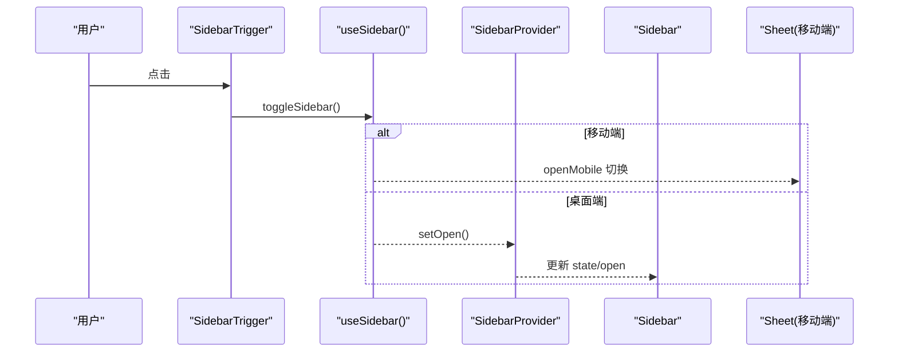
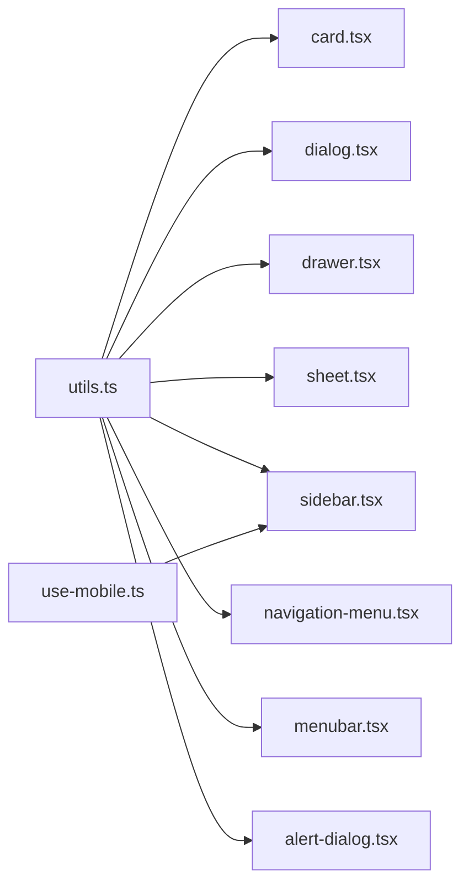

# 布局组件

<cite>
**本文引用的文件**
- [card.tsx](file://src/components/ui/card.tsx)
- [dialog.tsx](file://src/components/ui/dialog.tsx)
- [drawer.tsx](file://src/components/ui/drawer.tsx)
- [sheet.tsx](file://src/components/ui/sheet.tsx)
- [sidebar.tsx](file://src/components/ui/sidebar.tsx)
- [navigation-menu.tsx](file://src/components/ui/navigation-menu.tsx)
- [menubar.tsx](file://src/components/ui/menubar.tsx)
- [alert-dialog.tsx](file://src/components/ui/alert-dialog.tsx)
- [use-mobile.ts](file://src/hooks/use-mobile.ts)
- [utils.ts](file://src/lib/utils.ts)
- [global.css](file://src/styles/global.css)
- [variables.css](file://src/styles/variables.css)
- [App.tsx](file://src/App.tsx)
- [Home.tsx](file://src/pages/Home.tsx)
</cite>

## 目录
1. [简介](#简介)
2. [项目结构](#项目结构)
3. [核心组件](#核心组件)
4. [架构总览](#架构总览)
5. [组件详解](#组件详解)
6. [依赖关系分析](#依赖关系分析)
7. [性能考量](#性能考量)
8. [故障排查指南](#故障排查指南)
9. [结论](#结论)
10. [附录](#附录)

## 简介
本文件聚焦 MinLL 项目中的布局与容器类 UI 组件，系统性梳理卡片、对话框、抽屉、侧边栏等组件的视觉外观、行为与交互模式；逐项说明 props/属性、事件处理、状态管理与嵌套结构；提供完整使用示例与布局演示路径；给出响应式布局与网格系统的使用建议；记录组件间层级关系与组合模式，并总结复杂布局场景的最佳实践与性能优化建议。

## 项目结构
MinLL 的布局组件主要位于 src/components/ui 下，采用“原子化 + 组合”的设计思路，围绕卡片、对话框、抽屉、侧边栏等容器型组件构建。全局样式通过 variables.css 定义主题变量，global.css 提供基础排版与动画基线。移动端断点由 use-mobile.ts 提供统一判断。

图表来源
- [card.tsx:1-93](file://src/components/ui/card.tsx#L1-L93)
- [dialog.tsx:1-142](file://src/components/ui/dialog.tsx#L1-L142)
- [drawer.tsx:1-136](file://src/components/ui/drawer.tsx#L1-L136)
- [sheet.tsx:1-138](file://src/components/ui/sheet.tsx#L1-L138)
- [sidebar.tsx:1-727](file://src/components/ui/sidebar.tsx#L1-L727)
- [navigation-menu.tsx:1-169](file://src/components/ui/navigation-menu.tsx#L1-L169)
- [menubar.tsx:1-275](file://src/components/ui/menubar.tsx#L1-L275)
- [alert-dialog.tsx:1-156](file://src/components/ui/alert-dialog.tsx#L1-L156)
- [utils.ts:1-7](file://src/lib/utils.ts#L1-L7)
- [use-mobile.ts:1-20](file://src/hooks/use-mobile.ts#L1-L20)
- [variables.css:1-75](file://src/styles/variables.css#L1-L75)
- [global.css:1-294](file://src/styles/global.css#L1-L294)
- [App.tsx:1-70](file://src/App.tsx#L1-L70)
- [Home.tsx:1-15](file://src/pages/Home.tsx#L1-L15)

章节来源
- [App.tsx:1-70](file://src/App.tsx#L1-L70)
- [Home.tsx:1-15](file://src/pages/Home.tsx#L1-L15)
- [variables.css:1-75](file://src/styles/variables.css#L1-L75)
- [global.css:1-294](file://src/styles/global.css#L1-L294)

## 核心组件
本节概览布局组件族的关键能力与职责边界：
- 卡片（Card）：用于承载内容区块，提供头部、标题、描述、操作、正文、底部等语义化子组件，支持响应式栅格与对齐。
- 对话框（Dialog）：基于 Radix UI 实现模态弹窗，内置遮罩、关闭按钮、标题与描述等子组件，支持键盘无障碍与动画。
- 抽屉（Drawer）：基于 vaul 实现移动端滑出式面板，支持多方向（上/下/左/右），内置手柄与方向感知样式。
- 功能面板（Sheet）：类似抽屉但更通用，支持四边滑入，适合移动端或桌面侧边功能区。
- 侧边栏（Sidebar）：复杂布局骨架，提供 Provider/Context 状态、移动端抽屉、桌面折叠/展开、菜单按钮、分组与子菜单等。
- 导航菜单（NavigationMenu）：横向导航，支持下拉视口与指示器，适配桌面端主导航。
- 菜单栏（Menubar）：系统级菜单条，支持子菜单、复选/单选项、快捷键提示等。
- 警告对话（AlertDialog）：强调危险操作的确认流程，提供动作与取消按钮。

章节来源
- [card.tsx:1-93](file://src/components/ui/card.tsx#L1-L93)
- [dialog.tsx:1-142](file://src/components/ui/dialog.tsx#L1-L142)
- [drawer.tsx:1-136](file://src/components/ui/drawer.tsx#L1-L136)
- [sheet.tsx:1-138](file://src/components/ui/sheet.tsx#L1-L138)
- [sidebar.tsx:1-727](file://src/components/ui/sidebar.tsx#L1-L727)
- [navigation-menu.tsx:1-169](file://src/components/ui/navigation-menu.tsx#L1-L169)
- [menubar.tsx:1-275](file://src/components/ui/menubar.tsx#L1-L275)
- [alert-dialog.tsx:1-156](file://src/components/ui/alert-dialog.tsx#L1-L156)

## 架构总览
以下图展示布局组件在应用中的组织方式与数据流：

图表来源
- [App.tsx:53-66](file://src/App.tsx#L53-L66)
- [Home.tsx:6-14](file://src/pages/Home.tsx#L6-L14)
- [sidebar.tsx:56-152](file://src/components/ui/sidebar.tsx#L56-L152)
- [card.tsx:5-92](file://src/components/ui/card.tsx#L5-L92)
- [dialog.tsx:7-141](file://src/components/ui/dialog.tsx#L7-L141)
- [drawer.tsx:8-135](file://src/components/ui/drawer.tsx#L8-L135)
- [sheet.tsx:7-137](file://src/components/ui/sheet.tsx#L7-L137)

## 组件详解

### 卡片（Card）
- 视觉与行为
  - 卡片容器具备圆角、边框与阴影，内部以纵向栅格组织内容。
  - 支持头部（可含操作区）、标题、描述、正文、底部等子组件，自动处理间距与对齐。
- 关键子组件
  - CardHeader/CardTitle/CardDescription/CardAction/CardContent/CardFooter
- Props/属性
  - 所有子组件均透传原生 div 属性，并通过 data-slot 标注语义槽位，便于样式覆盖与测试定位。
- 事件与状态
  - 作为纯展示容器，不直接管理状态；可通过父组件控制其渲染条件。
- 使用示例与演示路径
  - 参考：[card.tsx:5-92](file://src/components/ui/card.tsx#L5-L92)
- 响应式与嵌套
  - 头部在存在 action 时启用网格布局，实现标题与操作的自适应排列。

图表来源
- [card.tsx:5-92](file://src/components/ui/card.tsx#L5-L92)

章节来源
- [card.tsx:1-93](file://src/components/ui/card.tsx#L1-L93)

### 对话框（Dialog）
- 视觉与行为
  - 遮罩支持开合动画，内容区域固定居中并限制最大宽度，支持可选关闭按钮。
  - 内置头部、尾部、标题、描述等子组件，支持左右/上下对齐。
- 关键子组件
  - Dialog/DialogTrigger/DialogPortal/DialogOverlay/DialogContent/DialogHeader/DialogFooter/DialogTitle/DialogDescription/DialogClose
- Props/属性
  - DialogContent 接受 showCloseButton 控制是否渲染关闭按钮。
- 事件与状态
  - 基于 Radix UI 的 open 状态驱动动画与可访问性。
- 使用示例与演示路径
  - 参考：[dialog.tsx:7-141](file://src/components/ui/dialog.tsx#L7-L141)

图表来源
- [dialog.tsx:13-79](file://src/components/ui/dialog.tsx#L13-L79)

章节来源
- [dialog.tsx:1-142](file://src/components/ui/dialog.tsx#L1-L142)

### 抽屉（Drawer）
- 视觉与行为
  - 基于 vaul 的滑出式面板，支持上/下/左/右四个方向，内置顶部手柄，方向感知样式。
  - 移动端体验优先，支持手势拖拽与回弹。
- 关键子组件
  - Drawer/DrawerTrigger/DrawerPortal/DrawerOverlay/DrawerContent/DrawerHeader/DrawerFooter/DrawerTitle/DrawerDescription/DrawerClose
- Props/属性
  - DrawerContent 透传原生属性，结合 data-vaul-drawer-direction 应用不同样式。
- 事件与状态
  - 通过 Portal 渲染到文档根部，避免层级与溢出问题。
- 使用示例与演示路径
  - 参考：[drawer.tsx:8-135](file://src/components/ui/drawer.tsx#L8-L135)

图表来源
- [drawer.tsx:48-72](file://src/components/ui/drawer.tsx#L48-L72)

章节来源
- [drawer.tsx:1-136](file://src/components/ui/drawer.tsx#L1-L136)

### 功能面板（Sheet）
- 视觉与行为
  - 类似抽屉，但更通用，支持四边滑入，适合移动端或桌面侧边功能区。
- 关键子组件
  - Sheet/SheetTrigger/SheetPortal/SheetOverlay/SheetContent/SheetHeader/SheetFooter/SheetTitle/SheetDescription/SheetClose
- Props/属性
  - SheetContent 接收 side 参数（top/right/bottom/left）决定滑入方向。
- 事件与状态
  - 基于 Radix UI 的开合状态与动画。
- 使用示例与演示路径
  - 参考：[sheet.tsx:7-137](file://src/components/ui/sheet.tsx#L7-L137)

章节来源
- [sheet.tsx:1-138](file://src/components/ui/sheet.tsx#L1-L138)

### 侧边栏（Sidebar）
- 视觉与行为
  - 提供 Provider/Context 管理状态，支持桌面折叠/展开、移动端抽屉、键盘快捷键、Cookie 记忆状态。
  - 内置 Rail 拖拽调整宽度、Header/Footer/Content/Group/Menu 系列子组件，支持菜单按钮、动作、徽标、子菜单与骨架。
- 关键子组件
  - SidebarProvider/useSidebar/Sidebar/SidebarTrigger/SidebarRail/SidebarInset/SidebarInput/SidebarHeader/SidebarFooter/SidebarSeparator/SidebarContent/SidebarGroup/SidebarGroupLabel/SidebarGroupAction/SidebarGroupContent/SidebarMenu/SidebarMenuItem/SidebarMenuButton/SidebarMenuAction/SidebarMenuBadge/SidebarMenuSkeleton/SidebarMenuSub/SidebarMenuSubItem/SidebarMenuSubButton
- Props/属性
  - Sidebar 支持 side、variant、collapsible；SidebarMenuButton 支持 variant/size/isActive/tooltip；SidebarMenuSubButton 支持 size/isActive。
- 事件与状态
  - 内部维护 open/openMobile/state，并通过 Cookie 保持状态；支持 Ctrl/Cmd+KeyB 快捷键切换。
- 使用示例与演示路径
  - 参考：[sidebar.tsx:56-726](file://src/components/ui/sidebar.tsx#L56-L726)
- 响应式与嵌套
  - 移动端使用 Sheet 承载侧边栏内容；桌面端根据 collapsible 与 variant 切换宽度与边框阴影。

图表来源
- [sidebar.tsx:92-110](file://src/components/ui/sidebar.tsx#L92-L110)
- [sidebar.tsx:183-205](file://src/components/ui/sidebar.tsx#L183-L205)
- [sidebar.tsx:208-253](file://src/components/ui/sidebar.tsx#L208-L253)

章节来源
- [sidebar.tsx:1-727](file://src/components/ui/sidebar.tsx#L1-L727)
- [use-mobile.ts:1-20](file://src/hooks/use-mobile.ts#L1-L20)

### 导航菜单（NavigationMenu）
- 视觉与行为
  - 支持下拉视口与指示器，触发器旋转 ChevronDown，内容区按方向滑入/淡入。
- 关键子组件
  - NavigationMenu/NavigationMenuList/NavigationMenuItem/NavigationMenuTrigger/NavigationMenuContent/NavigationMenuViewport/NavigationMenuLink/NavigationMenuIndicator
- Props/属性
  - NavigationMenu 接收 viewport 控制是否渲染视口。
- 事件与状态
  - 基于 Radix UI 的 open 状态与动画。
- 使用示例与演示路径
  - 参考：[navigation-menu.tsx:8-168](file://src/components/ui/navigation-menu.tsx#L8-L168)

章节来源
- [navigation-menu.tsx:1-169](file://src/components/ui/navigation-menu.tsx#L1-L169)

### 菜单栏（Menubar）
- 视觉与行为
  - 系统级菜单条，支持子菜单、复选/单选项、快捷键提示等。
- 关键子组件
  - Menubar/MenubarMenu/MenubarGroup/MenubarPortal/MenubarRadioGroup/MenubarTrigger/MenubarContent/MenubarItem/MenubarCheckboxItem/MenubarRadioItem/MenubarLabel/MenubarSeparator/MenubarShortcut/MenubarSub/MenubarSubTrigger/MenubarSubContent
- Props/属性
  - MenubarItem 支持 inset 与 variant（default/destructive）。
- 事件与状态
  - 基于 Radix UI 的 open 状态与动画。
- 使用示例与演示路径
  - 参考：[menubar.tsx:7-274](file://src/components/ui/menubar.tsx#L7-L274)

章节来源
- [menubar.tsx:1-275](file://src/components/ui/menubar.tsx#L1-L275)

### 警告对话（AlertDialog）
- 视觉与行为
  - 强调危险操作的确认流程，提供动作与取消按钮，内容区域固定居中。
- 关键子组件
  - AlertDialog/AlertDialogTrigger/AlertDialogPortal/AlertDialogOverlay/AlertDialogContent/AlertDialogHeader/AlertDialogFooter/AlertDialogTitle/AlertDialogDescription/AlertDialogAction/AlertDialogCancel
- Props/属性
  - AlertDialogContent 透传原生属性。
- 事件与状态
  - 基于 Radix UI 的 open 状态与动画。
- 使用示例与演示路径
  - 参考：[alert-dialog.tsx:7-155](file://src/components/ui/alert-dialog.tsx#L7-L155)

章节来源
- [alert-dialog.tsx:1-156](file://src/components/ui/alert-dialog.tsx#L1-L156)

## 依赖关系分析
- 组件内聚与耦合
  - 卡片、对话框、抽屉、功能面板等均为独立容器组件，彼此低耦合，通过 Portal 或根节点组合使用。
  - 侧边栏通过 Provider/Context 向下传递状态，向上暴露 useSidebar Hook，形成清晰的数据流。
- 外部依赖
  - 对话框/抽屉/功能面板/警告对话依赖 Radix UI；抽屉额外依赖 vaul；侧边栏依赖 @radix-ui/react-slot、class-variance-authority、键盘快捷键与 Cookie。
- 工具与样式
  - 所有组件使用 cn(...) 合并样式，依赖 utils.ts；移动端断点由 use-mobile.ts 提供。

图表来源
- [utils.ts:4-6](file://src/lib/utils.ts#L4-L6)
- [card.tsx:3-3](file://src/components/ui/card.tsx#L3-L3)
- [dialog.tsx:5-5](file://src/components/ui/dialog.tsx#L5-L5)
- [drawer.tsx:6-6](file://src/components/ui/drawer.tsx#L6-L6)
- [sheet.tsx:5-5](file://src/components/ui/sheet.tsx#L5-L5)
- [sidebar.tsx:9-9](file://src/components/ui/sidebar.tsx#L9-L9)
- [navigation-menu.tsx:6-6](file://src/components/ui/navigation-menu.tsx#L6-L6)
- [menubar.tsx:5-5](file://src/components/ui/menubar.tsx#L5-L5)
- [alert-dialog.tsx:4-4](file://src/components/ui/alert-dialog.tsx#L4-L4)
- [use-mobile.ts:1-3](file://src/hooks/use-mobile.ts#L1-L3)

章节来源
- [utils.ts:1-7](file://src/lib/utils.ts#L1-L7)
- [use-mobile.ts:1-20](file://src/hooks/use-mobile.ts#L1-L20)

## 性能考量
- 动画与过渡
  - 组件广泛使用 CSS 动画与 Tailwind 过渡类，建议在减少动画或降低帧率的设备上配合 prefers-reduced-motion 使用。
- 渲染与层级
  - 对话框、抽屉、功能面板通过 Portal 渲染至文档根部，避免层级与溢出问题，同时减少重排范围。
- 状态持久化
  - 侧边栏通过 Cookie 记忆状态，减少重复计算与 DOM 变更。
- 响应式断点
  - 使用统一的移动端断点（768px），在大屏与小屏之间切换时避免不必要的重绘。

[本节为通用性能建议，无需特定文件引用]

## 故障排查指南
- 对话框/抽屉/功能面板无法关闭
  - 检查触发元素是否正确包裹在根节点下，确认 Portal 是否正确挂载。
  - 参考：[dialog.tsx:13-141](file://src/components/ui/dialog.tsx#L13-L141)、[drawer.tsx:18-72](file://src/components/ui/drawer.tsx#L18-L72)、[sheet.tsx:11-79](file://src/components/ui/sheet.tsx#L11-L79)
- 侧边栏状态异常
  - 确认 SidebarProvider 是否包裹在应用根部；检查 Cookie 是否被禁用；验证键盘快捷键冲突。
  - 参考：[sidebar.tsx:56-152](file://src/components/ui/sidebar.tsx#L56-L152)
- 移动端显示错位
  - 检查 useIsMobile 返回值与断点逻辑；确保媒体查询与样式变量一致。
  - 参考：[use-mobile.ts:5-19](file://src/hooks/use-mobile.ts#L5-L19)、[variables.css:55-58](file://src/styles/variables.css#L55-L58)
- 样式未生效
  - 确认 cn(...) 合并顺序与 Tailwind 配置；检查 data-slot 选择器是否正确。
  - 参考：[utils.ts:4-6](file://src/lib/utils.ts#L4-L6)

章节来源
- [dialog.tsx:13-141](file://src/components/ui/dialog.tsx#L13-L141)
- [drawer.tsx:18-72](file://src/components/ui/drawer.tsx#L18-L72)
- [sheet.tsx:11-79](file://src/components/ui/sheet.tsx#L11-L79)
- [sidebar.tsx:56-152](file://src/components/ui/sidebar.tsx#L56-L152)
- [use-mobile.ts:5-19](file://src/hooks/use-mobile.ts#L5-L19)
- [variables.css:55-58](file://src/styles/variables.css#L55-L58)
- [utils.ts:4-6](file://src/lib/utils.ts#L4-L6)

## 结论
MinLL 的布局组件以卡片、对话框、抽屉、功能面板、侧边栏为核心骨架，辅以导航菜单、菜单栏与警告对话，构成一套完整且可组合的容器体系。通过统一的样式合并工具、移动端断点与状态持久化策略，组件在可用性与性能之间取得良好平衡。建议在复杂布局中遵循“Provider 在上、Portal 在外、语义槽位在内”的模式，以获得最佳的可维护性与扩展性。

[本节为总结性内容，无需特定文件引用]

## 附录

### 响应式布局与网格系统使用建议
- 断点与布局
  - 使用统一断点（移动端 768px），在桌面端采用 Sidebar 的折叠/展开策略，在移动端采用 Sheet/Drawer 承载侧边内容。
  - 参考：[use-mobile.ts:3-3](file://src/hooks/use-mobile.ts#L3-L3)、[sidebar.tsx:183-205](file://src/components/ui/sidebar.tsx#L183-L205)
- 网格与栅格
  - 卡片头部在存在操作区时启用网格布局，实现标题与操作的自适应排列。
  - 参考：[card.tsx:18-28](file://src/components/ui/card.tsx#L18-L28)
- 动画与可访问性
  - 组件普遍使用 CSS 动画与屏幕阅读器友好的隐藏文本，建议在 reduce-motion 场景下保持一致性。
  - 参考：[global.css:128-137](file://src/styles/global.css#L128-L137)

章节来源
- [use-mobile.ts:3-3](file://src/hooks/use-mobile.ts#L3-L3)
- [sidebar.tsx:183-205](file://src/components/ui/sidebar.tsx#L183-L205)
- [card.tsx:18-28](file://src/components/ui/card.tsx#L18-L28)
- [global.css:128-137](file://src/styles/global.css#L128-L137)

### 组件组合模式与最佳实践
- 组合模式
  - 将 SidebarProvider 放置于应用根部，侧边栏内容在 Sidebar 中组织，主内容区使用 SidebarInset 承载。
  - 参考：[App.tsx:53-66](file://src/App.tsx#L53-L66)、[Home.tsx:6-14](file://src/pages/Home.tsx#L6-L14)、[sidebar.tsx:56-152](file://src/components/ui/sidebar.tsx#L56-L152)
- 最佳实践
  - 使用 Portal 组件（Dialog/Drawer/Sheet）时，确保根节点包裹完整，避免层级与焦点问题。
  - 为所有交互元素提供明确的 data-slot 标记，便于样式覆盖与自动化测试。
  - 在移动端优先考虑触摸与手势体验，适当增大点击热区与反馈。

章节来源
- [App.tsx:53-66](file://src/App.tsx#L53-L66)
- [Home.tsx:6-14](file://src/pages/Home.tsx#L6-L14)
- [sidebar.tsx:56-152](file://src/components/ui/sidebar.tsx#L56-L152)