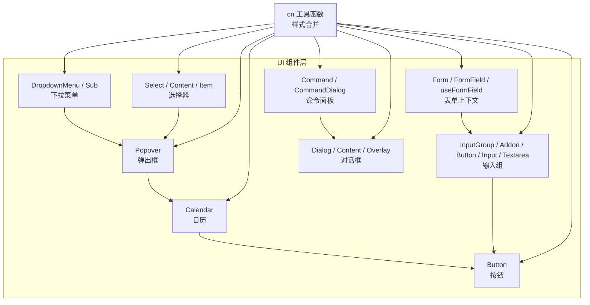
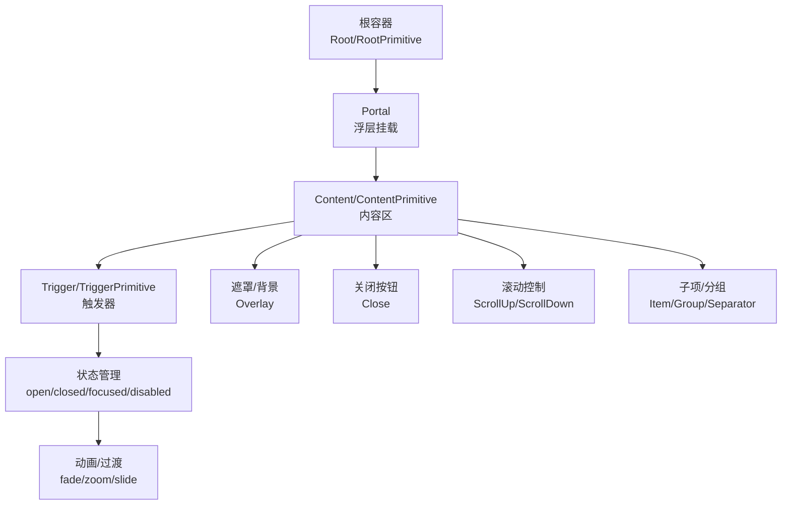
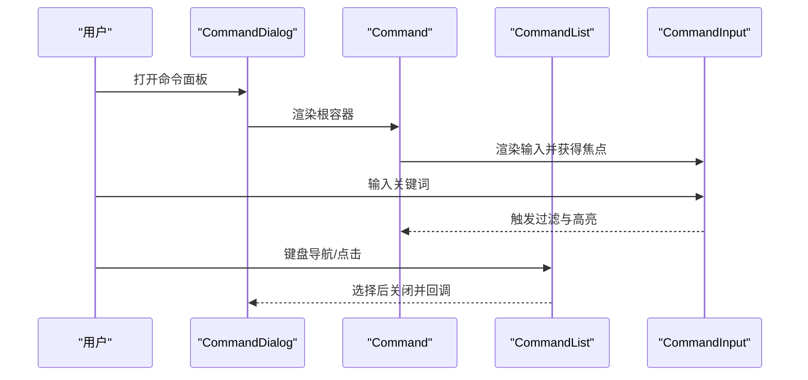
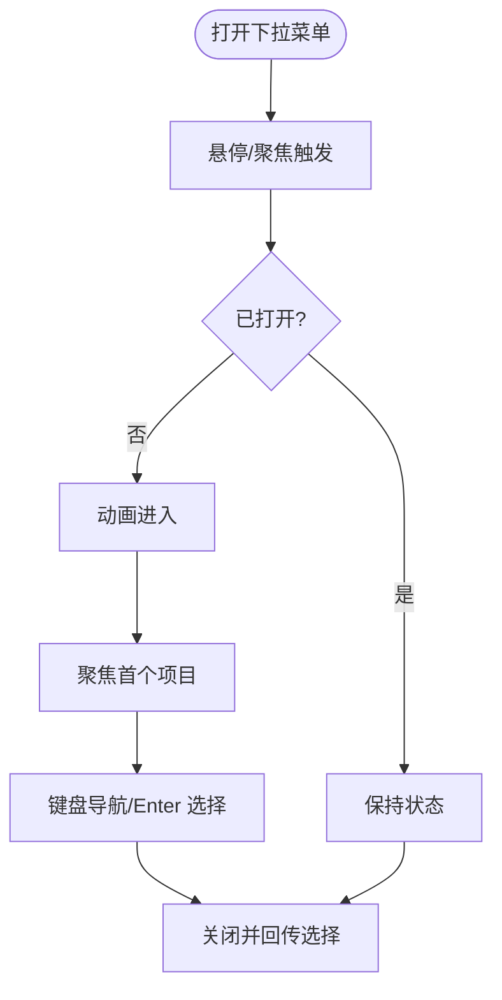
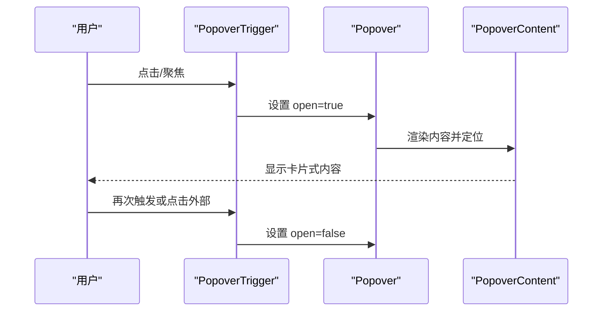
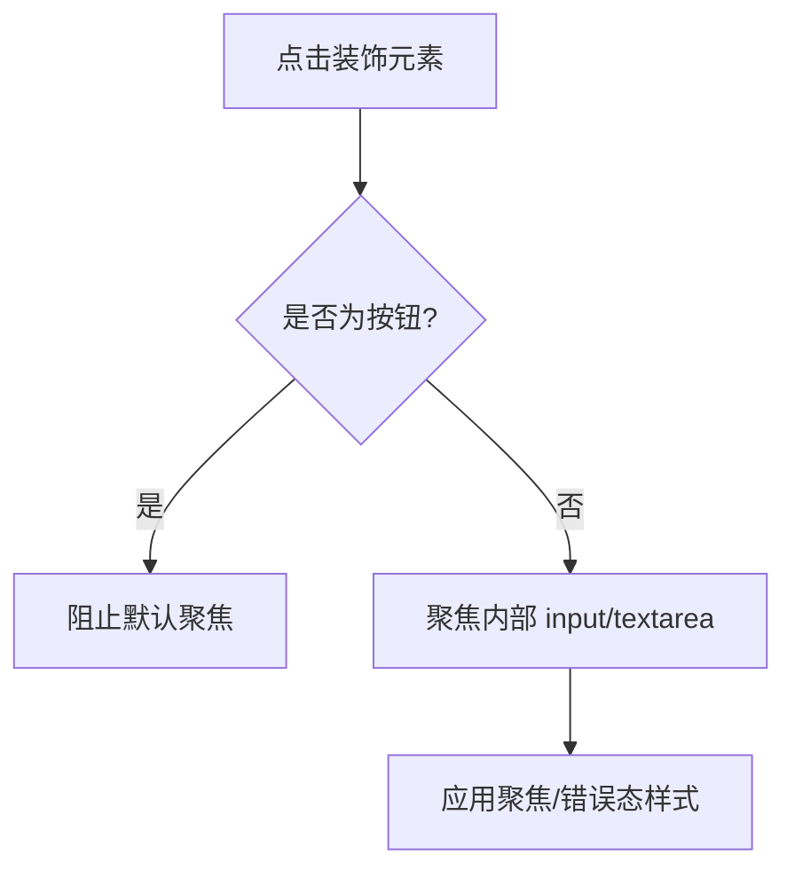
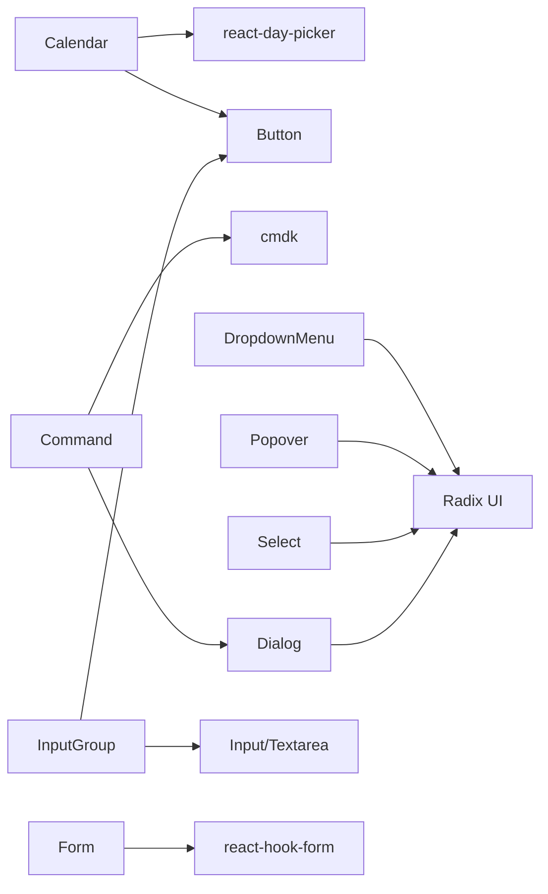

# 高级交互组件

<cite>
**本文引用的文件**
- [src/components/ui/calendar.tsx](file://src/components/ui/calendar.tsx)
- [src/components/ui/command.tsx](file://src/components/ui/command.tsx)
- [src/components/ui/dropdown-menu.tsx](file://src/components/ui/dropdown-menu.tsx)
- [src/components/ui/popover.tsx](file://src/components/ui/popover.tsx)
- [src/components/ui/input-group.tsx](file://src/components/ui/input-group.tsx)
- [src/components/ui/dialog.tsx](file://src/components/ui/dialog.tsx)
- [src/components/ui/form.tsx](file://src/components/ui/form.tsx)
- [src/components/ui/select.tsx](file://src/components/ui/select.tsx)
- [src/components/ui/button.tsx](file://src/components/ui/button.tsx)
- [src/lib/utils.ts](file://src/lib/utils.ts)
</cite>

## 目录
1. [简介](#简介)
2. [项目结构](#项目结构)
3. [核心组件](#核心组件)
4. [架构总览](#架构总览)
5. [详细组件分析](#详细组件分析)
6. [依赖关系分析](#依赖关系分析)
7. [性能考量](#性能考量)
8. [故障排查指南](#故障排查指南)
9. [结论](#结论)
10. [附录](#附录)

## 简介
本文件聚焦 MinLL 项目中的高级交互组件，包括日历（Calendar）、命令面板（Command Palette）、下拉菜单（Dropdown Menu）、弹出框（Popover）、输入组（Input Group）等。文档从视觉外观、行为与交互模式入手，系统梳理各组件的 props/属性、事件处理、状态管理与复杂交互逻辑，并提供可复用的使用示例路径、高级交互场景实现指导与性能优化建议。同时总结组件间协同与状态同步机制，阐释高级交互设计原则与用户体验最佳实践。

## 项目结构
MinLL 的 UI 组件位于 src/components/ui 下，采用按功能分层的组织方式：基础原子组件（如按钮、输入）与复合交互组件（日历、命令面板、下拉菜单、弹出框、输入组）并存。组件广泛使用 Radix UI 作为无障碍与状态控制的底层库，结合 Tailwind CSS 与自定义工具函数进行样式合并与主题适配。



图表来源
- [src/components/ui/calendar.tsx:1-221](file://src/components/ui/calendar.tsx#L1-L221)
- [src/components/ui/command.tsx:1-183](file://src/components/ui/command.tsx#L1-L183)
- [src/components/ui/dropdown-menu.tsx:1-256](file://src/components/ui/dropdown-menu.tsx#L1-L256)
- [src/components/ui/popover.tsx:1-49](file://src/components/ui/popover.tsx#L1-L49)
- [src/components/ui/input-group.tsx:1-171](file://src/components/ui/input-group.tsx#L1-L171)
- [src/components/ui/dialog.tsx:1-142](file://src/components/ui/dialog.tsx#L1-L142)
- [src/components/ui/select.tsx:1-189](file://src/components/ui/select.tsx#L1-L189)
- [src/components/ui/button.tsx:1-63](file://src/components/ui/button.tsx#L1-L63)
- [src/components/ui/form.tsx:1-168](file://src/components/ui/form.tsx#L1-L168)
- [src/lib/utils.ts:1-7](file://src/lib/utils.ts#L1-L7)

章节来源
- [src/components/ui/calendar.tsx:1-221](file://src/components/ui/calendar.tsx#L1-L221)
- [src/components/ui/command.tsx:1-183](file://src/components/ui/command.tsx#L1-L183)
- [src/components/ui/dropdown-menu.tsx:1-256](file://src/components/ui/dropdown-menu.tsx#L1-L256)
- [src/components/ui/popover.tsx:1-49](file://src/components/ui/popover.tsx#L1-L49)
- [src/components/ui/input-group.tsx:1-171](file://src/components/ui/input-group.tsx#L1-L171)
- [src/components/ui/dialog.tsx:1-142](file://src/components/ui/dialog.tsx#L1-L142)
- [src/components/ui/select.tsx:1-189](file://src/components/ui/select.tsx#L1-L189)
- [src/components/ui/button.tsx:1-63](file://src/components/ui/button.tsx#L1-L63)
- [src/components/ui/form.tsx:1-168](file://src/components/ui/form.tsx#L1-L168)
- [src/lib/utils.ts:1-7](file://src/lib/utils.ts#L1-L7)

## 核心组件
本节概览高级交互组件的职责边界与协作关系：
- 日历：基于 react-day-picker 封装，支持多月展示、范围选择、焦点管理与自定义按钮样式。
- 命令面板：基于 cmdk 与 Dialog，提供全局搜索与快捷操作入口。
- 下拉菜单：基于 Radix UI Dropdown，支持子菜单、复选/单选项、快捷键提示。
- 弹出框：基于 Radix UI Popover，用于承载日历、菜单等浮层内容。
- 输入组：组合输入、按钮、文本与装饰元素，统一对齐、尺寸与状态反馈。
- 对话框：基于 Radix UI Dialog，提供遮罩、关闭按钮与语义化标题/描述。
- 选择器：基于 Radix UI Select，支持滚动条、占位符、图标与对齐布局。
- 表单上下文：基于 react-hook-form，提供字段状态读取、错误传播与无障碍属性绑定。

章节来源
- [src/components/ui/calendar.tsx:18-180](file://src/components/ui/calendar.tsx#L18-L180)
- [src/components/ui/command.tsx:14-182](file://src/components/ui/command.tsx#L14-L182)
- [src/components/ui/dropdown-menu.tsx:7-255](file://src/components/ui/dropdown-menu.tsx#L7-L255)
- [src/components/ui/popover.tsx:8-48](file://src/components/ui/popover.tsx#L8-L48)
- [src/components/ui/input-group.tsx:11-170](file://src/components/ui/input-group.tsx#L11-L170)
- [src/components/ui/dialog.tsx:7-141](file://src/components/ui/dialog.tsx#L7-L141)
- [src/components/ui/select.tsx:7-188](file://src/components/ui/select.tsx#L7-L188)
- [src/components/ui/form.tsx:19-167](file://src/components/ui/form.tsx#L19-L167)

## 架构总览
高级交互组件围绕“根容器 + 浮层 + 控件变体”的模式构建，通过 cn 工具函数统一类名合并，Radix UI 提供可访问性与状态生命周期，第三方库（如 react-day-picker、cmdk）增强特定交互能力。



图表来源
- [src/components/ui/dropdown-menu.tsx:32-49](file://src/components/ui/dropdown-menu.tsx#L32-L49)
- [src/components/ui/popover.tsx:20-40](file://src/components/ui/popover.tsx#L20-L40)
- [src/components/ui/dialog.tsx:47-79](file://src/components/ui/dialog.tsx#L47-L79)
- [src/components/ui/select.tsx:51-85](file://src/components/ui/select.tsx#L51-L85)

## 详细组件分析

### 日历组件（Calendar）
- 视觉与行为
  - 支持多月并排显示、导航按钮、月份下拉、周标题与范围选择高亮。
  - 使用 Button 变体作为导航按钮，自动聚焦当前聚焦单元格。
  - 通过 data-slot 与 CSS 变量实现主题与尺寸一致性。
- 关键 props
  - className、classNames、showOutsideDays、captionLayout、buttonVariant、formatters、components。
- 状态与交互
  - 内部维护焦点修饰符，根据 modifiers.focused 自动 focus 按钮。
  - 范围选择通过 range_start/range_middle/range_end 数据属性标记。
- 复杂逻辑
  - 自定义 Chevron 组件根据方向渲染不同图标；WeekNumber 单元格尺寸固定。
- 使用示例路径
  - [日历组件定义:18-180](file://src/components/ui/calendar.tsx#L18-L180)
  - [日历日期按钮实现:182-218](file://src/components/ui/calendar.tsx#L182-L218)
  - [按钮样式变体注入:58-67](file://src/components/ui/calendar.tsx#L58-L67)

```mermaid
classDiagram
class Calendar {
+props : DayPickerProps & { buttonVariant }
+render()
}
class CalendarDayButton {
+props : DayButtonProps
+useEffect(focus)
+render()
}
class Button {
+variants : default/ghost/destructive/...
+sizes : default/sm/lg/icon...
+render()
}
Calendar --> CalendarDayButton : "渲染日期按钮"
CalendarDayButton --> Button : "使用按钮样式"
```

图表来源
- [src/components/ui/calendar.tsx:18-180](file://src/components/ui/calendar.tsx#L18-L180)
- [src/components/ui/calendar.tsx:182-218](file://src/components/ui/calendar.tsx#L182-L218)
- [src/components/ui/button.tsx:39-62](file://src/components/ui/button.tsx#L39-L62)

章节来源
- [src/components/ui/calendar.tsx:18-180](file://src/components/ui/calendar.tsx#L18-L180)
- [src/components/ui/calendar.tsx:182-218](file://src/components/ui/calendar.tsx#L182-L218)
- [src/components/ui/button.tsx:39-62](file://src/components/ui/button.tsx#L39-L62)

### 命令面板（Command / CommandDialog）
- 视觉与行为
  - 基于 Dialog 承载，顶部搜索输入带图标，列表区域可滚动，支持空状态与分组。
  - 通过 data-slot 标记内部元素，便于主题与样式覆盖。
- 关键 props
  - CommandDialog: title、description、showCloseButton、children。
  - CommandInput/CommandList/CommandItem 等各自 props。
- 状态与交互
  - 与 cmdk 的搜索匹配与键盘导航配合，支持 Enter 选择、Esc 关闭。
- 使用示例路径
  - [命令面板根组件:14-28](file://src/components/ui/command.tsx#L14-L28)
  - [命令面板对话框:30-59](file://src/components/ui/command.tsx#L30-L59)
  - [命令输入与列表:61-97](file://src/components/ui/command.tsx#L61-L97)
  - [命令项与分隔符:140-154](file://src/components/ui/command.tsx#L140-L154)



图表来源
- [src/components/ui/command.tsx:30-59](file://src/components/ui/command.tsx#L30-L59)
- [src/components/ui/command.tsx:61-97](file://src/components/ui/command.tsx#L61-L97)
- [src/components/ui/command.tsx:140-154](file://src/components/ui/command.tsx#L140-L154)
- [src/components/ui/dialog.tsx:47-79](file://src/components/ui/dialog.tsx#L47-L79)

章节来源
- [src/components/ui/command.tsx:14-182](file://src/components/ui/command.tsx#L14-L182)
- [src/components/ui/dialog.tsx:47-79](file://src/components/ui/dialog.tsx#L47-L79)

### 下拉菜单（DropdownMenu / Sub）
- 视觉与行为
  - 支持主菜单与子菜单嵌套，复选/单选项带指示器，快捷键提示与分隔符。
  - 动画入场/出场、侧向滑入、缩放与淡入淡出。
- 关键 props
  - DropdownMenuContent: sideOffset、className。
  - DropdownMenuItem: inset、variant。
  - SubTrigger/SubContent: 嵌套子菜单。
- 状态与交互
  - open/closed/focused 状态由 Radix UI 管理，支持键盘导航与 Escape 关闭。
- 使用示例路径
  - [下拉菜单根与触发器:7-30](file://src/components/ui/dropdown-menu.tsx#L7-L30)
  - [内容区与项目:32-81](file://src/components/ui/dropdown-menu.tsx#L32-L81)
  - [子菜单触发与内容:193-237](file://src/components/ui/dropdown-menu.tsx#L193-L237)



图表来源
- [src/components/ui/dropdown-menu.tsx:32-49](file://src/components/ui/dropdown-menu.tsx#L32-L49)
- [src/components/ui/dropdown-menu.tsx:193-237](file://src/components/ui/dropdown-menu.tsx#L193-L237)

章节来源
- [src/components/ui/dropdown-menu.tsx:7-255](file://src/components/ui/dropdown-menu.tsx#L7-L255)

### 弹出框（Popover）
- 视觉与行为
  - 固定宽度卡片式内容，居中/偏移定位，支持锚点与对齐。
  - 动画入场/出场、侧向滑入与缩放。
- 关键 props
  - PopoverContent: align、sideOffset、className。
- 状态与交互
  - 通过 Portal 渲染到文档流外，避免层级与溢出问题。
- 使用示例路径
  - [弹出框根与触发器:8-18](file://src/components/ui/popover.tsx#L8-L18)
  - [内容区与 Portal:20-40](file://src/components/ui/popover.tsx#L20-L40)



图表来源
- [src/components/ui/popover.tsx:8-40](file://src/components/ui/popover.tsx#L8-L40)

章节来源
- [src/components/ui/popover.tsx:8-48](file://src/components/ui/popover.tsx#L8-L48)

### 输入组（Input Group）
- 视觉与行为
  - 将输入、按钮、文本/图标等组合为一个整体，支持内联/块级对齐与聚焦/错误态。
  - 点击非按钮装饰元素可聚焦内部输入控件。
- 关键 props
  - InputGroupAddon: align（inline-start/end 或 block-start/end）。
  - InputGroupButton: size（xs/sm/icon-xs/icon-sm）与 variant。
  - InputGroupInput/Textarea: 作为受控槽位。
- 状态与交互
  - 通过 has-[] 伪类与 data-slot 属性驱动样式变化。
- 使用示例路径
  - [输入组根与对齐规则:11-37](file://src/components/ui/input-group.tsx#L11-L37)
  - [装饰元素与点击聚焦:60-80](file://src/components/ui/input-group.tsx#L60-L80)
  - [按钮变体与尺寸:100-117](file://src/components/ui/input-group.tsx#L100-L117)
  - [输入与文本占位:131-161](file://src/components/ui/input-group.tsx#L131-L161)



图表来源
- [src/components/ui/input-group.tsx:60-80](file://src/components/ui/input-group.tsx#L60-L80)

章节来源
- [src/components/ui/input-group.tsx:11-170](file://src/components/ui/input-group.tsx#L11-L170)

### 对话框（Dialog）
- 视觉与行为
  - 全屏遮罩、中心网格布局、可选关闭按钮、语义化标题/描述。
- 关键 props
  - DialogContent: showCloseButton、children。
- 状态与交互
  - open/closed 动画、Esc 关闭、点击遮罩关闭（可配置）。
- 使用示例路径
  - [对话框根与覆盖层:7-45](file://src/components/ui/dialog.tsx#L7-L45)
  - [内容区与关闭按钮:47-79](file://src/components/ui/dialog.tsx#L47-L79)
  - [头部/底部/标题/描述:81-128](file://src/components/ui/dialog.tsx#L81-L128)

章节来源
- [src/components/ui/dialog.tsx:7-141](file://src/components/ui/dialog.tsx#L7-L141)

### 选择器（Select）
- 视觉与行为
  - 触发器带图标与占位符，内容区支持滚动与对齐，项带勾选指示器。
- 关键 props
  - SelectTrigger: size（sm/default）、children。
  - SelectContent: position（item-aligned/popper）、align。
  - SelectItem: 文本与指示器。
- 状态与交互
  - 打开时计算可用高度，滚动至选中项，键盘导航。
- 使用示例路径
  - [触发器与图标:25-49](file://src/components/ui/select.tsx#L25-L49)
  - [内容区与视口:51-85](file://src/components/ui/select.tsx#L51-L85)
  - [项与指示器:101-126](file://src/components/ui/select.tsx#L101-L126)

章节来源
- [src/components/ui/select.tsx:7-188](file://src/components/ui/select.tsx#L7-L188)

### 表单上下文（Form）
- 视觉与行为
  - 通过 react-hook-form 提供字段状态、错误消息与无障碍属性绑定。
- 关键 props
  - Form、FormField、useFormField、FormControl、FormLabel、FormMessage。
- 状态与交互
  - 字段 id 生成、aria-describedby/invalid 绑定、错误消息渲染。
- 使用示例路径
  - [表单 Provider 与上下文:19-88](file://src/components/ui/form.tsx#L19-L88)
  - [字段状态读取与属性绑定:45-66](file://src/components/ui/form.tsx#L45-L66)
  - [标签与描述/消息:90-156](file://src/components/ui/form.tsx#L90-L156)

章节来源
- [src/components/ui/form.tsx:19-167](file://src/components/ui/form.tsx#L19-L167)

## 依赖关系分析
- 组件间耦合
  - Calendar 依赖 Button 与 DayPicker；Popover 为浮层基座；Dialog/Select/DropdownMenu 均依赖 Radix UI。
  - Input Group 与 Button/输入控件组合；Form 为上层数据层。
- 外部依赖
  - Radix UI（对话框、下拉、弹出、进度等）
  - react-day-picker（日历）
  - cmdk（命令面板）
  - Tailwind CSS + cn 工具（样式合并与主题）
- 循环依赖
  - 未发现直接循环依赖；组件通过 Portal 与数据流解耦。



图表来源
- [src/components/ui/calendar.tsx:3-16](file://src/components/ui/calendar.tsx#L3-L16)
- [src/components/ui/command.tsx:1-12](file://src/components/ui/command.tsx#L1-L12)
- [src/components/ui/dropdown-menu.tsx:1-2](file://src/components/ui/dropdown-menu.tsx#L1-L2)
- [src/components/ui/popover.tsx:3-4](file://src/components/ui/popover.tsx#L3-L4)
- [src/components/ui/input-group.tsx:3-9](file://src/components/ui/input-group.tsx#L3-L9)
- [src/components/ui/dialog.tsx:1-5](file://src/components/ui/dialog.tsx#L1-L5)
- [src/components/ui/select.tsx:1-2](file://src/components/ui/select.tsx#L1-L2)
- [src/components/ui/form.tsx:1-14](file://src/components/ui/form.tsx#L1-L14)

章节来源
- [src/components/ui/calendar.tsx:3-16](file://src/components/ui/calendar.tsx#L3-L16)
- [src/components/ui/command.tsx:1-12](file://src/components/ui/command.tsx#L1-L12)
- [src/components/ui/dropdown-menu.tsx:1-2](file://src/components/ui/dropdown-menu.tsx#L1-L2)
- [src/components/ui/popover.tsx:3-4](file://src/components/ui/popover.tsx#L3-L4)
- [src/components/ui/input-group.tsx:3-9](file://src/components/ui/input-group.tsx#L3-L9)
- [src/components/ui/dialog.tsx:1-5](file://src/components/ui/dialog.tsx#L1-L5)
- [src/components/ui/select.tsx:1-2](file://src/components/ui/select.tsx#L1-L2)
- [src/components/ui/form.tsx:1-14](file://src/components/ui/form.tsx#L1-L14)

## 性能考量
- 渲染优化
  - 使用 Portal 将浮层渲染到文档根节点，减少布局抖动与层级冲突。
  - 合理拆分组件，避免不必要的重渲染（如将日历按钮独立封装）。
- 动画与滚动
  - 下拉/弹出/选择器内容区使用滚动控制与最小高度约束，避免频繁测量。
  - 动画采用 CSS 过渡，尽量避免在动画帧内进行昂贵计算。
- 样式合并
  - 通过 cn 工具合并类名，减少重复与冲突，提升主题切换效率。
- 大数据列表
  - 命令面板与选择器列表应限制可见高度并启用虚拟滚动（如需），降低 DOM 节点数量。
- 事件处理
  - 在高频交互（如键盘导航、滚动）场景中，优先使用防抖/节流策略，避免过度更新。

## 故障排查指南
- 无法聚焦或键盘不可用
  - 检查触发器是否正确包裹在 Root 下，确认 Portal 是否挂载到文档根节点。
  - 参考：[下拉菜单触发器与 Portal:13-19](file://src/components/ui/dropdown-menu.tsx#L13-L19)、[弹出框 Portal:27-39](file://src/components/ui/popover.tsx#L27-L39)
- 选择器内容错位或不显示
  - 确认 SelectContent 的 position 与 align 设置，检查 viewport 尺寸计算。
  - 参考：[选择器内容区:51-85](file://src/components/ui/select.tsx#L51-L85)
- 日历按钮样式异常
  - 确认 buttonVariant 与 Button 变体一致，检查 classNames 覆盖顺序。
  - 参考：[日历按钮样式注入:58-67](file://src/components/ui/calendar.tsx#L58-L67)
- 输入组装饰元素点击无效
  - 确认点击事件未被按钮捕获，检查父级查询逻辑。
  - 参考：[输入组点击聚焦:71-77](file://src/components/ui/input-group.tsx#L71-L77)
- 表单错误未显示
  - 检查 useFormField 返回的错误与 aria-invalid/aria-describedby 绑定。
  - 参考：[表单字段状态:45-66](file://src/components/ui/form.tsx#L45-L66)

章节来源
- [src/components/ui/dropdown-menu.tsx:13-19](file://src/components/ui/dropdown-menu.tsx#L13-L19)
- [src/components/ui/popover.tsx:27-39](file://src/components/ui/popover.tsx#L27-L39)
- [src/components/ui/select.tsx:51-85](file://src/components/ui/select.tsx#L51-L85)
- [src/components/ui/calendar.tsx:58-67](file://src/components/ui/calendar.tsx#L58-L67)
- [src/components/ui/input-group.tsx:71-77](file://src/components/ui/input-group.tsx#L71-L77)
- [src/components/ui/form.tsx:45-66](file://src/components/ui/form.tsx#L45-L66)

## 结论
MinLL 的高级交互组件以 Radix UI 为核心，结合第三方库与自定义样式，形成一致、可访问且高性能的交互体系。通过清晰的 props 设计、状态管理与动画过渡，组件在复杂场景下仍能保持良好的用户体验。建议在实际业务中遵循组件职责边界、合理使用 Portal 与 cn 工具，并针对大数据量与高频交互进行性能优化与可访问性增强。

## 附录
- 使用示例路径汇总
  - 日历：[组件定义:18-180](file://src/components/ui/calendar.tsx#L18-L180)、[日期按钮:182-218](file://src/components/ui/calendar.tsx#L182-L218)
  - 命令面板：[对话框:30-59](file://src/components/ui/command.tsx#L30-L59)、[输入/列表/项:61-97](file://src/components/ui/command.tsx#L61-L97)
  - 下拉菜单：[根与内容:7-50](file://src/components/ui/dropdown-menu.tsx#L7-L50)、[子菜单:193-237](file://src/components/ui/dropdown-menu.tsx#L193-L237)
  - 弹出框：[根与内容:8-40](file://src/components/ui/popover.tsx#L8-L40)
  - 输入组：[根与装饰元素:11-80](file://src/components/ui/input-group.tsx#L11-L80)、[按钮与输入:100-161](file://src/components/ui/input-group.tsx#L100-L161)
  - 对话框：[内容与关闭按钮:47-79](file://src/components/ui/dialog.tsx#L47-L79)
  - 选择器：[触发器与内容:25-85](file://src/components/ui/select.tsx#L25-L85)、[项:101-126](file://src/components/ui/select.tsx#L101-L126)
  - 表单上下文：[Provider/上下文:19-88](file://src/components/ui/form.tsx#L19-L88)、[字段状态:45-66](file://src/components/ui/form.tsx#L45-L66)