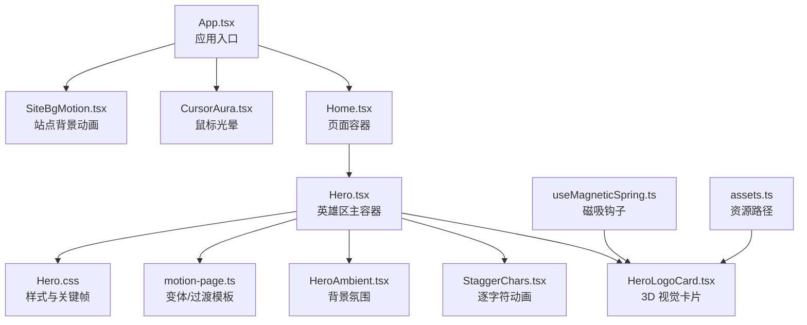
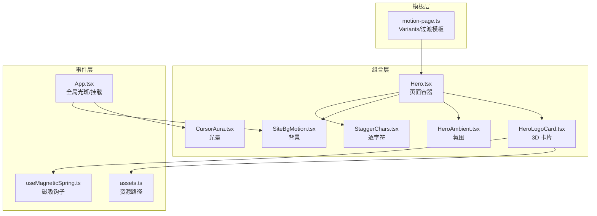
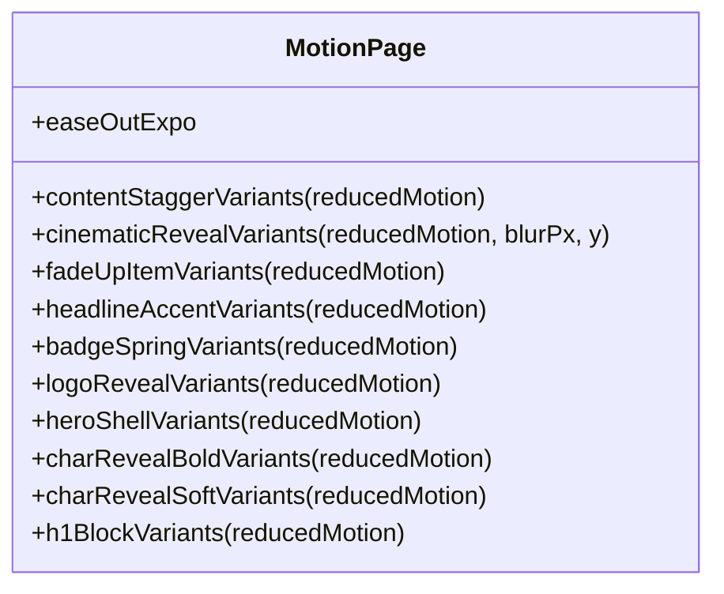
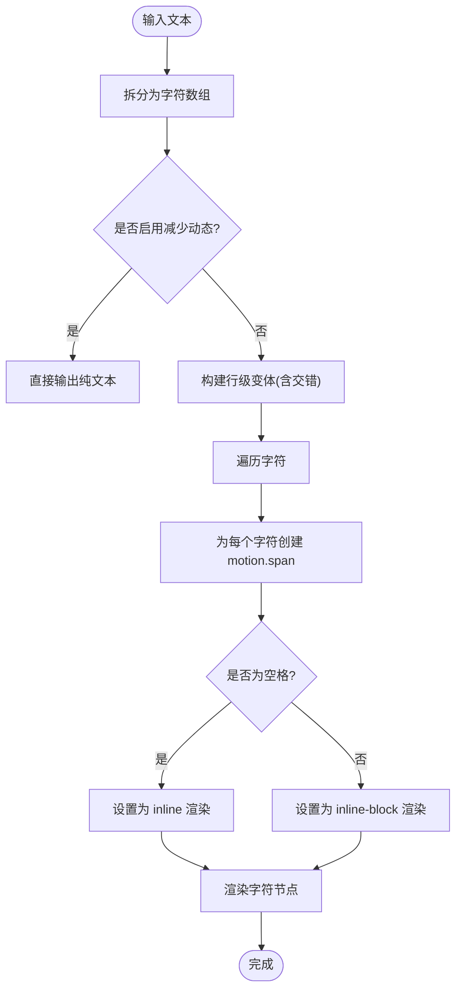
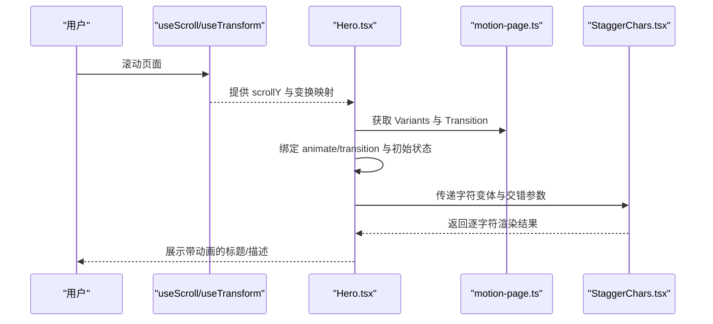
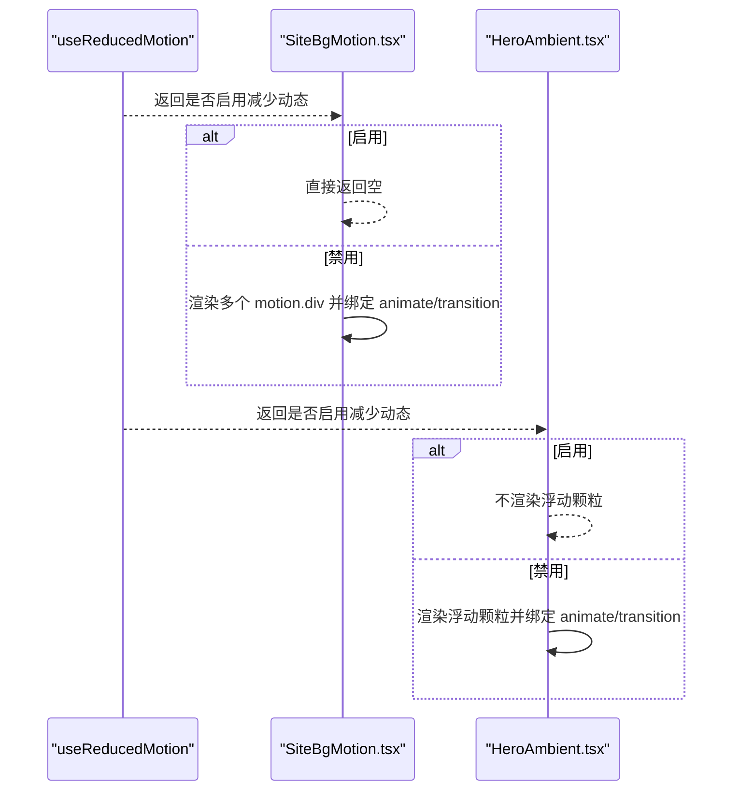
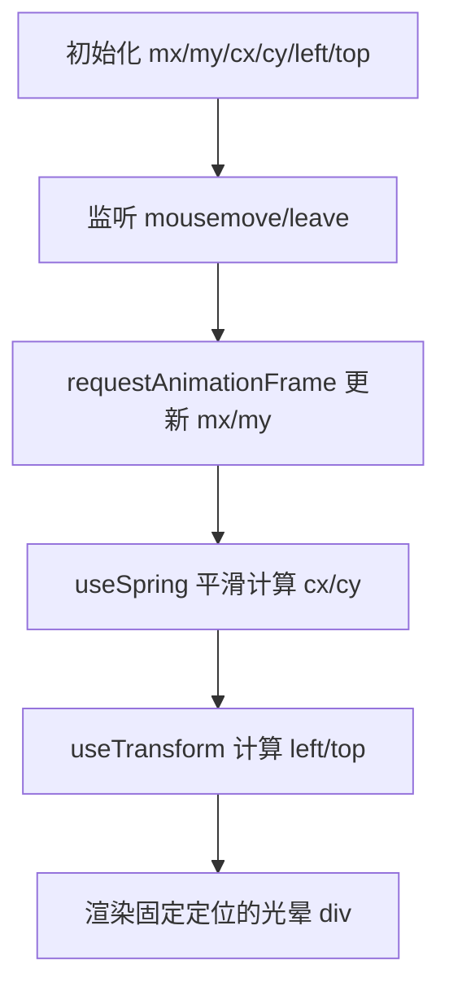
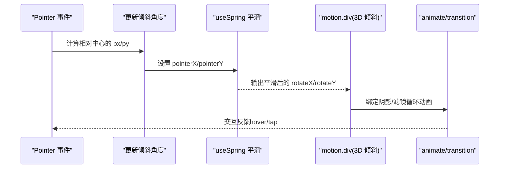
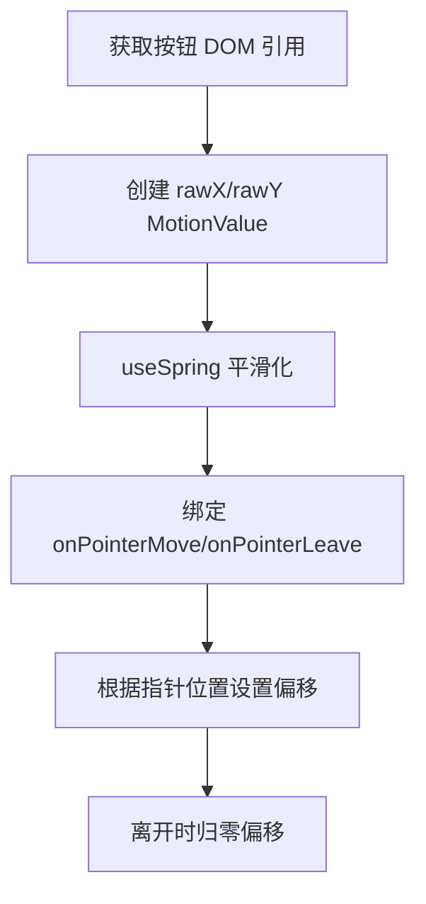
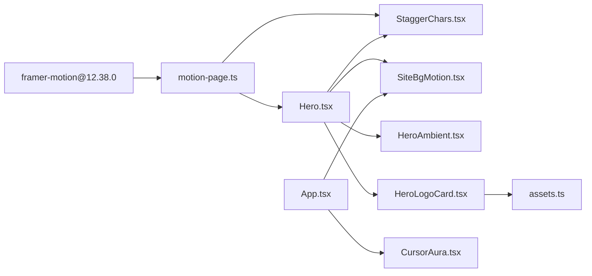

# 动画系统

<cite>
**本文引用的文件**
- [package.json](file://package.json)
- [App.tsx](file://src/App.tsx)
- [Hero.tsx](file://src/components/Hero.tsx)
- [HeroAmbient.tsx](file://src/components/HeroAmbient.tsx)
- [HeroLogoCard.tsx](file://src/components/HeroLogoCard.tsx)
- [StaggerChars.tsx](file://src/components/StaggerChars.tsx)
- [SiteBgMotion.tsx](file://src/components/SiteBgMotion.tsx)
- [CursorAura.tsx](file://src/components/CursorAura.tsx)
- [useMagneticSpring.ts](file://src/hooks/useMagneticSpring.ts)
- [assets.ts](file://src/constants/assets.ts)
- [motion-page.ts](file://src/utils/motion-page.ts)
- [Hero.css](file://src/styles/Hero.css)
</cite>

## 目录
1. [简介](#简介)
2. [项目结构](#项目结构)
3. [核心组件](#核心组件)
4. [架构总览](#架构总览)
5. [详细组件分析](#详细组件分析)
6. [依赖关系分析](#依赖关系分析)
7. [性能考量](#性能考量)
8. [故障排除指南](#故障排除指南)
9. [结论](#结论)
10. [附录](#附录)

## 简介
本文件系统性梳理 MinLL 项目的动画系统，围绕以下目标展开：
- 动画配置系统：统一的变体与过渡配置、可复用的动画模板。
- 变体定义规范：Variants 结构、过渡参数、延迟与交错策略。
- 性能优化策略：减少重排、降低合成层压力、适配“减少动态”偏好。
- 使用模式：Framer Motion 的 useMotionValue/useSpring/useTransform/useReducedMotion 等 API 的组合使用。
- 字符级与块级动画：逐字符分段与块级交错的实现原理。
- 生命周期与事件：滚动、指针移动、悬停/按压等事件驱动的动画。
- 调试与优化：监控与定位性能问题的方法与建议。

## 项目结构
动画系统主要由以下层次构成：
- 应用入口与全局背景：App.tsx 注入全局背景与光斑位置变量，并挂载全局动画组件（SiteBgMotion、CursorAura）。
- 页面级动画：Home.tsx 组织 Hero、相册与页脚；Hero.tsx 是动画的核心容器，负责标题、副标题、描述的字符级与块级动画。
- 工具与常量：motion-page.ts 提供统一的变体与过渡模板；assets.ts 提供资源路径解析；useMagneticSpring.ts 提供磁吸弹簧钩子。
- 组件级动画：StaggerChars.tsx 实现逐字符动画；SiteBgMotion.tsx 与 HeroAmbient.tsx 提供背景氛围动画；CursorAura.tsx 提供跟随鼠标轨迹的光晕；HeroLogoCard.tsx 提供 3D 视觉卡片的旋转与阴影动画。

图表来源
- [App.tsx:1-70](file://src/App.tsx#L1-L70)
- [Hero.tsx:1-316](file://src/components/Hero.tsx#L1-L316)
- [StaggerChars.tsx:1-59](file://src/components/StaggerChars.tsx#L1-L59)
- [SiteBgMotion.tsx:1-60](file://src/components/SiteBgMotion.tsx#L1-L60)
- [HeroAmbient.tsx:1-64](file://src/components/HeroAmbient.tsx#L1-L64)
- [HeroLogoCard.tsx:1-152](file://src/components/HeroLogoCard.tsx#L1-L152)
- [motion-page.ts:1-184](file://src/utils/motion-page.ts#L1-L184)
- [Hero.css:1-603](file://src/styles/Hero.css#L1-L603)
- [useMagneticSpring.ts:1-33](file://src/hooks/useMagneticSpring.ts#L1-L33)
- [assets.ts:1-24](file://src/constants/assets.ts#L1-L24)

章节来源
- [App.tsx:1-70](file://src/App.tsx#L1-L70)
- [Hero.tsx:1-316](file://src/components/Hero.tsx#L1-L316)

## 核心组件
- 变体与过渡模板（motion-page.ts）
  - 提供统一的 Variants 生成器：内容交错、镜头揭示、徽章弹跳、标题强调、角色揭示（粗体/柔和）、块级 H1 等。
  - 提供通用缓动曲线与过渡配置，便于跨组件复用。
- 逐字符动画（StaggerChars.tsx）
  - 将字符串拆分为字符数组，按行/字符层级进行 staggerChildren 控制，支持空格渲染与行内显示策略。
  - 在“减少动态”模式下直接输出纯文本，避免不必要的 DOM。
- 页面级动画容器（Hero.tsx）
  - 使用 useScroll/useTransform 做视差与网格位移；结合 useReducedMotion 切换静态/动画模式。
  - 通过 Variants 与 animate/transition 驱动徽章光环、滚动指示器、标题与描述的字符级动画。
- 背景氛围（SiteBgMotion.tsx、HeroAmbient.tsx）
  - 使用 motion.div/span 的 animate/transition 实现无限循环的透明度/位移/缩放动画。
  - 通过 useReducedMotion 在系统偏好下禁用动画。
- 交互式光晕（CursorAura.tsx）
  - 使用 useMotionValue/useSpring/useTransform 追踪鼠标位置，平滑跟随；在离开视口时回中。
- 3D 视觉卡片（HeroLogoCard.tsx）
  - 使用 pointer 事件计算倾斜角度，结合 useSpring 与 whileHover/whileTap 实现自然的反馈。
- 磁吸钩子（useMagneticSpring.ts）
  - 为按钮等元素提供基于指针位置的磁吸偏移，提升交互真实感。

章节来源
- [motion-page.ts:1-184](file://src/utils/motion-page.ts#L1-L184)
- [StaggerChars.tsx:1-59](file://src/components/StaggerChars.tsx#L1-L59)
- [Hero.tsx:1-316](file://src/components/Hero.tsx#L1-L316)
- [SiteBgMotion.tsx:1-60](file://src/components/SiteBgMotion.tsx#L1-L60)
- [HeroAmbient.tsx:1-64](file://src/components/HeroAmbient.tsx#L1-L64)
- [CursorAura.tsx:1-69](file://src/components/CursorAura.tsx#L1-L69)
- [HeroLogoCard.tsx:1-152](file://src/components/HeroLogoCard.tsx#L1-L152)
- [useMagneticSpring.ts:1-33](file://src/hooks/useMagneticSpring.ts#L1-L33)

## 架构总览
动画系统采用“模板 + 组合 + 事件驱动”的架构：
- 模板层：motion-page.ts 提供 Variants/Transition 的工厂函数，确保风格一致与性能可控。
- 组合层：Hero.tsx 将多个动画片段（字符级、块级、背景、交互）组合成完整的页面动画序列。
- 事件层：App.tsx 设置全局光斑位置；CursorAura.tsx 跟随鼠标；HeroLogoCard.tsx 响应指针事件；StaggerChars.tsx 在可见时按需渲染字符。
- 系统偏好层：useReducedMotion 统一开关所有动画，保障无障碍体验。

图表来源
- [motion-page.ts:1-184](file://src/utils/motion-page.ts#L1-L184)
- [Hero.tsx:1-316](file://src/components/Hero.tsx#L1-L316)
- [StaggerChars.tsx:1-59](file://src/components/StaggerChars.tsx#L1-L59)
- [SiteBgMotion.tsx:1-60](file://src/components/SiteBgMotion.tsx#L1-L60)
- [HeroAmbient.tsx:1-64](file://src/components/HeroAmbient.tsx#L1-L64)
- [CursorAura.tsx:1-69](file://src/components/CursorAura.tsx#L1-L69)
- [HeroLogoCard.tsx:1-152](file://src/components/HeroLogoCard.tsx#L1-L152)
- [App.tsx:1-70](file://src/App.tsx#L1-L70)
- [useMagneticSpring.ts:1-33](file://src/hooks/useMagneticSpring.ts#L1-L33)
- [assets.ts:1-24](file://src/constants/assets.ts#L1-L24)

## 详细组件分析

### 变体与过渡模板（motion-page.ts）
- 设计要点
  - Variants 以“隐藏/可见”两态定义，配合 transition 的 staggerChildren/delayChildren 控制块级交错。
  - 缓动曲线统一使用 easeOutExpo，保证视觉节奏一致。
  - 在 reducedMotion 为真时，将过渡时长置零或直接返回可见态，确保无障碍。
- 关键函数
  - 内容交错：contentStaggerVariants
  - 镜头揭示：cinematicRevealVariants（可定制模糊与位移）
  - 徽章弹跳：badgeSpringVariants
  - 标题强调：headlineAccentVariants
  - 角色揭示：charRevealBoldVariants / charRevealSoftVariants
  - 块级 H1：h1BlockVariants
  - 英雄外壳：heroShellVariants
  - Logo 揭示：logoRevealVariants

图表来源
- [motion-page.ts:1-184](file://src/utils/motion-page.ts#L1-L184)

章节来源
- [motion-page.ts:1-184](file://src/utils/motion-page.ts#L1-L184)

### 逐字符动画（StaggerChars.tsx）
- 设计要点
  - 将文本转为字符数组，每个字符包裹一层 motion.span，并通过 variants 与 lineVariants 控制 staggerChildren。
  - 对空格字符做特殊处理（内联渲染），避免多余布局开销。
  - 在 reducedMotion 下直接输出纯文本，不渲染任何动画节点。
- 参数与行为
  - 支持自定义字符变体、行变体、交错间隔与类名。
  - 行变体默认提供 staggerChildren，字符变体决定单个字符的进入方式。

图表来源
- [StaggerChars.tsx:14-58](file://src/components/StaggerChars.tsx#L14-L58)

章节来源
- [StaggerChars.tsx:1-59](file://src/components/StaggerChars.tsx#L1-L59)

### 页面级动画容器（Hero.tsx）
- 设计要点
  - 使用 useScroll/useTransform 计算视差与网格位移，配合 animate/transition 实现背景与网格的循环动画。
  - 通过 Variants 与 initial/animate 控制整体入场与内容块级交错。
  - 标题与描述在 reducedMotion 为真时走简化路径，字符级动画在非简化模式下由 StaggerChars.tsx 承担。
- 关键流程
  - 初始化各 Variants（item、accent、content、logo、badge、shell、h1Block、charSoft、charBold）。
  - 计算滚动驱动的 y 变换与网格位移。
  - 将 Variants 与 animate/transition 绑定到对应元素。

图表来源
- [Hero.tsx:25-35](file://src/components/Hero.tsx#L25-L35)
- [Hero.tsx:37-40](file://src/components/Hero.tsx#L37-L40)
- [motion-page.ts:6-184](file://src/utils/motion-page.ts#L6-L184)
- [StaggerChars.tsx:14-58](file://src/components/StaggerChars.tsx#L14-L58)

章节来源
- [Hero.tsx:1-316](file://src/components/Hero.tsx#L1-L316)

### 背景氛围与站点背景（SiteBgMotion.tsx、HeroAmbient.tsx）
- 设计要点
  - 使用 animate/transition 定义透明度、位移、缩放的关键帧序列，repeat 为无穷大实现循环。
  - 通过 useReducedMotion 在系统偏好下直接跳过动画。
- HeroAmbient.tsx
  - 除透明度外，还包含若干浮动颗粒的 y/opacity/scale 循环动画，增强空间感。

图表来源
- [SiteBgMotion.tsx:25-59](file://src/components/SiteBgMotion.tsx#L25-L59)
- [HeroAmbient.tsx:21-63](file://src/components/HeroAmbient.tsx#L21-L63)

章节来源
- [SiteBgMotion.tsx:1-60](file://src/components/SiteBgMotion.tsx#L1-L60)
- [HeroAmbient.tsx:1-64](file://src/components/HeroAmbient.tsx#L1-L64)

### 鼠标光晕（CursorAura.tsx）
- 设计要点
  - 使用 useMotionValue 记录目标坐标，useSpring 平滑跟随，useTransform 计算最终 left/top。
  - 在窗口与文档根节点上监听 mouseleave，使光晕回到屏幕中央。
  - 在 reducedMotion 下直接返回空，避免动画。

图表来源
- [CursorAura.tsx:13-68](file://src/components/CursorAura.tsx#L13-L68)

章节来源
- [CursorAura.tsx:1-69](file://src/components/CursorAura.tsx#L1-L69)

### 3D 视觉卡片（HeroLogoCard.tsx）
- 设计要点
  - 使用 pointer 事件计算相对中心的偏移，映射到 X/Y 轴倾斜角，结合 useSpring 平滑过渡。
  - whileHover/whileTap 提供交互反馈；animate/transition 控制框架阴影与滤镜的循环变化。
  - 在 reducedMotion 下跳过所有动画，保持静态展示。

图表来源
- [HeroLogoCard.tsx:20-152](file://src/components/HeroLogoCard.tsx#L20-L152)

章节来源
- [HeroLogoCard.tsx:1-152](file://src/components/HeroLogoCard.tsx#L1-L152)

### 磁吸钩子（useMagneticSpring.ts）
- 设计要点
  - 为按钮等元素提供基于指针位置的磁吸偏移，strength 控制灵敏度。
  - 提供 onPointerMove/onPointerLeave 回调，便于在外部组件中直接绑定。

图表来源
- [useMagneticSpring.ts:6-32](file://src/hooks/useMagneticSpring.ts#L6-L32)

章节来源
- [useMagneticSpring.ts:1-33](file://src/hooks/useMagneticSpring.ts#L1-L33)

## 依赖关系分析
- 外部依赖
  - Framer Motion 版本：12.38.0，提供 motion 组件与动画 API。
- 内部依赖
  - Hero.tsx 依赖 motion-page.ts 的 Variants 与过渡模板。
  - StaggerChars.tsx 依赖 motion-page.ts 的字符级变体。
  - HeroLogoCard.tsx 依赖 assets.ts 的品牌图片资源。
  - App.tsx 依赖 CursorAura.tsx 与 SiteBgMotion.tsx，同时设置全局 CSS 变量以驱动背景光斑。

图表来源
- [package.json:46](file://package.json#L46)
- [motion-page.ts:1-184](file://src/utils/motion-page.ts#L1-L184)
- [Hero.tsx:13-23](file://src/components/Hero.tsx#L13-L23)
- [StaggerChars.tsx:1-2](file://src/components/StaggerChars.tsx#L1-L2)
- [HeroLogoCard.tsx:8](file://src/components/HeroLogoCard.tsx#L8)
- [assets.ts:8](file://src/constants/assets.ts#L8)
- [App.tsx:2-3](file://src/App.tsx#L2-L3)

章节来源
- [package.json:1-84](file://package.json#L1-L84)
- [App.tsx:1-70](file://src/App.tsx#L1-L70)

## 性能考量
- 减少动态优先
  - 使用 useReducedMotion 在系统偏好下直接跳过动画，避免不必要的合成与重绘。
- 合理使用 stagger
  - contentStaggerVariants 与 h1BlockVariants 的 staggerChildren/delayChildren 控制交错节奏，避免过度密集导致卡顿。
- 限制合成层与滤镜
  - 避免在大量元素上同时使用高代价滤镜（如 blur），必要时在 reducedMotion 下关闭。
- requestAnimationFrame 与事件节流
  - CursorAura.tsx 中对 mousemove 使用 RAF，降低高频事件带来的抖动与重排。
- 视口与滚动驱动
  - 使用 useTransform 将滚动映射为轻量的 y/rotate/scale，避免复杂布局计算。
- 资源与尺寸
  - 图片尺寸与格式优化，HeroLogoCard.tsx 中使用 async 解码与合适的宽高，减少主线程阻塞。

## 故障排除指南
- 动画未生效
  - 检查是否启用了“减少动态”系统偏好；若启用，组件会直接返回静态内容。
  - 确认 motion-page.ts 的 Variants 是否正确传入到 motion 组件。
- 字符级动画异常
  - 确保 StaggerChars.tsx 的 text props 正确传入，且 charVariants/lineVariants 有效。
  - 检查 CSS 中对字符级元素的 display/inline-block 设置是否被覆盖。
- 光晕不跟随鼠标
  - 确认 CursorAura.tsx 的事件监听是否正常注册，以及是否在 reducedMotion 下被禁用。
- 3D 卡片无倾斜
  - 检查 pointer 事件是否触发，以及 wrapRef 是否正确获取 DOM。
- 背景动画闪烁
  - 检查 animate/transition 的 repeat 与 ease 配置，确保关键帧序列完整。
- 性能下降
  - 关闭部分动画（如徽章光环、浮动颗粒）观察帧率变化；减少滤镜与阴影数量；合并动画关键帧。

## 结论
MinLL 的动画系统以模板化与事件驱动为核心，通过 motion-page.ts 的统一变体与过渡配置，结合 StaggerChars.tsx 的字符级与 Hero.tsx 的块级交错，实现了从页面到细节的完整动画体验。系统充分考虑了无障碍与性能，通过 useReducedMotion 与合理的动画策略，确保在不同设备与偏好下都能提供流畅、优雅的交互。

## 附录
- 动画配置示例（路径参考）
  - 字符级动画：[Hero.tsx:157-173](file://src/components/Hero.tsx#L157-L173)、[StaggerChars.tsx:14-58](file://src/components/StaggerChars.tsx#L14-L58)
  - 块级交错：[motion-page.ts:6-16](file://src/utils/motion-page.ts#L6-L16)、[Hero.tsx:176-197](file://src/components/Hero.tsx#L176-L197)
  - 背景氛围：[SiteBgMotion.tsx:25-59](file://src/components/SiteBgMotion.tsx#L25-L59)、[HeroAmbient.tsx:21-63](file://src/components/HeroAmbient.tsx#L21-L63)
  - 交互光晕：[CursorAura.tsx:13-68](file://src/components/CursorAura.tsx#L13-L68)
  - 3D 卡片：[HeroLogoCard.tsx:20-152](file://src/components/HeroLogoCard.tsx#L20-L152)
  - 磁吸钩子：[useMagneticSpring.ts:6-32](file://src/hooks/useMagneticSpring.ts#L6-L32)
- 最佳实践
  - 优先使用 motion-page.ts 的模板，避免重复定义相似的 Variants。
  - 在 reducedMotion 下尽量减少动画，保持静态展示。
  - 使用 useTransform 与轻量属性（opacity/y/scale）替代昂贵的布局计算。
  - 对高频事件（mousemove/touchmove）使用 RAF 或节流策略。