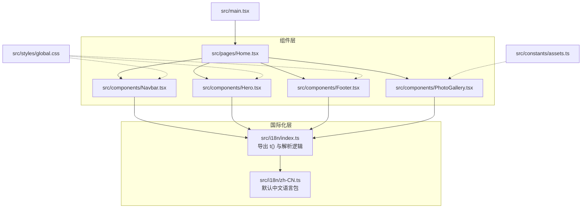
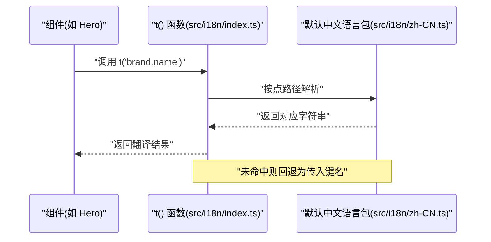
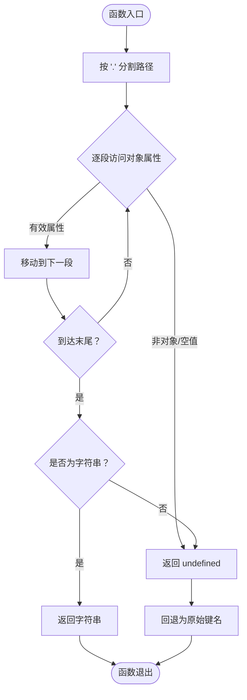
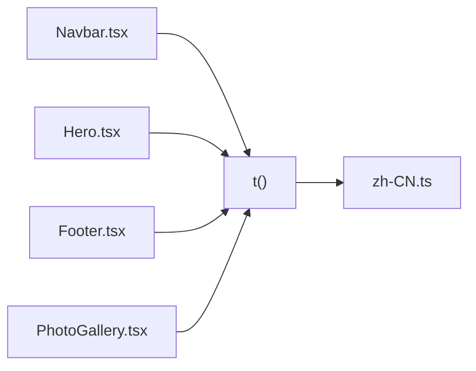
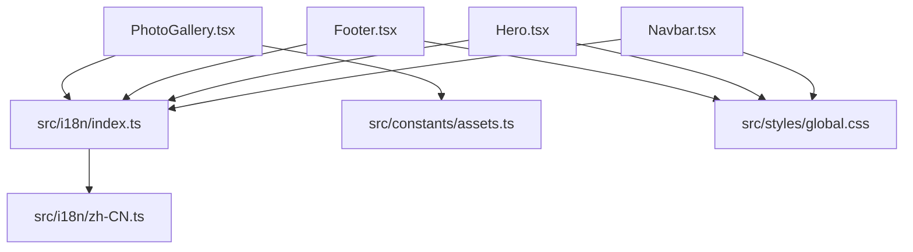

# 国际化系统

<cite>
**本文引用的文件**
- [src/i18n/index.ts](file://src/i18n/index.ts)
- [src/i18n/zh-CN.ts](file://src/i18n/zh-CN.ts)
- [src/components/Navbar.tsx](file://src/components/Navbar.tsx)
- [src/components/Hero.tsx](file://src/components/Hero.tsx)
- [src/components/Footer.tsx](file://src/components/Footer.tsx)
- [src/components/PhotoGallery.tsx](file://src/components/PhotoGallery.tsx)
- [src/pages/Home.tsx](file://src/pages/Home.tsx)
- [src/main.tsx](file://src/main.tsx)
- [src/constants/assets.ts](file://src/constants/assets.ts)
- [src/styles/global.css](file://src/styles/global.css)
</cite>

## 目录
1. [简介](#简介)
2. [项目结构](#项目结构)
3. [核心组件](#核心组件)
4. [架构总览](#架构总览)
5. [详细组件分析](#详细组件分析)
6. [依赖关系分析](#依赖关系分析)
7. [性能考量](#性能考量)
8. [故障排查指南](#故障排查指南)
9. [结论](#结论)
10. [附录](#附录)

## 简介
本文件系统性梳理 MinLL 项目的国际化（i18n）体系，重点覆盖以下方面：
- 多语言配置的实现方式与当前语言包组织结构
- 翻译函数 t() 的使用方法、翻译键命名规范与回退策略
- 文本处理机制与与组件系统的集成方式
- 中文界面支持的具体实现与扩展其他语言的方法
- 翻译维护最佳实践与工作流程
- 性能优化与缓存策略建议

当前项目采用“默认中文 + 点路径查找”的轻量级方案：所有翻译键集中于默认语言包，通过 t() 函数按点分路径进行查找，未命中时直接回退为传入的键名。

## 项目结构
国际化相关代码集中在 src/i18n 目录，并在各业务组件中以 t() 函数调用的方式使用。页面入口与全局样式为国际化提供基础环境。

图表来源
- [src/i18n/index.ts:1-17](file://src/i18n/index.ts#L1-L17)
- [src/i18n/zh-CN.ts:1-31](file://src/i18n/zh-CN.ts#L1-L31)
- [src/components/Navbar.tsx:1-111](file://src/components/Navbar.tsx#L1-L111)
- [src/components/Hero.tsx:1-316](file://src/components/Hero.tsx#L1-L316)
- [src/components/Footer.tsx:1-42](file://src/components/Footer.tsx#L1-L42)
- [src/components/PhotoGallery.tsx:1-166](file://src/components/PhotoGallery.tsx#L1-L166)
- [src/pages/Home.tsx:1-15](file://src/pages/Home.tsx#L1-L15)
- [src/main.tsx:1-18](file://src/main.tsx#L1-L18)
- [src/constants/assets.ts:1-24](file://src/constants/assets.ts#L1-L24)
- [src/styles/global.css:1-294](file://src/styles/global.css#L1-L294)

章节来源
- [src/i18n/index.ts:1-17](file://src/i18n/index.ts#L1-L17)
- [src/i18n/zh-CN.ts:1-31](file://src/i18n/zh-CN.ts#L1-L31)
- [src/components/Navbar.tsx:1-111](file://src/components/Navbar.tsx#L1-L111)
- [src/components/Hero.tsx:1-316](file://src/components/Hero.tsx#L1-L316)
- [src/components/Footer.tsx:1-42](file://src/components/Footer.tsx#L1-L42)
- [src/components/PhotoGallery.tsx:1-166](file://src/components/PhotoGallery.tsx#L1-L166)
- [src/pages/Home.tsx:1-15](file://src/pages/Home.tsx#L1-L15)
- [src/main.tsx:1-18](file://src/main.tsx#L1-L18)
- [src/constants/assets.ts:1-24](file://src/constants/assets.ts#L1-L24)
- [src/styles/global.css:1-294](file://src/styles/global.css#L1-L294)

## 核心组件
- 国际化入口与解析器
  - 导出 t() 函数，接收“点路径”形式的翻译键，内部通过递归解析默认中文语言包对象，返回对应字符串或回退为原键名。
  - 解析器支持任意层级嵌套，仅当最终值为字符串时视为有效命中。
- 默认中文语言包
  - 按功能域划分键空间（如 brand、hero、gallery、footer），每个键对应具体文案。
  - 使用只读断言确保类型安全与编译期校验。

章节来源
- [src/i18n/index.ts:1-17](file://src/i18n/index.ts#L1-L17)
- [src/i18n/zh-CN.ts:1-31](file://src/i18n/zh-CN.ts#L1-L31)

## 架构总览
国际化系统采用“单语言包 + 点路径查找”的轻量架构：组件通过 t() 获取文案，t() 再从默认语言包中解析。该设计简单、可维护性强，适合中小型项目或初期阶段。

图表来源
- [src/i18n/index.ts:12-16](file://src/i18n/index.ts#L12-L16)
- [src/i18n/zh-CN.ts:2-30](file://src/i18n/zh-CN.ts#L2-L30)

## 详细组件分析

### t() 函数与解析器
- 职责
  - 提供统一的翻译查询接口，屏蔽语言包细节。
  - 通过点路径解析默认语言包，保证键名与结构清晰。
- 行为特征
  - 命中：返回语言包中的字符串。
  - 未命中：直接回退为传入的键名，避免运行时错误。
- 复杂度
  - 时间复杂度：O(k)，k 为点路径段数。
  - 空间复杂度：O(1)。

图表来源
- [src/i18n/index.ts:3-16](file://src/i18n/index.ts#L3-L16)

章节来源
- [src/i18n/index.ts:1-17](file://src/i18n/index.ts#L1-L17)

### 默认中文语言包 zh-CN.ts
- 组织方式
  - 功能域分组：brand、hero、gallery、footer。
  - 子键命名：简洁明确，便于组件直接引用。
- 类型保障
  - 使用只读断言，提升类型安全性与 IDE 支持。

章节来源
- [src/i18n/zh-CN.ts:1-31](file://src/i18n/zh-CN.ts#L1-L31)

### 组件中的使用模式
- Navbar
  - 在导航栏标题处使用 t("brand.name")。
- Hero
  - 多处使用 t() 渲染品牌标语、副标题与描述，并结合动画组件实现逐字效果。
- Footer
  - 使用 t() 渲染品牌文案与版权信息。
- PhotoGallery
  - 使用 t() 渲染画廊区块标题、描述与标签文案；动态拼接键名以支持不同角色标签。

图表来源
- [src/components/Navbar.tsx:9-104](file://src/components/Navbar.tsx#L9-L104)
- [src/components/Hero.tsx:10-315](file://src/components/Hero.tsx#L10-L315)
- [src/components/Footer.tsx:3-36](file://src/components/Footer.tsx#L3-L36)
- [src/components/PhotoGallery.tsx:3-94](file://src/components/PhotoGallery.tsx#L3-L94)
- [src/i18n/index.ts:12-16](file://src/i18n/index.ts#L12-L16)
- [src/i18n/zh-CN.ts:2-30](file://src/i18n/zh-CN.ts#L2-L30)

章节来源
- [src/components/Navbar.tsx:1-111](file://src/components/Navbar.tsx#L1-L111)
- [src/components/Hero.tsx:1-316](file://src/components/Hero.tsx#L1-L316)
- [src/components/Footer.tsx:1-42](file://src/components/Footer.tsx#L1-L42)
- [src/components/PhotoGallery.tsx:1-166](file://src/components/PhotoGallery.tsx#L1-L166)

### 页面与入口集成
- 页面 Home.tsx 将多个组件组合为完整页面，组件内通过 t() 实现文案国际化。
- 入口 main.tsx 设置站点背景图变量，为国际化文案的视觉呈现提供一致的全局样式基础。

章节来源
- [src/pages/Home.tsx:1-15](file://src/pages/Home.tsx#L1-L15)
- [src/main.tsx:1-18](file://src/main.tsx#L1-L18)

## 依赖关系分析
- 组件对国际化模块的依赖
  - Navbar、Hero、Footer、PhotoGallery 直接导入 t() 并在渲染时使用。
- 语言包依赖
  - index.ts 依赖 zh-CN.ts 作为默认语言包。
- 资源与样式
  - PhotoGallery 使用常量资源与样式，与国际化解耦但共同参与最终文案呈现。

图表来源
- [src/components/Navbar.tsx:9](file://src/components/Navbar.tsx#L9)
- [src/components/Hero.tsx:11](file://src/components/Hero.tsx#L11)
- [src/components/Footer.tsx:3](file://src/components/Footer.tsx#L3)
- [src/components/PhotoGallery.tsx:3](file://src/components/PhotoGallery.tsx#L3)
- [src/i18n/index.ts:1](file://src/i18n/index.ts#L1)
- [src/i18n/zh-CN.ts:1](file://src/i18n/zh-CN.ts#L1)
- [src/constants/assets.ts:1-24](file://src/constants/assets.ts#L1-L24)
- [src/styles/global.css:1-294](file://src/styles/global.css#L1-L294)

章节来源
- [src/components/Navbar.tsx:1-111](file://src/components/Navbar.tsx#L1-L111)
- [src/components/Hero.tsx:1-316](file://src/components/Hero.tsx#L1-L316)
- [src/components/Footer.tsx:1-42](file://src/components/Footer.tsx#L1-L42)
- [src/components/PhotoGallery.tsx:1-166](file://src/components/PhotoGallery.tsx#L1-L166)
- [src/i18n/index.ts:1-17](file://src/i18n/index.ts#L1-L17)
- [src/i18n/zh-CN.ts:1-31](file://src/i18n/zh-CN.ts#L1-L31)
- [src/constants/assets.ts:1-24](file://src/constants/assets.ts#L1-L24)
- [src/styles/global.css:1-294](file://src/styles/global.css#L1-L294)

## 性能考量
- 当前实现
  - t() 为纯内存查找，时间复杂度 O(k)，k 为路径段数；空间复杂度 O(1)。
  - 未引入缓存层，每次调用均执行解析，适合键数量有限的小型应用。
- 可选优化方向（建议）
  - 键到值的映射缓存：在模块初始化时构建扁平映射表，后续直接 O(1) 查找。
  - 路径预编译：将常用路径编译为函数，减少字符串拆分与分支判断。
  - 语言切换与懒加载：未来扩展多语言时，按需加载语言包，避免一次性载入全部语言。
  - 批量更新与热替换：在开发态支持语言包热更新，减少全量重载成本。

[本节为通用性能讨论，无需列出章节来源]

## 故障排查指南
- 症状：页面显示“键名原文”
  - 可能原因：翻译键不存在或路径错误。
  - 排查步骤：核对键名与层级，确认是否拼写正确；检查是否存在多余空格或大小写差异。
- 症状：文案未生效或闪烁
  - 可能原因：组件在条件渲染中使用 t()，或在异步数据到达前渲染。
  - 排查步骤：确保在数据可用后再渲染依赖 t() 的节点；必要时增加骨架屏或占位文案。
- 症状：动态键名拼接无效
  - 示例场景：根据角色动态选择标签文案。
  - 解决要点：确保拼接后的键名与语言包一致；在组件中打印调试键名，确认最终路径。
- 症状：类型提示缺失或报错
  - 可能原因：未使用只读断言导致类型推断不足。
  - 解决要点：保持语言包使用只读断言；在新增键时同步完善类型推断。

章节来源
- [src/i18n/index.ts:12-16](file://src/i18n/index.ts#L12-L16)
- [src/components/PhotoGallery.tsx:55](file://src/components/PhotoGallery.tsx#L55)

## 结论
MinLL 的国际化系统以“默认中文 + 点路径查找”为核心，结构清晰、易于维护，满足当前需求。随着业务增长，建议逐步引入语言包懒加载、缓存与类型增强等机制，以提升可扩展性与性能表现。

[本节为总结性内容，无需列出章节来源]

## 附录

### 翻译键命名规范
- 域名前缀：按功能域划分（如 brand、hero、gallery、footer）。
- 层级结构：使用点号分隔，避免过深嵌套；保持语义化与可读性。
- 唯一性：同一域内键名唯一，避免冲突。
- 动态键：支持动态拼接（如 gallery.labels.{角色标识}），但需确保语言包中存在对应键。

章节来源
- [src/i18n/zh-CN.ts:2-30](file://src/i18n/zh-CN.ts#L2-L30)
- [src/components/PhotoGallery.tsx:55](file://src/components/PhotoGallery.tsx#L55)

### t() 函数使用示例（路径指引）
- 导航栏品牌名：[src/components/Navbar.tsx:104](file://src/components/Navbar.tsx#L104)
- 英雄区标语与标题：[src/components/Hero.tsx:148-166](file://src/components/Hero.tsx#L148-L166)
- 英雄区副标题与描述：[src/components/Hero.tsx:185-211](file://src/components/Hero.tsx#L185-L211)
- 底部文案与版权：[src/components/Footer.tsx:26-36](file://src/components/Footer.tsx#L26-L36)
- 画廊区块标题与描述：[src/components/PhotoGallery.tsx:87-91](file://src/components/PhotoGallery.tsx#L87-L91)
- 画廊角色标签：[src/components/PhotoGallery.tsx:55](file://src/components/PhotoGallery.tsx#L55)

章节来源
- [src/components/Navbar.tsx:1-111](file://src/components/Navbar.tsx#L1-L111)
- [src/components/Hero.tsx:1-316](file://src/components/Hero.tsx#L1-L316)
- [src/components/Footer.tsx:1-42](file://src/components/Footer.tsx#L1-L42)
- [src/components/PhotoGallery.tsx:1-166](file://src/components/PhotoGallery.tsx#L1-L166)

### 扩展其他语言的方法
- 新增语言包
  - 在 src/i18n 下新增语言文件（如 en-US.ts），结构与 zh-CN.ts 保持一致。
  - 在 index.ts 中导出新语言包并提供切换逻辑（例如根据用户设置或路由参数选择）。
- 切换策略
  - 运行时切换：维护当前语言状态，重新渲染依赖 t() 的组件。
  - 预加载策略：在应用启动时预加载常用语言包，降低首次切换延迟。
- 向后兼容
  - 保留默认中文语言包不变，新增语言包仅补充缺失键；t() 未命中时仍回退为键名，确保稳定性。

[本节为扩展性建议，无需列出章节来源]

### 翻译维护最佳实践
- 键名版本化：在迭代中避免删除或重命名键，新增键时提供默认值。
- 文案一致性：建立文案清单与评审流程，避免同义词混用。
- 类型驱动：保持语言包只读断言，利用 TypeScript 提前发现键缺失。
- 组件侧约束：在组件中尽量使用常量键名，避免硬编码字符串。
- 自动化校验：在 CI 中加入键名与类型检查，防止遗漏或错误。

[本节为通用实践建议，无需列出章节来源]