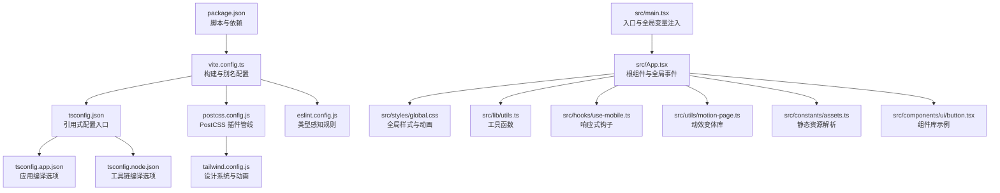
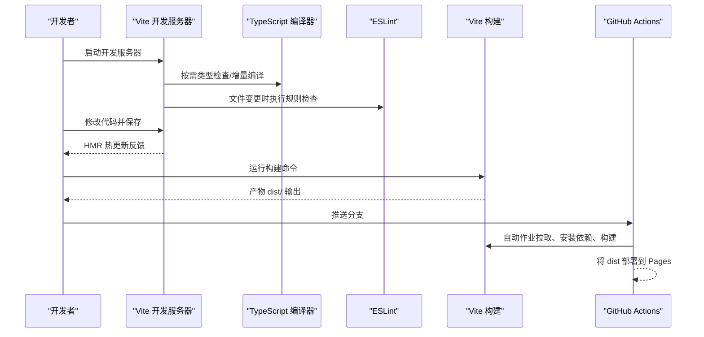
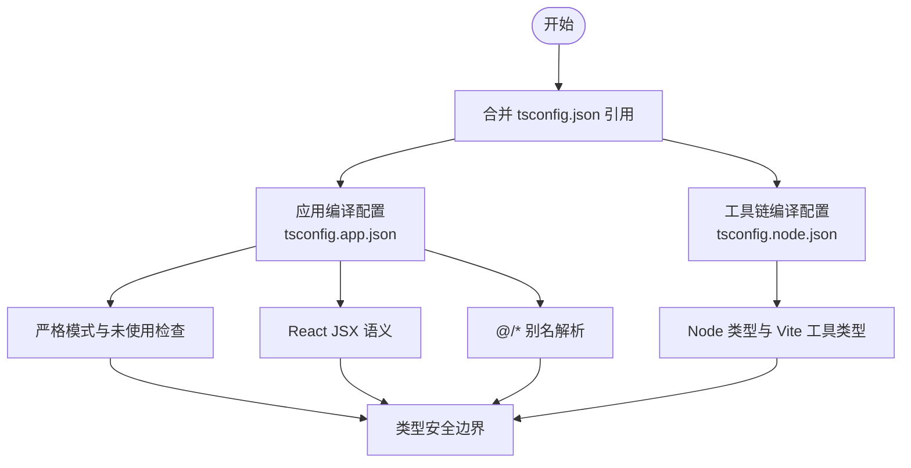
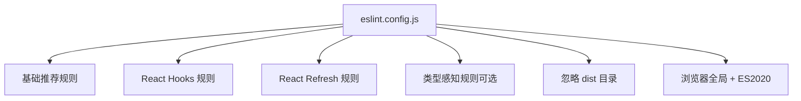
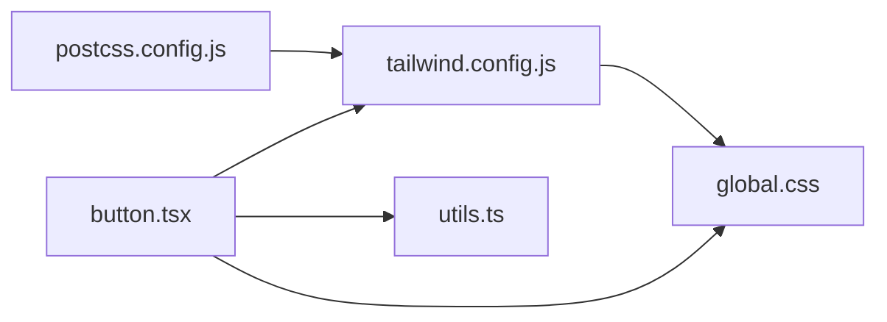
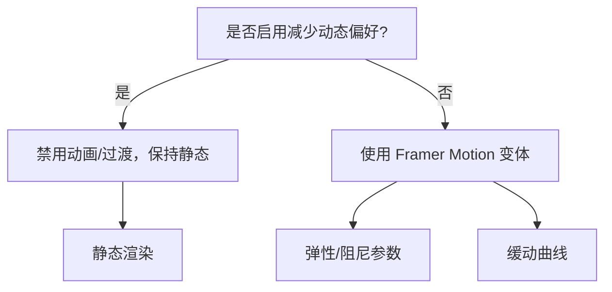
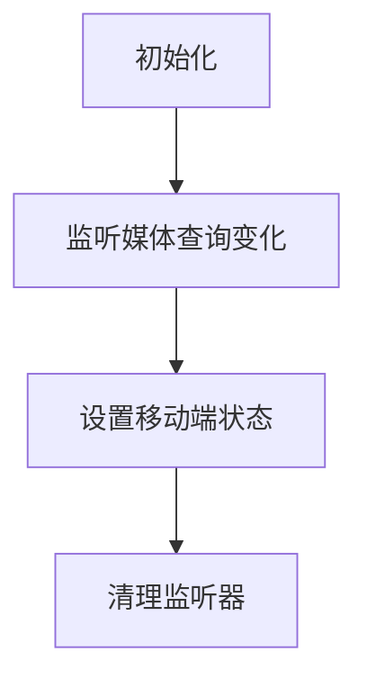
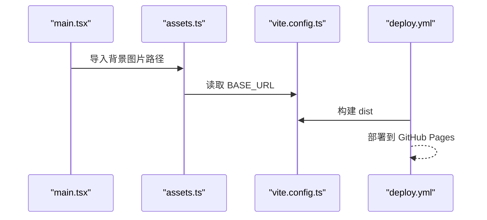
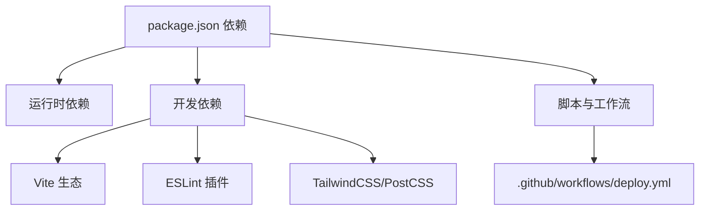

# 开发工具与最佳实践

<cite>
**本文引用的文件**
- [package.json](file://package.json)
- [vite.config.ts](file://vite.config.ts)
- [tsconfig.json](file://tsconfig.json)
- [tsconfig.app.json](file://tsconfig.app.json)
- [tsconfig.node.json](file://tsconfig.node.json)
- [eslint.config.js](file://eslint.config.js)
- [postcss.config.js](file://postcss.config.js)
- [tailwind.config.js](file://tailwind.config.js)
- [components.json](file://components.json)
- [.github/workflows/deploy.yml](file://.github/workflows/deploy.yml)
- [README.md](file://README.md)
- [src/main.tsx](file://src/main.tsx)
- [src/App.tsx](file://src/App.tsx)
- [src/lib/utils.ts](file://src/lib/utils.ts)
- [src/styles/global.css](file://src/styles/global.css)
- [src/hooks/use-mobile.ts](file://src/hooks/use-mobile.ts)
- [src/utils/motion-page.ts](file://src/utils/motion-page.ts)
- [src/constants/assets.ts](file://src/constants/assets.ts)
- [src/components/ui/button.tsx](file://src/components/ui/button.tsx)
</cite>

## 目录
1. [简介](#简介)
2. [项目结构](#项目结构)
3. [核心组件](#核心组件)
4. [架构总览](#架构总览)
5. [详细组件分析](#详细组件分析)
6. [依赖分析](#依赖分析)
7. [性能考虑](#性能考虑)
8. [故障排查指南](#故障排查指南)
9. [结论](#结论)
10. [附录](#附录)

## 简介
本文件面向 MinLL 项目的开发与工程化最佳实践，系统梳理开发工具链（Vite、TypeScript、ESLint、TailwindCSS）、代码质量与类型安全、性能优化与渲染策略、测试与持续集成、开发环境与调试技巧、团队协作与文档维护等主题，并提供可直接落地的配置参考与排障建议。

## 项目结构
MinLL 采用 React 19 + TypeScript + Vite 的现代前端技术栈，结合 TailwindCSS 与 shadcn/ui 组件体系，构建高性能、可维护的单页应用。项目通过多份 tsconfig 实现应用与 Node 工具链的严格分层编译，配合 ESLint 平台化规则与 Vite 插件生态实现快速开发与高质量交付。

图表来源
- [package.json:1-84](file://package.json#L1-L84)
- [vite.config.ts:1-26](file://vite.config.ts#L1-L26)
- [tsconfig.json:1-17](file://tsconfig.json#L1-L17)
- [tsconfig.app.json:1-35](file://tsconfig.app.json#L1-L35)
- [tsconfig.node.json:1-27](file://tsconfig.node.json#L1-L27)
- [postcss.config.js:1-7](file://postcss.config.js#L1-L7)
- [tailwind.config.js:1-84](file://tailwind.config.js#L1-L84)
- [eslint.config.js:1-24](file://eslint.config.js#L1-L24)
- [src/main.tsx:1-18](file://src/main.tsx#L1-L18)
- [src/App.tsx:1-70](file://src/App.tsx#L1-L70)
- [src/styles/global.css:1-294](file://src/styles/global.css#L1-L294)
- [src/lib/utils.ts:1-7](file://src/lib/utils.ts#L1-L7)
- [src/hooks/use-mobile.ts:1-20](file://src/hooks/use-mobile.ts#L1-L20)
- [src/utils/motion-page.ts:1-184](file://src/utils/motion-page.ts#L1-L184)
- [src/constants/assets.ts:1-24](file://src/constants/assets.ts#L1-L24)
- [src/components/ui/button.tsx:1-63](file://src/components/ui/button.tsx#L1-L63)

章节来源
- [package.json:1-84](file://package.json#L1-L84)
- [vite.config.ts:1-26](file://vite.config.ts#L1-L26)
- [tsconfig.json:1-17](file://tsconfig.json#L1-L17)
- [tsconfig.app.json:1-35](file://tsconfig.app.json#L1-L35)
- [tsconfig.node.json:1-27](file://tsconfig.node.json#L1-L27)
- [postcss.config.js:1-7](file://postcss.config.js#L1-L7)
- [tailwind.config.js:1-84](file://tailwind.config.js#L1-L84)
- [eslint.config.js:1-24](file://eslint.config.js#L1-L24)

## 核心组件
- 构建与别名：Vite 提供快速冷启动与热更新；通过路径别名统一模块导入，提升可读性与迁移成本。
- 类型系统：双 tsconfig 分层，应用侧启用严格模式与未使用检查，工具链侧聚焦 Node 环境。
- 质量保障：ESLint 使用推荐规则集与 React Hooks/React Refresh 插件，支持类型感知规则扩展。
- 样式体系：TailwindCSS + 自定义动画与变量，结合 PostCSS 自动前缀与按需扫描。
- 组件库：基于 shadcn/ui 规范，统一变体与尺寸，使用 class-variance-authority 与 tailwind-merge 组合类名。
- 动效与交互：Framer Motion 提供流畅的出场入场所需的变体与过渡，同时尊重“减少动态”偏好。
- 响应式与移动端：自研移动端断点检测 Hook，适配不同设备体验。
- 资源解析：在公共目录基础上结合 Vite base 配置，统一生成绝对路径，便于部署到子路径或 GitHub Pages。

章节来源
- [vite.config.ts:1-26](file://vite.config.ts#L1-L26)
- [tsconfig.app.json:1-35](file://tsconfig.app.json#L1-L35)
- [tsconfig.node.json:1-27](file://tsconfig.node.json#L1-L27)
- [eslint.config.js:1-24](file://eslint.config.js#L1-L24)
- [tailwind.config.js:1-84](file://tailwind.config.js#L1-L84)
- [postcss.config.js:1-7](file://postcss.config.js#L1-L7)
- [components.json:1-23](file://components.json#L1-L23)
- [src/components/ui/button.tsx:1-63](file://src/components/ui/button.tsx#L1-L63)
- [src/utils/motion-page.ts:1-184](file://src/utils/motion-page.ts#L1-L184)
- [src/hooks/use-mobile.ts:1-20](file://src/hooks/use-mobile.ts#L1-L20)
- [src/constants/assets.ts:1-24](file://src/constants/assets.ts#L1-L24)

## 架构总览
下图展示从开发到部署的关键流程：本地开发由 Vite 提供 HMR，TypeScript 在编译时进行类型检查，ESLint 在编辑器与 CI 中协同保证质量，构建阶段由 Vite 产出静态资源，最终通过 GitHub Actions 发布至 GitHub Pages。

图表来源
- [vite.config.ts:1-26](file://vite.config.ts#L1-L26)
- [tsconfig.app.json:1-35](file://tsconfig.app.json#L1-L35)
- [eslint.config.js:1-24](file://eslint.config.js#L1-L24)
- [.github/workflows/deploy.yml:1-34](file://.github/workflows/deploy.yml#L1-L34)

章节来源
- [vite.config.ts:1-26](file://vite.config.ts#L1-L26)
- [tsconfig.app.json:1-35](file://tsconfig.app.json#L1-L35)
- [eslint.config.js:1-24](file://eslint.config.js#L1-L24)
- [.github/workflows/deploy.yml:1-34](file://.github/workflows/deploy.yml#L1-L34)

## 详细组件分析

### TypeScript 配置与类型安全
- 双配置分层
  - 应用层：启用严格模式、未使用检查、JSX 语法、bundler 模式与路径别名，确保运行时与构建时一致性。
  - 工具链层：聚焦 Node 环境与 Vite 配置文件的类型推断，避免应用层规则对工具链造成干扰。
- 引用式入口：通过 tsconfig.json 聚合 app 与 node 两套配置，简化 IDE 与工具链识别。
- 类型感知 ESLint：README 提示可通过类型感知规则进一步收紧，建议在生产环境开启相应配置。

图表来源
- [tsconfig.json:1-17](file://tsconfig.json#L1-L17)
- [tsconfig.app.json:1-35](file://tsconfig.app.json#L1-L35)
- [tsconfig.node.json:1-27](file://tsconfig.node.json#L1-L27)

章节来源
- [tsconfig.json:1-17](file://tsconfig.json#L1-L17)
- [tsconfig.app.json:1-35](file://tsconfig.app.json#L1-L35)
- [tsconfig.node.json:1-27](file://tsconfig.node.json#L1-L27)
- [README.md:14-74](file://README.md#L14-L74)

### ESLint 配置与代码质量
- 规则集
  - 推荐基础：继承官方推荐规则，确保基础质量。
  - React Hooks：启用 Hooks 建议规则，避免常见陷阱。
  - React Refresh：与 Vite 的 React Refresh 协同，提升 HMR 准确性。
  - 类型感知：README 提示可替换为类型感知规则集，获得更强约束。
- 忽略项：默认忽略 dist 目录，避免对构建产物进行二次检查。
- 语言选项：浏览器全局与 ECMAScript 2020 语义，满足现代前端需求。

图表来源
- [eslint.config.js:1-24](file://eslint.config.js#L1-L24)
- [README.md:14-74](file://README.md#L14-L74)

章节来源
- [eslint.config.js:1-24](file://eslint.config.js#L1-L24)
- [README.md:14-74](file://README.md#L14-L74)

### 样式与组件体系
- TailwindCSS
  - 设计系统：通过变量与扩展主题，统一颜色、圆角、阴影与动画。
  - 动画：内置与扩展 keyframes/animation，结合 prefers-reduced-motion 降低视觉负担。
  - 插件：启用动画插件，增强动效能力。
- PostCSS
  - 自动前缀与 Tailwind 扫描，确保兼容性与按需输出。
- 组件库
  - 使用 class-variance-authority 定义变体，结合 tailwind-merge 与 clsx 合并类名，避免冲突。
  - 通过组件别名与 hooks 别名，统一导入路径，降低心智负担。

图表来源
- [tailwind.config.js:1-84](file://tailwind.config.js#L1-L84)
- [postcss.config.js:1-7](file://postcss.config.js#L1-L7)
- [src/components/ui/button.tsx:1-63](file://src/components/ui/button.tsx#L1-L63)
- [src/lib/utils.ts:1-7](file://src/lib/utils.ts#L1-L7)
- [src/styles/global.css:1-294](file://src/styles/global.css#L1-L294)

章节来源
- [tailwind.config.js:1-84](file://tailwind.config.js#L1-L84)
- [postcss.config.js:1-7](file://postcss.config.js#L1-L7)
- [src/components/ui/button.tsx:1-63](file://src/components/ui/button.tsx#L1-L63)
- [src/lib/utils.ts:1-7](file://src/lib/utils.ts#L1-L7)
- [src/styles/global.css:1-294](file://src/styles/global.css#L1-L294)

### 动效与渲染优化
- 动效库：通过 Framer Motion 提供统一的变体与过渡，结合“减少动态”偏好自动降级。
- 字符级动画：提供字符翻转、淡入、弹性质感等变体，兼顾可读性与表现力。
- 渲染策略：全局样式中使用 will-change 与混合模式，合理利用 GPU 加速；在高复杂度场景下优先拆分子树与懒加载。

图表来源
- [src/utils/motion-page.ts:1-184](file://src/utils/motion-page.ts#L1-L184)
- [src/styles/global.css:128-137](file://src/styles/global.css#L128-L137)

章节来源
- [src/utils/motion-page.ts:1-184](file://src/utils/motion-page.ts#L1-L184)
- [src/styles/global.css:128-137](file://src/styles/global.css#L128-L137)

### 响应式与移动端适配
- 断点检测：通过媒体查询与事件监听，实时判断是否为移动端，避免重复计算。
- 使用建议：在布局与交互上根据断点切换行为，如导航折叠、触控区域放大等。

图表来源
- [src/hooks/use-mobile.ts:1-20](file://src/hooks/use-mobile.ts#L1-L20)

章节来源
- [src/hooks/use-mobile.ts:1-20](file://src/hooks/use-mobile.ts#L1-L20)

### 资源解析与部署基址
- 基址解析：在公共目录资源前拼接 import.meta.env.BASE_URL，适配子路径部署。
- 图片常量：集中导出品牌与背景资源，统一管理路径与标签。
- 部署：通过 GitHub Actions 将构建产物发布到 gh-pages 分支。

图表来源
- [src/main.tsx:1-18](file://src/main.tsx#L1-L18)
- [src/constants/assets.ts:1-24](file://src/constants/assets.ts#L1-L24)
- [vite.config.ts:1-26](file://vite.config.ts#L1-L26)
- [.github/workflows/deploy.yml:1-34](file://.github/workflows/deploy.yml#L1-L34)

章节来源
- [src/main.tsx:1-18](file://src/main.tsx#L1-L18)
- [src/constants/assets.ts:1-24](file://src/constants/assets.ts#L1-L24)
- [vite.config.ts:1-26](file://vite.config.ts#L1-L26)
- [.github/workflows/deploy.yml:1-34](file://.github/workflows/deploy.yml#L1-L34)

## 依赖分析
- 运行时依赖
  - React 19 与生态：路由、表单、UI 组件库、图表与主题切换等。
  - 动效：Framer Motion 提供高性能动画。
  - 工具：clsx、tailwind-merge、class-variance-authority 等。
- 开发依赖
  - Vite 生态：React 插件、TypeScript 支持、ESLint 插件与 TailwindCSS。
  - 构建与样式：PostCSS、Autoprefixer、TailwindCSS 插件。
- 脚本与工作流
  - dev/build/preview/lint/deploy 脚本覆盖日常开发与发布流程。
  - GitHub Actions 自动化构建与部署。

图表来源
- [package.json:1-84](file://package.json#L1-L84)
- [.github/workflows/deploy.yml:1-34](file://.github/workflows/deploy.yml#L1-L34)

章节来源
- [package.json:1-84](file://package.json#L1-L84)
- [.github/workflows/deploy.yml:1-34](file://.github/workflows/deploy.yml#L1-L34)

## 性能考虑
- 构建优化
  - 代码分割：通过手动分包将 React/ReactDOM 独立打包，提升缓存命中率。
  - 输出目录：明确 dist 与 assetsDir，便于 CDN 与缓存策略。
- 样式与渲染
  - Tailwind 按需扫描：仅生成使用到的样式，减小体积。
  - will-change 与混合模式：在全局样式中谨慎使用，避免过度合成。
- 动效与交互
  - 优先使用 transform/opacity 等可由 GPU 加速的属性。
  - 结合 prefers-reduced-motion，自动降级复杂动画。
- 资源与网络
  - 使用 import.meta.env.BASE_URL 解析静态资源，避免硬编码路径。
  - 在移动端与弱网环境下，优先加载关键资源与骨架屏。

章节来源
- [vite.config.ts:14-24](file://vite.config.ts#L14-L24)
- [tailwind.config.js:4,83](file://tailwind.config.js#L4,L83)
- [src/styles/global.css:204-205](file://src/styles/global.css#L204-L205)
- [src/utils/motion-page.ts:1-184](file://src/utils/motion-page.ts#L1-L184)
- [src/constants/assets.ts:1-6](file://src/constants/assets.ts#L1-L6)

## 故障排查指南
- ESLint 报错
  - 若出现类型相关错误，参考 README 中类型感知规则建议，将推荐规则替换为类型感知版本，并在 parserOptions 中声明 tsconfig 路径。
  - 确认已安装并启用相关插件（如 React Hooks、React Refresh）。
- 构建失败
  - 检查 tsconfig 引用是否正确，确保 app 与 node 配置均被识别。
  - 确认 Vite 插件顺序与别名配置无冲突。
- 样式异常
  - 确保 Tailwind 内容扫描路径包含 src 下所有文件。
  - 检查 PostCSS 插件顺序与 Tailwind 版本兼容性。
- 部署问题
  - 确认 Vite base 与 GitHub Pages 子路径一致。
  - 查看 Actions 日志中的构建与部署步骤，确认 dist 目录存在且内容完整。

章节来源
- [eslint.config.js:1-24](file://eslint.config.js#L1-L24)
- [README.md:14-74](file://README.md#L14-L74)
- [tsconfig.json:1-17](file://tsconfig.json#L1-L17)
- [vite.config.ts:1-26](file://vite.config.ts#L1-L26)
- [tailwind.config.js:1-84](file://tailwind.config.js#L1-L84)
- [postcss.config.js:1-7](file://postcss.config.js#L1-L7)
- [.github/workflows/deploy.yml:1-34](file://.github/workflows/deploy.yml#L1-L34)

## 结论
本项目以 Vite 为核心，结合 TypeScript 严格编译、ESLint 类型感知规则、TailwindCSS 设计系统与 shadcn/ui 组件库，形成高效、可维护的前端工程化方案。通过合理的构建优化、动效策略与部署自动化，能够在保证开发体验的同时，稳定交付高质量产品。建议在生产环境中启用更严格的 ESLint 类型感知规则，并持续完善测试与文档体系。

## 附录
- 团队协作规范
  - 统一使用 TypeScript 严格模式与 ESLint 规则，提交前执行 lint 与类型检查。
  - 组件命名与导出遵循 shadcn/ui 规范，保持一致的变体与尺寸体系。
  - 文档与注释同步更新，README 与组件注释保持一致。
- 代码风格指南
  - 使用 class-variance-authority 定义变体，使用 cn 合并类名，避免内联样式。
  - 动效使用 Framer Motion 提供的变体，尊重用户“减少动态”偏好。
- 测试策略与持续集成
  - 建议引入 Vitest/Jest 与 React Testing Library，覆盖关键组件与工具函数。
  - 在现有 Actions 基础上增加测试与构建校验，确保质量门禁。
- 开发环境配置与调试
  - 使用 Vite 的 HMR 与 React Refresh，结合浏览器开发者工具定位性能瓶颈。
  - 对于复杂动效，使用 React DevTools Profiler 与帧率监控工具进行分析。