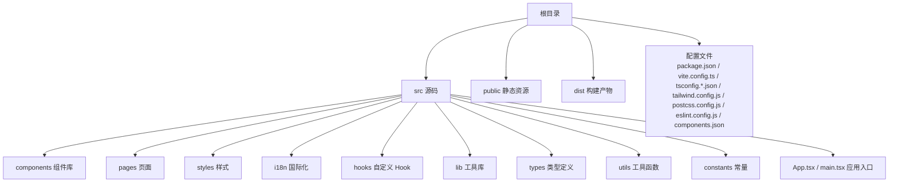
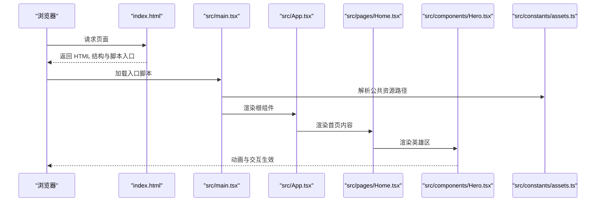
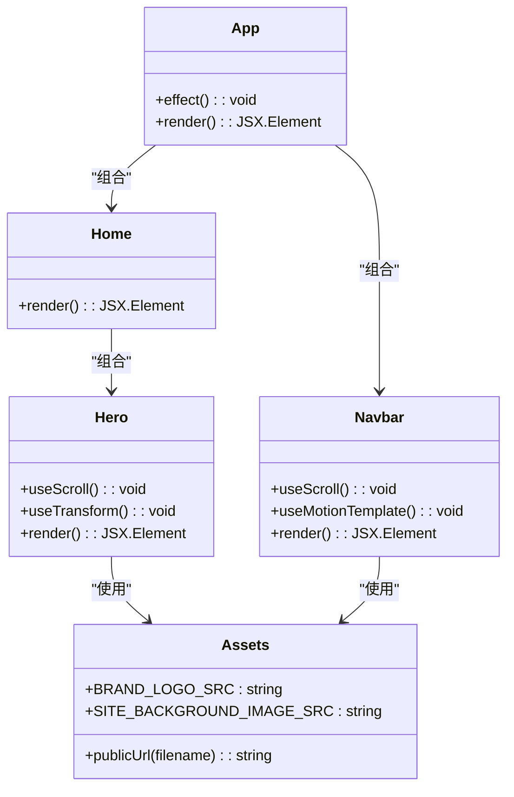
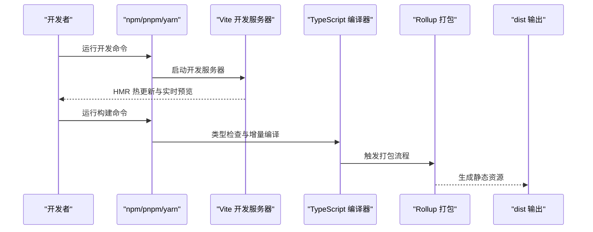

# 快速开始

<cite>
**本文引用的文件**
- [package.json](file://package.json)
- [README.md](file://README.md)
- [vite.config.ts](file://vite.config.ts)
- [tsconfig.json](file://tsconfig.json)
- [tsconfig.app.json](file://tsconfig.app.json)
- [tsconfig.node.json](file://tsconfig.node.json)
- [tailwind.config.js](file://tailwind.config.js)
- [postcss.config.js](file://postcss.config.js)
- [eslint.config.js](file://eslint.config.js)
- [components.json](file://components.json)
- [index.html](file://index.html)
- [src/main.tsx](file://src/main.tsx)
- [src/App.tsx](file://src/App.tsx)
- [src/pages/Home.tsx](file://src/pages/Home.tsx)
- [src/components/Hero.tsx](file://src/components/Hero.tsx)
- [src/components/Navbar.tsx](file://src/components/Navbar.tsx)
- [src/constants/assets.ts](file://src/constants/assets.ts)
</cite>

## 目录
1. [简介](#简介)
2. [项目结构](#项目结构)
3. [核心组件](#核心组件)
4. [架构总览](#架构总览)
5. [详细组件分析](#详细组件分析)
6. [依赖分析](#依赖分析)
7. [性能考虑](#性能考虑)
8. [故障排除指南](#故障排除指南)
9. [结论](#结论)
10. [附录](#附录)

## 简介
本指南面向初学者，帮助你在最短时间内完成 MinLL 项目的环境准备、依赖安装、本地运行、构建与部署准备。项目采用 React + TypeScript + Vite 技术栈，并集成 TailwindCSS、Framer Motion、Radix UI 组件等生态工具，提供现代化的前端开发体验。

## 项目结构
MinLL 项目遵循“按功能分层”的组织方式，核心目录与职责如下：
- src：源代码根目录，包含页面、组件、样式、国际化、类型定义、工具函数等
- public：静态资源目录（图标、图片等），通过 Vite 的 base 配置在部署时自动拼接路径前缀
- dist：构建产物输出目录
- 配置文件：package.json、vite.config.ts、tsconfig.*.json、tailwind.config.js、postcss.config.js、eslint.config.js、components.json 等

**图表来源**
- [vite.config.ts:1-26](file://vite.config.ts#L1-L26)
- [tsconfig.json:1-17](file://tsconfig.json#L1-L17)
- [tsconfig.app.json:1-35](file://tsconfig.app.json#L1-L35)
- [tsconfig.node.json:1-27](file://tsconfig.node.json#L1-L27)
- [tailwind.config.js:1-84](file://tailwind.config.js#L1-L84)
- [postcss.config.js:1-7](file://postcss.config.js#L1-L7)
- [eslint.config.js:1-24](file://eslint.config.js#L1-L24)
- [components.json:1-23](file://components.json#L1-L23)

**章节来源**
- [vite.config.ts:1-26](file://vite.config.ts#L1-L26)
- [tsconfig.json:1-17](file://tsconfig.json#L1-L17)
- [tsconfig.app.json:1-35](file://tsconfig.app.json#L1-L35)
- [tsconfig.node.json:1-27](file://tsconfig.node.json#L1-L27)
- [tailwind.config.js:1-84](file://tailwind.config.js#L1-L84)
- [postcss.config.js:1-7](file://postcss.config.js#L1-L7)
- [eslint.config.js:1-24](file://eslint.config.js#L1-L24)
- [components.json:1-23](file://components.json#L1-L23)

## 核心组件
- 应用入口与挂载
  - 入口脚本负责注入站点背景图变量、引入全局样式并渲染根组件
  - 参考路径：[src/main.tsx:1-18](file://src/main.tsx#L1-L18)
- 应用根组件
  - 负责监听鼠标/触控事件，动态更新视口高亮位置，组合导航栏、首页内容与背景动效
  - 参考路径：[src/App.tsx:1-70](file://src/App.tsx#L1-L70)
- 首页页面
  - 组合英雄区、相册与页脚组件，承载页面主体内容
  - 参考路径：[src/pages/Home.tsx:1-15](file://src/pages/Home.tsx#L1-L15)
- 英雄区组件
  - 使用 Framer Motion 实现滚动联动与字符级动画，支持系统“减少动态”偏好
  - 参考路径：[src/components/Hero.tsx:1-316](file://src/components/Hero.tsx#L1-L316)
- 导航栏组件
  - 基于滚动变换实现视觉效果，结合磁力弹簧与动画库增强交互
  - 参考路径：[src/components/Navbar.tsx:1-111](file://src/components/Navbar.tsx#L1-L111)
- 资源常量
  - 通过公共路径解析函数统一处理 public 资源在不同部署前缀下的访问
  - 参考路径：[src/constants/assets.ts:1-24](file://src/constants/assets.ts#L1-L24)

**章节来源**
- [src/main.tsx:1-18](file://src/main.tsx#L1-L18)
- [src/App.tsx:1-70](file://src/App.tsx#L1-L70)
- [src/pages/Home.tsx:1-15](file://src/pages/Home.tsx#L1-L15)
- [src/components/Hero.tsx:1-316](file://src/components/Hero.tsx#L1-L316)
- [src/components/Navbar.tsx:1-111](file://src/components/Navbar.tsx#L1-L111)
- [src/constants/assets.ts:1-24](file://src/constants/assets.ts#L1-L24)

## 架构总览
下图展示了从浏览器加载到应用渲染的关键流程，以及与构建、样式与国际化模块的协作关系。

**图表来源**
- [index.html:1-21](file://index.html#L1-L21)
- [src/main.tsx:1-18](file://src/main.tsx#L1-L18)
- [src/App.tsx:1-70](file://src/App.tsx#L1-L70)
- [src/pages/Home.tsx:1-15](file://src/pages/Home.tsx#L1-L15)
- [src/components/Hero.tsx:1-316](file://src/components/Hero.tsx#L1-L316)
- [src/constants/assets.ts:1-24](file://src/constants/assets.ts#L1-L24)

## 详细组件分析

### 组件类图（代码级）

**图表来源**
- [src/App.tsx:1-70](file://src/App.tsx#L1-L70)
- [src/pages/Home.tsx:1-15](file://src/pages/Home.tsx#L1-L15)
- [src/components/Hero.tsx:1-316](file://src/components/Hero.tsx#L1-L316)
- [src/components/Navbar.tsx:1-111](file://src/components/Navbar.tsx#L1-L111)
- [src/constants/assets.ts:1-24](file://src/constants/assets.ts#L1-L24)

**章节来源**
- [src/App.tsx:1-70](file://src/App.tsx#L1-L70)
- [src/pages/Home.tsx:1-15](file://src/pages/Home.tsx#L1-L15)
- [src/components/Hero.tsx:1-316](file://src/components/Hero.tsx#L1-L316)
- [src/components/Navbar.tsx:1-111](file://src/components/Navbar.tsx#L1-L111)
- [src/constants/assets.ts:1-24](file://src/constants/assets.ts#L1-L24)

### API/服务组件调用序列（概念性）
以下序列图展示“本地开发启动”和“构建发布”的典型流程，便于理解命令与工具链之间的关系。

[此图为概念流程示意，不直接映射具体源码文件，故无图表来源]

## 依赖分析
- 包管理与脚本
  - 项目提供开发、构建、预览与部署相关脚本，建议优先使用 pnpm（仓库同时包含 pnpm 锁定文件）
  - 参考路径：[package.json:6-12](file://package.json#L6-L12)
- 依赖与开发依赖
  - 生产依赖覆盖 React 生态、UI 组件库（Radix UI）、动画（Framer Motion）、图表（Recharts）等
  - 开发依赖覆盖 Vite、TypeScript、TailwindCSS、ESLint 等
  - 参考路径：[package.json:13-82](file://package.json#L13-L82)
- TypeScript 多配置
  - 通过 tsconfig.json 引用 app 与 node 两套配置，分别用于应用与工具链
  - 参考路径：[tsconfig.json:1-17](file://tsconfig.json#L1-L17)，[tsconfig.app.json:1-35](file://tsconfig.app.json#L1-L35)，[tsconfig.node.json:1-27](file://tsconfig.node.json#L1-L27)
- 样式与工具链
  - TailwindCSS 与 PostCSS 配合，PostCSS 插件启用 TailwindCSS 与 Autoprefixer
  - 参考路径：[tailwind.config.js:1-84](file://tailwind.config.js#L1-L84)，[postcss.config.js:1-7](file://postcss.config.js#L1-L7)
- ESLint 配置
  - 推荐开启类型感知规则与 React Hooks、React Refresh 相关规则
  - 参考路径：[eslint.config.js:1-24](file://eslint.config.js#L1-L24)
- UI 组件库配置
  - shadcn/ui 配置文件，定义样式风格、TSX、Tailwind 参数与别名
  - 参考路径：[components.json:1-23](file://components.json#L1-L23)

**章节来源**
- [package.json:6-12](file://package.json#L6-L12)
- [package.json:13-82](file://package.json#L13-L82)
- [tsconfig.json:1-17](file://tsconfig.json#L1-L17)
- [tsconfig.app.json:1-35](file://tsconfig.app.json#L1-L35)
- [tsconfig.node.json:1-27](file://tsconfig.node.json#L1-L27)
- [tailwind.config.js:1-84](file://tailwind.config.js#L1-L84)
- [postcss.config.js:1-7](file://postcss.config.js#L1-L7)
- [eslint.config.js:1-24](file://eslint.config.js#L1-L24)
- [components.json:1-23](file://components.json#L1-L23)

## 性能考虑
- 构建分包策略
  - 通过 Rollup 的 manualChunks 将 React 与 React DOM 单独拆分为 vendor 分包，提升缓存命中率
  - 参考路径：[vite.config.ts:17-23](file://vite.config.ts#L17-L23)
- 路径别名与模块解析
  - 配置 @/* 别名与 bundler 模式，减少路径解析开销，提升开发与构建效率
  - 参考路径：[vite.config.ts:9-13](file://vite.config.ts#L9-L13)，[tsconfig.app.json:12-16](file://tsconfig.app.json#L12-L16)
- 减少动态与无障碍优化
  - 组件中对系统“减少动态”偏好进行适配，避免不必要的动画消耗
  - 参考路径：[src/components/Hero.tsx:26](file://src/components/Hero.tsx#L26)，[src/components/Navbar.tsx:14](file://src/components/Navbar.tsx#L14)

**章节来源**
- [vite.config.ts:9-23](file://vite.config.ts#L9-L23)
- [tsconfig.app.json:12-16](file://tsconfig.app.json#L12-L16)
- [src/components/Hero.tsx:26](file://src/components/Hero.tsx#L26)
- [src/components/Navbar.tsx:14](file://src/components/Navbar.tsx#L14)

## 故障排除指南
- 无法启动开发服务器或端口被占用
  - 检查本地是否已有占用默认端口的服务；可调整 Vite 端口或终止冲突进程
  - 参考路径：[vite.config.ts:7](file://vite.config.ts#L7)
- 构建失败或找不到模块
  - 确认已安装依赖且使用与仓库一致的包管理器；若混用请清理锁文件后重新安装
  - 参考路径：[package.json:6-12](file://package.json#L6-L12)
- 样式未生效或 Tailwind 未扫描到组件
  - 确保 content 路径包含 src 下的组件文件；检查 postcss.config.js 中插件配置
  - 参考路径：[tailwind.config.js:4](file://tailwind.config.js#L4)，[postcss.config.js:1-7](file://postcss.config.js#L1-L7)
- 静态资源路径错误（如图片 404）
  - 在 public 中放置资源，并通过公共路径解析函数生成带 base 前缀的 URL
  - 参考路径：[src/constants/assets.ts:1-6](file://src/constants/assets.ts#L1-L6)，[vite.config.ts:7](file://vite.config.ts#L7)
- ESLint 报错或类型检查异常
  - 按 README 推荐启用类型感知规则，并确保 tsconfig 引用正确
  - 参考路径：[README.md:14-44](file://README.md#L14-L44)，[tsconfig.json:3-10](file://tsconfig.json#L3-L10)

**章节来源**
- [vite.config.ts:7](file://vite.config.ts#L7)
- [package.json:6-12](file://package.json#L6-L12)
- [tailwind.config.js:4](file://tailwind.config.js#L4)
- [postcss.config.js:1-7](file://postcss.config.js#L1-L7)
- [src/constants/assets.ts:1-6](file://src/constants/assets.ts#L1-L6)
- [README.md:14-44](file://README.md#L14-L44)
- [tsconfig.json:3-10](file://tsconfig.json#L3-L10)

## 结论
通过本指南，你可以在本地快速完成 MinLL 项目的环境准备与运行。建议优先使用 pnpm 并严格遵循配置文件中的路径与别名约定；在开发过程中充分利用 Vite 的热更新与 TypeScript 的类型安全能力；在构建与部署前确保样式与资源路径正确、依赖完整。

## 附录

### 环境要求与安装步骤
- Node.js 版本
  - 项目使用 TypeScript 与 Vite，建议使用长期支持版本（LTS）。具体版本范围可参考开发依赖中的 TypeScript 与 Vite 版本约束
  - 参考路径：[package.json:79](file://package.json#L79)，[package.json:81](file://package.json#L81)
- 包管理器选择
  - 仓库同时包含 pnpm 锁定文件，推荐使用 pnpm 以获得更稳定的依赖解析与更快的安装速度
  - 参考路径：[pnpm-lock.yaml](file://pnpm-lock.yaml)
- 安装依赖
  - 在项目根目录执行安装命令（如使用 pnpm）
  - 参考路径：[package.json:6-12](file://package.json#L6-L12)

**章节来源**
- [package.json:79](file://package.json#L79)
- [package.json:81](file://package.json#L81)
- [pnpm-lock.yaml](file://pnpm-lock.yaml)
- [package.json:6-12](file://package.json#L6-L12)

### 开发环境搭建
- 启动本地开发
  - 使用开发脚本启动 Vite 开发服务器，支持热更新与类型检查
  - 参考路径：[package.json:7](file://package.json#L7)，[vite.config.ts:7](file://vite.config.ts#L7)
- 本地预览
  - 使用预览脚本在本地启动静态服务器，验证构建产物
  - 参考路径：[package.json:10](file://package.json#L10)

**章节来源**
- [package.json:7](file://package.json#L7)
- [vite.config.ts:7](file://vite.config.ts#L7)
- [package.json:10](file://package.json#L10)

### 构建与部署准备
- 构建命令
  - 先执行类型检查与增量编译，再触发 Vite 打包生成 dist
  - 参考路径：[package.json:8](file://package.json#L8)，[vite.config.ts:14-24](file://vite.config.ts#L14-L24)
- 部署准备
  - 项目提供 gh-pages 部署脚本，需先构建再推送至分支
  - 参考路径：[package.json:11](file://package.json#L11)
- 资源路径与前缀
  - 通过 Vite base 配置与公共路径解析函数，确保在子路径（如 GitHub Pages）下资源可正确加载
  - 参考路径：[vite.config.ts:7](file://vite.config.ts#L7)，[src/constants/assets.ts:1-6](file://src/constants/assets.ts#L1-L6)

**章节来源**
- [package.json:8](file://package.json#L8)
- [vite.config.ts:14-24](file://vite.config.ts#L14-L24)
- [package.json:11](file://package.json#L11)
- [vite.config.ts:7](file://vite.config.ts#L7)
- [src/constants/assets.ts:1-6](file://src/constants/assets.ts#L1-L6)

### 配置文件作用与基本设置
- package.json
  - 定义项目元信息、脚本、依赖与开发依赖
  - 参考路径：[package.json:1-84](file://package.json#L1-L84)
- vite.config.ts
  - 配置基础路径、插件、别名与构建分包策略
  - 参考路径：[vite.config.ts:1-26](file://vite.config.ts#L1-L26)
- tsconfig.json / tsconfig.app.json / tsconfig.node.json
  - 组合式多配置，分别用于应用与工具链的类型检查与模块解析
  - 参考路径：[tsconfig.json:1-17](file://tsconfig.json#L1-L17)，[tsconfig.app.json:1-35](file://tsconfig.app.json#L1-L35)，[tsconfig.node.json:1-27](file://tsconfig.node.json#L1-L27)
- tailwind.config.js
  - TailwindCSS 主题、颜色、动画与插件配置
  - 参考路径：[tailwind.config.js:1-84](file://tailwind.config.js#L1-L84)
- postcss.config.js
  - PostCSS 插件启用顺序与参数
  - 参考路径：[postcss.config.js:1-7](file://postcss.config.js#L1-L7)
- eslint.config.js
  - ESLint 推荐规则与语言选项
  - 参考路径：[eslint.config.js:1-24](file://eslint.config.js#L1-L24)
- components.json
  - UI 组件库（shadcn/ui）的样式与别名配置
  - 参考路径：[components.json:1-23](file://components.json#L1-L23)
- index.html
  - 页面模板与字体资源链接
  - 参考路径：[index.html:1-21](file://index.html#L1-L21)

**章节来源**
- [package.json:1-84](file://package.json#L1-L84)
- [vite.config.ts:1-26](file://vite.config.ts#L1-L26)
- [tsconfig.json:1-17](file://tsconfig.json#L1-L17)
- [tsconfig.app.json:1-35](file://tsconfig.app.json#L1-L35)
- [tsconfig.node.json:1-27](file://tsconfig.node.json#L1-L27)
- [tailwind.config.js:1-84](file://tailwind.config.js#L1-L84)
- [postcss.config.js:1-7](file://postcss.config.js#L1-L7)
- [eslint.config.js:1-24](file://eslint.config.js#L1-L24)
- [components.json:1-23](file://components.json#L1-L23)
- [index.html:1-21](file://index.html#L1-L21)