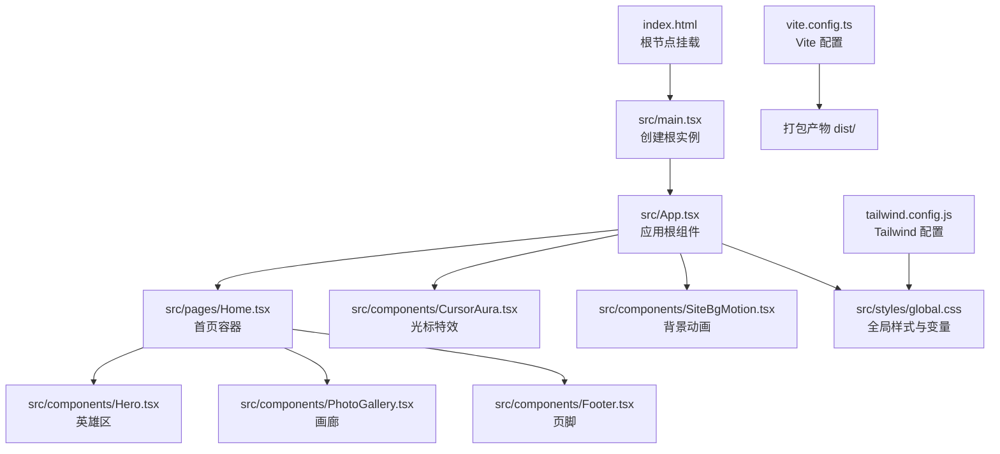
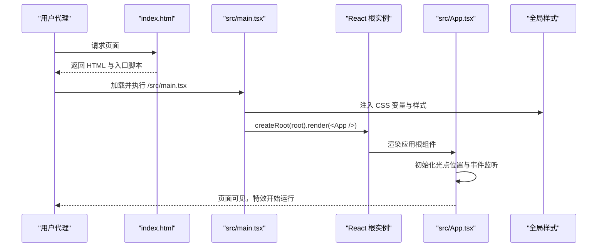
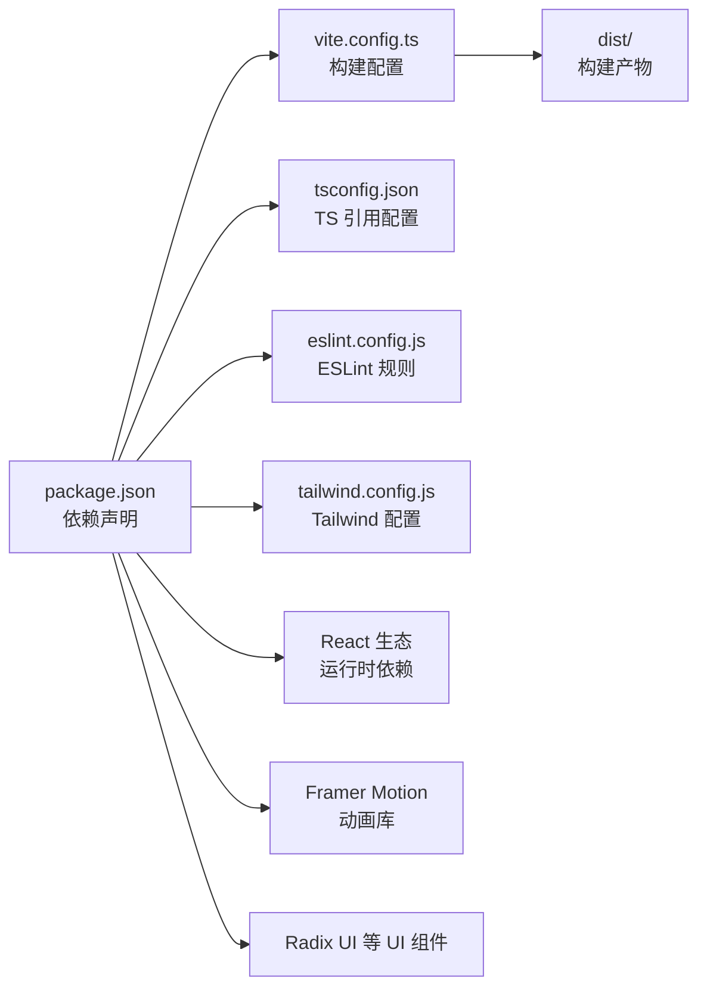
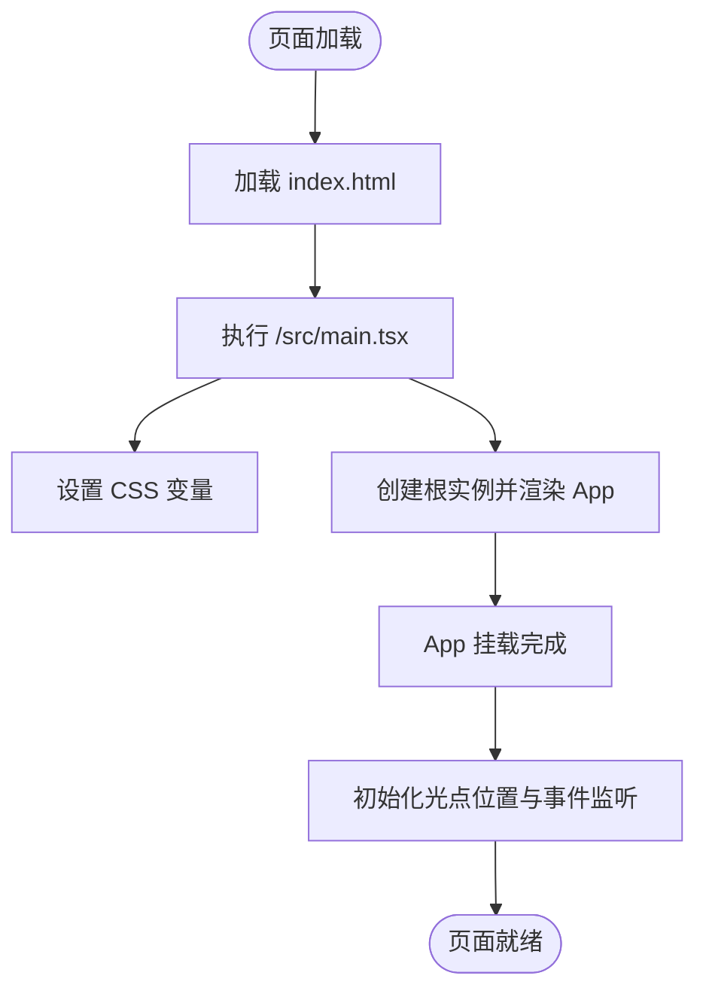

# 故障排除与常见问题

<cite>
**本文引用的文件**
- [package.json](file://package.json)
- [vite.config.ts](file://vite.config.ts)
- [tailwind.config.js](file://tailwind.config.js)
- [eslint.config.js](file://eslint.config.js)
- [README.md](file://README.md)
- [src/App.tsx](file://src/App.tsx)
- [src/main.tsx](file://src/main.tsx)
- [src/pages/Home.tsx](file://src/pages/Home.tsx)
- [src/components/CursorAura.tsx](file://src/components/CursorAura.tsx)
- [src/components/SiteBgMotion.tsx](file://src/components/SiteBgMotion.tsx)
- [src/styles/global.css](file://src/styles/global.css)
- [src/styles/Home.css](file://src/styles/Home.css)
- [src/hooks/use-mobile.ts](file://src/hooks/use-mobile.ts)
- [index.html](file://index.html)
- [tsconfig.json](file://tsconfig.json)
</cite>

## 目录
1. [简介](#简介)
2. [项目结构](#项目结构)
3. [核心组件](#核心组件)
4. [架构总览](#架构总览)
5. [详细组件分析](#详细组件分析)
6. [依赖关系分析](#依赖关系分析)
7. [性能注意事项](#性能注意事项)
8. [故障排除指南](#故障排除指南)
9. [结论](#结论)
10. [附录](#附录)

## 简介
本文件面向 MinLL 项目开发者与维护者，提供系统化的故障排除与常见问题解决方案。内容覆盖环境配置、依赖冲突、构建失败、性能瓶颈、内存泄漏风险、渲染优化、浏览器与移动端兼容性、响应式调试以及日志与工具使用建议。所有建议均基于仓库现有配置与代码实现进行归纳总结。

## 项目结构
MinLL 是一个基于 React 19、TypeScript、Vite 与 TailwindCSS 的前端项目。核心入口在 HTML 中挂载到根节点，并通过 React 根实例渲染应用。全局样式与主题变量通过 CSS 变量与 Tailwind 扩展统一管理；页面由首页组件组织，包含导航栏、英雄区、画廊与页脚等模块。

图表来源
- [index.html](file://index.html)
- [src/main.tsx](file://src/main.tsx)
- [src/App.tsx](file://src/App.tsx)
- [src/pages/Home.tsx](file://src/pages/Home.tsx)
- [src/components/CursorAura.tsx](file://src/components/CursorAura.tsx)
- [src/components/SiteBgMotion.tsx](file://src/components/SiteBgMotion.tsx)
- [src/styles/global.css](file://src/styles/global.css)
- [vite.config.ts](file://vite.config.ts)
- [tailwind.config.js](file://tailwind.config.js)

章节来源
- [index.html](file://index.html)
- [src/main.tsx](file://src/main.tsx)
- [src/App.tsx](file://src/App.tsx)
- [src/pages/Home.tsx](file://src/pages/Home.tsx)
- [vite.config.ts](file://vite.config.ts)
- [tailwind.config.js](file://tailwind.config.js)

## 核心组件
- 应用根组件负责设置全局 CSS 变量（如光点位置与站点背景图）、注册窗口事件监听（鼠标移动、触摸、窗口尺寸变化）并渲染顶层布局与特效层。
- 光标特效组件使用 Framer Motion 的受控值与弹簧系统，按帧更新光标位置，并尊重“减少动态”偏好设置。
- 背景动画组件使用循环动画与混合模式，营造柔和的背景流动效果，同样尊重“减少动态”偏好设置。
- 全局样式集中定义了字体、滚动条、链接、按钮、占位符、图片、媒体查询与关键动画，同时提供“减少动态”降级策略。

章节来源
- [src/App.tsx](file://src/App.tsx)
- [src/components/CursorAura.tsx](file://src/components/CursorAura.tsx)
- [src/components/SiteBgMotion.tsx](file://src/components/SiteBgMotion.tsx)
- [src/styles/global.css](file://src/styles/global.css)

## 架构总览
下图展示从浏览器加载到页面渲染的关键流程，包括入口脚本、React 渲染、样式注入与特效初始化。

图表来源
- [index.html](file://index.html)
- [src/main.tsx](file://src/main.tsx)
- [src/App.tsx](file://src/App.tsx)
- [src/styles/global.css](file://src/styles/global.css)

## 详细组件分析

### 组件：App（应用根）
- 功能要点
  - 在挂载时读取根元素并设置 CSS 变量（光点坐标）。
  - 使用 requestAnimationFrame 防抖处理鼠标移动与触摸事件，避免高频重排。
  - 在窗口尺寸变化时重置光点至中心。
  - 卸载时清理事件与动画帧，防止内存泄漏。
- 常见问题
  - 光点不跟随或闪烁：检查事件绑定是否被提前移除、RAF 是否被正确取消。
  - 切换路由后特效失效：确认根组件未被卸载，且事件监听在正确的生命周期内注册。
- 性能建议
  - 将计算量集中在 RAF 回调中，避免在渲染阶段做大量计算。
  - 对于高密度交互场景，可考虑节流而非取消所有 RAF。

章节来源
- [src/App.tsx](file://src/App.tsx)

### 组件：CursorAura（光标特效）
- 功能要点
  - 使用受控值与弹簧系统平滑跟随指针。
  - 监听鼠标移动与离开视口事件，离开时回中心。
  - 尊重系统“减少动态”偏好，自动降级。
- 常见问题
  - 特效不显示：确认未启用“减少动态”，检查根元素 CSS 变量是否生效。
  - 指针不同步：检查 RAF 与事件绑定顺序，确保在每次移动时更新受控值。
- 性能建议
  - 控制容器尺寸与模糊半径，避免过度滤镜开销。
  - 在低端设备上可降低弹簧刚度或质量参数。

章节来源
- [src/components/CursorAura.tsx](file://src/components/CursorAura.tsx)

### 组件：SiteBgMotion（背景动画）
- 功能要点
  - 多个圆形背景块以不同幅度与周期循环运动，叠加噪声闪烁。
  - 使用无限重复与缓动函数，营造柔和流动感。
- 常见问题
  - 动画卡顿：检查设备性能与浏览器对滤镜/混合模式的支持。
  - “减少动态”开启后仍出现动画：确认组件已正确读取系统偏好。
- 性能建议
  - 合理设置滤镜模糊半径与透明度，避免过高的 GPU 开销。
  - 在低端设备上可减少动画数量或缩短持续时间。

章节来源
- [src/components/SiteBgMotion.tsx](file://src/components/SiteBgMotion.tsx)

### 样式：global.css（全局样式与变量）
- 功能要点
  - 定义基础排版、滚动条、链接、按钮、输入占位符与图片默认样式。
  - 提供关键动画与媒体查询，支持“减少动态”降级。
  - 通过 CSS 变量统一主题色与圆角半径，便于 Tailwind 扩展映射。
- 常见问题
  - 字体加载慢导致闪烁：确认预连接与字体加载策略。
  - 滚动条样式不一致：检查浏览器默认样式覆盖与暗色模式切换。
- 性能建议
  - 避免在全局样式中使用昂贵的滤镜或混合模式。
  - 使用 Tailwind 工具类替代复杂选择器，提升编译效率。

章节来源
- [src/styles/global.css](file://src/styles/global.css)

### 页面：Home（首页容器）
- 功能要点
  - 组织 Hero、PhotoGallery、Footer 三大区域，承载页面主体内容。
- 常见问题
  - 区域高度异常：检查容器最小高度与 Flex 布局设置。
  - 内容溢出：确认父容器的溢出控制与滚动行为。

章节来源
- [src/pages/Home.tsx](file://src/pages/Home.tsx)
- [src/styles/Home.css](file://src/styles/Home.css)

### Hook：useIsMobile（移动端断点）
- 功能要点
  - 基于媒体查询与窗口宽度判断是否为移动端，便于条件渲染与样式调整。
- 常见问题
  - 断点不准确：确认断点常量与媒体查询匹配，注意 CSS 像素与设备像素差异。
- 性能建议
  - 将断点逻辑封装为稳定 Hook，避免重复计算。

章节来源
- [src/hooks/use-mobile.ts](file://src/hooks/use-mobile.ts)

## 依赖关系分析
- 构建与开发
  - Vite 作为开发服务器与打包工具，配置别名与分包策略，输出到 dist 目录。
  - TypeScript 采用多项目引用配置，分别针对应用与 Node 环境。
  - ESLint 与 TypeScript ESLint 提供类型感知规则与 React Hooks 规则。
- 运行时
  - React 19 与 React DOM 19 提供渲染能力。
  - Framer Motion 用于高性能动画与受控值。
  - Radix UI 与多种 UI 组件库提供语义化与无障碍支持。
  - TailwindCSS 与扩展插件提供原子化样式与动画。

图表来源
- [package.json](file://package.json)
- [vite.config.ts](file://vite.config.ts)
- [tsconfig.json](file://tsconfig.json)
- [eslint.config.js](file://eslint.config.js)
- [tailwind.config.js](file://tailwind.config.js)

章节来源
- [package.json](file://package.json)
- [vite.config.ts](file://vite.config.ts)
- [tsconfig.json](file://tsconfig.json)
- [eslint.config.js](file://eslint.config.js)
- [tailwind.config.js](file://tailwind.config.js)

## 性能注意事项
- 动画与渲染
  - 使用 requestAnimationFrame 防抖事件回调，避免频繁重绘。
  - Framer Motion 的弹簧参数应根据设备性能调整，必要时降低质量或刚度。
  - 背景动画与滤镜组合可能带来 GPU 压力，建议在低端设备上减少数量或强度。
- 样式与主题
  - CSS 变量与 Tailwind 扩展配合，避免重复定义与深层嵌套。
  - “减少动态”降级路径已在组件中内置，确保低功耗体验。
- 构建与分包
  - Vite 配置中对 vendor 进行手动分包，有助于缓存与加载性能。
  - 注意 base 路径与部署前缀，避免静态资源 404。

章节来源
- [src/App.tsx](file://src/App.tsx)
- [src/components/CursorAura.tsx](file://src/components/CursorAura.tsx)
- [src/components/SiteBgMotion.tsx](file://src/components/SiteBgMotion.tsx)
- [src/styles/global.css](file://src/styles/global.css)
- [vite.config.ts](file://vite.config.ts)

## 故障排除指南

### 环境与安装
- 症状：安装依赖报错或版本冲突
  - 排查：优先使用锁定文件（package-lock 或 pnpm-lock）保证一致性；若存在冲突，清理缓存后重装。
  - 参考：依赖声明与开发依赖范围。
- 症状：TypeScript 类型检查失败
  - 排查：确认 tsconfig 引用配置正确，应用与 Node 环境的 tsconfig 分别指向对应文件。
  - 参考：多项目引用配置与路径别名。

章节来源
- [package.json](file://package.json)
- [tsconfig.json](file://tsconfig.json)

### 构建与部署
- 症状：构建失败或产物缺失
  - 排查：检查 Vite 配置中的输出目录与分包策略；确认 TypeScript 编译先行。
  - 参考：构建脚本与 Rollup 输出配置。
- 症状：预览或部署后资源 404
  - 排查：核对 base 路径与部署前缀；确保静态资源目录与引用路径一致。
  - 参考：Vite base 与 dist 结构。

章节来源
- [package.json](file://package.json)
- [vite.config.ts](file://vite.config.ts)

### 浏览器与兼容性
- 症状：动画不显示或异常
  - 排查：确认未启用“减少动态”；检查混合模式与滤镜在目标浏览器的支持情况。
  - 参考：组件对系统偏好的处理与样式降级。
- 症状：移动端布局错乱
  - 排查：使用断点 Hook 判断当前设备状态；检查媒体查询与视口设置。
  - 参考：移动端断点与样式媒体查询。

章节来源
- [src/components/CursorAura.tsx](file://src/components/CursorAura.tsx)
- [src/components/SiteBgMotion.tsx](file://src/components/SiteBgMotion.tsx)
- [src/styles/global.css](file://src/styles/global.css)
- [src/hooks/use-mobile.ts](file://src/hooks/use-mobile.ts)

### 日志与调试
- 日志定位
  - 构建日志：查看 Vite 输出与 TypeScript 编译进度；关注警告与错误堆栈。
  - 运行时日志：在关键事件回调（如鼠标移动、触摸、窗口尺寸变化）添加轻量日志，确认触发频率与参数。
- 调试工具
  - 浏览器性能面板：观察动画帧率、合成层与重绘热点。
  - React DevTools：检查组件树与渲染次数，定位不必要的重渲染。
  - ESLint：启用类型感知规则，提前发现潜在类型问题。

章节来源
- [eslint.config.js](file://eslint.config.js)
- [README.md](file://README.md)

### 常见问题与案例
- 案例：光点不跟随
  - 步骤：确认事件监听是否在根组件挂载后注册；检查 RAF 是否被频繁取消；验证 CSS 变量是否更新。
  - 预防：将事件处理逻辑收敛到单一副作用中，统一清理。
- 案例：背景动画卡顿
  - 步骤：降低滤镜模糊半径或透明度；减少动画数量；在低端设备上禁用部分动画。
  - 预防：在开发阶段使用性能面板监控帧率，逐步优化。
- 案例：移动端点击无反馈
  - 步骤：检查断点判断逻辑与媒体查询；确认按钮样式与触摸目标大小。
  - 预防：使用语义化标签与合适的触摸目标尺寸。

章节来源
- [src/App.tsx](file://src/App.tsx)
- [src/components/SiteBgMotion.tsx](file://src/components/SiteBgMotion.tsx)
- [src/hooks/use-mobile.ts](file://src/hooks/use-mobile.ts)

## 结论
本指南基于项目现有配置与代码实现，提供了从环境、构建、运行到性能与兼容性的系统化排查思路。建议在开发与发布流程中遵循“先本地验证、再构建预览、最后部署上线”的原则，并结合性能面板与 ESLint 规则，持续优化用户体验与稳定性。

## 附录

### 关键流程：页面渲染与特效初始化

图表来源
- [index.html](file://index.html)
- [src/main.tsx](file://src/main.tsx)
- [src/App.tsx](file://src/App.tsx)