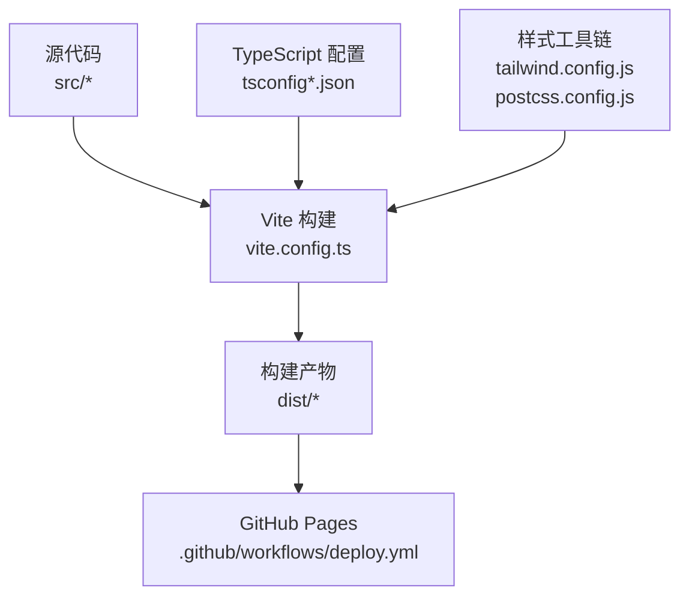
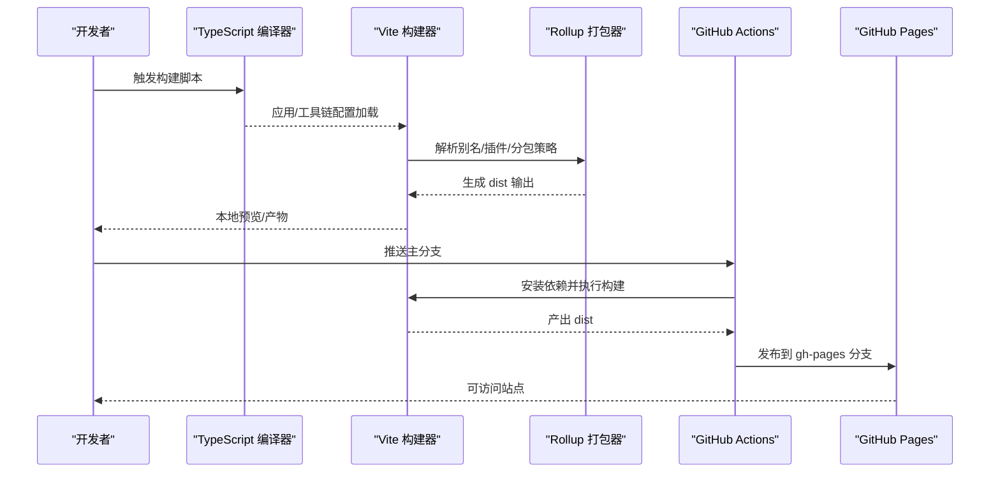
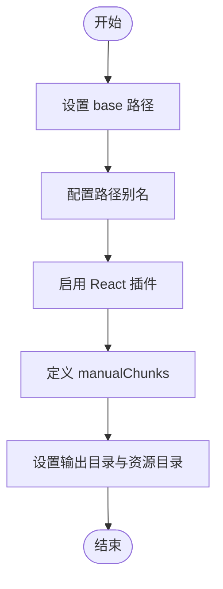
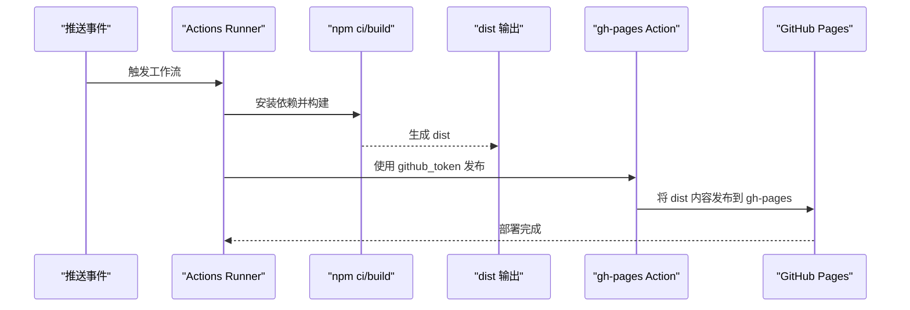
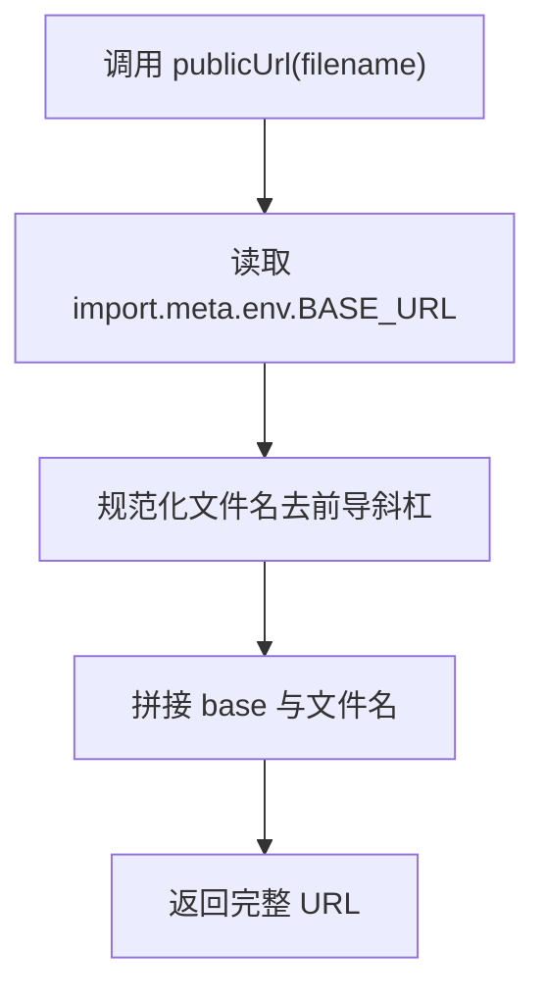
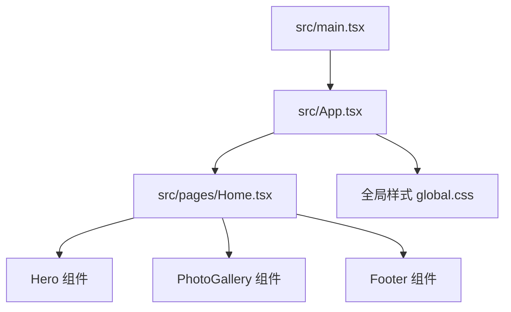
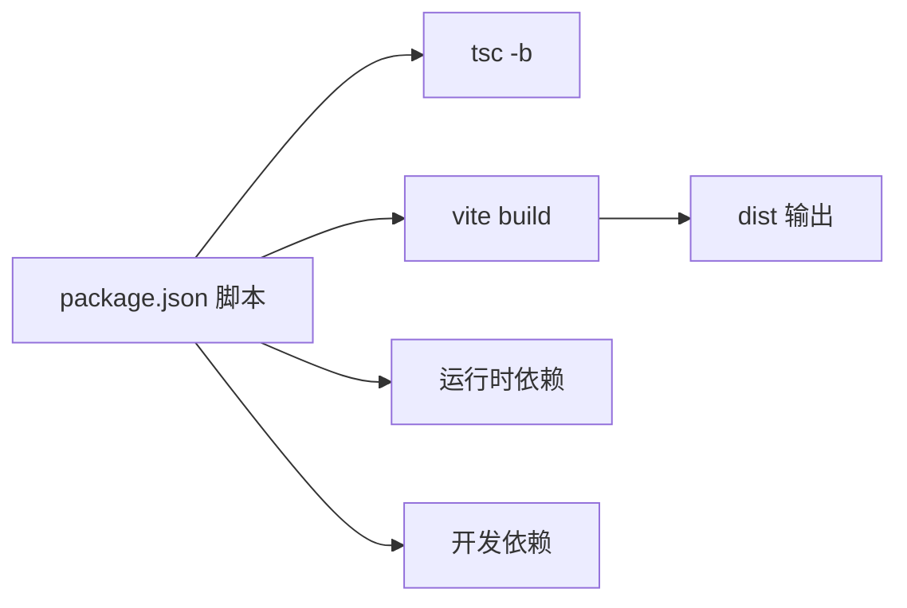

# 构建与部署

<cite>
**本文引用的文件**
- [vite.config.ts](file://vite.config.ts)
- [package.json](file://package.json)
- [tsconfig.json](file://tsconfig.json)
- [tsconfig.app.json](file://tsconfig.app.json)
- [tsconfig.node.json](file://tsconfig.node.json)
- [.github/workflows/deploy.yml](file://.github/workflows/deploy.yml)
- [postcss.config.js](file://postcss.config.js)
- [tailwind.config.js](file://tailwind.config.js)
- [eslint.config.js](file://eslint.config.js)
- [index.html](file://index.html)
- [src/main.tsx](file://src/main.tsx)
- [src/App.tsx](file://src/App.tsx)
- [src/constants/assets.ts](file://src/constants/assets.ts)
- [src/pages/Home.tsx](file://src/pages/Home.tsx)
- [src/styles/global.css](file://src/styles/global.css)
- [README.md](file://README.md)
</cite>

## 目录
1. [简介](#简介)
2. [项目结构](#项目结构)
3. [核心组件](#核心组件)
4. [架构总览](#架构总览)
5. [详细组件分析](#详细组件分析)
6. [依赖关系分析](#依赖关系分析)
7. [性能考虑](#性能考虑)
8. [故障排除指南](#故障排除指南)
9. [结论](#结论)
10. [附录](#附录)

## 简介
本文件面向 MinLL 项目的构建与部署，系统性梳理 Vite 构建配置、TypeScript 多配置文件体系、代码分割策略、GitHub Pages 自动化部署流程与 CI/CD 配置，并给出生产环境优化、性能监控与错误追踪建议、缓存策略与 CDN 集成思路、部署拓扑与 HTTPS 配置要点，以及回滚策略与常见问题排查方法。内容以仓库现有配置为基础，结合实际可落地的最佳实践进行说明。

## 项目结构
MinLL 采用 Vite + React + TypeScript 技术栈，使用多配置文件组织 TypeScript 编译目标，配合 TailwindCSS 与 PostCSS 进行样式处理；前端资源通过 Vite 打包输出至 dist 目录，使用 GitHub Actions 将 dist 部署到 GitHub Pages 的 gh-pages 分支。



图表来源
- [vite.config.ts:1-26](file://vite.config.ts#L1-L26)
- [tsconfig.json:1-17](file://tsconfig.json#L1-L17)
- [tsconfig.app.json:1-35](file://tsconfig.app.json#L1-L35)
- [tsconfig.node.json:1-27](file://tsconfig.node.json#L1-L27)
- [tailwind.config.js:1-84](file://tailwind.config.js#L1-L84)
- [postcss.config.js:1-7](file://postcss.config.js#L1-L7)
- [.github/workflows/deploy.yml:1-34](file://.github/workflows/deploy.yml#L1-L34)

章节来源
- [vite.config.ts:1-26](file://vite.config.ts#L1-L26)
- [tsconfig.json:1-17](file://tsconfig.json#L1-L17)
- [tsconfig.app.json:1-35](file://tsconfig.app.json#L1-L35)
- [tsconfig.node.json:1-27](file://tsconfig.node.json#L1-L27)
- [tailwind.config.js:1-84](file://tailwind.config.js#L1-L84)
- [postcss.config.js:1-7](file://postcss.config.js#L1-L7)
- [.github/workflows/deploy.yml:1-34](file://.github/workflows/deploy.yml#L1-L34)

## 核心组件
- Vite 构建配置：定义基础路径、插件、别名与 Rollup 输出策略（含手动分包）。
- TypeScript 多配置：分别针对应用与 Node 工具链，确保 bundler 模式与类型安全。
- 样式工具链：TailwindCSS 与 PostCSS 组合，按需生成类与自动前缀。
- GitHub Actions：在主分支推送时自动安装依赖、构建并发布到 GitHub Pages。
- 资源路径解析：通过公共常量模块统一解析 public 下静态资源的带 base 前缀 URL。

章节来源
- [vite.config.ts:6-25](file://vite.config.ts#L6-L25)
- [tsconfig.app.json:17-32](file://tsconfig.app.json#L17-L32)
- [tsconfig.node.json:10-24](file://tsconfig.node.json#L10-L24)
- [tailwind.config.js:1-84](file://tailwind.config.js#L1-L84)
- [postcss.config.js:1-7](file://postcss.config.js#L1-L7)
- [.github/workflows/deploy.yml:11-34](file://.github/workflows/deploy.yml#L11-L34)
- [src/constants/assets.ts:1-6](file://src/constants/assets.ts#L1-L6)

## 架构总览
下图展示从源码到部署产物的关键流程：TypeScript 编译与 Vite 打包、样式处理、资源输出与 GitHub Pages 发布。



图表来源
- [package.json:6-12](file://package.json#L6-L12)
- [vite.config.ts:6-25](file://vite.config.ts#L6-L25)
- [.github/workflows/deploy.yml:11-34](file://.github/workflows/deploy.yml#L11-L34)

## 详细组件分析

### Vite 构建配置分析
- 基础路径与别名：设置 base 以适配 GitHub Pages 子路径，同时通过路径别名提升导入可读性。
- 插件与解析：启用 React 插件，配合 bundler 模式解析。
- 代码分割：通过 manualChunks 将核心库（如 react、react-dom）单独拆分为 vendor 包，提升缓存命中率。
- 输出目录：指定 dist 与 assets 目录，便于静态托管。



图表来源
- [vite.config.ts:6-25](file://vite.config.ts#L6-L25)

章节来源
- [vite.config.ts:6-25](file://vite.config.ts#L6-L25)

### TypeScript 配置分析
- 根配置引用：通过 references 将应用与 Node 两套 tsconfig 组织起来，统一 baseUrl 与路径映射。
- 应用配置：bundler 模式、ESNext 目标、React JSX、严格模式与无 emit。
- Node 配置：仅用于工具链与 Vite 配置文件的类型支持，严格模式与无 emit。

```mermaid
classDiagram
class TsRoot {
"+files : []"
"+references : [{path}]"
"+compilerOptions.paths"
}
class TsApp {
"+target : ES2022"
"+module : ESNext"
"+moduleResolution : bundler"
"+jsx : react-jsx"
"+strict : true"
"+noEmit : true"
}
class TsNode {
"+target : ES2023"
"+module : ESNext"
"+moduleResolution : bundler"
"+noEmit : true"
}
TsRoot --> TsApp : "引用"
TsRoot --> TsNode : "引用"
```

图表来源
- [tsconfig.json:1-17](file://tsconfig.json#L1-L17)
- [tsconfig.app.json:1-35](file://tsconfig.app.json#L1-L35)
- [tsconfig.node.json:1-27](file://tsconfig.node.json#L1-L27)

章节来源
- [tsconfig.json:1-17](file://tsconfig.json#L1-L17)
- [tsconfig.app.json:1-35](file://tsconfig.app.json#L1-L35)
- [tsconfig.node.json:1-27](file://tsconfig.node.json#L1-L27)

### 样式与工具链分析
- TailwindCSS：content 范围覆盖根 HTML 与 src 下组件，主题扩展与动画配置集中管理。
- PostCSS：启用 Tailwind 与 Autoprefixer，保证现代浏览器兼容与类名按需生成。
- 全局样式：全局重置、滚动条美化、动画降敏与响应式光晕效果等。


图表来源
- [index.html:1-21](file://index.html#L1-L21)
- [src/main.tsx:1-18](file://src/main.tsx#L1-L18)
- [src/App.tsx:1-70](file://src/App.tsx#L1-L70)
- [src/styles/global.css:1-294](file://src/styles/global.css#L1-L294)
- [tailwind.config.js:1-84](file://tailwind.config.js#L1-L84)
- [postcss.config.js:1-7](file://postcss.config.js#L1-L7)

章节来源
- [tailwind.config.js:1-84](file://tailwind.config.js#L1-L84)
- [postcss.config.js:1-7](file://postcss.config.js#L1-L7)
- [src/styles/global.css:1-294](file://src/styles/global.css#L1-L294)
- [index.html:1-21](file://index.html#L1-L21)
- [src/main.tsx:1-18](file://src/main.tsx#L1-L18)
- [src/App.tsx:1-70](file://src/App.tsx#L1-L70)

### GitHub Pages 自动化部署
- 触发条件：主分支推送触发工作流。
- 步骤：检出代码、安装依赖、构建项目、使用 peaceiris/actions-gh-pages 将 dist 发布到 gh-pages 分支。
- 环境变量：启用 Node 22 并开启 npm 缓存。



图表来源
- [.github/workflows/deploy.yml:1-34](file://.github/workflows/deploy.yml#L1-L34)

章节来源
- [.github/workflows/deploy.yml:1-34](file://.github/workflows/deploy.yml#L1-L34)

### 资源路径与公共资产
- 公共 URL 解析：通过公共常量模块统一拼接 BASE_URL 与 public 文件名，确保在子路径场景下正确引用。
- 示例：品牌 Logo、背景图、王座照与全身照等均通过该函数生成最终 URL。



图表来源
- [src/constants/assets.ts:1-6](file://src/constants/assets.ts#L1-L6)

章节来源
- [src/constants/assets.ts:1-6](file://src/constants/assets.ts#L1-L6)

### 页面与组件结构
- 入口与渲染：main.tsx 初始化全局 CSS、变量与背景图，挂载 App。
- 应用布局：App 统一处理全局事件（鼠标/触摸/窗口尺寸），并组合 Navbar、Home 页面与背景动效。
- 主页页面：Home 聚合 Hero、PhotoGallery、Footer 三大区域。



图表来源
- [src/main.tsx:1-18](file://src/main.tsx#L1-L18)
- [src/App.tsx:1-70](file://src/App.tsx#L1-L70)
- [src/pages/Home.tsx:1-15](file://src/pages/Home.tsx#L1-L15)
- [src/styles/global.css:1-294](file://src/styles/global.css#L1-L294)

章节来源
- [src/main.tsx:1-18](file://src/main.tsx#L1-L18)
- [src/App.tsx:1-70](file://src/App.tsx#L1-L70)
- [src/pages/Home.tsx:1-15](file://src/pages/Home.tsx#L1-L15)
- [src/styles/global.css:1-294](file://src/styles/global.css#L1-L294)

## 依赖关系分析
- 构建链路：package.json 中的 build 脚本先执行 tsc -b 再执行 vite build，确保类型检查与打包顺序。
- 依赖生态：React 19、React Router、Radix UI、Framer Motion、Recharts、TailwindCSS 等。
- 开发依赖：Vite、TypeScript、ESLint、TailwindCSS、PostCSS 等。



图表来源
- [package.json:6-12](file://package.json#L6-L12)

章节来源
- [package.json:1-84](file://package.json#L1-L84)

## 性能考虑
- 代码分割：通过 manualChunks 将 react 与 react-dom 单独拆分，减少第三方库更新频率，提升浏览器缓存命中。
- 资源目录：assetsDir 设定独立资源目录，便于 CDN 缓存与版本控制。
- 样式体积：TailwindCSS content 限定扫描范围，避免生成冗余类；PostCSS 自动前缀减少手写兼容代码。
- 构建速度：bundler 模式与无 emit 的 tsconfig 减少重复编译成本；ESLint 使用推荐规则降低 lint 成本。
- 运行时优化：全局样式中对高耗动画的降敏处理，减少高负载设备上的性能压力。

章节来源
- [vite.config.ts:14-24](file://vite.config.ts#L14-L24)
- [tsconfig.app.json:17-32](file://tsconfig.app.json#L17-L32)
- [tailwind.config.js:4,82-84](file://tailwind.config.js#L4,L82-L84)
- [postcss.config.js:1-7](file://postcss.config.js#L1-L7)
- [src/styles/global.css:128-137](file://src/styles/global.css#L128-L137)

## 故障排除指南
- 构建失败或路径错误
  - 症状：资源 404 或样式未生效。
  - 排查：确认 vite.config.ts 的 base 与 public 资源路径是否一致；检查 src/constants/assets.ts 中的 publicUrl 是否正确拼接 BASE_URL。
  - 参考
    - [vite.config.ts:7](file://vite.config.ts#L7)
    - [src/constants/assets.ts:1-6](file://src/constants/assets.ts#L1-L6)
- GitHub Pages 访问空白或路由异常
  - 症状：刷新后 404 或首页空白。
  - 排查：确认 GitHub Pages 启用了正确的分支（gh-pages）；检查 base 路径与子路径部署是否匹配；确认 index.html 中的入口脚本路径。
  - 参考
    - [.github/workflows/deploy.yml:30-33](file://.github/workflows/deploy.yml#L30-L33)
    - [index.html:18](file://index.html#L18)
- CI 缓存与 Node 版本
  - 症状：安装依赖缓慢或构建不稳定。
  - 排查：确认 Actions 中已启用 npm 缓存与 Node 版本；必要时升级 Node 版本以获得更佳性能。
  - 参考
    - [.github/workflows/deploy.yml:17-21](file://.github/workflows/deploy.yml#L17-L21)
- 类名未生效或样式冲突
  - 症状：Tailwind 类无效或动画异常。
  - 排查：确认 content 路径包含对应文件；检查全局样式与组件样式优先级；验证 PostCSS 插件顺序。
  - 参考
    - [tailwind.config.js:4](file://tailwind.config.js#L4)
    - [postcss.config.js:1-7](file://postcss.config.js#L1-L7)
    - [src/styles/global.css:1-294](file://src/styles/global.css#L1-L294)

章节来源
- [vite.config.ts:7](file://vite.config.ts#L7)
- [src/constants/assets.ts:1-6](file://src/constants/assets.ts#L1-L6)
- [.github/workflows/deploy.yml:30-33](file://.github/workflows/deploy.yml#L30-L33)
- [index.html:18](file://index.html#L18)
- [.github/workflows/deploy.yml:17-21](file://.github/workflows/deploy.yml#L17-L21)
- [tailwind.config.js:4](file://tailwind.config.js#L4)
- [postcss.config.js:1-7](file://postcss.config.js#L1-L7)
- [src/styles/global.css:1-294](file://src/styles/global.css#L1-L294)

## 结论
本项目以 Vite 为核心构建工具，结合 TypeScript 多配置体系与 TailwindCSS/PostCSS 工具链，形成清晰的开发与构建边界。通过 manualChunks 与独立资源目录实现良好的缓存策略；借助 GitHub Actions 实现主分支驱动的自动化部署。建议在生产环境中进一步引入性能监控与错误追踪、CDN 缓存与 HTTPS 强制跳转、以及回滚策略与灰度发布机制，以提升稳定性与用户体验。

## 附录

### 生产环境优化与监控
- 性能监控：集成 Web Vitals 采集与自定义指标上报，结合构建产物 sourcemap 与错误日志定位问题。
- 错误追踪：接入错误上报服务（如 Sentry），在入口处捕获未处理异常与 Promise 拒绝。
- 缓存策略：利用 HTTP 缓存头与资源指纹，结合 CDN 缓存策略实现长效缓存与快速失效。
- HTTPS 与域名：在 GitHub Pages 上启用自定义域名与强制 HTTPS；如需更灵活的边缘加速，可考虑引入 CDN 与证书管理。

### 部署拓扑与 HTTPS 设置
- 拓扑：源码推送到主分支 → Actions 自动构建 → 产物发布到 gh-pages 分支 → 通过 GitHub Pages 提供静态服务。
- HTTPS：GitHub Pages 默认支持 HTTPS；若使用自定义域名，可在 Pages 设置中启用强制 HTTPS。
- 回滚策略：保留最近若干次构建产物的发布记录，必要时回退到上一个稳定版本的提交或分支。

### 最佳实践清单
- 保持 base 与 public 资源路径一致性，避免相对路径导致的运行时错误。
- 使用 manualChunks 对核心库进行分包，提升缓存复用率。
- 控制 TailwindCSS content 范围，避免生成冗余类。
- 在 CI 中启用依赖缓存与合适的 Node 版本，缩短构建时间。
- 对关键页面与交互组件进行性能基准测试，持续优化首屏与交互延迟。