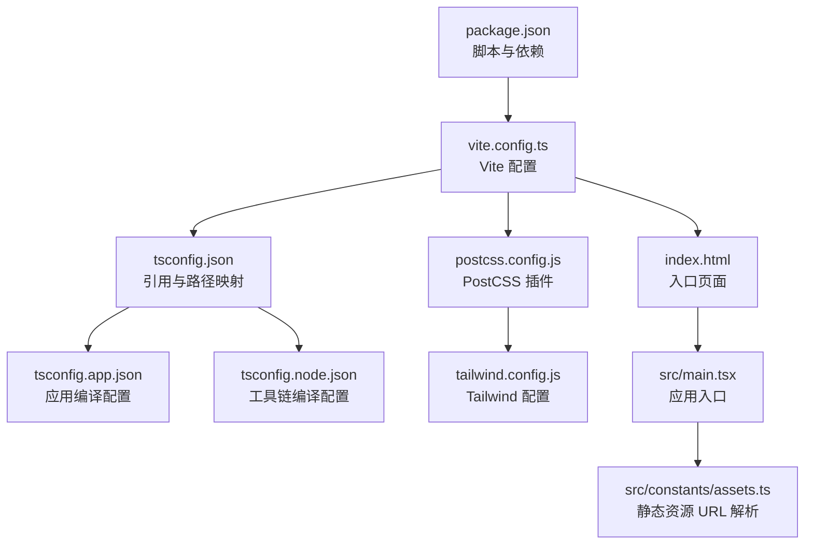
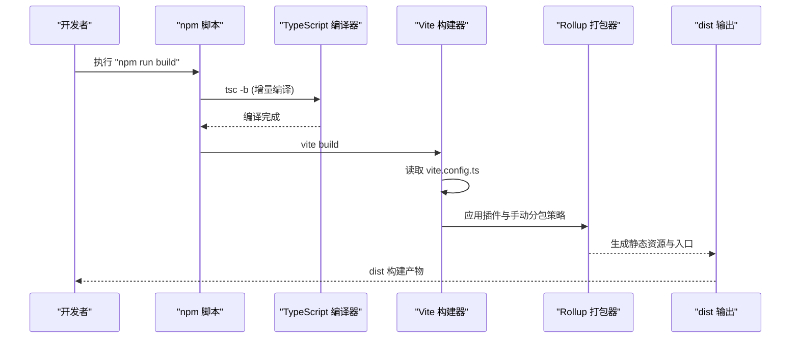
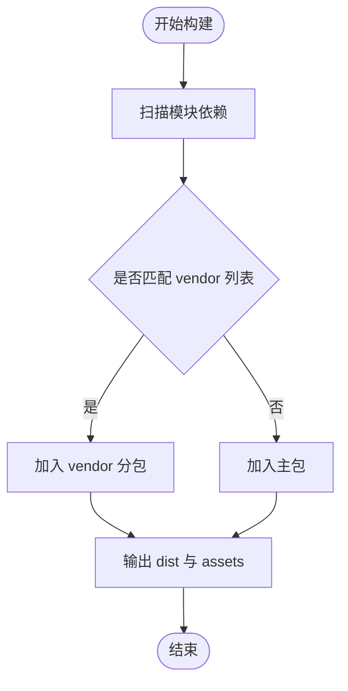
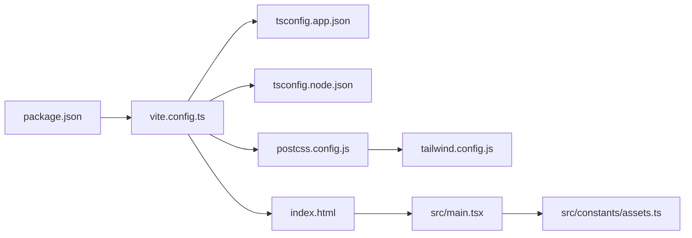

# 构建配置

<cite>
**本文引用的文件**
- [vite.config.ts](file://vite.config.ts)
- [package.json](file://package.json)
- [tsconfig.json](file://tsconfig.json)
- [tsconfig.app.json](file://tsconfig.app.json)
- [tsconfig.node.json](file://tsconfig.node.json)
- [postcss.config.js](file://postcss.config.js)
- [tailwind.config.js](file://tailwind.config.js)
- [eslint.config.js](file://eslint.config.js)
- [index.html](file://index.html)
- [src/main.tsx](file://src/main.tsx)
- [src/constants/assets.ts](file://src/constants/assets.ts)
</cite>

## 目录
1. [简介](#简介)
2. [项目结构](#项目结构)
3. [核心组件](#核心组件)
4. [架构总览](#架构总览)
5. [详细组件分析](#详细组件分析)
6. [依赖关系分析](#依赖关系分析)
7. [性能考量](#性能考量)
8. [故障排查指南](#故障排查指南)
9. [结论](#结论)
10. [附录](#附录)

## 简介
本文件系统性梳理 MinLL 项目的构建配置，围绕 Vite 配置、TypeScript 编译配置、代码分割与手动分包、构建输出与静态资源处理、Rollup 选项、以及开发服务器与部署相关配置进行深入解析，并提供性能优化建议与常见问题解决方案。内容兼顾技术细节与可读性，适合不同背景的读者参考。

## 项目结构
MinLL 采用 Vite + React + TypeScript 的现代前端工程化方案，结合 TailwindCSS 与 PostCSS 进行样式处理，使用 ESLint 进行代码质量管控。构建脚本通过 package.json 中的 scripts 调用 Vite 与 TypeScript 编译器，配合多份 tsconfig 文件实现应用与 Node 工具链的双环境编译配置。

图表来源
- [package.json:1-84](file://package.json#L1-L84)
- [vite.config.ts:1-26](file://vite.config.ts#L1-L26)
- [tsconfig.json:1-17](file://tsconfig.json#L1-L17)
- [tsconfig.app.json:1-35](file://tsconfig.app.json#L1-L35)
- [tsconfig.node.json:1-27](file://tsconfig.node.json#L1-L27)
- [postcss.config.js:1-7](file://postcss.config.js#L1-L7)
- [tailwind.config.js:1-84](file://tailwind.config.js#L1-L84)
- [index.html:1-21](file://index.html#L1-L21)
- [src/main.tsx:1-18](file://src/main.tsx#L1-L18)
- [src/constants/assets.ts:1-24](file://src/constants/assets.ts#L1-L24)

章节来源
- [package.json:1-84](file://package.json#L1-L84)
- [vite.config.ts:1-26](file://vite.config.ts#L1-L26)
- [tsconfig.json:1-17](file://tsconfig.json#L1-L17)
- [tsconfig.app.json:1-35](file://tsconfig.app.json#L1-L35)
- [tsconfig.node.json:1-27](file://tsconfig.node.json#L1-L27)
- [postcss.config.js:1-7](file://postcss.config.js#L1-L7)
- [tailwind.config.js:1-84](file://tailwind.config.js#L1-L84)
- [index.html:1-21](file://index.html#L1-L21)
- [src/main.tsx:1-18](file://src/main.tsx#L1-L18)
- [src/constants/assets.ts:1-24](file://src/constants/assets.ts#L1-L24)

## 核心组件
- Vite 配置：基础路径、插件、路径别名、构建输出与 Rollup 手动分包。
- TypeScript 配置：应用与 Node 双环境 tsconfig，模块解析模式、严格规则、Bundler 模式。
- 样式管线：PostCSS + TailwindCSS，按需扫描与生成。
- 开发与预览：本地开发服务器、预览命令与部署脚本。
- 静态资源：基于 base 的资源 URL 计算与 public 目录约定。

章节来源
- [vite.config.ts:1-26](file://vite.config.ts#L1-L26)
- [tsconfig.app.json:1-35](file://tsconfig.app.json#L1-L35)
- [tsconfig.node.json:1-27](file://tsconfig.node.json#L1-L27)
- [postcss.config.js:1-7](file://postcss.config.js#L1-L7)
- [tailwind.config.js:1-84](file://tailwind.config.js#L1-L84)
- [package.json:1-84](file://package.json#L1-L84)
- [src/constants/assets.ts:1-24](file://src/constants/assets.ts#L1-L24)

## 架构总览
下图展示从开发到构建的关键流程：Vite 读取配置，加载 React 插件与路径别名；TypeScript 编译器根据 tsconfig 对应用与 Node 工具链分别编译；PostCSS/Tailwind 处理样式；最终由 Vite 将产物输出至 dist 目录。

图表来源
- [package.json:6-12](file://package.json#L6-L12)
- [vite.config.ts:14-24](file://vite.config.ts#L14-L24)
- [tsconfig.app.json:18-23](file://tsconfig.app.json#L18-L23)

## 详细组件分析

### Vite 配置详解
- 基础路径（base）
  - 作用：在 GitHub Pages 等子路径部署场景中，确保资源与路由正确解析。
  - 影响范围：所有静态资源与 HTML 中的相对链接都会基于该前缀重写。
  - 使用方式：通过 import.meta.env.BASE_URL 获取当前 base 值，用于拼接 public 目录下的资源 URL。
  - 参考实现：[src/constants/assets.ts:1-6](file://src/constants/assets.ts#L1-L6)。
- 插件配置（plugins）
  - React 插件：启用 JSX 转换、HMR、React Refresh 等能力。
  - 参考实现：[vite.config.ts:8](file://vite.config.ts#L8)。
- 路径别名（resolve.alias）
  - 作用：将 @ 映射到 src 目录，提升导入可读性与维护性。
  - 参考实现：[vite.config.ts:9-13](file://vite.config.ts#L9-L13)。
- 构建输出与静态资源（build.outDir/assetsDir）
  - outDir：构建产物输出目录，默认 dist。
  - assetsDir：静态资源子目录，默认 assets。
  - 参考实现：[vite.config.ts:14-16](file://vite.config.ts#L14-L16)。
- Rollup 选项与手动分包（rollupOptions.output.manualChunks）
  - 作用：将 react 与 react-dom 单独打包为 vendor 分包，提升缓存命中率与二次加载性能。
  - 实现原理：基于模块名匹配，将指定依赖放入同一 chunk，浏览器可独立缓存。
  - 参考实现：[vite.config.ts:17-23](file://vite.config.ts#L17-L23)。

章节来源
- [vite.config.ts:6-25](file://vite.config.ts#L6-L25)
- [src/constants/assets.ts:1-6](file://src/constants/assets.ts#L1-L6)

### TypeScript 编译配置
- 统一入口（tsconfig.json）
  - 通过 references 引入应用与 Node 环境的 tsconfig，实现多项目联合编译。
  - 路径映射：baseUrl 与 paths，与 Vite 的 @ 别名保持一致。
  - 参考实现：[tsconfig.json:1-17](file://tsconfig.json#L1-L17)。
- 应用编译配置（tsconfig.app.json）
  - 目标与运行时：target、lib、module、jsx 等。
  - 模块解析：bundler 模式，支持 verbatimModuleSyntax、moduleDetection 等现代特性。
  - 严格规则：strict、noUnusedLocals、noUnusedParameters、noFallthroughCasesInSwitch 等。
  - 类型注入：vite/client。
  - 参考实现：[tsconfig.app.json:1-35](file://tsconfig.app.json#L1-L35)。
- Node 工具链配置（tsconfig.node.json）
  - 目标与运行时：target、lib、module。
  - 模块解析：bundler 模式，仅对 vite.config.ts 生效。
  - 严格规则：同上。
  - 参考实现：[tsconfig.node.json:1-27](file://tsconfig.node.json#L1-L27)。

章节来源
- [tsconfig.json:1-17](file://tsconfig.json#L1-L17)
- [tsconfig.app.json:1-35](file://tsconfig.app.json#L1-L35)
- [tsconfig.node.json:1-27](file://tsconfig.node.json#L1-L27)

### 样式与工具链配置
- PostCSS 配置
  - 插件：tailwindcss、autoprefixer。
  - 参考实现：[postcss.config.js:1-7](file://postcss.config.js#L1-L7)。
- Tailwind 配置
  - 内容扫描：index.html 与 src 下的 TS/JS/TSX/JSX。
  - 主题扩展：颜色、圆角、动画等。
  - 插件：tailwindcss-animate。
  - 参考实现：[tailwind.config.js:1-84](file://tailwind.config.js#L1-L84)。

章节来源
- [postcss.config.js:1-7](file://postcss.config.js#L1-L7)
- [tailwind.config.js:1-84](file://tailwind.config.js#L1-L84)

### 开发服务器与预览
- 开发脚本（dev）
  - 启动 Vite 开发服务器，支持热更新与 React Refresh。
  - 参考实现：[package.json:7](file://package.json#L7)。
- 预览脚本（preview）
  - 在本地预览生产构建产物，便于验证部署效果。
  - 参考实现：[package.json:10](file://package.json#L10)。
- 部署脚本（deploy）
  - 先执行构建，再将 dist 推送到 gh-pages 分支。
  - 参考实现：[package.json:11](file://package.json#L11)。

章节来源
- [package.json:6-12](file://package.json#L6-L12)

### 静态资源与入口页面
- 入口页面（index.html）
  - 包含基础 meta 信息、字体预连接、favicon 与根节点挂载点。
  - 参考实现：[index.html:1-21](file://index.html#L1-L21)。
- 应用入口（src/main.tsx）
  - 设置 CSS 变量以注入背景图片，渲染根组件。
  - 参考实现：[src/main.tsx:1-18](file://src/main.tsx#L1-L18)。
- 资源 URL 解析（src/constants/assets.ts）
  - 基于 import.meta.env.BASE_URL 与 public 目录约定，统一拼接静态资源 URL。
  - 参考实现：[src/constants/assets.ts:1-24](file://src/constants/assets.ts#L1-L24)。

章节来源
- [index.html:1-21](file://index.html#L1-L21)
- [src/main.tsx:1-18](file://src/main.tsx#L1-L18)
- [src/constants/assets.ts:1-24](file://src/constants/assets.ts#L1-L24)

### 代码分割与手动分包
- 手动分包策略
  - 将 react 与 react-dom 单独拆分为 vendor 分包，减少主包体积并提升缓存复用。
  - 参考实现：[vite.config.ts:19-21](file://vite.config.ts#L19-L21)。
- 代码分割流程

图表来源
- [vite.config.ts:17-23](file://vite.config.ts#L17-L23)

## 依赖关系分析
- 构建链路依赖
  - npm 脚本依赖 Vite 与 TypeScript 编译器。
  - Vite 依赖 React 插件与路径别名。
  - TypeScript 依赖 tsconfig 引用与严格规则。
  - 样式管线依赖 PostCSS 与 TailwindCSS。
- 关键耦合点
  - Vite 的 base 与 TypeScript 的 baseUrl/paths 必须与实际部署路径一致，否则会出现资源 404。
  - 手动分包依赖模块名称与版本锁定，升级依赖可能影响分包结果。

图表来源
- [package.json:1-84](file://package.json#L1-L84)
- [vite.config.ts:1-26](file://vite.config.ts#L1-L26)
- [tsconfig.app.json:1-35](file://tsconfig.app.json#L1-L35)
- [tsconfig.node.json:1-27](file://tsconfig.node.json#L1-L27)
- [postcss.config.js:1-7](file://postcss.config.js#L1-L7)
- [tailwind.config.js:1-84](file://tailwind.config.js#L1-L84)
- [index.html:1-21](file://index.html#L1-L21)
- [src/main.tsx:1-18](file://src/main.tsx#L1-L18)
- [src/constants/assets.ts:1-24](file://src/constants/assets.ts#L1-L24)

## 性能考量
- 代码分割与缓存
  - 将第三方库（如 react、react-dom）单独分包，可显著提升浏览器缓存命中率，减少主包体积。
  - 建议定期评估第三方依赖的变动频率，动态调整分包策略。
- 构建输出与静态资源
  - outDir 与 assetsDir 的合理组织有助于 CDN 缓存与清理策略。
  - 建议开启压缩与哈希命名（Vite 默认行为），并配合 CDN 缓存头配置。
- 开发体验
  - 使用 React 插件与 React Refresh 提升热更新效率。
  - 启用严格的 TypeScript 规则与 ESLint，降低运行时错误概率。
- 样式优化
  - Tailwind 的 content 扫描应覆盖所有使用到的组件，避免无用类被保留。
  - 合理使用原子化样式，减少重复定义与冗余 CSS。

## 故障排查指南
- 资源 404 或页面空白
  - 检查 vite.config.ts 的 base 是否与部署路径一致；确认 import.meta.env.BASE_URL 的值。
  - 确认 public 目录中的资源名称与 src/constants/assets.ts 中的拼接逻辑一致。
  - 参考实现：
    - [vite.config.ts:7](file://vite.config.ts#L7)
    - [src/constants/assets.ts:1-6](file://src/constants/assets.ts#L1-L6)
- 构建失败或类型错误
  - 确认 tsconfig.json 的 references 正确指向 tsconfig.app.json 与 tsconfig.node.json。
  - 检查 tsconfig.app.json 的 moduleResolution 是否为 bundler，避免模块解析异常。
  - 参考实现：
    - [tsconfig.json:3-10](file://tsconfig.json#L3-L10)
    - [tsconfig.app.json:18](file://tsconfig.app.json#L18)
- 开发服务器端口占用或热更新异常
  - 更换端口或关闭占用进程；重启开发服务器。
  - 清理 node_modules/.vite 缓存后重试。
- 预览与部署不一致
  - 使用 vite preview 在本地验证生产构建；确认 dist 目录结构与资源路径。
  - 部署脚本会将 dist 推送至 gh-pages，请确保分支与权限配置正确。
  - 参考实现：
    - [package.json:10](file://package.json#L10)
    - [package.json:11](file://package.json#L11)

章节来源
- [vite.config.ts:7](file://vite.config.ts#L7)
- [src/constants/assets.ts:1-6](file://src/constants/assets.ts#L1-L6)
- [tsconfig.json:3-10](file://tsconfig.json#L3-L10)
- [tsconfig.app.json:18](file://tsconfig.app.json#L18)
- [package.json:10](file://package.json#L10)
- [package.json:11](file://package.json#L11)

## 结论
MinLL 的构建体系以 Vite 为核心，结合 TypeScript 的严格编译规则与 PostCSS/Tailwind 的现代化样式管线，实现了高效、可维护且可扩展的前端工程化实践。通过合理的基础路径、路径别名、手动分包与缓存策略，项目在开发体验与生产性能之间取得了良好平衡。建议在后续迭代中持续关注依赖演进与缓存策略，以进一步提升构建稳定性与加载性能。

## 附录
- 常用命令
  - 开发：npm run dev
  - 构建：npm run build
  - 预览：npm run preview
  - 部署：npm run deploy
- 关键配置要点速查
  - 基础路径：vite.config.ts base
  - 路径别名：vite.config.ts resolve.alias 与 tsconfig.json paths
  - 手动分包：vite.config.ts rollupOptions.output.manualChunks
  - 编译目标：tsconfig.app.json target/moduleResolution
  - 样式管线：postcss.config.js 与 tailwind.config.js

章节来源
- [package.json:6-12](file://package.json#L6-L12)
- [vite.config.ts:7-23](file://vite.config.ts#L7-L23)
- [tsconfig.json:11-16](file://tsconfig.json#L11-L16)
- [tsconfig.app.json:4-23](file://tsconfig.app.json#L4-L23)
- [postcss.config.js:1-7](file://postcss.config.js#L1-L7)
- [tailwind.config.js:1-84](file://tailwind.config.js#L1-L84)