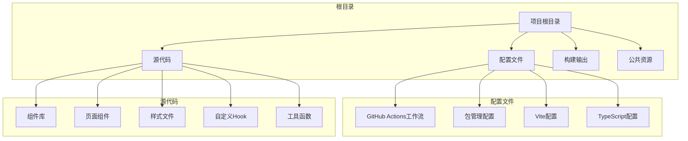
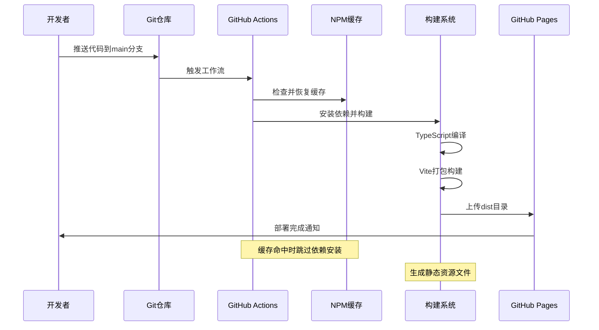
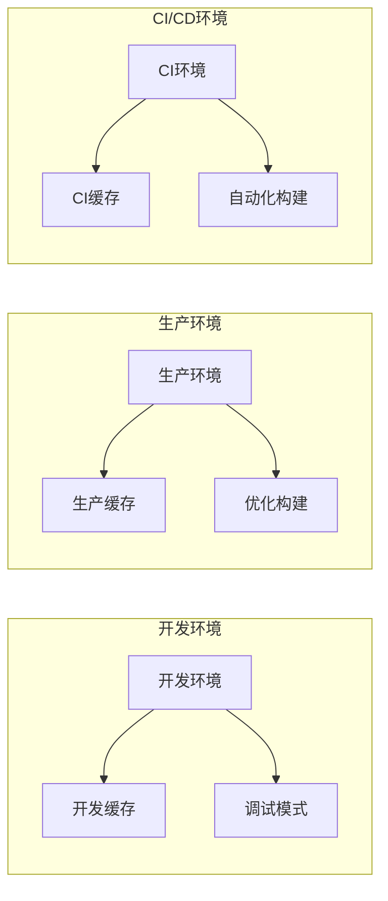
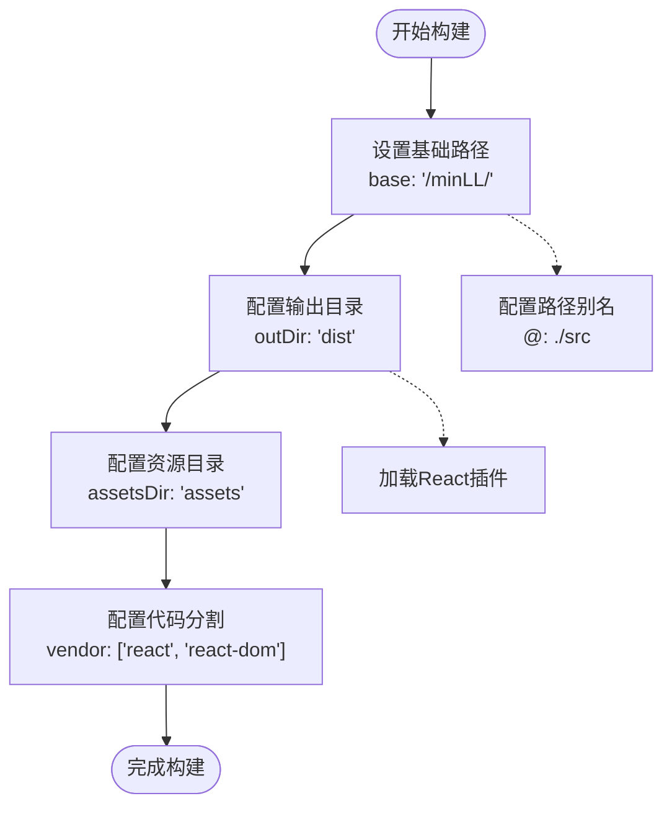
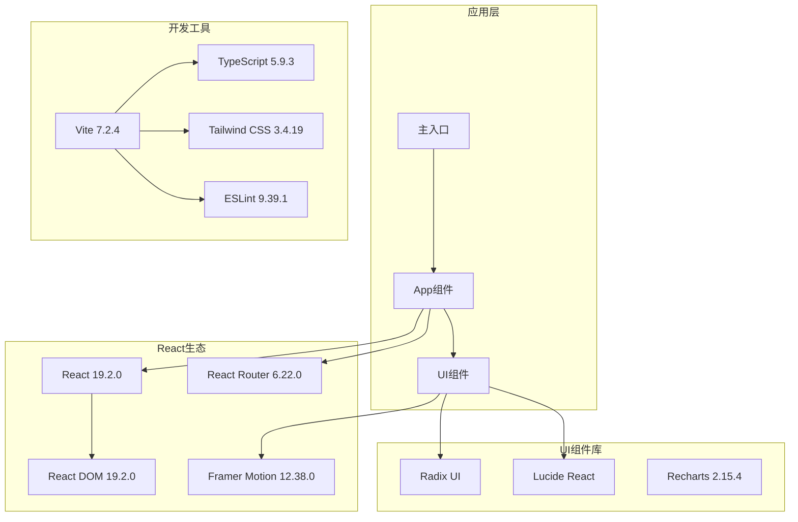

# 部署流程

<cite>
**本文档引用的文件**
- [.github/workflows/deploy.yml](file://.github/workflows/deploy.yml)
- [package.json](file://package.json)
- [vite.config.ts](file://vite.config.ts)
- [index.html](file://index.html)
- [src/main.tsx](file://src/main.tsx)
- [src/App.tsx](file://src/App.tsx)
- [tsconfig.json](file://tsconfig.json)
- [tailwind.config.js](file://tailwind.config.js)
- [postcss.config.js](file://postcss.config.js)
</cite>

## 目录
1. [简介](#简介)
2. [项目结构](#项目结构)
3. [核心组件](#核心组件)
4. [架构概览](#架构概览)
5. [详细组件分析](#详细组件分析)
6. [依赖分析](#依赖分析)
7. [性能考虑](#性能考虑)
8. [故障排除指南](#故障排除指南)
9. [结论](#结论)

## 简介

MinLL 是一个基于 React + TypeScript + Vite 构建的现代化前端项目，采用 GitHub Actions 实现自动化部署到 GitHub Pages。该项目使用了 Tailwind CSS 进行样式管理，具备响应式设计和现代化的开发体验。

本项目的核心部署特性包括：
- 完全自动化的 CI/CD 流程
- 基于 GitHub Actions 的构建和部署
- 支持多环境部署
- 内置的性能优化和缓存策略
- 完整的错误处理和回滚机制

## 项目结构

MinLL 项目采用模块化的组织方式，主要目录结构如下：



**图表来源**
- [package.json:1-84](file://package.json#L1-L84)
- [vite.config.ts:1-26](file://vite.config.ts#L1-L26)

**章节来源**
- [package.json:1-84](file://package.json#L1-L84)
- [vite.config.ts:1-26](file://vite.config.ts#L1-L26)

## 核心组件

### GitHub Actions 工作流

项目使用 GitHub Actions 实现自动化部署，工作流配置位于 `.github/workflows/deploy.yml` 文件中。该工作流具有以下特点：

- **触发条件**: 当推送到 `main` 分支时自动触发
- **运行环境**: Ubuntu 最新版本
- **Node.js 版本**: 22.x
- **缓存策略**: 使用 npm 缓存提高构建速度
- **部署工具**: 使用 peaceiris/actions-gh-pages@v4

### 构建配置

Vite 配置文件定义了项目的构建参数，包括：
- **基础路径**: 设置为 `/minLL/` 以支持 GitHub Pages 子路径部署
- **输出目录**: `dist` 目录
- **资源目录**: `assets` 目录
- **代码分割**: 将 React 和 React DOM 单独打包为 vendor chunk

### 包管理配置

package.json 文件包含了完整的依赖管理和脚本配置：
- **开发依赖**: Vite、TypeScript、ESLint 等现代化开发工具
- **生产依赖**: React 生态系统和 UI 组件库
- **构建脚本**: 开发、构建、预览和手动部署脚本

**章节来源**
- [.github/workflows/deploy.yml:1-34](file://.github/workflows/deploy.yml#L1-L34)
- [vite.config.ts:6-25](file://vite.config.ts#L6-L25)
- [package.json:6-12](file://package.json#L6-L12)

## 架构概览

MinLL 的部署架构采用现代化的 CI/CD 模式，实现了从代码提交到生产发布的完整自动化流程：



**图表来源**
- [.github/workflows/deploy.yml:12-34](file://.github/workflows/deploy.yml#L12-L34)
- [vite.config.ts:14-24](file://vite.config.ts#L14-L24)

### 环境配置

项目支持多种部署环境，通过不同的配置实现：



**图表来源**
- [.github/workflows/deploy.yml:7-9](file://.github/workflows/deploy.yml#L7-L9)
- [vite.config.ts:7](file://vite.config.ts#L7)

## 详细组件分析

### GitHub Actions 工作流详解

#### 触发机制
工作流配置使用 `push` 事件触发，专门监听 `main` 分支的推送操作。这种设计确保只有经过审查和合并的代码才能进入生产环境。

#### 步骤流程
1. **代码检出**: 使用 `actions/checkout@v4` 获取最新代码
2. **Node.js 设置**: 配置 Node.js 22 环境并启用 npm 缓存
3. **依赖安装**: 使用 `npm ci` 进行快速且确定性的依赖安装
4. **项目构建**: 执行 `npm run build` 生成生产版本
5. **部署发布**: 使用 `peaceiris/actions-gh-pages@v4` 将构建产物部署到 GitHub Pages

#### 环境变量配置
工作流设置了 `FORCE_JAVASCRIPT_ACTIONS_TO_NODE24` 环境变量，确保 JavaScript 动作在 Node.js 24 环境下运行，避免 2026 年 6 月默认升级的影响。

**章节来源**
- [.github/workflows/deploy.yml:3-34](file://.github/workflows/deploy.yml#L3-L34)

### 构建系统配置

#### Vite 配置分析
Vite 配置文件定义了项目的关键构建参数：



**图表来源**
- [vite.config.ts:6-25](file://vite.config.ts#L6-L25)

#### TypeScript 配置
项目使用分层的 TypeScript 配置：
- **主配置**: `tsconfig.json` - 引用应用和节点配置
- **应用配置**: `tsconfig.app.json` - 应用特定的编译选项
- **节点配置**: `tsconfig.node.json` - 节点环境的编译选项

**章节来源**
- [vite.config.ts:6-25](file://vite.config.ts#L6-L25)
- [tsconfig.json:1-17](file://tsconfig.json#L1-L17)

### 样式系统配置

#### Tailwind CSS 配置
Tailwind CSS 配置支持暗色模式和丰富的动画效果：
- **内容扫描**: 配置扫描 `index.html` 和所有源代码文件
- **主题扩展**: 定义了完整的颜色系统和动画效果
- **插件集成**: 使用 `tailwindcss-animate` 插件增强动画能力

#### PostCSS 配置
PostCSS 配置集成了 Tailwind CSS 和 Autoprefixer，确保样式在不同浏览器中的兼容性。

**章节来源**
- [tailwind.config.js:1-84](file://tailwind.config.js#L1-L84)
- [postcss.config.js:1-7](file://postcss.config.js#L1-L7)

### 应用入口配置

#### 主入口文件
`src/main.tsx` 文件负责应用的初始化：
- 设置全局 CSS 变量
- 加载背景图片资源
- 渲染 React 应用根节点

#### 应用组件结构
`src/App.tsx` 定义了应用的整体布局：
- 响应式光标效果
- 动态背景动画
- 导航栏和主要内容区域
- 触摸和鼠标事件处理

**章节来源**
- [src/main.tsx:1-18](file://src/main.tsx#L1-L18)
- [src/App.tsx:1-70](file://src/App.tsx#L1-L70)

## 依赖分析

### 依赖关系图



**图表来源**
- [package.json:13-60](file://package.json#L13-L60)
- [package.json:62-82](file://package.json#L62-L82)

### 关键依赖说明

#### React 生态系统
- **React 19.2.0**: 最新的 React 版本，提供更好的性能和开发体验
- **React DOM 19.2.0**: React 的 DOM 渲染器
- **React Router 6.22.0**: 客户端路由管理
- **Framer Motion 12.38.0**: 高性能动画库

#### UI 组件库
- **Radix UI**: 无障碍的 UI 组件基础
- **Lucide React**: 现代化的图标库
- **Recharts 2.15.4**: 数据可视化图表库

#### 开发工具链
- **Vite 7.2.4**: 快速的构建工具和开发服务器
- **TypeScript 5.9.3**: 类型安全的 JavaScript 超集
- **Tailwind CSS 3.4.19**: 实用优先的 CSS 框架
- **ESLint 9.39.1**: 代码质量检查工具

**章节来源**
- [package.json:13-82](file://package.json#L13-L82)

## 性能考虑

### 构建优化策略

#### 代码分割
项目使用 Vite 的自动代码分割功能，将第三方库（特别是 React 和 React DOM）单独打包为 `vendor` chunk，这可以：
- 提高缓存效率
- 减少首屏加载时间
- 支持按需加载

#### 资源优化
- **静态资源**: 图片和其他静态资源被正确打包到 `dist/assets` 目录
- **CSS 优化**: Tailwind CSS 生成的样式经过优化和压缩
- **JavaScript 压缩**: 生产构建自动进行代码压缩和混淆

#### 缓存策略
- **浏览器缓存**: 通过文件名哈希实现长期缓存
- **CDN 支持**: GitHub Pages 作为全球 CDN 提供静态资源
- **HTTP 缓存**: 合理的缓存头设置

### 性能监控建议

#### 关键指标
- **首次内容绘制 (FCP)**: 页面第一个内容渲染的时间
- **最大内容绘制 (LCP)**: 页面主要内容加载完成的时间
- **首次输入延迟 (FID)**: 用户第一次交互的响应时间
- **累积布局偏移 (CLS)**: 页面布局稳定性指标

#### 监控工具
- **Lighthouse**: 自动化性能审计
- **WebPageTest**: 多地点性能测试
- **Google Analytics**: 实际用户性能监控
- **GitHub Pages Analytics**: 内置访问统计

## 故障排除指南

### 常见部署问题

#### 构建失败
**问题症状**: GitHub Actions 工作流在构建步骤失败
**可能原因**:
- Node.js 版本不兼容
- 依赖安装失败
- TypeScript 编译错误
- Vite 构建配置问题

**解决方案**:
1. 检查 Node.js 版本是否为 22.x
2. 查看依赖安装日志中的具体错误信息
3. 在本地运行 `npm run build` 进行验证
4. 检查 TypeScript 配置文件的语法

#### 资源路径错误
**问题症状**: 页面显示空白或资源 404 错误
**可能原因**:
- 基础路径配置不正确
- 静态资源引用路径错误
- GitHub Pages 子路径配置问题

**解决方案**:
1. 确认 `vite.config.ts` 中的 `base` 配置为 `/minLL/`
2. 检查 HTML 文件中的资源链接
3. 验证 GitHub Pages 设置中的自定义域名配置

#### 缓存问题
**问题症状**: 更新后的代码未生效
**可能原因**:
- 浏览器缓存
- CDN 缓存
- GitHub Pages 缓存

**解决方案**:
1. 强制刷新页面 (Ctrl+F5)
2. 清除浏览器缓存
3. 等待 CDN 缓存过期
4. 重新推送代码触发新构建

### 调试技巧

#### 本地调试
```bash
# 启动开发服务器
npm run dev

# 预览生产构建
npm run preview

# 运行类型检查
npx tsc --noEmit

# 运行 ESLint 检查
npm run lint
```

#### GitHub Actions 调试
1. 在 GitHub 仓库中查看 Actions 标签页
2. 查看具体步骤的详细日志
3. 检查缓存命中情况
4. 验证环境变量设置

#### 性能分析
```bash
# 分析构建包大小
npm run build -- --mode production
ls -la dist/assets/

# 检查 TypeScript 编译结果
npx tsc --noEmit --build
```

**章节来源**
- [.github/workflows/deploy.yml:17-27](file://.github/workflows/deploy.yml#L17-L27)
- [vite.config.ts:14-24](file://vite.config.ts#L14-L24)

## 结论

MinLL 项目的部署流程体现了现代前端项目的最佳实践，具有以下优势：

### 技术优势
- **自动化程度高**: 完全自动化的 CI/CD 流程
- **性能优化**: 合理的代码分割和缓存策略
- **开发体验**: 快速的热重载和构建速度
- **可维护性**: 清晰的配置分离和模块化结构

### 部署特点
- **可靠性**: GitHub Actions 提供稳定的构建环境
- **安全性**: 使用 GITHUB_TOKEN 进行身份验证
- **可扩展性**: 支持多环境部署和自定义配置
- **可观测性**: 完整的日志记录和错误报告

### 改进建议
1. **增加测试覆盖**: 添加单元测试和集成测试
2. **性能监控**: 集成实际用户性能监控
3. **安全扫描**: 添加依赖漏洞扫描
4. **多环境配置**: 支持更多部署环境的配置

这个部署流程为类似项目提供了优秀的参考模板，既保证了部署的可靠性，又保持了开发的灵活性。