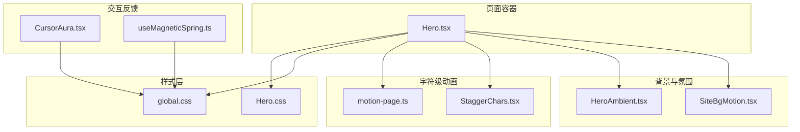
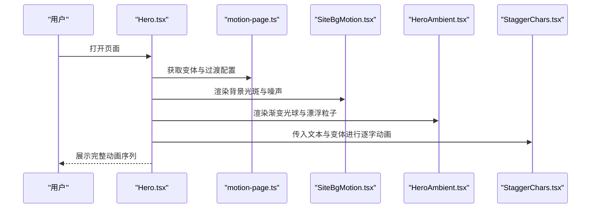
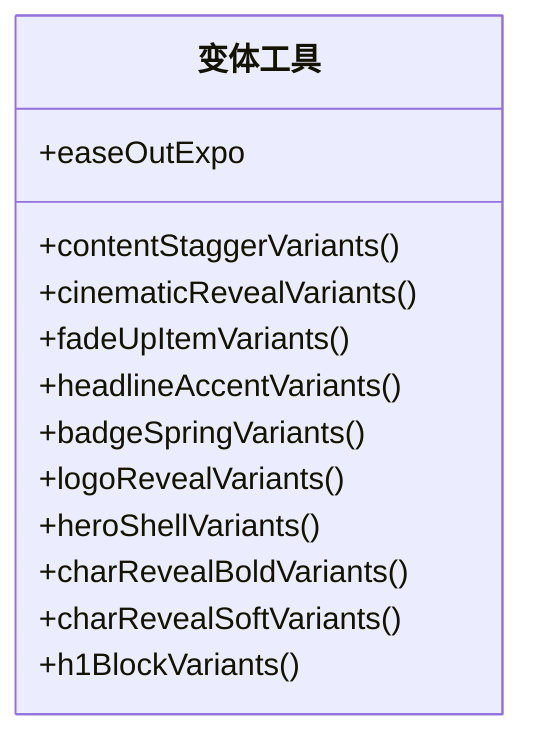
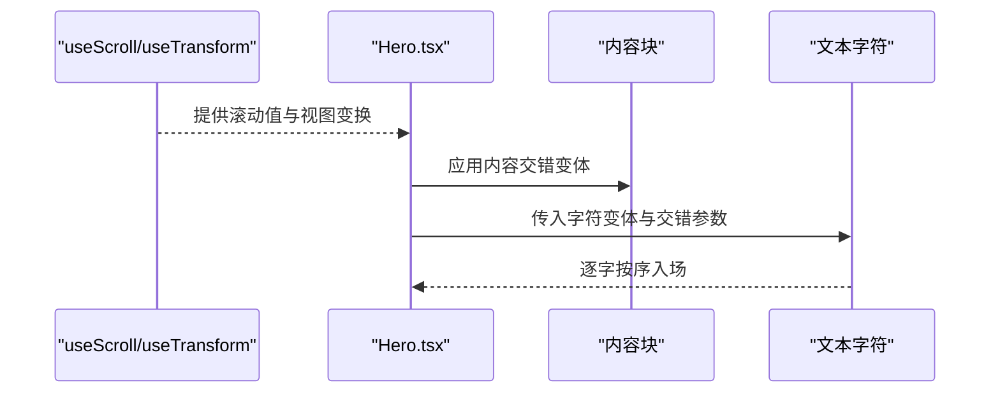
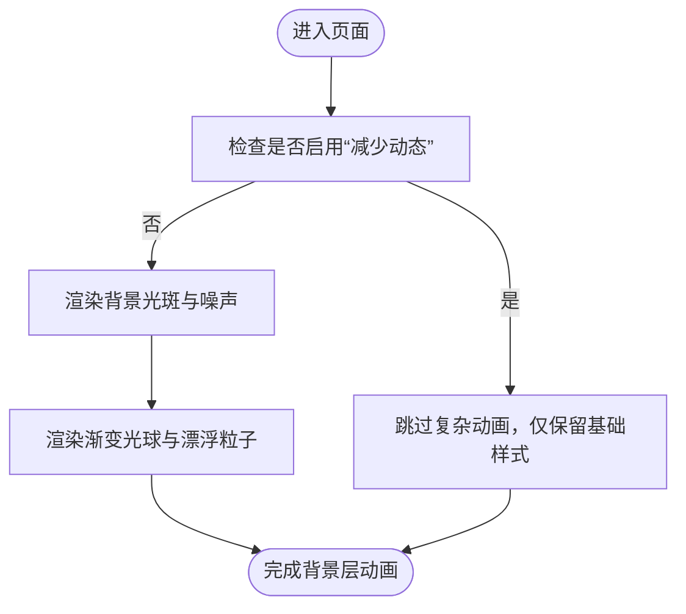
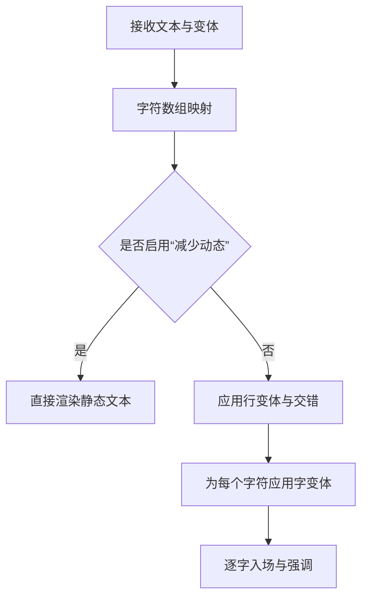
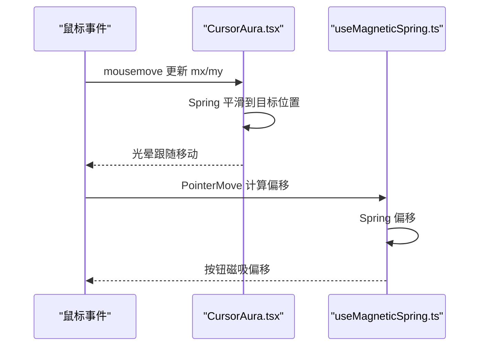
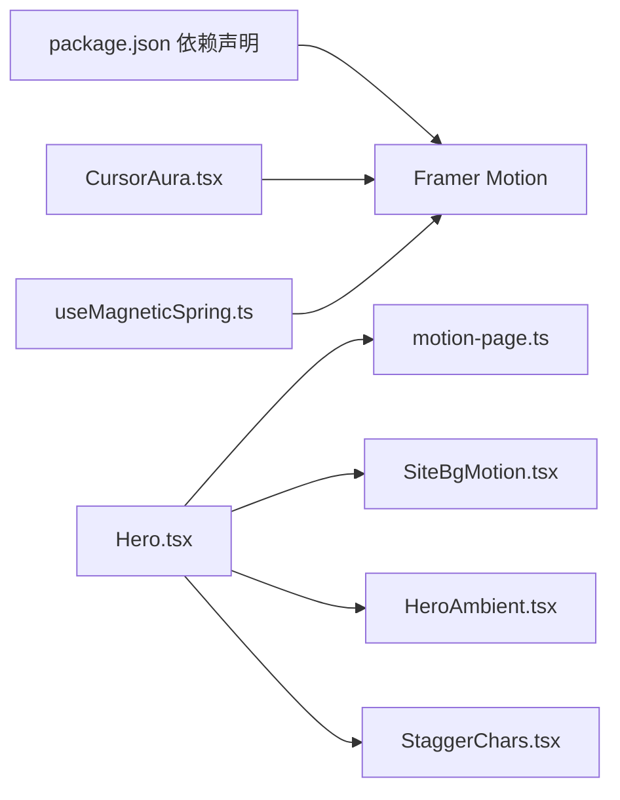

# 动画架构

<cite>
**本文引用的文件**
- [CursorAura.tsx](file://src/components/CursorAura.tsx)
- [HeroAmbient.tsx](file://src/components/HeroAmbient.tsx)
- [SiteBgMotion.tsx](file://src/components/SiteBgMotion.tsx)
- [StaggerChars.tsx](file://src/components/StaggerChars.tsx)
- [motion-page.ts](file://src/utils/motion-page.ts)
- [Hero.tsx](file://src/components/Hero.tsx)
- [global.css](file://src/styles/global.css)
- [Hero.css](file://src/styles/Hero.css)
- [Home.tsx](file://src/pages/Home.tsx)
- [useMagneticSpring.ts](file://src/hooks/useMagneticSpring.ts)
- [package.json](file://package.json)
</cite>

## 目录
1. [引言](#引言)
2. [项目结构](#项目结构)
3. [核心组件](#核心组件)
4. [架构总览](#架构总览)
5. [详细组件分析](#详细组件分析)
6. [依赖关系分析](#依赖关系分析)
7. [性能考量](#性能考量)
8. [故障排查指南](#故障排查指南)
9. [结论](#结论)
10. [附录](#附录)

## 引言
本文件系统性梳理 MinLL 项目的动画架构，围绕基于 Framer Motion 的动画体系进行深入解析。内容涵盖动画配置的集中管理、变体系统的实现原理与复用策略、光晕效果、背景动画与字符级动画的实现机制、动画状态管理与时间轴控制、帧率优化、动画配置文件结构、命名规范与复用策略、性能监控与调试方法，以及动画与用户交互的响应机制。

## 项目结构
MinLL 的动画系统主要由以下层次构成：
- 页面级容器：负责滚动监听、视口变换与整体布局的动画编排
- 背景与氛围层：通过纯 CSS 与 Framer Motion 结合的方式实现背景光效、粒子与漂浮物
- 字符级动画：通过分字变体与交错（stagger）实现逐字入场与强调动效
- 交互反馈：指针光晕、磁吸弹簧等交互式动画
- 配置与工具：集中化的变体与过渡定义，统一的缓动曲线与参数

图表来源
- [Hero.tsx:25-35](file://src/components/Hero.tsx#L25-L35)
- [SiteBgMotion.tsx:25-59](file://src/components/SiteBgMotion.tsx#L25-L59)
- [HeroAmbient.tsx:21-63](file://src/components/HeroAmbient.tsx#L21-L63)
- [StaggerChars.tsx:14-58](file://src/components/StaggerChars.tsx#L14-L58)
- [motion-page.ts:6-183](file://src/utils/motion-page.ts#L6-L183)
- [CursorAura.tsx:13-68](file://src/components/CursorAura.tsx#L13-L68)
- [useMagneticSpring.ts:6-32](file://src/hooks/useMagneticSpring.ts#L6-L32)
- [global.css:151-287](file://src/styles/global.css#L151-L287)
- [Hero.css:19-603](file://src/styles/Hero.css#L19-L603)

章节来源
- [Home.tsx:6-14](file://src/pages/Home.tsx#L6-L14)
- [Hero.tsx:25-35](file://src/components/Hero.tsx#L25-L35)

## 核心组件
- 变体与过渡工具集：集中定义各类动画变体（入场、强调、字符翻转、徽章弹跳等）与统一缓动曲线，便于跨组件复用与一致性控制
- 页面级 Hero 容器：整合滚动监听、视口变换、背景与氛围动画、字符级交错动画、徽章与标题动效
- 背景与氛围：站点背景光斑、噪声闪烁、渐变光球与漂浮粒子；在“减少动态”模式下自动降级
- 字符级交错：按字拆分、逐字入场、支持不同强度的模糊与旋转，形成层次丰富的文本动效
- 指针光晕与磁吸：指针跟随与阻尼过渡、按钮磁吸偏移，提升交互真实感

章节来源
- [motion-page.ts:3-183](file://src/utils/motion-page.ts#L3-L183)
- [Hero.tsx:25-35](file://src/components/Hero.tsx#L25-L35)
- [SiteBgMotion.tsx:25-59](file://src/components/SiteBgMotion.tsx#L25-L59)
- [HeroAmbient.tsx:21-63](file://src/components/HeroAmbient.tsx#L21-L63)
- [StaggerChars.tsx:14-58](file://src/components/StaggerChars.tsx#L14-L58)
- [CursorAura.tsx:13-68](file://src/components/CursorAura.tsx#L13-L68)
- [useMagneticSpring.ts:6-32](file://src/hooks/useMagneticSpring.ts#L6-L32)

## 架构总览
动画系统采用“配置集中 + 组件解耦”的设计：
- 配置集中：所有变体与过渡参数集中在工具模块中，统一命名与参数风格
- 组件解耦：页面容器仅负责装配与编排，具体动效由子组件或工具函数提供
- 降级策略：通过系统偏好“减少动态”开关，自动关闭复杂动画，保证可访问性与性能
- 性能优先：使用 will-change、requestAnimationFrame、Spring 等手段优化渲染与交互

图表来源
- [Hero.tsx:25-35](file://src/components/Hero.tsx#L25-L35)
- [motion-page.ts:6-183](file://src/utils/motion-page.ts#L6-L183)
- [SiteBgMotion.tsx:25-59](file://src/components/SiteBgMotion.tsx#L25-L59)
- [HeroAmbient.tsx:21-63](file://src/components/HeroAmbient.tsx#L21-L63)
- [StaggerChars.tsx:14-58](file://src/components/StaggerChars.tsx#L14-L58)

## 详细组件分析

### 变体系统与配置集中管理
- 统一缓动：提供平滑的编辑器减速曲线，用于整体动效节奏控制
- 入场变体：包含“上升+模糊+透明度”三要素，支持不同强度与位移
- 字符变体：针对强调标题与正文分别提供“粗体强调”和“柔和强调”，均采用弹簧阻尼
- 徽章与壳体：徽章采用弹性弹出，壳体采用指数缓动展开
- 内容块交错：统一的交错延迟与子项延迟，确保层级清晰

图表来源
- [motion-page.ts:3-183](file://src/utils/motion-page.ts#L3-L183)

章节来源
- [motion-page.ts:3-183](file://src/utils/motion-page.ts#L3-L183)

### 页面容器与时间轴控制
- 滚动驱动：使用滚动监听与视图变换，驱动背景与网格的视差移动
- 时间轴编排：通过统一的变体与过渡配置，串联徽章、标题、副标题与描述的出场顺序
- 字符级交错：根据文本类型选择不同的字符变体与交错步长，形成层次感
- 交互元素：滚动提示按钮的多维动画（缩放、旋转、上下浮动），结合悬停与点击反馈

图表来源
- [Hero.tsx:37-38](file://src/components/Hero.tsx#L37-L38)
- [motion-page.ts:6-183](file://src/utils/motion-page.ts#L6-L183)
- [StaggerChars.tsx:14-58](file://src/components/StaggerChars.tsx#L14-L58)

章节来源
- [Hero.tsx:37-38](file://src/components/Hero.tsx#L37-L38)
- [motion-page.ts:6-183](file://src/utils/motion-page.ts#L6-L183)
- [StaggerChars.tsx:14-58](file://src/components/StaggerChars.tsx#L14-L58)

### 背景动画与氛围效果
- 站点背景光斑：三个不同尺寸与路径的光斑，循环变换位置与缩放，营造流动感
- 噪声闪烁：覆盖全屏的噪声纹理，周期性透明度变化，增强颗粒质感
- 渐变光球与漂浮粒子：纯 CSS 的浮动基底，配合 Framer Motion 的透明度与位移，形成柔和的环境光

图表来源
- [SiteBgMotion.tsx:25-59](file://src/components/SiteBgMotion.tsx#L25-L59)
- [HeroAmbient.tsx:21-63](file://src/components/HeroAmbient.tsx#L21-L63)
- [global.css:196-260](file://src/styles/global.css#L196-L260)
- [Hero.css:61-106](file://src/styles/Hero.css#L61-L106)

章节来源
- [SiteBgMotion.tsx:25-59](file://src/components/SiteBgMotion.tsx#L25-L59)
- [HeroAmbient.tsx:21-63](file://src/components/HeroAmbient.tsx#L21-L63)
- [global.css:196-260](file://src/styles/global.css#L196-L260)
- [Hero.css:61-106](file://src/styles/Hero.css#L61-L106)

### 字符级动画与交错机制
- 分字策略：将字符串映射为字符数组，空格使用特殊键名，避免 display 异常
- 行变体：默认提供交错子项的延迟与步长，支持自定义行变体
- 字变体：提供柔和与强调两种字符变体，均采用弹簧阻尼，确保自然回弹
- 减少动态：在“减少动态”模式下直接输出静态文本，保持可读性与性能

图表来源
- [StaggerChars.tsx:23-57](file://src/components/StaggerChars.tsx#L23-L57)
- [motion-page.ts:116-183](file://src/utils/motion-page.ts#L116-L183)

章节来源
- [StaggerChars.tsx:14-58](file://src/components/StaggerChars.tsx#L14-L58)
- [motion-page.ts:116-183](file://src/utils/motion-page.ts#L116-L183)

### 指针光晕与磁吸交互
- 指针光晕：使用运动值与弹簧阻尼，将鼠标坐标转换为光晕位置，配合 requestAnimationFrame 降低抖动
- 磁吸弹簧：按钮在指针靠近时产生偏移，离开后回归原位，提供自然的物理反馈
- 减少动态：在系统偏好开启时，自动禁用动画，保障无障碍体验

图表来源
- [CursorAura.tsx:22-48](file://src/components/CursorAura.tsx#L22-L48)
- [useMagneticSpring.ts:13-29](file://src/hooks/useMagneticSpring.ts#L13-L29)

章节来源
- [CursorAura.tsx:13-68](file://src/components/CursorAura.tsx#L13-L68)
- [useMagneticSpring.ts:6-32](file://src/hooks/useMagneticSpring.ts#L6-L32)

## 依赖关系分析
- 版本与生态：项目使用 Framer Motion 作为核心动画库，版本在依赖清单中明确
- 组件间耦合：页面容器与变体工具为弱耦合，通过函数调用注入变体；子组件仅关注自身动效
- 外部依赖：Radix UI、Lucide 等 UI 生态与图标库，不直接影响动画逻辑，但影响交互与视觉一致性

图表来源
- [package.json:46-46](file://package.json#L46-L46)
- [Hero.tsx:13-23](file://src/components/Hero.tsx#L13-L23)
- [motion-page.ts:1-4](file://src/utils/motion-page.ts#L1-L4)
- [SiteBgMotion.tsx:1-1](file://src/components/SiteBgMotion.tsx#L1-L1)
- [HeroAmbient.tsx:1-1](file://src/components/HeroAmbient.tsx#L1-L1)
- [StaggerChars.tsx:1-2](file://src/components/StaggerChars.tsx#L1-L2)
- [CursorAura.tsx:1-7](file://src/components/CursorAura.tsx#L1-L7)
- [useMagneticSpring.ts:1-2](file://src/hooks/useMagneticSpring.ts#L1-L2)

章节来源
- [package.json:46-46](file://package.json#L46-L46)
- [Hero.tsx:13-23](file://src/components/Hero.tsx#L13-L23)

## 性能考量
- 减少动态降级：通过系统偏好检测，自动关闭复杂动画，保证可访问性与性能
- will-change 与合成层：全局样式中广泛使用 will-change 与混合模式，减少重绘与提高合成效率
- requestAnimationFrame：在高频事件中使用节流，降低主线程压力
- Spring 参数：在交互反馈中采用合适的刚度、阻尼与质量，平衡流畅度与能耗
- 视口变换：滚动驱动的视差与网格移动，尽量使用 transform 与 opacity，避免强制同步布局
- 字符级动画：在“减少动态”模式下直接渲染静态文本，避免不必要的 DOM 与动画计算

章节来源
- [Hero.tsx:26-35](file://src/components/Hero.tsx#L26-L35)
- [global.css:109-126](file://src/styles/global.css#L109-L126)
- [global.css:196-205](file://src/styles/global.css#L196-L205)
- [CursorAura.tsx:28-35](file://src/components/CursorAura.tsx#L28-L35)
- [useMagneticSpring.ts:4-4](file://src/hooks/useMagneticSpring.ts#L4-L4)

## 故障排查指南
- 动画未生效
  - 检查“减少动态”系统偏好是否开启
  - 确认变体函数返回值与组件 props 是否正确传递
  - 核对 transition 与 animate 的配置是否冲突
- 性能问题
  - 关注 will-change 与混合模式的使用，避免过度合成
  - 在高频事件中使用 requestAnimationFrame 或节流
  - 合理设置 Spring 刚度与阻尼，避免过度抖动
- 字符级动画异常
  - 空格处理：确保空格字符的键名与 display 设置一致
  - 交错步长：根据文本长度调整 stagger 与 delay，避免拥挤
- 指针光晕与磁吸
  - 确保事件监听在组件挂载时注册，在卸载时清理
  - 检查坐标计算与边界条件，避免越界或卡顿

章节来源
- [Hero.tsx:26-35](file://src/components/Hero.tsx#L26-L35)
- [StaggerChars.tsx:23-57](file://src/components/StaggerChars.tsx#L23-L57)
- [CursorAura.tsx:22-48](file://src/components/CursorAura.tsx#L22-L48)
- [useMagneticSpring.ts:13-29](file://src/hooks/useMagneticSpring.ts#L13-L29)

## 结论
MinLL 的动画架构以 Framer Motion 为核心，通过“配置集中 + 组件解耦 + 降级策略 + 性能优先”的设计，实现了从背景氛围到字符级动画再到交互反馈的完整链路。统一的变体与过渡定义提升了复用性与一致性，而“减少动态”与 will-change 等策略则兼顾了可访问性与性能。该架构既满足了视觉表现力，也确保了在不同设备与系统偏好下的稳定体验。

## 附录

### 动画配置文件结构与命名规范
- 文件结构
  - 变体与过渡：集中于工具模块，按功能域划分（入场、字符、徽章、壳体等）
  - 页面容器：仅负责装配与编排，不直接定义动画细节
- 命名规范
  - 变体函数：动词短语 + 名词（如 cinematicRevealVariants、charRevealSoftVariants）
  - 过渡配置：以 Transition 类型约束，统一 ease、duration、repeat 等字段
  - 字符级：lineVariants 与 charVariants 明确职责边界
- 复用策略
  - 将通用变体抽取至工具模块，页面容器按需组合
  - 对于差异化需求，通过参数化（如 blurPx、y、stagger）扩展，避免重复定义

章节来源
- [motion-page.ts:6-183](file://src/utils/motion-page.ts#L6-L183)
- [StaggerChars.tsx:4-12](file://src/components/StaggerChars.tsx#L4-L12)