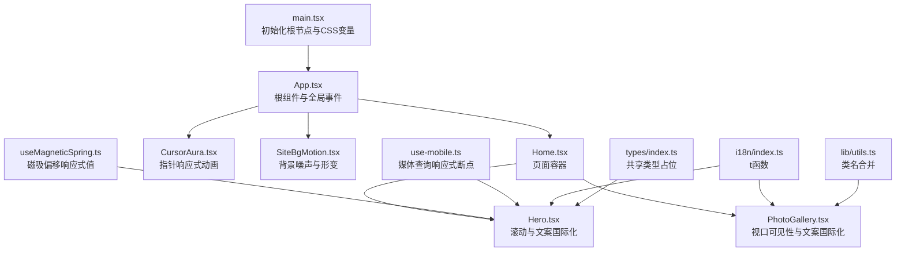
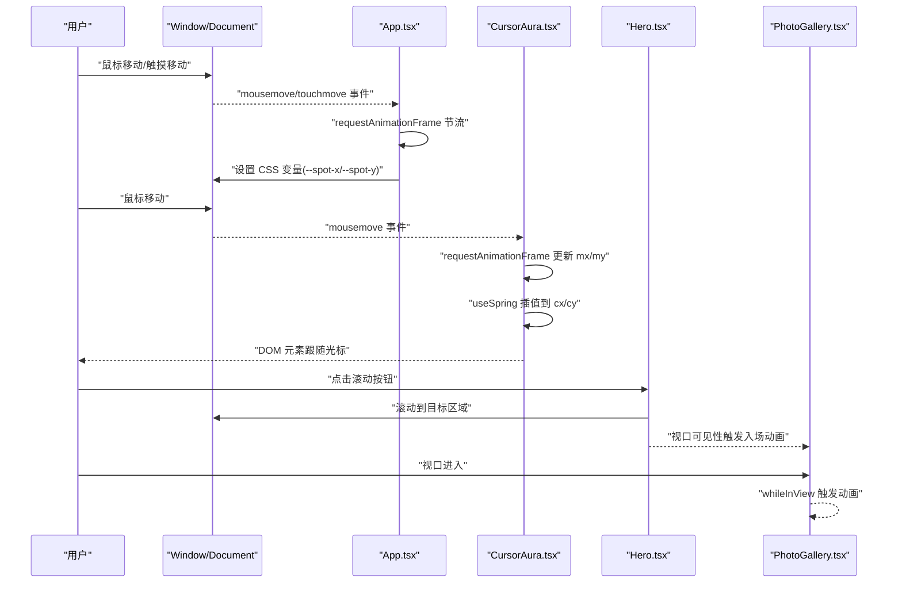
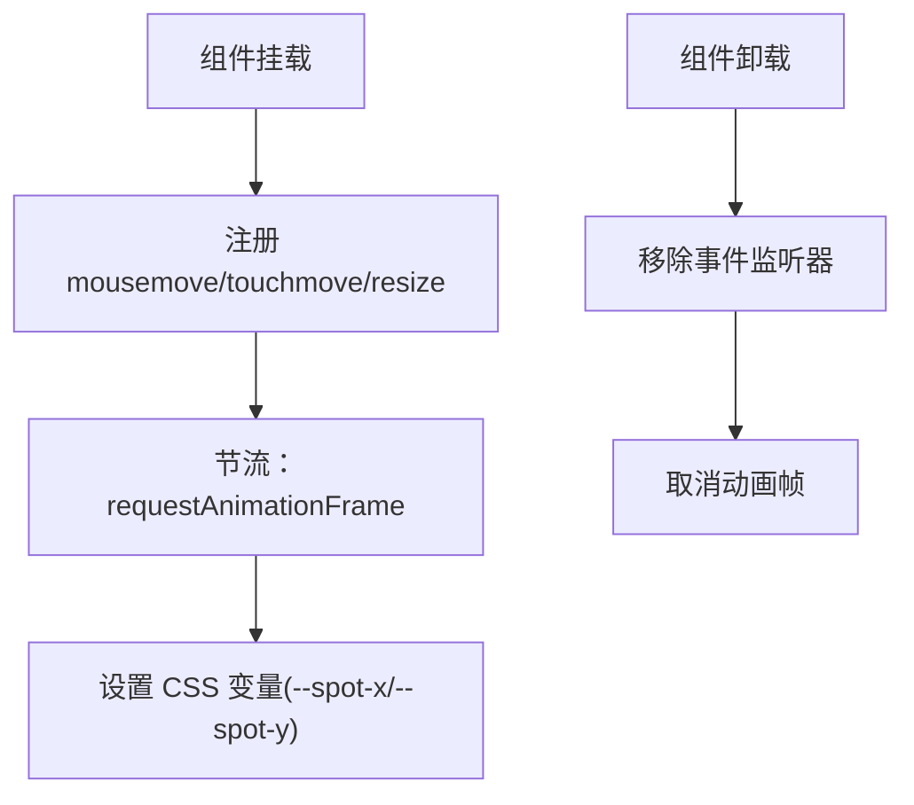
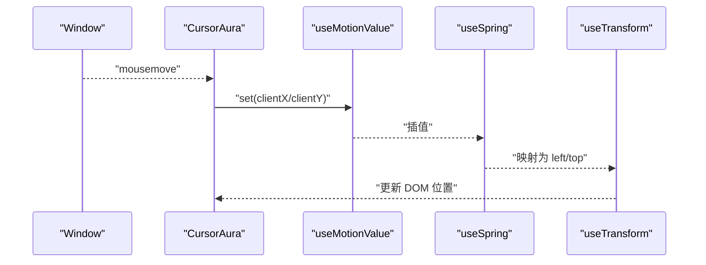
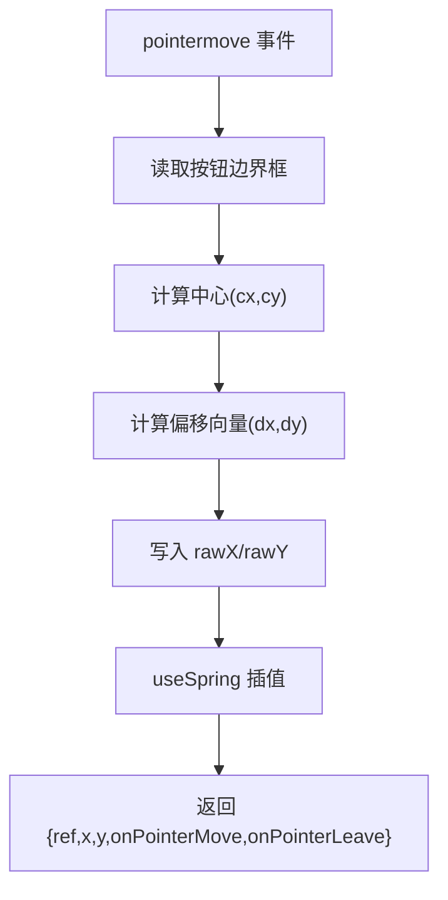
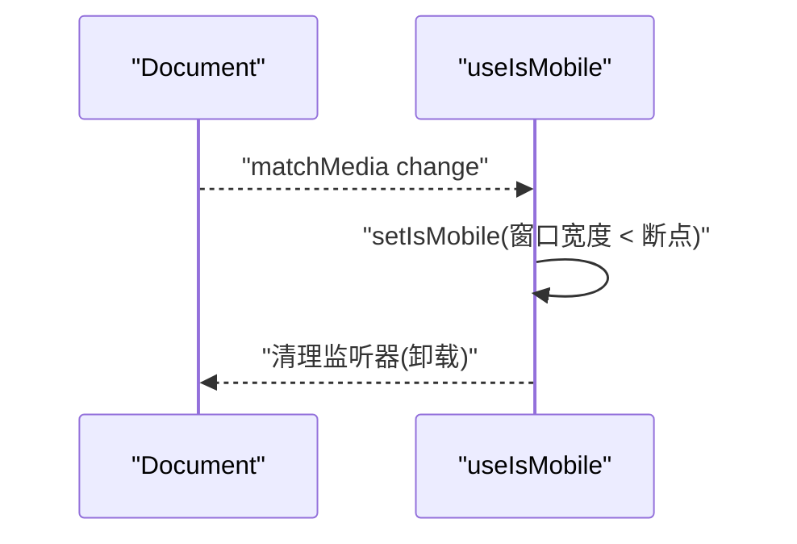
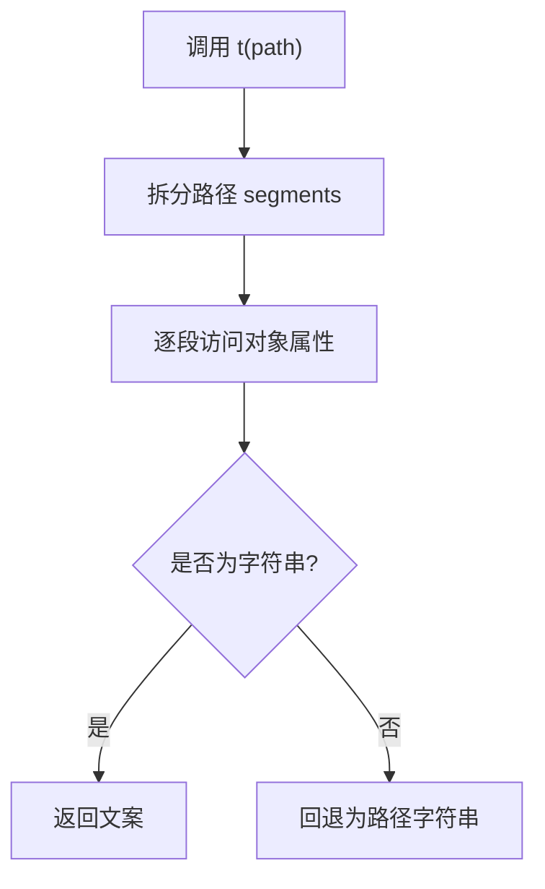
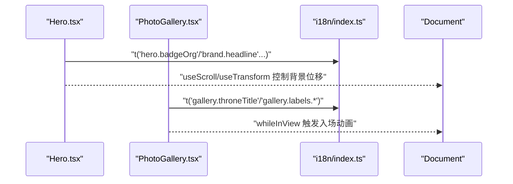
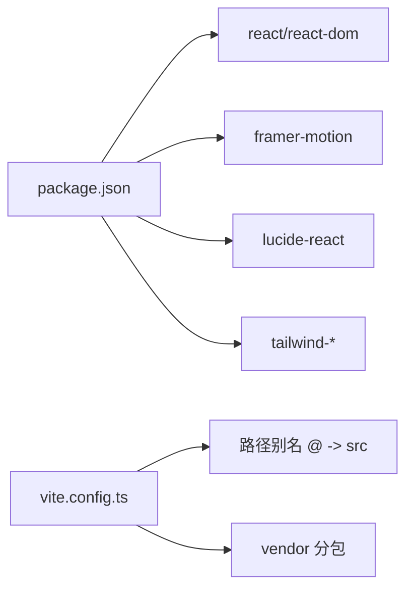

# 数据流架构

<cite>
**本文引用的文件**
- [src/App.tsx](file://src/App.tsx)
- [src/main.tsx](file://src/main.tsx)
- [src/hooks/useMagneticSpring.ts](file://src/hooks/useMagneticSpring.ts)
- [src/hooks/use-mobile.ts](file://src/hooks/use-mobile.ts)
- [src/i18n/index.ts](file://src/i18n/index.ts)
- [src/i18n/zh-CN.ts](file://src/i18n/zh-CN.ts)
- [src/components/CursorAura.tsx](file://src/components/CursorAura.tsx)
- [src/components/SiteBgMotion.tsx](file://src/components/SiteBgMotion.tsx)
- [src/components/Hero.tsx](file://src/components/Hero.tsx)
- [src/components/PhotoGallery.tsx](file://src/components/PhotoGallery.tsx)
- [src/pages/Home.tsx](file://src/pages/Home.tsx)
- [src/lib/utils.ts](file://src/lib/utils.ts)
- [src/types/index.ts](file://src/types/index.ts)
- [package.json](file://package.json)
- [vite.config.ts](file://vite.config.ts)
</cite>

## 目录
1. [简介](#简介)
2. [项目结构](#项目结构)
3. [核心组件](#核心组件)
4. [架构总览](#架构总览)
5. [详细组件分析](#详细组件分析)
6. [依赖关系分析](#依赖关系分析)
7. [性能考量](#性能考量)
8. [故障排查指南](#故障排查指南)
9. [结论](#结论)
10. [附录](#附录)

## 简介
本文件系统性梳理 MinLL 项目的数据流架构，覆盖以下主题：
- 用户输入事件处理：鼠标移动、触摸、指针事件如何驱动响应式数据（如光标位置、按钮磁吸偏移）。
- 状态更新机制：使用 Framer Motion 的 useMotionValue/useSpring 等响应式值，以及 React useState/useEffect 驱动 DOM 属性或 CSS 变量。
- 组件重渲染策略：基于响应式值的细粒度更新与视图绑定，避免不必要的整体重渲染。
- 自定义 Hook 的数据管理模式：useMagneticSpring、use-mobile 如何封装内部状态与副作用。
- 国际化数据传递：通过 t 函数进行点路径查找，确保文案在组件中按需加载。
- 响应式数据处理：滚动、视口可见性、减少动画偏好等场景下的数据到样式的映射。
- 事件监听器注册与清理：RAF 节流、被动事件监听、卸载清理，防止内存泄漏。
- 持久化与状态同步：当前仓库未实现持久化层，建议采用浏览器存储与页面状态同步策略。
- 错误边界：当前未实现错误边界，建议在应用根部引入错误边界以提升稳定性。
- 调试与性能监控：提供调试方法与可观察指标建议。

## 项目结构
MinLL 采用按功能域分层的组织方式：
- 根组件与入口：App.tsx 作为根组件，main.tsx 初始化全局 CSS 变量并挂载应用。
- 页面与组件：pages/Home.tsx 组合 Hero、PhotoGallery、Footer 等业务组件。
- UI 组件：components/ui 下为通用 UI 组件集合，components 下为页面级视觉与交互组件。
- 自定义 Hook：hooks 目录提供 useMagneticSpring、useIsMobile 等可复用逻辑。
- 国际化：i18n 提供 t 函数与 zh-CN 文案源。
- 工具与类型：lib/utils 提供类名合并工具，types 定义共享类型占位。

图表来源
- [src/main.tsx:1-18](file://src/main.tsx#L1-L18)
- [src/App.tsx:1-70](file://src/App.tsx#L1-L70)
- [src/pages/Home.tsx:1-15](file://src/pages/Home.tsx#L1-L15)
- [src/components/Hero.tsx:1-316](file://src/components/Hero.tsx#L1-L316)
- [src/components/PhotoGallery.tsx:1-162](file://src/components/PhotoGallery.tsx#L1-L162)
- [src/components/CursorAura.tsx:1-69](file://src/components/CursorAura.tsx#L1-L69)
- [src/components/SiteBgMotion.tsx:1-60](file://src/components/SiteBgMotion.tsx#L1-L60)
- [src/hooks/useMagneticSpring.ts:1-33](file://src/hooks/useMagneticSpring.ts#L1-L33)
- [src/hooks/use-mobile.ts:1-20](file://src/hooks/use-mobile.ts#L1-L20)
- [src/i18n/index.ts:1-17](file://src/i18n/index.ts#L1-L17)
- [src/lib/utils.ts:1-7](file://src/lib/utils.ts#L1-L7)
- [src/types/index.ts:1-3](file://src/types/index.ts#L1-L3)

章节来源
- [src/main.tsx:1-18](file://src/main.tsx#L1-L18)
- [src/App.tsx:1-70](file://src/App.tsx#L1-L70)
- [src/pages/Home.tsx:1-15](file://src/pages/Home.tsx#L1-L15)

## 核心组件
- 根组件与全局事件
  - 在根组件中注册鼠标移动、触摸移动、窗口尺寸变化事件，并通过 requestAnimationFrame 节流更新 CSS 变量，驱动“聚光灯”效果。
  - 卸载时统一清理事件监听器与动画帧，避免内存泄漏。
- 响应式光标组件
  - 使用 useMotionValue/useSpring 维护光标坐标，结合 useReducedMotion 适配无障碍设置。
  - 通过事件监听器更新运动值，再由 Framer Motion 将其映射为 DOM 位置。
- 磁吸偏移自定义 Hook
  - 使用 useMotionValue 记录原始偏移，useSpring 进行阻尼插值，回调中计算相对元素中心的偏移量。
  - 返回 ref、x/y 响应式值与事件处理器，便于在按钮上启用磁吸效果。
- 移动端断点检测 Hook
  - 使用 matchMedia 监听断点变化，维护 isMobile 状态并在卸载时清理。
- 国际化模块
  - t 函数通过点路径在 zhCN 中查找文案，找不到则回退为路径本身，保证健壮性。
- 页面容器与业务组件
  - Home 作为页面容器组合 Hero 与 PhotoGallery。
  - Hero 使用滚动与视口可见性驱动动画，文案来自国际化模块。
  - PhotoGallery 使用视口可见性触发入场动画，文案来自国际化模块。

章节来源
- [src/App.tsx:1-70](file://src/App.tsx#L1-L70)
- [src/components/CursorAura.tsx:1-69](file://src/components/CursorAura.tsx#L1-L69)
- [src/hooks/useMagneticSpring.ts:1-33](file://src/hooks/useMagneticSpring.ts#L1-L33)
- [src/hooks/use-mobile.ts:1-20](file://src/hooks/use-mobile.ts#L1-L20)
- [src/i18n/index.ts:1-17](file://src/i18n/index.ts#L1-L17)
- [src/i18n/zh-CN.ts:1-31](file://src/i18n/zh-CN.ts#L1-L31)
- [src/pages/Home.tsx:1-15](file://src/pages/Home.tsx#L1-L15)
- [src/components/Hero.tsx:1-316](file://src/components/Hero.tsx#L1-L316)
- [src/components/PhotoGallery.tsx:1-162](file://src/components/PhotoGallery.tsx#L1-L162)

## 架构总览
下图展示了从用户输入到组件渲染的关键数据流路径，以及响应式值与 DOM 的绑定关系。

图表来源
- [src/App.tsx:1-70](file://src/App.tsx#L1-L70)
- [src/components/CursorAura.tsx:1-69](file://src/components/CursorAura.tsx#L1-L69)
- [src/components/Hero.tsx:1-316](file://src/components/Hero.tsx#L1-L316)
- [src/components/PhotoGallery.tsx:1-162](file://src/components/PhotoGallery.tsx#L1-L162)

## 详细组件分析

### 根组件与全局事件数据流
- 事件注册
  - 注册 mousemove、touchstart、touchmove、resize 事件，均使用被动监听以提升滚动性能。
- 节流策略
  - 使用 requestAnimationFrame 合并高频事件，降低主线程压力。
- 状态更新
  - 通过 documentElement 设置 CSS 变量，驱动样式层的视觉效果。
- 清理策略
  - 卸载时统一移除事件监听器与取消动画帧，防止内存泄漏。

图表来源
- [src/App.tsx:1-70](file://src/App.tsx#L1-L70)

章节来源
- [src/App.tsx:1-70](file://src/App.tsx#L1-L70)

### 响应式光标组件数据流
- 输入事件
  - 监听鼠标移动与离开，使用 requestAnimationFrame 更新运动值。
- 响应式值
  - useMotionValue 记录目标位置，useSpring 进行平滑插值，useTransform 将插值结果映射为 left/top。
- 无障碍适配
  - 结合 useReducedMotion，在系统偏好关闭动画时直接返回空节点。

图表来源
- [src/components/CursorAura.tsx:1-69](file://src/components/CursorAura.tsx#L1-L69)

章节来源
- [src/components/CursorAura.tsx:1-69](file://src/components/CursorAura.tsx#L1-L69)

### 磁吸偏移自定义 Hook 数据流
- 输入事件
  - 接收按钮的 pointermove/pointerleave 事件。
- 计算逻辑
  - 获取按钮边界框中心，计算鼠标相对中心的偏移并乘以强度系数，写入 useMotionValue。
- 插值与输出
  - 使用 useSpring 对原始偏移进行插值，返回 ref、x/y 与事件处理器，供按钮使用。

图表来源
- [src/hooks/useMagneticSpring.ts:1-33](file://src/hooks/useMagneticSpring.ts#L1-L33)

章节来源
- [src/hooks/useMagneticSpring.ts:1-33](file://src/hooks/useMagneticSpring.ts#L1-L33)

### 移动端断点检测 Hook 数据流
- 媒体查询监听
  - 使用 matchMedia 监听断点变化，onChange 回调中更新 isMobile 状态。
- 生命周期管理
  - 卸载时移除监听器，避免内存泄漏。

图表来源
- [src/hooks/use-mobile.ts:1-20](file://src/hooks/use-mobile.ts#L1-L20)

章节来源
- [src/hooks/use-mobile.ts:1-20](file://src/hooks/use-mobile.ts#L1-L20)

### 国际化数据传递与回退机制
- 查找策略
  - t 函数按点路径遍历 zhCN 对象，命中则返回文案，否则回退为路径字符串。
- 使用场景
  - Hero 与 PhotoGallery 在渲染阶段调用 t，将文案注入到 DOM 文本节点。

图表来源
- [src/i18n/index.ts:1-17](file://src/i18n/index.ts#L1-L17)
- [src/i18n/zh-CN.ts:1-31](file://src/i18n/zh-CN.ts#L1-L31)

章节来源
- [src/i18n/index.ts:1-17](file://src/i18n/index.ts#L1-L17)
- [src/i18n/zh-CN.ts:1-31](file://src/i18n/zh-CN.ts#L1-L31)

### 页面容器与业务组件数据流
- Home 容器
  - 组合 Hero、PhotoGallery、Footer，负责页面布局与样式导入。
- Hero 动画与文案
  - 使用 useScroll/useTransform 基于滚动驱动背景与网格的位移。
  - 使用 whileHover/whileTap 等手势属性驱动按钮动画。
  - 文案通过 t 函数注入。
- PhotoGallery 动画与文案
  - 使用 whileInView 与 viewport 配置触发入场动画。
  - 文案通过 t 函数注入。

图表来源
- [src/pages/Home.tsx:1-15](file://src/pages/Home.tsx#L1-L15)
- [src/components/Hero.tsx:1-316](file://src/components/Hero.tsx#L1-L316)
- [src/components/PhotoGallery.tsx:1-162](file://src/components/PhotoGallery.tsx#L1-L162)
- [src/i18n/index.ts:1-17](file://src/i18n/index.ts#L1-L17)

章节来源
- [src/pages/Home.tsx:1-15](file://src/pages/Home.tsx#L1-L15)
- [src/components/Hero.tsx:1-316](file://src/components/Hero.tsx#L1-L316)
- [src/components/PhotoGallery.tsx:1-162](file://src/components/PhotoGallery.tsx#L1-L162)
- [src/i18n/index.ts:1-17](file://src/i18n/index.ts#L1-L17)

## 依赖关系分析
- 外部依赖
  - React 与 React DOM：应用运行时。
  - Framer Motion：响应式动画与运动值管理。
  - Lucide React：图标。
  - Tailwind 生态：样式与类名合并。
- 构建与打包
  - Vite：开发与构建工具，配置了别名与分包策略。
  - TypeScript：类型检查。
- 运行时依赖
  - 浏览器 API：matchMedia、addEventListener、requestAnimationFrame、CSS 变量。

图表来源
- [package.json:1-84](file://package.json#L1-L84)
- [vite.config.ts:1-26](file://vite.config.ts#L1-L26)

章节来源
- [package.json:1-84](file://package.json#L1-L84)
- [vite.config.ts:1-26](file://vite.config.ts#L1-L26)

## 性能考量
- 事件节流
  - 使用 requestAnimationFrame 合并高频事件，降低主线程压力与重绘次数。
- 被动事件监听
  - 触摸与鼠标事件使用被动监听，提升滚动性能。
- 响应式值与细粒度更新
  - 使用 Framer Motion 的运动值与变换，仅更新受影响的样式属性，避免整树重渲染。
- 动画偏好适配
  - 结合 useReducedMotion，在系统偏好关闭动画时直接返回空节点，减少计算与绘制。
- 图像懒加载与解码异步
  - 图片使用 lazy 与 async，减轻首屏压力。
- 分包与缓存
  - Vite 配置 vendor 分包，利于浏览器缓存与并行下载。

章节来源
- [src/App.tsx:1-70](file://src/App.tsx#L1-L70)
- [src/components/CursorAura.tsx:1-69](file://src/components/CursorAura.tsx#L1-L69)
- [src/components/PhotoGallery.tsx:1-162](file://src/components/PhotoGallery.tsx#L1-L162)
- [vite.config.ts:1-26](file://vite.config.ts#L1-L26)

## 故障排查指南
- 内存泄漏排查
  - 确认所有事件监听器在卸载时被移除，包括 requestAnimationFrame 的取消。
  - 检查媒体查询监听器是否在组件卸载时清理。
- 动画异常
  - 若动画卡顿，检查是否有过多同步布局读取或频繁写入样式。
  - 确保使用被动监听与 requestAnimationFrame 节流。
- 国际化文案缺失
  - 检查点路径是否正确，确认 zhCN 中存在对应键值。
- 视口动画未触发
  - 检查 viewport 配置与 once 参数，确认容器可见性与 margin 设置合理。

章节来源
- [src/App.tsx:1-70](file://src/App.tsx#L1-L70)
- [src/hooks/use-mobile.ts:1-20](file://src/hooks/use-mobile.ts#L1-L20)
- [src/i18n/index.ts:1-17](file://src/i18n/index.ts#L1-L17)

## 结论
MinLL 的数据流以“事件驱动 + 响应式值”为核心，通过 requestAnimationFrame 节流与被动监听优化性能，利用 Framer Motion 的运动值与变换实现精细动画控制。国际化模块提供稳定的文案注入机制，移动端断点检测 Hook 支持响应式布局。建议后续增强持久化与错误边界能力，以进一步提升用户体验与稳定性。

## 附录
- 数据持久化与状态同步建议
  - 使用 localStorage/sessionStorage 存储轻量状态（如用户偏好），在应用启动时恢复。
  - 对于复杂状态，可考虑使用 Zustand 或 Redux Toolkit，配合中间件记录日志与时间旅行调试。
  - 与路由状态联动时，保持 URL 与应用状态一致，避免状态漂移。
- 错误边界建议
  - 在根组件包裹错误边界组件，捕获子树渲染错误并降级显示。
  - 记录错误堆栈与上下文信息，便于定位问题。
- 调试与性能监控
  - 使用 React DevTools Profiler 观察渲染热点。
  - 使用浏览器性能面板测量长任务与重排重绘。
  - 为关键路径添加性能指标（如 FP/FCP/LCP/FID/CLS）观测点。