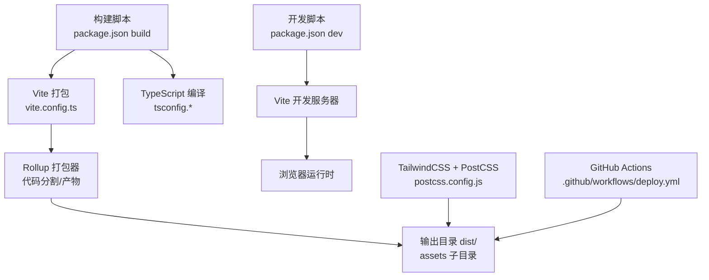
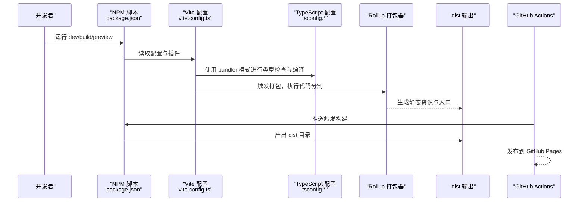
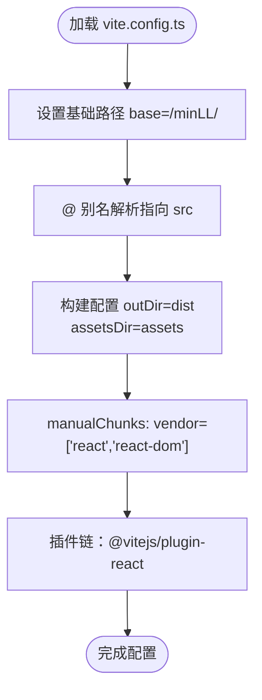
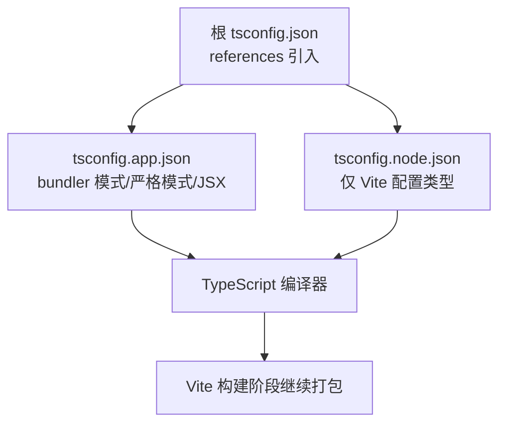
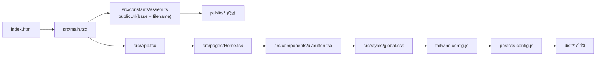
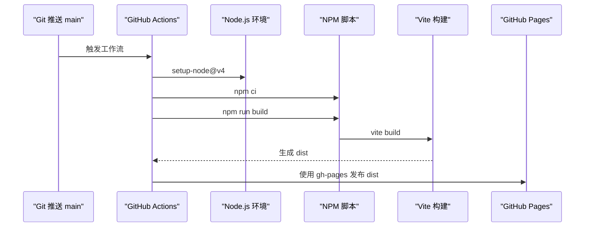
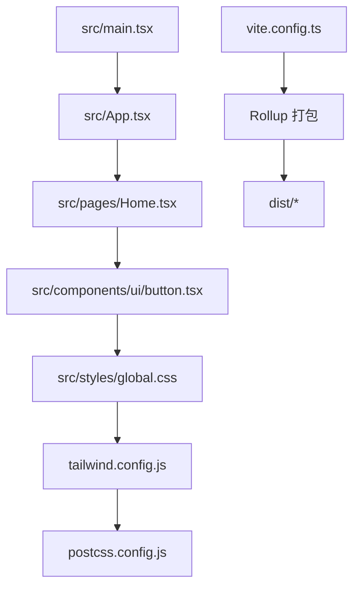

# 构建架构

<cite>
**本文引用的文件**
- [vite.config.ts](file://vite.config.ts)
- [package.json](file://package.json)
- [tsconfig.json](file://tsconfig.json)
- [tsconfig.app.json](file://tsconfig.app.json)
- [tsconfig.node.json](file://tsconfig.node.json)
- [tailwind.config.js](file://tailwind.config.js)
- [postcss.config.js](file://postcss.config.js)
- [.github/workflows/deploy.yml](file://.github/workflows/deploy.yml)
- [src/main.tsx](file://src/main.tsx)
- [src/App.tsx](file://src/App.tsx)
- [index.html](file://index.html)
- [eslint.config.js](file://eslint.config.js)
- [src/components/ui/button.tsx](file://src/components/ui/button.tsx)
- [src/pages/Home.tsx](file://src/pages/Home.tsx)
- [src/styles/global.css](file://src/styles/global.css)
- [src/constants/assets.ts](file://src/constants/assets.ts)
</cite>

## 目录
1. [简介](#简介)
2. [项目结构](#项目结构)
3. [核心组件](#核心组件)
4. [架构总览](#架构总览)
5. [详细组件分析](#详细组件分析)
6. [依赖关系分析](#依赖关系分析)
7. [性能考量](#性能考量)
8. [故障排查指南](#故障排查指南)
9. [结论](#结论)
10. [附录](#附录)

## 简介
本文件系统性梳理 MinLL 项目的构建架构，围绕基于 Vite 的前端工程体系展开，覆盖配置文件作用机制、代码分割策略、模块解析规则、TypeScript 编译与类型检查、路径别名、资源处理与输出目录、开发服务器与热重载、生产构建优化与缓存、以及 GitHub Actions 的 CI/CD 自动化部署流程。文档同时提供可视化图示帮助不同技术背景的读者快速理解。

## 项目结构
MinLL 采用 Vite 作为构建与开发工具链，结合 TypeScript、TailwindCSS 和 PostCSS 实现现代化前端工程实践。项目关键文件与职责如下：
- 构建与开发：Vite 配置、开发脚本、预览与打包脚本
- 类型系统：多 tsconfig 文件分层管理应用与 Node 工具链
- 样式管线：TailwindCSS + PostCSS 自动前缀与按需生成
- 资源与别名：路径别名统一导入、public 资源通过 BASE_URL 解析
- 质量保障：ESLint 配置与 React Refresh 规则
- 自动化：GitHub Actions 在主分支推送时自动构建并发布到 GitHub Pages

图表来源
- [package.json:6-12](file://package.json#L6-L12)
- [vite.config.ts:14-24](file://vite.config.ts#L14-L24)
- [tsconfig.json:1-17](file://tsconfig.json#L1-L17)
- [postcss.config.js:1-7](file://postcss.config.js#L1-L7)
- [.github/workflows/deploy.yml:12-34](file://.github/workflows/deploy.yml#L12-L34)

章节来源
- [package.json:6-12](file://package.json#L6-L12)
- [vite.config.ts:1-26](file://vite.config.ts#L1-L26)
- [tsconfig.json:1-17](file://tsconfig.json#L1-L17)
- [postcss.config.js:1-7](file://postcss.config.js#L1-L7)
- [.github/workflows/deploy.yml:1-34](file://.github/workflows/deploy.yml#L1-L34)

## 核心组件
- Vite 配置与插件
  - 插件：React 插件启用 JSX/TSX 支持与开发体验增强
  - 路径别名：通过解析器别名将 @ 指向 src 目录，提升导入可读性
  - 基础路径：base 设置为 /minLL/，适配 GitHub Pages 子路径部署
  - 产物目录：outDir 为 dist，静态资源放置在 assets 子目录
  - 代码分割：manualChunks 将 react 与 react-dom 提升为独立 vendor 包
- TypeScript 多配置文件
  - 根 tsconfig.json 引用 app 与 node 两套配置
  - app 配置：bundler 模式、严格模式、JSX 语法、路径别名同步
  - node 配置：仅用于 Vite 配置文件的类型检查
- 样式管线
  - TailwindCSS 内容扫描范围覆盖根 HTML 与 src 下所有 TS/JS/TSX 文件
  - PostCSS 启用 Tailwind 与 Autoprefixer，确保跨浏览器兼容
- 资源与别名
  - 路径别名：@/* 对应 src/*
  - public 资源：通过 import.meta.env.BASE_URL 与工具函数拼接完整 URL
- 质量与开发体验
  - ESLint：推荐规则 + React Hooks + React Refresh
  - 开发脚本：dev、preview、build、lint、deploy
- CI/CD
  - Actions：安装依赖、构建、使用 gh-pages 插件发布到 GitHub Pages

章节来源
- [vite.config.ts:6-26](file://vite.config.ts#L6-L26)
- [tsconfig.json:1-17](file://tsconfig.json#L1-L17)
- [tsconfig.app.json:1-35](file://tsconfig.app.json#L1-L35)
- [tsconfig.node.json:1-27](file://tsconfig.node.json#L1-L27)
- [tailwind.config.js:1-84](file://tailwind.config.js#L1-L84)
- [postcss.config.js:1-7](file://postcss.config.js#L1-L7)
- [package.json:6-12](file://package.json#L6-L12)
- [eslint.config.js:1-24](file://eslint.config.js#L1-L24)

## 架构总览
下图展示从开发到生产的端到端流程，涵盖配置、编译、打包、样式与资源处理，以及自动化部署。

图表来源
- [package.json:6-12](file://package.json#L6-L12)
- [vite.config.ts:6-26](file://vite.config.ts#L6-L26)
- [tsconfig.app.json:17-23](file://tsconfig.app.json#L17-L23)
- [.github/workflows/deploy.yml:12-34](file://.github/workflows/deploy.yml#L12-L34)

## 详细组件分析

### Vite 配置与模块解析
- 路径别名
  - 通过解析器别名将 @ 映射到 src，便于相对路径导入
  - TypeScript 配置同步 baseUrl 与 paths，保证编辑器与编译一致
- 基础路径与部署
  - base 设为 /minLL/，适配 GitHub Pages 子路径部署场景
  - public 资源通过 import.meta.env.BASE_URL 与工具函数拼接
- 代码分割策略
  - manualChunks 将 react 与 react-dom 提升为 vendor 包，利于 CDN 缓存与复用
- 产物目录与资源组织
  - outDir 为 dist；assetsDir 为 assets，静态资源按 Rollup 默认策略命名
- 插件链
  - React 插件提供 JSX/TSX 支持与开发期优化

图表来源
- [vite.config.ts:6-26](file://vite.config.ts#L6-L26)
- [tsconfig.json:11-16](file://tsconfig.json#L11-L16)

章节来源
- [vite.config.ts:6-26](file://vite.config.ts#L6-L26)
- [tsconfig.json:11-16](file://tsconfig.json#L11-L16)

### TypeScript 编译与类型检查
- 配置分层
  - 根 tsconfig.json 通过 references 引入 app 与 node 两套配置
  - app 配置启用 bundler 模式、严格模式、JSX 与路径别名
  - node 配置限定于 Vite 配置文件的类型需求
- 编译命令
  - package.json 中 build 脚本先执行 tsc -b，再执行 vite build，确保类型检查先行
- 路径别名一致性
  - tsconfig.json 与 tsconfig.app.json 的 baseUrl 与 paths 保持一致，避免运行时与编译时差异

图表来源
- [tsconfig.json:1-17](file://tsconfig.json#L1-L17)
- [tsconfig.app.json:1-35](file://tsconfig.app.json#L1-L35)
- [tsconfig.node.json:1-27](file://tsconfig.node.json#L1-L27)

章节来源
- [tsconfig.json:1-17](file://tsconfig.json#L1-L17)
- [tsconfig.app.json:1-35](file://tsconfig.app.json#L1-L35)
- [tsconfig.node.json:1-27](file://tsconfig.node.json#L1-L27)
- [package.json](file://package.json#L8)

### 样式与资源处理
- TailwindCSS
  - content 扫描根 HTML 与 src 下 TS/JS/TSX 文件，确保按需生成样式
  - 主题扩展与动画定义集中管理，支持深色模式与自定义变量
- PostCSS
  - 启用 tailwindcss 与 autoprefixer，自动添加厂商前缀并缩小无关样式
- 资源解析
  - publicUrl 工具函数结合 import.meta.env.BASE_URL，统一解析 public 目录下的资源
  - index.html 中的静态资源链接与动态注入均遵循 base 路径

图表来源
- [index.html:1-21](file://index.html#L1-L21)
- [src/main.tsx:1-18](file://src/main.tsx#L1-L18)
- [src/constants/assets.ts:1-24](file://src/constants/assets.ts#L1-L24)
- [src/App.tsx:1-70](file://src/App.tsx#L1-L70)
- [src/pages/Home.tsx:1-15](file://src/pages/Home.tsx#L1-L15)
- [src/components/ui/button.tsx:1-63](file://src/components/ui/button.tsx#L1-L63)
- [src/styles/global.css:1-294](file://src/styles/global.css#L1-L294)
- [tailwind.config.js:1-84](file://tailwind.config.js#L1-L84)
- [postcss.config.js:1-7](file://postcss.config.js#L1-L7)

章节来源
- [tailwind.config.js:1-84](file://tailwind.config.js#L1-L84)
- [postcss.config.js:1-7](file://postcss.config.js#L1-L7)
- [src/constants/assets.ts:1-24](file://src/constants/assets.ts#L1-L24)
- [index.html:1-21](file://index.html#L1-L21)

### 开发服务器、热重载与代理
- 开发脚本
  - package.json 中 dev 指向 vite，启动本地开发服务器
- 热重载机制
  - Vite 默认内置 HMR，React Refresh 与 ESLint 配置共同提升开发体验
- 代理设置
  - 当前仓库未见显式代理配置；如需后端联调，可在 vite.config.ts 中添加 server.proxy 以满足跨域与转发需求

章节来源
- [package.json](file://package.json#L7)
- [eslint.config.js:1-24](file://eslint.config.js#L1-L24)

### 生产构建优化与缓存
- 代码分割
  - manualChunks 将 react 与 react-dom 提升为 vendor 包，有利于浏览器缓存与 CDN 分发
- 产物目录
  - outDir=dist，assetsDir=assets，静态资源按 Rollup 命名策略输出
- 缓存策略
  - 建议在服务器或 GitHub Pages 上对 dist/** 设置长缓存，并对入口 HTML 设置较短缓存
  - vendor 包名稳定，可进一步利用浏览器缓存减少重复下载

章节来源
- [vite.config.ts:14-24](file://vite.config.ts#L14-L24)

### CI/CD 与自动化部署
- 触发条件
  - 推送到 main 分支时触发工作流
- 步骤概览
  - 检出代码、设置 Node.js 版本与 npm 缓存
  - 安装依赖、执行构建脚本
  - 使用 peaceiris/actions-gh-pages 将 dist 目录发布到 GitHub Pages
- 环境变量
  - 工作流中设置 FORCE_JAVASCRIPT_ACTIONS_TO_NODE24，确保 JavaScript 动作使用 Node 24

图表来源
- [.github/workflows/deploy.yml:1-34](file://.github/workflows/deploy.yml#L1-L34)

章节来源
- [.github/workflows/deploy.yml:1-34](file://.github/workflows/deploy.yml#L1-L34)

## 依赖关系分析
- 组件耦合
  - src/main.tsx 依赖 App.tsx、全局样式与常量资源
  - App.tsx 依赖页面组件与 UI 组件，形成自上而下的依赖链
  - UI 组件依赖样式工具与 Tailwind 变量，最终由 Tailwind 与 PostCSS 生成产物
- 配置耦合
  - vite.config.ts 与 tsconfig.* 之间存在路径别名与模块解析的一致性要求
  - tailwind.config.js 与 postcss.config.js 影响最终 CSS 产物大小与兼容性
- 外部依赖
  - React 与 Radix UI 组件生态广泛使用，建议关注版本升级与废弃 API

图表来源
- [src/main.tsx:1-18](file://src/main.tsx#L1-L18)
- [src/App.tsx:1-70](file://src/App.tsx#L1-L70)
- [src/pages/Home.tsx:1-15](file://src/pages/Home.tsx#L1-L15)
- [src/components/ui/button.tsx:1-63](file://src/components/ui/button.tsx#L1-L63)
- [src/styles/global.css:1-294](file://src/styles/global.css#L1-L294)
- [tailwind.config.js:1-84](file://tailwind.config.js#L1-L84)
- [postcss.config.js:1-7](file://postcss.config.js#L1-L7)
- [vite.config.ts:14-24](file://vite.config.ts#L14-L24)

章节来源
- [src/main.tsx:1-18](file://src/main.tsx#L1-L18)
- [src/App.tsx:1-70](file://src/App.tsx#L1-L70)
- [src/pages/Home.tsx:1-15](file://src/pages/Home.tsx#L1-L15)
- [src/components/ui/button.tsx:1-63](file://src/components/ui/button.tsx#L1-L63)
- [src/styles/global.css:1-294](file://src/styles/global.css#L1-L294)

## 性能考量
- 代码分割
  - 将第三方库拆分为 vendor 包，提升缓存命中率
- 资源体积
  - TailwindCSS 按需扫描内容，避免引入未使用的样式
  - 建议在生产环境开启压缩与 Tree Shaking（Vite 默认启用）
- 缓存策略
  - 对静态资源设置强缓存，对 HTML 设置短缓存
  - 使用内容哈希文件名（Vite 默认行为）提升缓存有效性
- 开发体验
  - HMR 与 React Refresh 提升迭代效率，建议保持默认配置

[本节为通用性能建议，不直接分析具体文件]

## 故障排查指南
- 路径别名无效
  - 确认 vite.config.ts 与 tsconfig.* 的 baseUrl 与 paths 一致
  - 检查编辑器是否正确读取 tsconfig.json 的 references
- 资源 404（GitHub Pages 子路径）
  - 确认 vite.config.ts 的 base 为 /minLL/，且 publicUrl 正确拼接 import.meta.env.BASE_URL
- 构建失败（TypeScript）
  - 先执行 tsc -b 检查类型错误，再执行 vite build
- ESLint 报错
  - 检查 eslint.config.js 的 extends 与语言选项是否匹配当前项目
- 预览与部署不一致
  - 使用 npm run preview 验证产物路径与资源加载是否正常

章节来源
- [vite.config.ts:6-26](file://vite.config.ts#L6-L26)
- [tsconfig.json:1-17](file://tsconfig.json#L1-L17)
- [tsconfig.app.json:1-35](file://tsconfig.app.json#L1-L35)
- [src/constants/assets.ts:1-24](file://src/constants/assets.ts#L1-L24)
- [package.json](file://package.json#L8)
- [eslint.config.js:1-24](file://eslint.config.js#L1-L24)

## 结论
MinLL 的构建架构以 Vite 为核心，配合 TypeScript、TailwindCSS 与 PostCSS，实现了清晰的配置分层、高效的开发体验与可控的生产产物。通过路径别名、代码分割与按需样式生成，项目在可维护性与性能之间取得平衡。CI/CD 流程自动化地将构建产物发布至 GitHub Pages，降低了部署门槛。建议在后续迭代中持续关注第三方依赖更新、样式体积优化与缓存策略完善。

[本节为总结性内容，不直接分析具体文件]

## 附录
- 关键配置清单
  - Vite：base、resolve.alias、build.outDir、build.assetsDir、rollupOptions.output.manualChunks、plugins
  - TypeScript：references、compilerOptions.baseUrl、compilerOptions.paths、moduleResolution、jsx
  - TailwindCSS：content、theme.extend、plugins
  - PostCSS：plugins.tailwindcss、plugins.autoprefixer
  - NPM Scripts：dev、build、preview、lint、deploy
  - GitHub Actions：触发条件、步骤与发布目标

[本节为概览性内容，不直接分析具体文件]