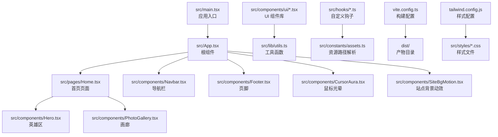
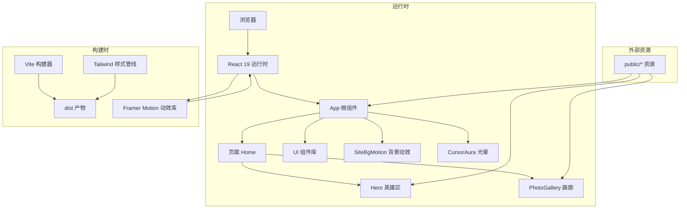
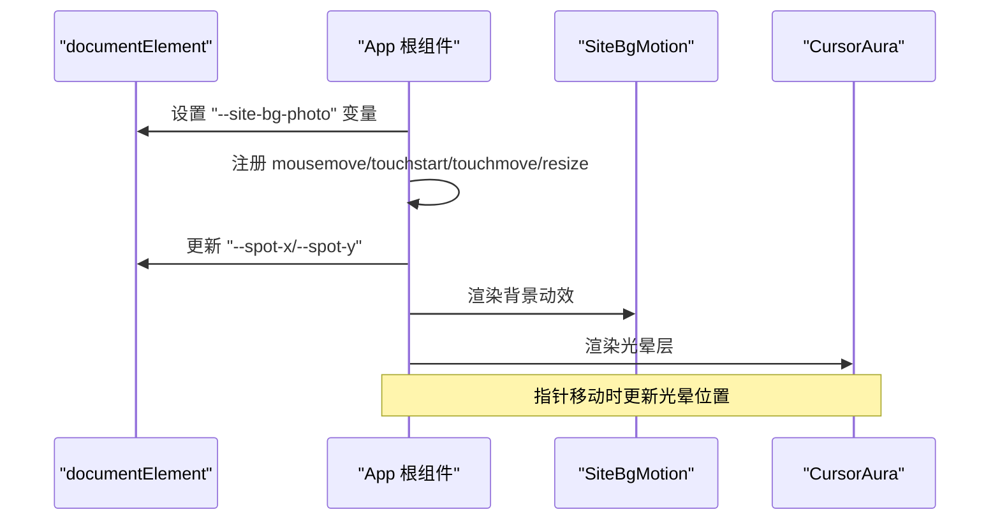
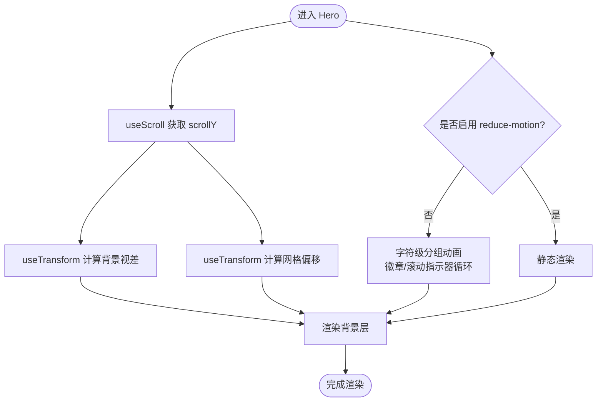
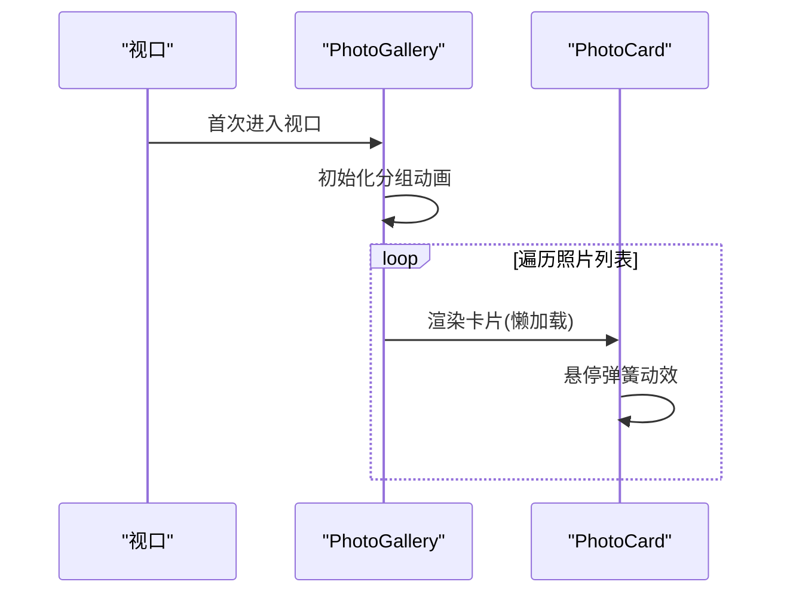
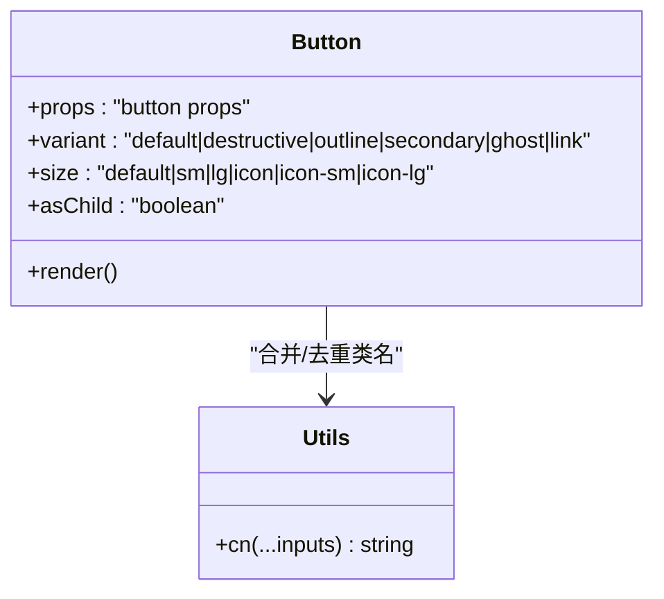
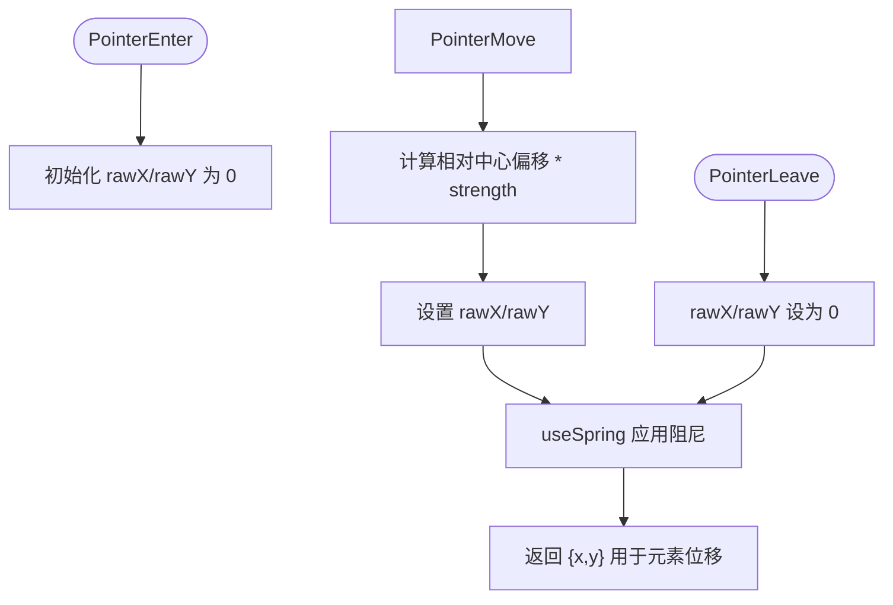
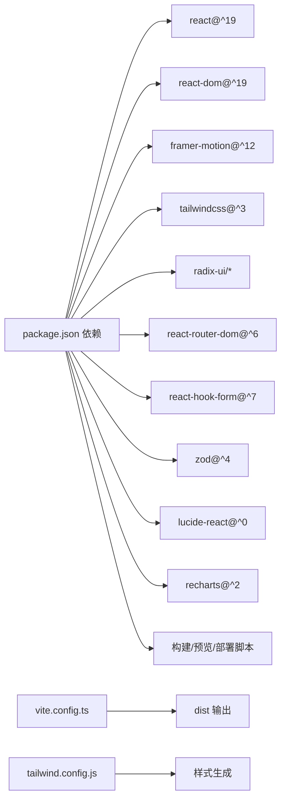
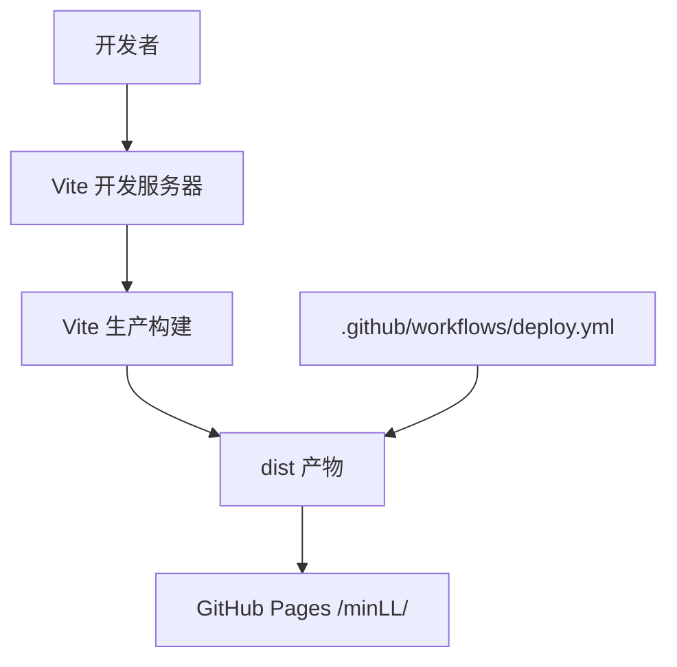

# 架构设计

<cite>
**本文引用的文件**
- [package.json](file://package.json)
- [README.md](file://README.md)
- [vite.config.ts](file://vite.config.ts)
- [tailwind.config.js](file://tailwind.config.js)
- [src/main.tsx](file://src/main.tsx)
- [src/App.tsx](file://src/App.tsx)
- [src/pages/Home.tsx](file://src/pages/Home.tsx)
- [src/components/ui/button.tsx](file://src/components/ui/button.tsx)
- [src/components/CursorAura.tsx](file://src/components/CursorAura.tsx)
- [src/components/SiteBgMotion.tsx](file://src/components/SiteBgMotion.tsx)
- [src/components/Hero.tsx](file://src/components/Hero.tsx)
- [src/components/PhotoGallery.tsx](file://src/components/PhotoGallery.tsx)
- [src/constants/assets.ts](file://src/constants/assets.ts)
- [src/hooks/useMagneticSpring.ts](file://src/hooks/useMagneticSpring.ts)
- [src/lib/utils.ts](file://src/lib/utils.ts)
- [.github/workflows/deploy.yml](file://.github/workflows/deploy.yml)
</cite>

## 目录
1. [引言](#引言)
2. [项目结构](#项目结构)
3. [核心组件](#核心组件)
4. [架构总览](#架构总览)
5. [详细组件分析](#详细组件分析)
6. [依赖关系分析](#依赖关系分析)
7. [性能考量](#性能考量)
8. [故障排查指南](#故障排查指南)
9. [结论](#结论)
10. [附录](#附录)

## 引言
本架构设计文档面向 MinLL 项目，目标是提供从高层到代码级的系统设计说明，涵盖架构模式、组件层次、数据与控制流、集成方式、技术选型权衡、基础设施与部署拓扑、可扩展性与安全、监控与灾备等横切关注点，并给出技术栈、第三方依赖与版本兼容性信息。

MinLL 是一个以 React 19 为核心、使用 Vite 构建、采用 Framer Motion 实现动效、用 Tailwind CSS 做样式体系的前端单页应用（SPA）。项目强调视觉表现力与交互体验，通过组件化与可复用 UI 组件库、动效钩子与全局状态注入，构建沉浸式主页与画廊页面。

## 项目结构
项目采用按功能域分层的组织方式：入口与根组件位于 src 下，页面组件在 pages，通用 UI 组件在 components/ui，业务组件在 components，国际化与常量在 i18n 与 constants，工具函数在 lib，样式在 styles，类型定义在 types，动画与过渡逻辑在 utils。

图表来源
- [src/main.tsx:1-18](file://src/main.tsx#L1-L18)
- [src/App.tsx:1-70](file://src/App.tsx#L1-L70)
- [src/pages/Home.tsx:1-15](file://src/pages/Home.tsx#L1-L15)
- [src/components/Hero.tsx:1-316](file://src/components/Hero.tsx#L1-L316)
- [src/components/PhotoGallery.tsx:1-166](file://src/components/PhotoGallery.tsx#L1-L166)
- [src/components/CursorAura.tsx:1-69](file://src/components/CursorAura.tsx#L1-L69)
- [src/components/SiteBgMotion.tsx:1-60](file://src/components/SiteBgMotion.tsx#L1-L60)
- [src/components/ui/button.tsx:1-63](file://src/components/ui/button.tsx#L1-L63)
- [src/lib/utils.ts:1-7](file://src/lib/utils.ts#L1-L7)
- [src/constants/assets.ts:1-24](file://src/constants/assets.ts#L1-L24)
- [vite.config.ts:1-26](file://vite.config.ts#L1-L26)
- [tailwind.config.js:1-84](file://tailwind.config.js#L1-L84)

章节来源
- [src/main.tsx:1-18](file://src/main.tsx#L1-L18)
- [src/App.tsx:1-70](file://src/App.tsx#L1-L70)
- [vite.config.ts:1-26](file://vite.config.ts#L1-L26)
- [tailwind.config.js:1-84](file://tailwind.config.js#L1-L84)

## 核心组件
- 应用入口与根组件
  - 入口负责设置站点背景变量并渲染根组件；根组件负责全局动效与布局容器。
- 页面与业务组件
  - 首页聚合英雄区、画廊与页脚；英雄区承载品牌文案、滚动视差与多层动效；画廊实现懒加载与分组展示。
- UI 组件库
  - 基于 Radix UI 与 class-variance-authority 的可变样式按钮等组件，统一风格与可访问性。
- 自定义动效与交互
  - 使用 Framer Motion 提供的 useMotionValue/useSpring/useTransform 等实现光晕跟随、背景 blob 动画、滚动驱动的视差等。
- 资源与国际化
  - 资源路径通过公共前缀解析；国际化键值在页面中消费。

章节来源
- [src/main.tsx:1-18](file://src/main.tsx#L1-L18)
- [src/App.tsx:1-70](file://src/App.tsx#L1-L70)
- [src/pages/Home.tsx:1-15](file://src/pages/Home.tsx#L1-L15)
- [src/components/Hero.tsx:1-316](file://src/components/Hero.tsx#L1-L316)
- [src/components/PhotoGallery.tsx:1-166](file://src/components/PhotoGallery.tsx#L1-L166)
- [src/components/ui/button.tsx:1-63](file://src/components/ui/button.tsx#L1-L63)
- [src/components/CursorAura.tsx:1-69](file://src/components/CursorAura.tsx#L1-L69)
- [src/components/SiteBgMotion.tsx:1-60](file://src/components/SiteBgMotion.tsx#L1-L60)
- [src/constants/assets.ts:1-24](file://src/constants/assets.ts#L1-L24)

## 架构总览
MinLL 采用“入口 -> 根组件 -> 页面 -> 业务组件”的单向数据流与事件流。根组件通过全局 CSS 变量与事件监听注入动态视觉效果；页面组件组合业务组件与 UI 组件；构建阶段由 Vite 处理模块与资源打包；样式通过 Tailwind 与主题变量统一管理；动效由 Framer Motion 驱动。

图表来源
- [src/App.tsx:1-70](file://src/App.tsx#L1-L70)
- [src/pages/Home.tsx:1-15](file://src/pages/Home.tsx#L1-L15)
- [src/components/Hero.tsx:1-316](file://src/components/Hero.tsx#L1-L316)
- [src/components/PhotoGallery.tsx:1-166](file://src/components/PhotoGallery.tsx#L1-L166)
- [src/components/SiteBgMotion.tsx:1-60](file://src/components/SiteBgMotion.tsx#L1-L60)
- [src/components/CursorAura.tsx:1-69](file://src/components/CursorAura.tsx#L1-L69)
- [vite.config.ts:1-26](file://vite.config.ts#L1-L26)
- [tailwind.config.js:1-84](file://tailwind.config.js#L1-L84)

## 详细组件分析

### 根组件与全局动效
- 角色与职责
  - 注入站点背景图片变量，维护鼠标位置的 CSS 变量，渲染背景动效与光晕层，组织页面主内容区域。
- 关键流程
  - 初始化：设置 CSS 变量；注册鼠标/触摸/窗口尺寸事件；在卸载时清理。
  - 动效：背景 blob 循环动画；光晕跟随指针并带弹簧阻尼；滚动驱动的视差背景。
- 性能与可访问性
  - 使用 requestAnimationFrame 降低重绘开销；尊重 reduce-motion；在移动端启用被动事件监听。

图表来源
- [src/App.tsx:1-70](file://src/App.tsx#L1-L70)
- [src/components/SiteBgMotion.tsx:1-60](file://src/components/SiteBgMotion.tsx#L1-L60)
- [src/components/CursorAura.tsx:1-69](file://src/components/CursorAura.tsx#L1-L69)

章节来源
- [src/App.tsx:1-70](file://src/App.tsx#L1-L70)
- [src/main.tsx:1-18](file://src/main.tsx#L1-L18)

### 英雄区组件（Hero）
- 角色与职责
  - 展示品牌标语、副标题与描述；提供滚动提示；承载 Logo 卡片与环境光效。
- 动画策略
  - 使用 useScroll/useTransform 驱动背景视差与网格位移；文本逐字分组动画；徽章与滚动指示器循环动画。
- 可访问性
  - 文本拆分为字符级元素，支持 reduce-motion；提供语义化标签与 aria 属性。

图表来源
- [src/components/Hero.tsx:1-316](file://src/components/Hero.tsx#L1-L316)

章节来源
- [src/components/Hero.tsx:1-316](file://src/components/Hero.tsx#L1-L316)

### 画廊组件（PhotoGallery）
- 角色与职责
  - 分区展示“王座照”与“全身照”，每张卡片懒加载，悬停带弹性动效，支持首屏后视口进入触发。
- 动画策略
  - 使用 whileInView 与 viewport 配置触发；卡片悬停使用弹簧动画；分组使用 stagger 子动画。
- 性能优化
  - 图片懒加载与异步解码；过渡延迟按索引递增，避免同时触发。

图表来源
- [src/components/PhotoGallery.tsx:1-166](file://src/components/PhotoGallery.tsx#L1-L166)

章节来源
- [src/components/PhotoGallery.tsx:1-166](file://src/components/PhotoGallery.tsx#L1-L166)

### UI 组件库（以 Button 为例）
- 设计要点
  - 基于 Variants 模式与 class-variance-authority 组合类名；Slot 支持语义标签切换；统一聚焦态与禁用态。
- 与 Tailwind 的协作
  - 通过工具函数合并与去重，确保样式一致性与体积最小化。

图表来源
- [src/components/ui/button.tsx:1-63](file://src/components/ui/button.tsx#L1-L63)
- [src/lib/utils.ts:1-7](file://src/lib/utils.ts#L1-L7)

章节来源
- [src/components/ui/button.tsx:1-63](file://src/components/ui/button.tsx#L1-L63)
- [src/lib/utils.ts:1-7](file://src/lib/utils.ts#L1-L7)

### 自定义动效钩子（useMagneticSpring）
- 设计目的
  - 为按钮等交互元素提供磁吸跟随效果，通过 useMotionValue/useSpring 控制位移，结合 pointer 事件计算相对中心的偏移。
- 参数与行为
  - stiffness/damping/mass 决定弹簧刚度与阻尼；strength 控制灵敏度；离开元素时回弹至原位。

图表来源
- [src/hooks/useMagneticSpring.ts:1-33](file://src/hooks/useMagneticSpring.ts#L1-L33)

章节来源
- [src/hooks/useMagneticSpring.ts:1-33](file://src/hooks/useMagneticSpring.ts#L1-L33)

## 依赖关系分析
- 技术栈与版本
  - React 19 与 React DOM 19：提供最新并发特性与性能改进。
  - Vite：快速开发与构建工具链。
  - Framer Motion：高性能动效库，支持 useMotionValue/useSpring/useTransform。
  - Tailwind CSS：原子化样式框架，配合主题变量与插件。
  - Radix UI：无障碍基础 UI 组件集合。
  - 其他：路由、表单、图表、通知、日期处理等生态库。
- 构建与打包
  - Vite 配置别名与分包策略，将 react 与 react-dom 打包为 vendor chunk，提升缓存命中率。
  - 资源路径通过 publicUrl 解析，适配 GitHub Pages 的子路径前缀。
- 开发与质量
  - ESLint TypeScript 配置与 React 特定规则；PostCSS/Tailwind 插件链。

图表来源
- [package.json:1-84](file://package.json#L1-L84)
- [vite.config.ts:1-26](file://vite.config.ts#L1-L26)
- [tailwind.config.js:1-84](file://tailwind.config.js#L1-L84)

章节来源
- [package.json:1-84](file://package.json#L1-L84)
- [vite.config.ts:1-26](file://vite.config.ts#L1-L26)
- [tailwind.config.js:1-84](file://tailwind.config.js#L1-L84)

## 性能考量
- 渲染与动效
  - 使用 requestAnimationFrame 与 useSpring 减少主线程压力；对复杂动画启用 reduce-motion；滚动驱动的视差与网格动画采用 transform 与 opacity，避免强制同步布局。
- 资源与网络
  - 图片懒加载与异步解码；公共资源通过 BASE_URL 解析，避免硬编码；vendor chunk 分离提升缓存复用。
- 构建优化
  - Vite 快速冷启动与热更新；Rollup 手动分包策略；生产构建压缩与 Tree Shaking。
- 可访问性
  - 优先级：减少动画偏好；提供语义化标签与键盘可达性；焦点可见性与对比度。

## 故障排查指南
- 构建与部署
  - 若页面资源 404，请检查 vite.config.ts 中 base 与 GitHub Pages 发布路径一致；确认 public 资源已复制到 dist。
  - 预览失败：确认本地端口未被占用；查看 Vite 日志输出。
- 动效异常
  - 光晕或背景不显示：检查 reduce-motion 偏好；确认根节点 CSS 变量已设置。
  - 卡片悬停无响应：确认 Framer Motion 版本与 React 版本兼容；检查 pointer 事件绑定。
- 样式问题
  - Tailwind 类名无效：确认 tailwind.config.js 的 content 路径包含对应文件；重新生成样式。
- 国际化与资源
  - 文案未翻译：检查 i18n 键是否存在；确认页面中 t() 使用正确键名。
  - 图片不显示：核对 publicUrl 生成的绝对路径；确认文件存在于 public 对应目录。

章节来源
- [vite.config.ts:1-26](file://vite.config.ts#L1-L26)
- [src/constants/assets.ts:1-24](file://src/constants/assets.ts#L1-L24)
- [tailwind.config.js:1-84](file://tailwind.config.js#L1-L84)
- [src/components/CursorAura.tsx:1-69](file://src/components/CursorAura.tsx#L1-L69)
- [src/components/SiteBgMotion.tsx:1-60](file://src/components/SiteBgMotion.tsx#L1-L60)

## 结论
MinLL 通过 React 19 的现代能力、Vite 的高效构建、Framer Motion 的流畅动效与 Tailwind 的可维护样式，形成一套高可读性与高表现力的前端架构。组件化与可复用 UI 组件库提升了开发效率；全局动效与资源路径解析保证了用户体验与可维护性。建议在后续迭代中完善监控埋点、自动化测试与缓存策略，以进一步增强稳定性与可观测性。

## 附录

### 技术栈与版本兼容性
- 前端框架
  - React 19、React DOM 19
- 构建工具
  - Vite 7、TypeScript 5.x
- 样式体系
  - Tailwind CSS 3、tailwindcss-animate、tailwind-merge、clsx
- 动效与交互
  - Framer Motion 12、Lucide React
- UI 基础
  - Radix UI 各组件（对话框、菜单、滚动条、开关、标签页等）
- 表单与校验
  - react-hook-form、@hookform/resolvers、Zod
- 导航与路由
  - react-router-dom
- 图表与可视化
  - Recharts
- 工具与生态
  - date-fns、input-otp、cmdk、sonner、next-themes、embla-carousel-react、react-resizable-panels

章节来源
- [package.json:1-84](file://package.json#L1-L84)

### 基础设施与部署拓扑
- 本地开发
  - 使用 Vite 提供的开发服务器与 HMR；TypeScript 提供类型检查；ESLint 保障代码质量。
- 静态托管
  - 通过 GitHub Pages 发布，使用子路径前缀；构建脚本将 dist 推送至 gh-pages 分支。
- CI/CD
  - GitHub Actions 工作流负责自动化构建与发布。

图表来源
- [package.json:1-84](file://package.json#L1-L84)
- [.github/workflows/deploy.yml](file://.github/workflows/deploy.yml)

章节来源
- [package.json:1-84](file://package.json#L1-L84)
- [.github/workflows/deploy.yml](file://.github/workflows/deploy.yml)

### 安全、监控与灾备（横切关注点）
- 安全
  - 仅使用前端静态资源，避免敏感信息泄露；资源路径通过公共前缀解析，防止相对路径攻击。
- 监控
  - 建议引入前端埋点 SDK（如自定义埋点或轻量 SDK），记录关键交互与错误日志；结合浏览器性能 API 采集关键指标。
- 灾难恢复
  - 代码与构建产物均在版本库中；发布流程可回滚至上一稳定版本；若需 CDN 缓存，建议开启长缓存与版本化策略。