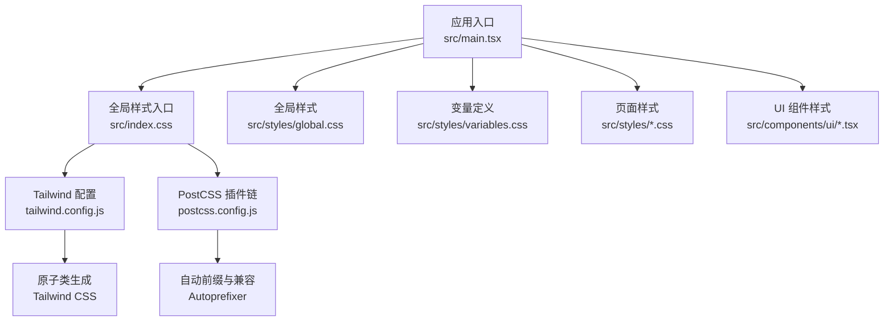
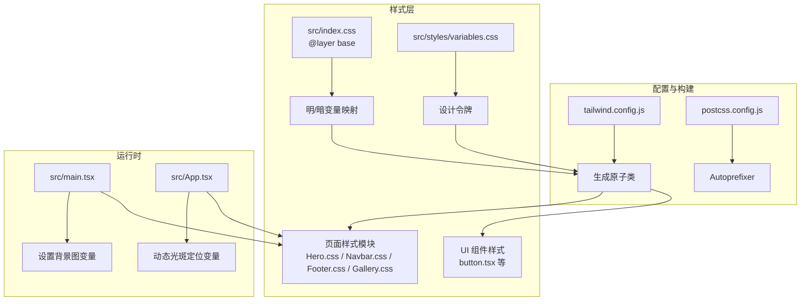
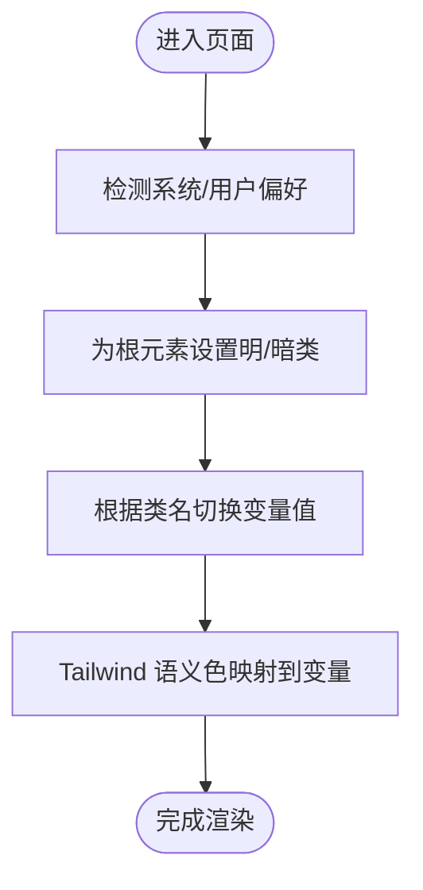
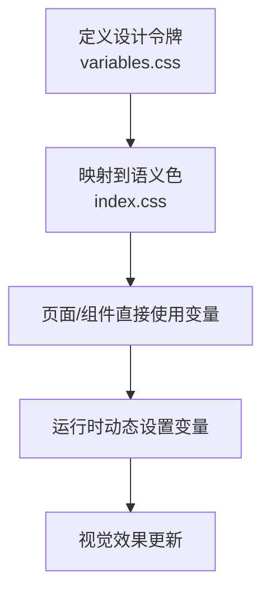
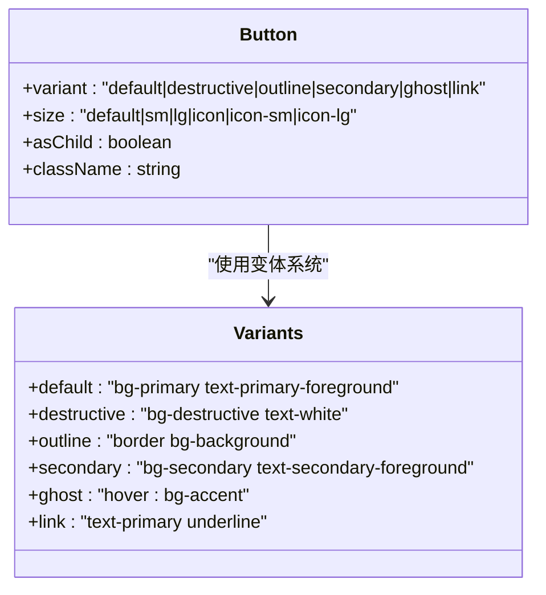
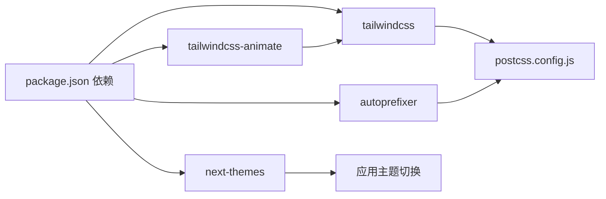

# 样式架构

<cite>
**本文引用的文件**
- [tailwind.config.js](file://tailwind.config.js)
- [postcss.config.js](file://postcss.config.js)
- [package.json](file://package.json)
- [src/index.css](file://src/index.css)
- [src/styles/global.css](file://src/styles/global.css)
- [src/styles/variables.css](file://src/styles/variables.css)
- [src/styles/Home.css](file://src/styles/Home.css)
- [src/styles/Hero.css](file://src/styles/Hero.css)
- [src/styles/Navbar.css](file://src/styles/Navbar.css)
- [src/styles/Footer.css](file://src/styles/Footer.css)
- [src/styles/Gallery.css](file://src/styles/Gallery.css)
- [src/components/ui/button.tsx](file://src/components/ui/button.tsx)
- [src/App.tsx](file://src/App.tsx)
- [src/main.tsx](file://src/main.tsx)
</cite>

## 目录
1. [简介](#简介)
2. [项目结构](#项目结构)
3. [核心组件](#核心组件)
4. [架构总览](#架构总览)
5. [详细组件分析](#详细组件分析)
6. [依赖分析](#依赖分析)
7. [性能考虑](#性能考虑)
8. [故障排查指南](#故障排查指南)
9. [结论](#结论)
10. [附录](#附录)

## 简介
本文件系统性梳理 MinLL 项目的样式架构，围绕基于 Tailwind CSS 的原子化样式体系展开，涵盖以下关键主题：
- 原子化 CSS 的使用原则与落地方式
- 自定义样式的组织与模块化策略
- 主题系统（明/暗）的实现与变量映射
- CSS 变量的使用模式与命名约定
- 响应式设计策略与媒体查询规范
- 组件样式的隔离与覆盖规则
- 暗色主题支持机制与无障碍偏好处理
- 移动端适配策略与交互体验优化
- 样式性能优化建议与最佳实践

## 项目结构
MinLL 的样式系统由“原子化框架 + 自定义变量 + 页面级样式”三层构成：
- 原子化框架层：Tailwind CSS 提供基础原子类，通过配置扩展颜色、圆角、阴影、动画等。
- 自定义变量层：统一的 CSS 变量定义，承载品牌色、排版、间距、动效曲线与断点等设计令牌。
- 页面/组件样式层：按页面或功能域拆分的样式文件，引入变量并组合原子类实现视觉与布局。

图表来源
- [src/main.tsx:1-18](file://src/main.tsx#L1-L18)
- [src/index.css:1-75](file://src/index.css#L1-L75)
- [src/styles/global.css:1-294](file://src/styles/global.css#L1-L294)
- [src/styles/variables.css:1-75](file://src/styles/variables.css#L1-L75)
- [tailwind.config.js:1-84](file://tailwind.config.js#L1-L84)
- [postcss.config.js:1-7](file://postcss.config.js#L1-L7)

章节来源
- [src/main.tsx:1-18](file://src/main.tsx#L1-L18)
- [src/index.css:1-75](file://src/index.css#L1-L75)
- [src/styles/global.css:1-294](file://src/styles/global.css#L1-L294)
- [src/styles/variables.css:1-75](file://src/styles/variables.css#L1-L75)
- [tailwind.config.js:1-84](file://tailwind.config.js#L1-L84)
- [postcss.config.js:1-7](file://postcss.config.js#L1-L7)

## 核心组件
- Tailwind 配置与插件
  - 启用类名驱动的暗色主题模式，内容扫描路径覆盖源码与 HTML。
  - 在主题扩展中将语义颜色映射到 CSS 变量，确保明/暗模式下颜色一致。
  - 扩展圆角、阴影、关键帧与动画，统一动效节奏。
  - 引入动画插件，提供可复用的过渡与状态动画。
- PostCSS 流水线
  - 顺序执行 Tailwind 与 Autoprefixer，保证原子类生成与浏览器兼容。
- 变量系统
  - 定义品牌主色、辅助色、文本色、表面色、动效曲线、时长、字体、断点、圆角与阴影等设计令牌。
  - 在全局样式中将 Tailwind 语义色映射至变量，形成“语义色 ↔ 设计令牌”的双通道。
- 页面样式模块化
  - 按页面拆分样式文件，统一引入变量，避免重复定义。
  - 使用媒体查询在不同断点下调整布局与排版，遵循移动优先策略。
- 组件样式
  - UI 组件通过原子类组合与变体系统实现样式隔离与可配置性。
  - 使用工具函数合并类名，确保可读性与可维护性。

章节来源
- [tailwind.config.js:1-84](file://tailwind.config.js#L1-L84)
- [postcss.config.js:1-7](file://postcss.config.js#L1-L7)
- [src/index.css:1-75](file://src/index.css#L1-L75)
- [src/styles/variables.css:1-75](file://src/styles/variables.css#L1-L75)
- [src/styles/Home.css:1-10](file://src/styles/Home.css#L1-L10)
- [src/styles/Hero.css:1-603](file://src/styles/Hero.css#L1-L603)
- [src/styles/Navbar.css:1-73](file://src/styles/Navbar.css#L1-L73)
- [src/styles/Footer.css:1-75](file://src/styles/Footer.css#L1-L75)
- [src/styles/Gallery.css:1-260](file://src/styles/Gallery.css#L1-L260)
- [src/components/ui/button.tsx:1-63](file://src/components/ui/button.tsx#L1-L63)

## 架构总览
样式系统采用“配置驱动 + 变量中心 + 原子化组合”的架构，确保一致性、可扩展性与可维护性。

图表来源
- [tailwind.config.js:1-84](file://tailwind.config.js#L1-L84)
- [postcss.config.js:1-7](file://postcss.config.js#L1-L7)
- [src/index.css:1-75](file://src/index.css#L1-L75)
- [src/styles/variables.css:1-75](file://src/styles/variables.css#L1-L75)
- [src/styles/Hero.css:1-603](file://src/styles/Hero.css#L1-L603)
- [src/styles/Navbar.css:1-73](file://src/styles/Navbar.css#L1-L73)
- [src/styles/Footer.css:1-75](file://src/styles/Footer.css#L1-L75)
- [src/styles/Gallery.css:1-260](file://src/styles/Gallery.css#L1-L260)
- [src/components/ui/button.tsx:1-63](file://src/components/ui/button.tsx#L1-L63)
- [src/main.tsx:1-18](file://src/main.tsx#L1-L18)
- [src/App.tsx:1-70](file://src/App.tsx#L1-L70)

## 详细组件分析

### 主题系统与暗色模式
- 明/暗变量映射
  - 在全局样式中通过 @layer base 定义 :root 与 .dark 两套变量，确保明/暗模式下颜色一致且可覆盖。
  - Tailwind 配置将语义色映射到 CSS 变量，使原子类在不同主题下自动切换。
- 动态主题切换
  - 应用根元素添加暗色类名即可触发变量切换；无需重载页面即可生效。
- 无障碍偏好
  - 全局样式对减少动效偏好进行降级处理，保障可访问性。

图表来源
- [src/index.css:37-65](file://src/index.css#L37-L65)
- [tailwind.config.js:5-51](file://tailwind.config.js#L5-L51)
- [src/styles/global.css:128-137](file://src/styles/global.css#L128-L137)

章节来源
- [src/index.css:1-75](file://src/index.css#L1-L75)
- [tailwind.config.js:1-84](file://tailwind.config.js#L1-L84)
- [src/styles/global.css:1-294](file://src/styles/global.css#L1-L294)

### CSS 变量使用模式
- 设计令牌集中管理
  - 品牌色、文本色、表面色、动效曲线、时长、断点、圆角、阴影等均在变量文件中定义。
- 双通道映射
  - Tailwind 语义色 → CSS 变量；页面/组件样式直接消费变量，保证一致性。
- 运行时动态变量
  - 背景图地址与光斑位置通过 JS 设置 CSS 变量，实现动态视觉效果。

图表来源
- [src/styles/variables.css:1-75](file://src/styles/variables.css#L1-L75)
- [src/index.css:5-66](file://src/index.css#L5-L66)
- [src/main.tsx:8-11](file://src/main.tsx#L8-L11)
- [src/App.tsx:12-26](file://src/App.tsx#L12-L26)

章节来源
- [src/styles/variables.css:1-75](file://src/styles/variables.css#L1-L75)
- [src/index.css:1-75](file://src/index.css#L1-L75)
- [src/main.tsx:1-18](file://src/main.tsx#L1-L18)
- [src/App.tsx:1-70](file://src/App.tsx#L1-L70)

### 响应式设计与媒体查询规范
- 断点与栅格
  - 使用变量定义移动、平板、桌面、宽屏断点，页面样式按断点调整布局与排版。
- 移动优先
  - 默认样式面向小屏，逐步在大屏上增强细节与密度。
- 媒体查询策略
  - 在页面样式中集中声明断点，避免在组件内重复定义。
  - 对减少动效偏好进行统一降级处理，提升可访问性。

章节来源
- [src/styles/variables.css:55-58](file://src/styles/variables.css#L55-L58)
- [src/styles/Hero.css:12-17](file://src/styles/Hero.css#L12-L17)
- [src/styles/Hero.css:153-165](file://src/styles/Hero.css#L153-L165)
- [src/styles/Navbar.css:32-36](file://src/styles/Navbar.css#L32-L36)
- [src/styles/Gallery.css:100-132](file://src/styles/Gallery.css#L100-L132)
- [src/styles/global.css:128-137](file://src/styles/global.css#L128-L137)

### 组件样式隔离与覆盖规则
- UI 组件样式
  - 使用变体系统（variants）与工具函数合并类名，确保样式可配置且可覆盖。
  - 通过数据属性与原子类组合，实现语义化与可测试性。
- 页面/组件样式
  - 通过模块化 CSS 文件引入变量并在页面容器内作用域化，避免全局污染。
- 覆盖规则
  - 原子类具备较高优先级；若需覆盖，可在页面样式中使用更具体的选择器或在组件容器上增加限定类名。

图表来源
- [src/components/ui/button.tsx:7-37](file://src/components/ui/button.tsx#L7-L37)

章节来源
- [src/components/ui/button.tsx:1-63](file://src/components/ui/button.tsx#L1-L63)

### 页面样式模块化组织
- 模块划分
  - 按页面拆分样式文件（如 Hero、Navbar、Footer、Gallery），统一引入变量，减少重复。
- 组合策略
  - 页面样式中优先使用原子类，必要时再写局部样式，保持最小特异性。
- 可维护性
  - 将媒体查询集中在页面样式中，便于统一管理与调试。

章节来源
- [src/styles/Hero.css:1-603](file://src/styles/Hero.css#L1-L603)
- [src/styles/Navbar.css:1-73](file://src/styles/Navbar.css#L1-L73)
- [src/styles/Footer.css:1-75](file://src/styles/Footer.css#L1-L75)
- [src/styles/Gallery.css:1-260](file://src/styles/Gallery.css#L1-L260)
- [src/styles/Home.css:1-10](file://src/styles/Home.css#L1-L10)

### 动画与动效
- 关键帧与动画
  - 在 Tailwind 主题中定义关键帧与动画名称，页面样式中按需使用。
- 减少动效偏好
  - 全局样式对减少动效偏好进行降级，确保无障碍友好。

章节来源
- [tailwind.config.js:62-80](file://tailwind.config.js#L62-L80)
- [src/styles/global.css:128-137](file://src/styles/global.css#L128-L137)

## 依赖分析
- 构建链路
  - PostCSS 顺序：Tailwind → Autoprefixer，确保原子类生成与浏览器兼容。
- 运行时依赖
  - 主题切换依赖 next-themes（在依赖清单中可见）。
  - 动画依赖 tailwindcss-animate（在 Tailwind 插件中启用）。

图表来源
- [package.json:13-82](file://package.json#L13-L82)
- [postcss.config.js:1-7](file://postcss.config.js#L1-L7)
- [tailwind.config.js:83-84](file://tailwind.config.js#L83-L84)

章节来源
- [package.json:1-84](file://package.json#L1-L84)
- [postcss.config.js:1-7](file://postcss.config.js#L1-L7)
- [tailwind.config.js:1-84](file://tailwind.config.js#L1-L84)

## 性能考虑
- 原子化优势
  - 通过原子类减少重复样式定义，降低 CSS 体积与解析成本。
- 变量复用
  - 将设计令牌集中管理，避免多处重复定义导致的体积膨胀。
- 媒体查询集中
  - 将断点与布局调整集中在页面样式，减少选择器复杂度。
- 动画降级
  - 对减少动效偏好的用户进行降级处理，避免不必要的重绘与回流。
- 构建优化
  - 使用 PostCSS 自动前缀，减少手动兼容代码。
- 最佳实践
  - 优先使用原子类；仅在必要时编写局部样式。
  - 控制动画数量与复杂度，避免在滚动路径上产生重负载。
  - 使用 CSS 变量而非硬编码值，便于主题切换与维护。

## 故障排查指南
- 暗色模式未生效
  - 检查根元素是否正确设置了暗色类名；确认全局样式中的变量映射是否被覆盖。
- 颜色不一致
  - 确认 Tailwind 配置中的语义色已映射到 CSS 变量；检查页面样式是否直接覆盖了变量。
- 响应式异常
  - 检查媒体查询断点是否与变量一致；确认页面样式中是否存在更高优先级的选择器。
- 动画卡顿
  - 对减少动效偏好的用户进行降级；检查关键帧与动画时长是否合理。
- 构建报错
  - 确认 PostCSS 插件顺序正确；检查 Tailwind 配置内容扫描路径是否包含目标文件。

章节来源
- [src/index.css:37-65](file://src/index.css#L37-L65)
- [tailwind.config.js:5-51](file://tailwind.config.js#L5-L51)
- [src/styles/global.css:128-137](file://src/styles/global.css#L128-L137)
- [postcss.config.js:1-7](file://postcss.config.js#L1-L7)

## 结论
MinLL 的样式架构以 Tailwind CSS 为核心，结合统一的 CSS 变量系统与模块化的页面样式，实现了高一致性、强可维护性与良好的可访问性。通过明/暗主题变量映射、移动优先的响应式策略以及组件级样式隔离，项目在视觉与交互层面达到了优雅与稳定。建议持续遵循“优先原子类、其次变量、最后局部样式”的原则，并在新增功能时同步完善变量与断点，以保持体系的长期健康。

## 附录
- 命名与组织建议
  - 页面样式文件按功能域命名（如 Hero.css、Navbar.css），统一引入变量。
  - 组件样式使用变体系统与原子类组合，避免深层嵌套。
- 常见问题速查
  - 暗色模式失效：检查根元素类名与变量映射。
  - 响应式异常：核对断点与媒体查询。
  - 动画降级：遵循减少动效偏好的处理逻辑。