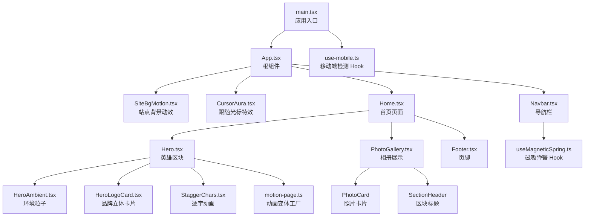
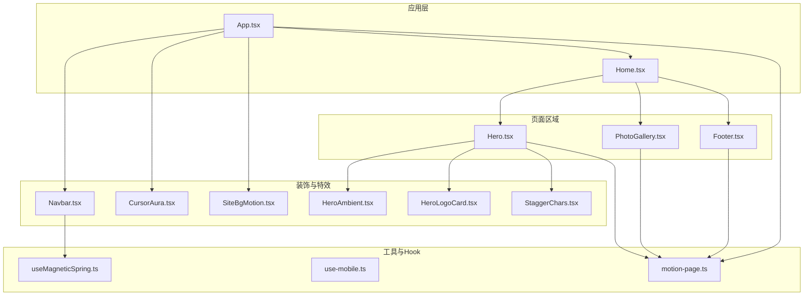
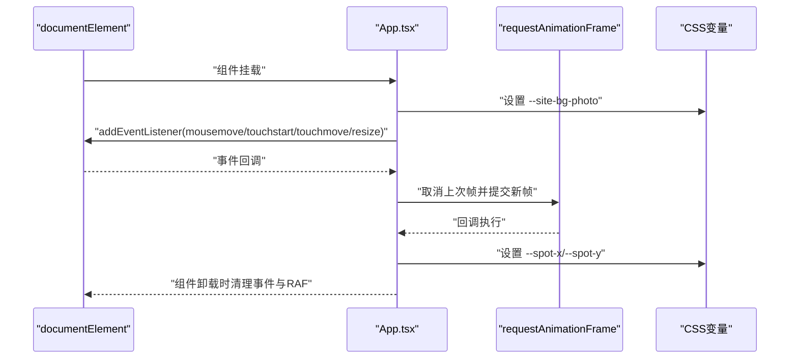
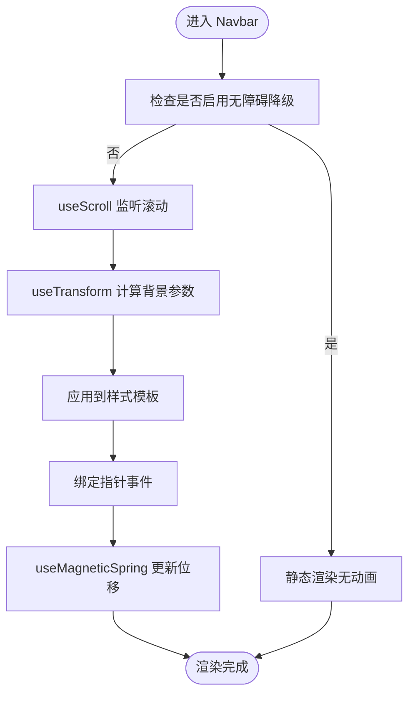
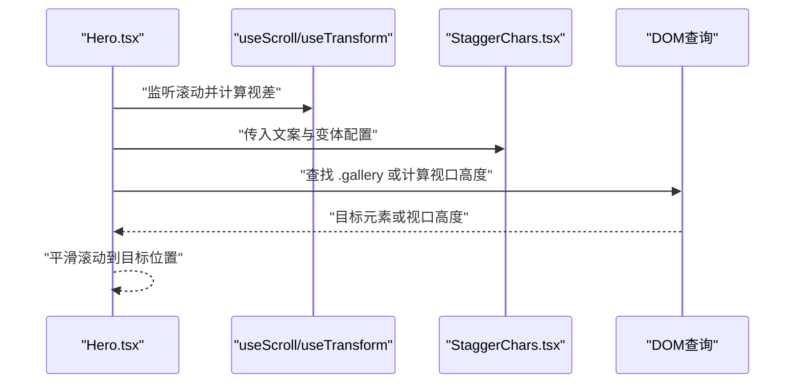
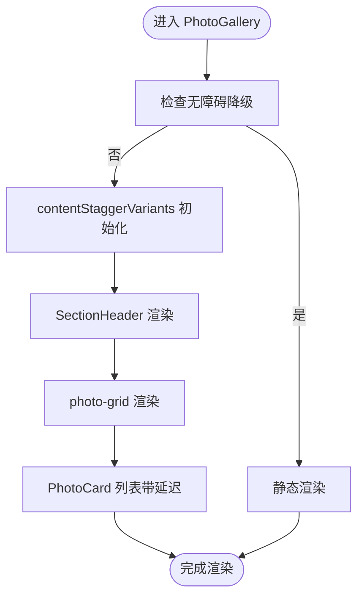
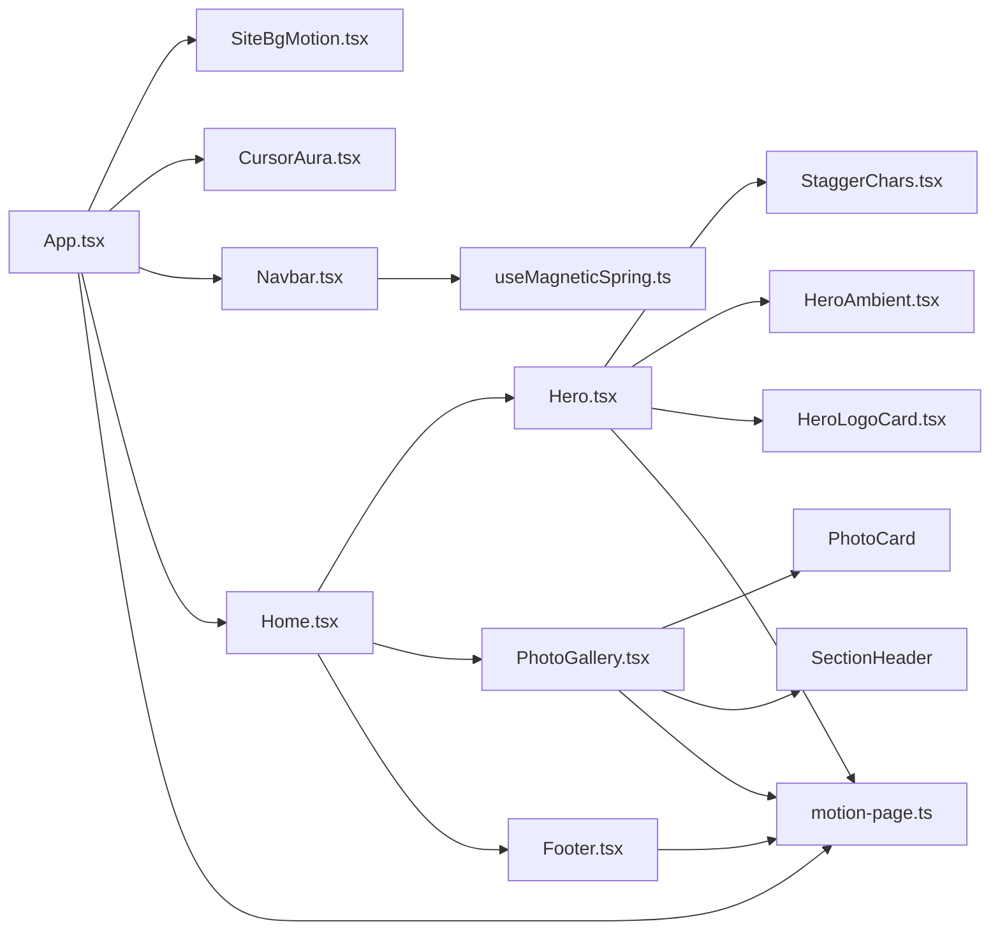
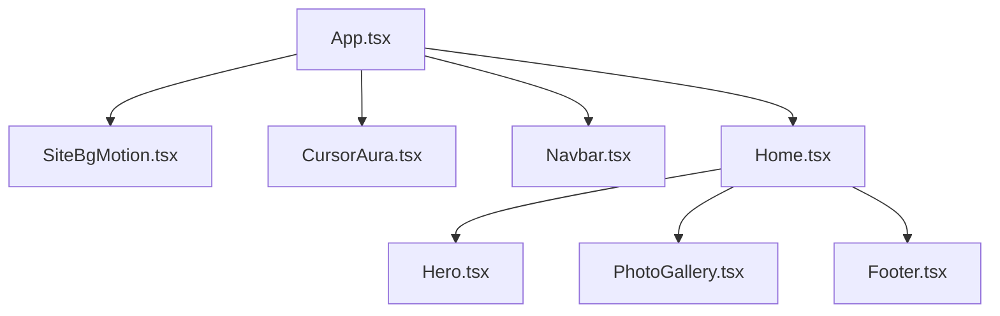

# 组件架构

<cite>
**本文引用的文件**
- [src/App.tsx](file://src/App.tsx)
- [src/main.tsx](file://src/main.tsx)
- [src/pages/Home.tsx](file://src/pages/Home.tsx)
- [src/components/Navbar.tsx](file://src/components/Navbar.tsx)
- [src/components/Footer.tsx](file://src/components/Footer.tsx)
- [src/components/Hero.tsx](file://src/components/Hero.tsx)
- [src/components/PhotoGallery.tsx](file://src/components/PhotoGallery.tsx)
- [src/components/CursorAura.tsx](file://src/components/CursorAura.tsx)
- [src/components/SiteBgMotion.tsx](file://src/components/SiteBgMotion.tsx)
- [src/components/HeroAmbient.tsx](file://src/components/HeroAmbient.tsx)
- [src/components/HeroLogoCard.tsx](file://src/components/HeroLogoCard.tsx)
- [src/components/StaggerChars.tsx](file://src/components/StaggerChars.tsx)
- [src/hooks/useMagneticSpring.ts](file://src/hooks/useMagneticSpring.ts)
- [src/hooks/use-mobile.ts](file://src/hooks/use-mobile.ts)
- [src/utils/motion-page.ts](file://src/utils/motion-page.ts)
</cite>

## 目录
1. [引言](#引言)
2. [项目结构](#项目结构)
3. [核心组件](#核心组件)
4. [架构总览](#架构总览)
5. [详细组件分析](#详细组件分析)
6. [依赖分析](#依赖分析)
7. [性能考虑](#性能考虑)
8. [故障排查指南](#故障排查指南)
9. [结论](#结论)
10. [附录](#附录)

## 引言
本文件系统化梳理 MinLL 项目的组件架构与设计模式，聚焦于 React 组件层次结构、根组件 App.tsx 的职责与控制流、组件间的数据与事件传递、状态管理模式、以及通过组合模式实现的功能模块化。文档同时覆盖组件生命周期管理、事件处理机制、无障碍与无障碍增强、以及自定义 Hook 的可复用性设计，并提供组件树结构图与关系图，帮助开发者快速理解与扩展系统。

## 项目结构
MinLL 采用按功能域分层的组织方式：入口在 main.tsx，根组件 App.tsx 负责全局背景、光标特效与页面导航；页面级组件 Home.tsx 聚合 Hero、PhotoGallery、Footer 等业务区块；各功能子组件（如 Navbar、CursorAura、SiteBgMotion）通过组合形成页面内容；工具与动画逻辑集中在 utils 与 hooks 中，确保跨组件复用。

图表来源
- [src/main.tsx:1-18](file://src/main.tsx#L1-L18)
- [src/App.tsx:1-70](file://src/App.tsx#L1-L70)
- [src/pages/Home.tsx:1-15](file://src/pages/Home.tsx#L1-L15)
- [src/components/Navbar.tsx:1-111](file://src/components/Navbar.tsx#L1-L111)
- [src/components/Hero.tsx:1-316](file://src/components/Hero.tsx#L1-L316)
- [src/components/PhotoGallery.tsx:1-162](file://src/components/PhotoGallery.tsx#L1-L162)
- [src/components/CursorAura.tsx:1-69](file://src/components/CursorAura.tsx#L1-L69)
- [src/components/SiteBgMotion.tsx:1-60](file://src/components/SiteBgMotion.tsx#L1-L60)
- [src/components/HeroAmbient.tsx:1-64](file://src/components/HeroAmbient.tsx#L1-L64)
- [src/components/HeroLogoCard.tsx:1-152](file://src/components/HeroLogoCard.tsx#L1-L152)
- [src/components/StaggerChars.tsx:1-59](file://src/components/StaggerChars.tsx#L1-L59)
- [src/hooks/useMagneticSpring.ts:1-33](file://src/hooks/useMagneticSpring.ts#L1-L33)
- [src/hooks/use-mobile.ts:1-20](file://src/hooks/use-mobile.ts#L1-L20)
- [src/utils/motion-page.ts:1-184](file://src/utils/motion-page.ts#L1-L184)

章节来源
- [src/main.tsx:1-18](file://src/main.tsx#L1-L18)
- [src/App.tsx:1-70](file://src/App.tsx#L1-L70)

## 核心组件
- 根组件 App.tsx
  - 职责：设置全局 CSS 变量（光标焦点位置、背景图）、挂载背景动效与光标特效、渲染导航与主内容区。
  - 生命周期：在挂载时监听鼠标/触摸移动与窗口尺寸变化，使用 requestAnimationFrame 优化更新频率；卸载时清理事件与动画帧。
  - 数据流：通过 CSS 自定义属性向子组件广播“光标焦点”坐标，供背景与光标特效消费。
- 页面组件 Home.tsx
  - 职责：聚合 Hero、PhotoGallery、Footer 三大区域，作为页面级布局容器。
  - 通信：以 props 向子组件传递国际化文案键与资源路径等只读数据。
- 导航组件 Navbar.tsx
  - 职责：响应滚动变换背景透明度与模糊度，提供磁吸动效的 Logo 按钮。
  - 状态：使用 useReducedMotion 控制无障碍降级；使用 useScroll/useTransform 实现视口滚动驱动的视觉状态。
  - 事件：绑定指针事件，结合 useMagneticSpring 提供磁吸位移。
- 英雄区块 Hero.tsx
  - 职责：主导航标题、副标题与描述的逐字动画展示，提供“向下滚动”交互提示。
  - 状态：滚动驱动背景网格平移与视差；使用 StaggerChars 实现字符级动画序列。
  - 事件：点击滚动到相册区域或默认可视高度。
- 相册展示 PhotoGallery.tsx
  - 职责：分区块展示“王座照”与“全身照”，支持懒加载与无障碍标签。
  - 状态：使用 useReducedMotion 控制入场动画；通过 contentStaggerVariants/fadeUpItemVariants 实现交错出现。
- 页脚 Footer.tsx
  - 职责：品牌信息、标语与版权信息的视口触发动画展示。
  - 状态：基于 viewport 触发 whileInView 动画，支持 once 与 margin 配置。
- 光标特效 CursorAura.tsx
  - 职责：跟随鼠标位置的光晕特效，使用 useMotionValue/useSpring 平滑插值。
  - 生命周期：监听 mousemove 与离开视窗外的事件，使用 requestAnimationFrame 降低抖动。
- 站点背景 SiteBgMotion.tsx
  - 职责：多形态背景 blob 的无限循环动画，噪声闪烁效果。
  - 无障碍：在 reduce-motion 下自动禁用动画。
- 环境粒子 HeroAmbient.tsx
  - 职责：渐变球体与漂浮颗粒的循环动画，增强场景氛围。
- 品牌立体卡片 HeroLogoCard.tsx
  - 职责：鼠标指针驱动的 3D 倾斜与阴影动态，提供交互反馈。
- 逐字动画 StaggerChars.tsx
  - 职责：将字符串拆分为字符级元素，配合 Variants 实现交错动画。
- 自定义 Hook
  - useMagneticSpring.ts：封装磁吸弹簧位移计算与指针事件回调，返回 ref 与 x/y 值。
  - use-mobile.ts：基于媒体查询检测移动端断点，返回布尔值。

章节来源
- [src/App.tsx:1-70](file://src/App.tsx#L1-L70)
- [src/pages/Home.tsx:1-15](file://src/pages/Home.tsx#L1-L15)
- [src/components/Navbar.tsx:1-111](file://src/components/Navbar.tsx#L1-L111)
- [src/components/Hero.tsx:1-316](file://src/components/Hero.tsx#L1-L316)
- [src/components/PhotoGallery.tsx:1-162](file://src/components/PhotoGallery.tsx#L1-L162)
- [src/components/Footer.tsx:1-42](file://src/components/Footer.tsx#L1-L42)
- [src/components/CursorAura.tsx:1-69](file://src/components/CursorAura.tsx#L1-L69)
- [src/components/SiteBgMotion.tsx:1-60](file://src/components/SiteBgMotion.tsx#L1-L60)
- [src/components/HeroAmbient.tsx:1-64](file://src/components/HeroAmbient.tsx#L1-L64)
- [src/components/HeroLogoCard.tsx:1-152](file://src/components/HeroLogoCard.tsx#L1-L152)
- [src/components/StaggerChars.tsx:1-59](file://src/components/StaggerChars.tsx#L1-L59)
- [src/hooks/useMagneticSpring.ts:1-33](file://src/hooks/useMagneticSpring.ts#L1-L33)
- [src/hooks/use-mobile.ts:1-20](file://src/hooks/use-mobile.ts#L1-L20)

## 架构总览
MinLL 的架构遵循“根组件集中初始化 + 页面级组合 + 子组件职责单一 + 工具与 Hook 复用”的设计原则。根组件负责全局样式与事件绑定，页面组件负责业务区域编排，子组件专注各自领域的交互与动画，工具与 Hook 提供跨组件的状态与行为抽象。

图表来源
- [src/App.tsx:1-70](file://src/App.tsx#L1-L70)
- [src/pages/Home.tsx:1-15](file://src/pages/Home.tsx#L1-L15)
- [src/components/Navbar.tsx:1-111](file://src/components/Navbar.tsx#L1-L111)
- [src/components/Hero.tsx:1-316](file://src/components/Hero.tsx#L1-L316)
- [src/components/PhotoGallery.tsx:1-162](file://src/components/PhotoGallery.tsx#L1-L162)
- [src/components/Footer.tsx:1-42](file://src/components/Footer.tsx#L1-L42)
- [src/components/CursorAura.tsx:1-69](file://src/components/CursorAura.tsx#L1-L69)
- [src/components/SiteBgMotion.tsx:1-60](file://src/components/SiteBgMotion.tsx#L1-L60)
- [src/components/HeroAmbient.tsx:1-64](file://src/components/HeroAmbient.tsx#L1-L64)
- [src/components/HeroLogoCard.tsx:1-152](file://src/components/HeroLogoCard.tsx#L1-L152)
- [src/components/StaggerChars.tsx:1-59](file://src/components/StaggerChars.tsx#L1-L59)
- [src/hooks/useMagneticSpring.ts:1-33](file://src/hooks/useMagneticSpring.ts#L1-L33)
- [src/hooks/use-mobile.ts:1-20](file://src/hooks/use-mobile.ts#L1-L20)
- [src/utils/motion-page.ts:1-184](file://src/utils/motion-page.ts#L1-L184)

## 详细组件分析

### 根组件 App.tsx 设计模式与数据流
- 设计模式
  - 初始化模式：在挂载阶段设置 CSS 变量，统一为全局动效提供数据源。
  - 事件订阅模式：集中订阅鼠标/触摸/窗口事件，统一调度与清理。
  - 组合模式：将背景动效、光标特效、导航与主内容区组合为页面骨架。
- 生命周期管理
  - 挂载：注册事件监听器，启动 RAF 更新；初始化中心点坐标。
  - 卸载：取消事件监听与未完成的 RAF。
- 事件处理机制
  - 鼠标移动：节流至 RAF，避免高频重绘。
  - 触摸事件：触点存在性校验后更新焦点。
  - 窗口尺寸变化：重置中心点。
- 状态管理模式
  - 全局状态：通过 CSS 变量暴露“光标焦点”坐标，子组件通过 style 或类名消费。
  - 局部状态：子组件内部使用 Framer Motion 的 useMotionValue/useSpring 管理动画状态。
- 组件间通信
  - Props：Home 向子组件传递只读数据（如文案键、图片资源）。
  - Context：当前代码未使用 React Context，但可通过 Provider 扩展以承载主题、语言等跨层级共享状态。
  - 事件冒泡：导航与页面交互通过原生 DOM 事件与滚动 API 协作，不依赖 React 事件冒泡。

图表来源
- [src/App.tsx:1-70](file://src/App.tsx#L1-L70)
- [src/main.tsx:1-18](file://src/main.tsx#L1-L18)

章节来源
- [src/App.tsx:1-70](file://src/App.tsx#L1-L70)
- [src/main.tsx:1-18](file://src/main.tsx#L1-L18)

### 导航组件 Navbar.tsx：滚动驱动与磁吸动效
- 职责分离
  - 视觉状态：由 useScroll/useTransform 计算透明度、模糊度与边框透明度。
  - 交互反馈：useMagneticSpring 提供磁吸位移，结合 Framer Motion 的 whileHover/whileTap。
- 状态与生命周期
  - 使用 useReducedMotion 判断无障碍降级。
  - 在首次渲染时根据滚动位置初始化视觉状态。
- 事件处理
  - onPointerMove/onPointerLeave 与磁吸 Hook 协作，实时更新位移。
- 组合模式
  - 将 Logo 文本、sheen 光效、背景模板与滚动变换组合为统一的导航壳。

图表来源
- [src/components/Navbar.tsx:1-111](file://src/components/Navbar.tsx#L1-L111)
- [src/hooks/useMagneticSpring.ts:1-33](file://src/hooks/useMagneticSpring.ts#L1-L33)

章节来源
- [src/components/Navbar.tsx:1-111](file://src/components/Navbar.tsx#L1-L111)
- [src/hooks/useMagneticSpring.ts:1-33](file://src/hooks/useMagneticSpring.ts#L1-L33)

### 英雄区块 Hero.tsx：滚动视差与逐字动画
- 职责分离
  - 视差背景：useScroll/useTransform 驱动背景与网格的垂直偏移。
  - 文案动画：StaggerChars 将文本拆分为字符级元素，配合 Variants 实现交错出现。
  - 交互提示：滚动按钮通过 DOM 查询定位目标区域并平滑滚动。
- 状态与生命周期
  - 使用 useReducedMotion 控制动画开关。
  - contentStaggerVariants/fadeUpItemVariants 等工厂函数提供一致的动画语义。
- 组合模式
  - HeroAmbient、HeroLogoCard、StaggerChars 作为子模块被组合进 Hero。

图表来源
- [src/components/Hero.tsx:1-316](file://src/components/Hero.tsx#L1-L316)
- [src/components/StaggerChars.tsx:1-59](file://src/components/StaggerChars.tsx#L1-L59)

章节来源
- [src/components/Hero.tsx:1-316](file://src/components/Hero.tsx#L1-L316)
- [src/components/StaggerChars.tsx:1-59](file://src/components/StaggerChars.tsx#L1-L59)

### 相册展示 PhotoGallery.tsx：区块化与交错动画
- 职责分离
  - SectionHeader：区块标题与图标，使用 contentStaggerVariants 控制交错。
  - PhotoCard：单张照片卡片，支持悬停与延迟过渡。
- 状态与生命周期
  - 使用 useReducedMotion 控制入场动画。
  - whileInView 与 viewport 配置实现视口触发与一次性动画。
- 组合模式
  - 将 SectionHeader 与 PhotoCard 组合为“王座照/全身照”两大区块。

图表来源
- [src/components/PhotoGallery.tsx:1-162](file://src/components/PhotoGallery.tsx#L1-L162)
- [src/utils/motion-page.ts:1-184](file://src/utils/motion-page.ts#L1-L184)

章节来源
- [src/components/PhotoGallery.tsx:1-162](file://src/components/PhotoGallery.tsx#L1-L162)
- [src/utils/motion-page.ts:1-184](file://src/utils/motion-page.ts#L1-L184)

### 页脚 Footer.tsx：视口触发与品牌信息
- 职责分离
  - 使用 whileInView 与 viewport 配置实现进入视口时的交错出现。
  - 品牌图标与文案通过国际化键值渲染。
- 状态与生命周期
  - 仅依赖 Framer Motion 的视口触发能力，无需额外状态。

章节来源
- [src/components/Footer.tsx:1-42](file://src/components/Footer.tsx#L1-L42)

### 光标特效 CursorAura.tsx：跟随与平滑插值
- 职责分离
  - 事件监听：在根节点上监听 mousemove 与离开视窗外事件。
  - 状态管理：useMotionValue 记录目标位置，useSpring 平滑插值。
- 生命周期
  - 挂载：初始化中心位置；注册事件；RAF 更新。
  - 卸载：清理事件与未完成的 RAF。

章节来源
- [src/components/CursorAura.tsx:1-69](file://src/components/CursorAura.tsx#L1-L69)

### 站点背景 SiteBgMotion.tsx：无限循环动画
- 职责分离
  - 多个背景 blob 的循环动画与噪声闪烁。
  - 在 reduce-motion 下自动禁用。
- 组合模式
  - 通过数组映射批量渲染多个动画元素。

章节来源
- [src/components/SiteBgMotion.tsx:1-60](file://src/components/SiteBgMotion.tsx#L1-L60)

### 环境粒子 HeroAmbient.tsx：氛围增强
- 职责分离
  - 渐变球体与漂浮颗粒的循环动画，保持与主场景的协调感。
- 组合模式
  - 与 Hero 背景组合，共同营造沉浸式体验。

章节来源
- [src/components/HeroAmbient.tsx:1-64](file://src/components/HeroAmbient.tsx#L1-L64)

### 品牌立体卡片 HeroLogoCard.tsx：3D 倾斜与阴影
- 职责分离
  - 鼠标指针驱动的 3D 倾斜与阴影动态，提供交互反馈。
- 状态与生命周期
  - 使用 useMotionValue/useSpring 管理倾斜角度与阴影过渡。

章节来源
- [src/components/HeroLogoCard.tsx:1-152](file://src/components/HeroLogoCard.tsx#L1-L152)

### 逐字动画 StaggerChars.tsx：字符级交错
- 职责分离
  - 将字符串拆分为字符级元素，支持空格与特殊字符处理。
  - 通过 Variants 控制字符级动画序列。
- 组合模式
  - 被 Hero 的标题与副标题复用。

章节来源
- [src/components/StaggerChars.tsx:1-59](file://src/components/StaggerChars.tsx#L1-L59)

### 自定义 Hook 使用模式与可复用性
- useMagneticSpring.ts
  - 输入：强度系数（strength），输出：ref、x、y、onPointerMove、onPointerLeave。
  - 复用性：可在任意按钮或交互元素上复用，统一磁吸行为。
- use-mobile.ts
  - 输入：断点常量（MOBILE_BREAKPOINT）。
  - 复用性：提供移动端判断，便于在多处组件中进行响应式行为切换。

章节来源
- [src/hooks/useMagneticSpring.ts:1-33](file://src/hooks/useMagneticSpring.ts#L1-L33)
- [src/hooks/use-mobile.ts:1-20](file://src/hooks/use-mobile.ts#L1-L20)

## 依赖分析
- 组件耦合
  - App.tsx 与子组件之间为单向数据流（CSS 变量）+ 事件协作，低耦合。
  - Hero.tsx 依赖 StaggerChars.tsx、HeroAmbient.tsx、HeroLogoCard.tsx，体现组合模式。
  - PhotoGallery.tsx 依赖 SectionHeader 与 PhotoCard，形成区块化复用。
- 外部依赖
  - Framer Motion：用于滚动、变换、动画与无障碍降级。
  - Lucide Icons：用于图标渲染。
  - 国际化：通过 t 函数从 i18n 注入文案键值。
- 潜在循环依赖
  - 当前文件组织避免了直接循环导入；若后续引入 Context，需注意 Provider 与 Consumer 的边界。

图表来源
- [src/App.tsx:1-70](file://src/App.tsx#L1-L70)
- [src/pages/Home.tsx:1-15](file://src/pages/Home.tsx#L1-L15)
- [src/components/Hero.tsx:1-316](file://src/components/Hero.tsx#L1-L316)
- [src/components/PhotoGallery.tsx:1-162](file://src/components/PhotoGallery.tsx#L1-L162)
- [src/components/Navbar.tsx:1-111](file://src/components/Navbar.tsx#L1-L111)
- [src/components/StaggerChars.tsx:1-59](file://src/components/StaggerChars.tsx#L1-L59)
- [src/components/HeroAmbient.tsx:1-64](file://src/components/HeroAmbient.tsx#L1-L64)
- [src/components/HeroLogoCard.tsx:1-152](file://src/components/HeroLogoCard.tsx#L1-L152)
- [src/hooks/useMagneticSpring.ts:1-33](file://src/hooks/useMagneticSpring.ts#L1-L33)
- [src/utils/motion-page.ts:1-184](file://src/utils/motion-page.ts#L1-L184)

章节来源
- [src/App.tsx:1-70](file://src/App.tsx#L1-L70)
- [src/pages/Home.tsx:1-15](file://src/pages/Home.tsx#L1-L15)
- [src/components/Hero.tsx:1-316](file://src/components/Hero.tsx#L1-L316)
- [src/components/PhotoGallery.tsx:1-162](file://src/components/PhotoGallery.tsx#L1-L162)
- [src/components/Navbar.tsx:1-111](file://src/components/Navbar.tsx#L1-L111)
- [src/components/StaggerChars.tsx:1-59](file://src/components/StaggerChars.tsx#L1-L59)
- [src/components/HeroAmbient.tsx:1-64](file://src/components/HeroAmbient.tsx#L1-L64)
- [src/components/HeroLogoCard.tsx:1-152](file://src/components/HeroLogoCard.tsx#L1-L152)
- [src/hooks/useMagneticSpring.ts:1-33](file://src/hooks/useMagneticSpring.ts#L1-L33)
- [src/utils/motion-page.ts:1-184](file://src/utils/motion-page.ts#L1-L184)

## 性能考虑
- 动画与事件
  - 使用 requestAnimationFrame 限制更新频率，避免高频重绘。
  - 使用 useSpring 与 useMotionValue 进行物理插值，减少主线程压力。
- 懒加载与延迟
  - 图片懒加载与解码异步，降低首屏阻塞。
  - 卡片列表通过 transitionDelay 实现交错延迟，避免同时触发大量动画。
- 无障碍降级
  - useReducedMotion 控制动画开关，保障低功耗与可访问性。
- DOM 查询
  - 通过选择器定位目标元素并平滑滚动，避免复杂状态同步。

## 故障排查指南
- 光标特效不生效
  - 检查 App.tsx 是否正确设置 CSS 变量与事件监听。
  - 确认 CursorAura.tsx 的 reduce-motion 条件分支与事件清理。
- 滚动视差异常
  - 检查 Hero.tsx 的 useScroll/useTransform 参数与目标元素是否存在。
- 动画卡顿
  - 确认是否启用了 reduce-motion；检查是否有过多同时运行的无限循环动画。
- 移动端显示问题
  - 使用 use-mobile.ts 判断断点，必要时调整布局与动画策略。

章节来源
- [src/App.tsx:1-70](file://src/App.tsx#L1-L70)
- [src/components/CursorAura.tsx:1-69](file://src/components/CursorAura.tsx#L1-L69)
- [src/components/Hero.tsx:1-316](file://src/components/Hero.tsx#L1-L316)
- [src/hooks/use-mobile.ts:1-20](file://src/hooks/use-mobile.ts#L1-L20)

## 结论
MinLL 的组件架构以 App.tsx 为核心枢纽，Home.tsx 为页面容器，子组件围绕各自领域职责实现高内聚、低耦合的模块化设计。通过 Framer Motion 的滚动与动画能力、useReducedMotion 的无障碍降级、以及 useMagneticSpring 等自定义 Hook 的复用，系统在保证视觉表现力的同时兼顾性能与可维护性。建议后续可引入 Context 以承载跨层级共享状态，并持续优化动画与事件的节流策略。

## 附录
- 组件树结构图（概念示意）
