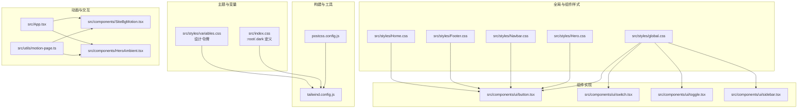
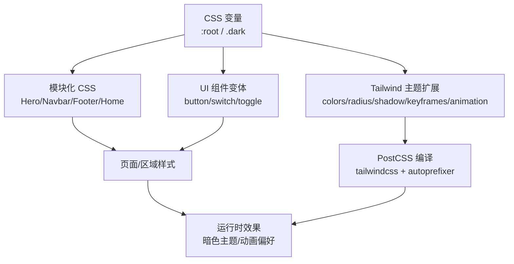
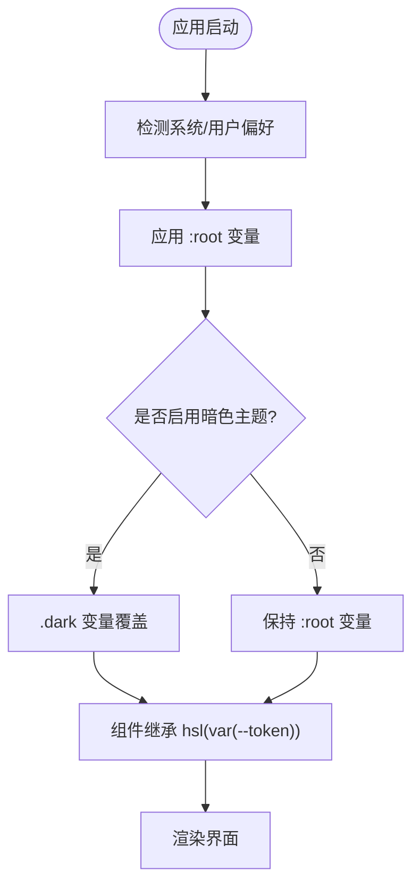
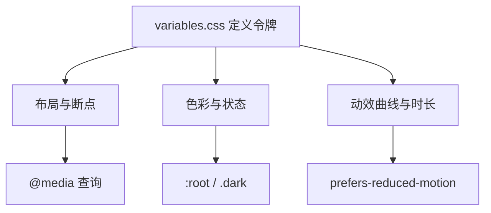
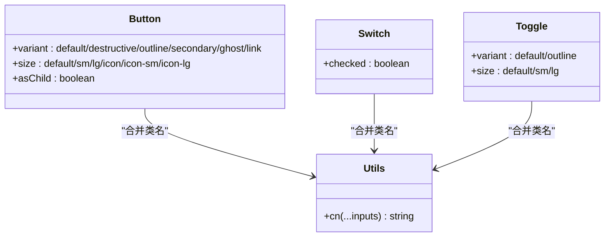
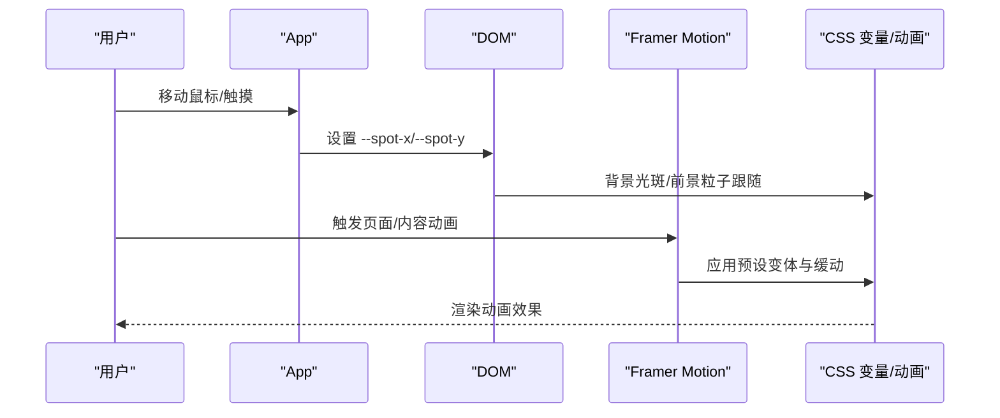
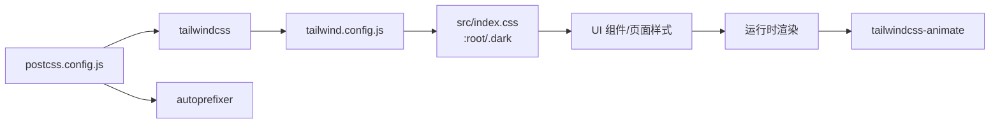

# 样式系统

<cite>
**本文引用的文件**
- [tailwind.config.js](file://tailwind.config.js)
- [postcss.config.js](file://postcss.config.js)
- [src/index.css](file://src/index.css)
- [src/styles/global.css](file://src/styles/global.css)
- [src/styles/variables.css](file://src/styles/variables.css)
- [src/styles/Hero.css](file://src/styles/Hero.css)
- [src/styles/Navbar.css](file://src/styles/Navbar.css)
- [src/styles/Footer.css](file://src/styles/Footer.css)
- [src/styles/Home.css](file://src/styles/Home.css)
- [src/components/ui/button.tsx](file://src/components/ui/button.tsx)
- [src/components/ui/switch.tsx](file://src/components/ui/switch.tsx)
- [src/components/ui/toggle.tsx](file://src/components/ui/toggle.tsx)
- [src/components/ui/sidebar.tsx](file://src/components/ui/sidebar.tsx)
- [src/components/HeroAmbient.tsx](file://src/components/HeroAmbient.tsx)
- [src/components/SiteBgMotion.tsx](file://src/components/SiteBgMotion.tsx)
- [src/utils/motion-page.ts](file://src/utils/motion-page.ts)
- [src/App.tsx](file://src/App.tsx)
- [src/lib/utils.ts](file://src/lib/utils.ts)
- [package.json](file://package.json)
</cite>

## 目录
1. [简介](#简介)
2. [项目结构](#项目结构)
3. [核心组件](#核心组件)
4. [架构总览](#架构总览)
5. [详细组件分析](#详细组件分析)
6. [依赖关系分析](#依赖关系分析)
7. [性能考量](#性能考量)
8. [故障排查指南](#故障排查指南)
9. [结论](#结论)
10. [附录](#附录)

## 简介
本文件系统性梳理 MinLL 的样式系统，覆盖 Tailwind CSS 配置、主题系统（含明/暗模式）、CSS 变量体系、响应式策略、组件样式组织、全局与动画样式管理、暗色主题支持机制与切换逻辑，并提供定制指南、最佳实践、性能优化与代码分割建议，以及常见问题解决方案。

## 项目结构
MinLL 的样式系统由以下层次构成：
- 构建与工具链：PostCSS 负责编译与自动前缀；Tailwind CSS 提供原子化样式与动画扩展。
- 主题与变量：通过 CSS 变量在 :root 与 .dark 中定义明/暗两套调色板与设计令牌；Tailwind 使用 hsl(var(--token)) 绑定变量。
- 全局样式：重置与基础排版、滚动条、选择器高亮、媒体查询缩减动效等。
- 组件样式：以功能域划分的模块化 CSS 文件（如 Hero、Navbar、Footer），配合原子类与变量使用。
- 组件实现：UI 组件采用 class-variance-authority 定义变体，使用 cn 合并类名，统一风格与可维护性。
- 动画与交互：站点背景与前景粒子动画由 Framer Motion 驱动，同时尊重“减少动态”偏好设置。

**图表来源**
- [postcss.config.js:1-7](file://postcss.config.js#L1-L7)
- [tailwind.config.js:1-84](file://tailwind.config.js#L1-L84)
- [src/index.css:1-75](file://src/index.css#L1-L75)
- [src/styles/variables.css:1-75](file://src/styles/variables.css#L1-L75)
- [src/styles/global.css:1-294](file://src/styles/global.css#L1-L294)
- [src/styles/Hero.css:1-603](file://src/styles/Hero.css#L1-L603)
- [src/styles/Navbar.css:1-73](file://src/styles/Navbar.css#L1-L73)
- [src/styles/Footer.css:1-75](file://src/styles/Footer.css#L1-L75)
- [src/styles/Home.css:1-10](file://src/styles/Home.css#L1-L10)
- [src/components/ui/button.tsx:1-63](file://src/components/ui/button.tsx#L1-L63)
- [src/components/ui/switch.tsx:1-31](file://src/components/ui/switch.tsx#L1-L31)
- [src/components/ui/toggle.tsx:1-45](file://src/components/ui/toggle.tsx#L1-L45)
- [src/components/ui/sidebar.tsx:53-94](file://src/components/ui/sidebar.tsx#L53-L94)
- [src/components/SiteBgMotion.tsx:1-59](file://src/components/SiteBgMotion.tsx#L1-L59)
- [src/components/HeroAmbient.tsx:1-63](file://src/components/HeroAmbient.tsx#L1-L63)
- [src/utils/motion-page.ts:1-113](file://src/utils/motion-page.ts#L1-L113)
- [src/App.tsx:1-70](file://src/App.tsx#L1-L70)

**章节来源**
- [tailwind.config.js:1-84](file://tailwind.config.js#L1-L84)
- [postcss.config.js:1-7](file://postcss.config.js#L1-L7)
- [src/index.css:1-75](file://src/index.css#L1-L75)
- [src/styles/global.css:1-294](file://src/styles/global.css#L1-L294)
- [src/styles/variables.css:1-75](file://src/styles/variables.css#L1-L75)
- [src/styles/Hero.css:1-603](file://src/styles/Hero.css#L1-L603)
- [src/styles/Navbar.css:1-73](file://src/styles/Navbar.css#L1-L73)
- [src/styles/Footer.css:1-75](file://src/styles/Footer.css#L1-L75)
- [src/styles/Home.css:1-10](file://src/styles/Home.css#L1-L10)
- [src/components/ui/button.tsx:1-63](file://src/components/ui/button.tsx#L1-L63)
- [src/components/ui/switch.tsx:1-31](file://src/components/ui/switch.tsx#L1-L31)
- [src/components/ui/toggle.tsx:1-45](file://src/components/ui/toggle.tsx#L1-L45)
- [src/components/ui/sidebar.tsx:53-94](file://src/components/ui/sidebar.tsx#L53-L94)
- [src/components/SiteBgMotion.tsx:1-59](file://src/components/SiteBgMotion.tsx#L1-L59)
- [src/components/HeroAmbient.tsx:1-63](file://src/components/HeroAmbient.tsx#L1-L63)
- [src/utils/motion-page.ts:1-113](file://src/utils/motion-page.ts#L1-L113)
- [src/App.tsx:1-70](file://src/App.tsx#L1-L70)

## 核心组件
- Tailwind 配置与主题绑定
  - 使用 darkMode: ["class"]，通过根元素上的 class="dark" 切换明/暗主题。
  - 在 theme.extend 中将颜色、圆角半径、阴影、关键帧与动画映射到 CSS 变量，确保与 :root/.dark 一致。
  - 引入 tailwindcss-animate 插件，复用配置中的 keyframes 与 animation。
- CSS 变量与设计令牌
  - :root 定义主色、文本、表面、阴影、动效缓动曲线、时长、间距、字体与断点等。
  - .dark 在暗色主题下重定义 --background、--foreground 等，保证组件继承一致。
- 全局样式与基础排版
  - 归一化、滚动行为平滑、字体与行高、占位符颜色、滚动条样式、选择器高亮。
  - 响应式动画缩减：当用户启用“减少动态”偏好时，全局禁用动画与过渡，仅保留必要的滚动行为调整。
- 组件样式组织
  - 按页面/区域拆分 CSS 文件（Hero、Navbar、Footer、Home），统一引入 variables.css。
  - 组件内部优先使用原子类与 Tailwind 工具类，必要时局部样式补充。
- 动画与交互
  - 站点背景与前景粒子由 Framer Motion 驱动，尊重 useReducedMotion 偏好。
  - 页面转场与内容入场动画通过 motion-page 工具函数提供预设变体。

**章节来源**
- [tailwind.config.js:1-84](file://tailwind.config.js#L1-L84)
- [src/index.css:1-75](file://src/index.css#L1-L75)
- [src/styles/global.css:1-294](file://src/styles/global.css#L1-L294)
- [src/styles/variables.css:1-75](file://src/styles/variables.css#L1-L75)
- [src/styles/Hero.css:1-603](file://src/styles/Hero.css#L1-L603)
- [src/styles/Navbar.css:1-73](file://src/styles/Navbar.css#L1-L73)
- [src/styles/Footer.css:1-75](file://src/styles/Footer.css#L1-L75)
- [src/styles/Home.css:1-10](file://src/styles/Home.css#L1-L10)
- [src/components/SiteBgMotion.tsx:1-59](file://src/components/SiteBgMotion.tsx#L1-L59)
- [src/components/HeroAmbient.tsx:1-63](file://src/components/HeroAmbient.tsx#L1-L63)
- [src/utils/motion-page.ts:1-113](file://src/utils/motion-page.ts#L1-L113)

## 架构总览
样式系统围绕“变量驱动 + 原子化 + 组件化 + 动画集成”的理念构建，形成从设计令牌到组件实现再到页面级样式的完整闭环。

**图表来源**
- [src/styles/variables.css:1-75](file://src/styles/variables.css#L1-L75)
- [tailwind.config.js:1-84](file://tailwind.config.js#L1-L84)
- [postcss.config.js:1-7](file://postcss.config.js#L1-L7)
- [src/styles/Hero.css:1-603](file://src/styles/Hero.css#L1-L603)
- [src/styles/Navbar.css:1-73](file://src/styles/Navbar.css#L1-L73)
- [src/styles/Footer.css:1-75](file://src/styles/Footer.css#L1-L75)
- [src/styles/Home.css:1-10](file://src/styles/Home.css#L1-L10)
- [src/components/ui/button.tsx:1-63](file://src/components/ui/button.tsx#L1-L63)
- [src/components/ui/switch.tsx:1-31](file://src/components/ui/switch.tsx#L1-L31)
- [src/components/ui/toggle.tsx:1-45](file://src/components/ui/toggle.tsx#L1-L45)

## 详细组件分析

### Tailwind 配置与主题系统
- 明/暗模式
  - 通过 darkMode: ["class"] 与 .dark 类控制主题切换。
  - :root 定义浅色变量，.dark 重新定义 --background、--foreground 等，确保组件继承一致。
- 设计令牌映射
  - colors 使用 hsl(var(--token))，使组件无需硬编码颜色值。
  - radius、shadow、keyframes、animation 通过 theme.extend 与 CSS 变量联动。
- 动画扩展
  - 引入 tailwindcss-animate，复用配置中的 keyframes 与 animation 名称，简化类名书写。

**图表来源**
- [tailwind.config.js:1-84](file://tailwind.config.js#L1-L84)
- [src/index.css:1-75](file://src/index.css#L1-L75)

**章节来源**
- [tailwind.config.js:1-84](file://tailwind.config.js#L1-L84)
- [src/index.css:1-75](file://src/index.css#L1-L75)

### CSS 变量与响应式设计
- 设计令牌
  - 主色、强调色、文本、表面、边框、错误/成功状态、阴影、动效缓动曲线、时长、间距、字体族、断点、圆角半径。
- 响应式策略
  - 使用媒体查询与 CSS 自定义属性组合，如 clamp、min/max/vw/vh 确保流式布局。
  - 针对小屏设备的断点（mobile/tablet/desktop/wide）在变量中集中管理。
- 动画偏好适配
  - 全局媒体查询在用户启用“减少动态”时，将动画与过渡时长降至极短，保证可用性。

**图表来源**
- [src/styles/variables.css:1-75](file://src/styles/variables.css#L1-L75)
- [src/styles/global.css:128-137](file://src/styles/global.css#L128-L137)

**章节来源**
- [src/styles/variables.css:1-75](file://src/styles/variables.css#L1-L75)
- [src/styles/global.css:128-137](file://src/styles/global.css#L128-L137)

### 组件样式组织与变体系统
- 组件变体
  - 使用 class-variance-authority 定义按钮、开关、切换等组件的变体与尺寸，结合 cn 合并类名，确保一致性与可维护性。
- 原子化优先
  - 组件内部优先使用 Tailwind 原子类，必要时局部样式补充，避免重复定义。
- 区域样式
  - Hero、Navbar、Footer、Home 等按功能域拆分 CSS，统一引入 variables.css，便于主题与设计令牌更新。

**图表来源**
- [src/components/ui/button.tsx:1-63](file://src/components/ui/button.tsx#L1-L63)
- [src/components/ui/switch.tsx:1-31](file://src/components/ui/switch.tsx#L1-L31)
- [src/components/ui/toggle.tsx:1-45](file://src/components/ui/toggle.tsx#L1-L45)
- [src/lib/utils.ts:1-7](file://src/lib/utils.ts#L1-L7)

**章节来源**
- [src/components/ui/button.tsx:1-63](file://src/components/ui/button.tsx#L1-L63)
- [src/components/ui/switch.tsx:1-31](file://src/components/ui/switch.tsx#L1-L31)
- [src/components/ui/toggle.tsx:1-45](file://src/components/ui/toggle.tsx#L1-L45)
- [src/lib/utils.ts:1-7](file://src/lib/utils.ts#L1-L7)

### 页面级样式与动画集成
- Hero 区域
  - 大面积渐变、光晕、颗粒与网格背景，结合 CSS 动画与 Framer Motion 的粒子漂浮，营造沉浸式体验。
  - 使用 variables.css 中的断点与动效曲线，确保在不同设备上的一致表现。
- Navbar/Footbar
  - 固定定位与透明背景，配合 sheen 效果与品牌文字阴影，提升层次感。
- 动画系统
  - App 将鼠标位置映射为 CSS 变量，驱动背景光斑与前景粒子。
  - motion-page 提供内容入场与转场的预设变体，尊重 useReducedMotion 偏好。

**图表来源**
- [src/App.tsx:1-70](file://src/App.tsx#L1-L70)
- [src/components/SiteBgMotion.tsx:1-59](file://src/components/SiteBgMotion.tsx#L1-L59)
- [src/components/HeroAmbient.tsx:1-63](file://src/components/HeroAmbient.tsx#L1-L63)
- [src/utils/motion-page.ts:1-113](file://src/utils/motion-page.ts#L1-L113)

**章节来源**
- [src/styles/Hero.css:1-603](file://src/styles/Hero.css#L1-L603)
- [src/styles/Navbar.css:1-73](file://src/styles/Navbar.css#L1-L73)
- [src/styles/Footer.css:1-75](file://src/styles/Footer.css#L1-L75)
- [src/styles/Home.css:1-10](file://src/styles/Home.css#L1-L10)
- [src/App.tsx:1-70](file://src/App.tsx#L1-L70)
- [src/components/SiteBgMotion.tsx:1-59](file://src/components/SiteBgMotion.tsx#L1-L59)
- [src/components/HeroAmbient.tsx:1-63](file://src/components/HeroAmbient.tsx#L1-L63)
- [src/utils/motion-page.ts:1-113](file://src/utils/motion-page.ts#L1-L113)

## 依赖关系分析
- 构建链路
  - PostCSS 加载 tailwindcss 与 autoprefixer 插件，将 Tailwind 生成的类名注入最终 CSS。
- 主题依赖
  - Tailwind colors 依赖 :root 与 .dark 中的 CSS 变量，组件继承这些变量实现主题切换。
- 动画依赖
  - tailwindcss-animate 读取 tailwind.config.js 中的 keyframes 与 animation，组件可直接使用类名触发。
- 运行时依赖
  - next-themes 或手动切换 class="dark"，影响 :root/.dark 的变量值，从而改变组件外观。

**图表来源**
- [postcss.config.js:1-7](file://postcss.config.js#L1-L7)
- [tailwind.config.js:1-84](file://tailwind.config.js#L1-L84)
- [src/index.css:1-75](file://src/index.css#L1-L75)

**章节来源**
- [postcss.config.js:1-7](file://postcss.config.js#L1-L7)
- [tailwind.config.js:1-84](file://tailwind.config.js#L1-L84)
- [src/index.css:1-75](file://src/index.css#L1-L75)
- [package.json:1-84](file://package.json#L1-L84)

## 性能考量
- CSS 变量与原子化
  - 使用 CSS 变量集中管理设计令牌，减少重复定义；Tailwind 原子类降低选择器复杂度，提升匹配效率。
- 动画与渲染
  - 对于昂贵的 transform/opacity 动画，尽量使用 will-change 与硬件加速友好的属性；在“减少动态”模式下禁用或缩短动画。
- 代码分割与懒加载
  - 将页面级样式按需引入，避免一次性加载过多 CSS；组件样式按需加载，减少首屏体积。
- 构建优化
  - PostCSS 与 autoprefixer 在构建阶段完成处理，确保产物最小化与兼容性。

[本节为通用指导，不直接分析具体文件]

## 故障排查指南
- 暗色主题未生效
  - 确认根元素存在 class="dark" 或通过主题库正确切换；检查 :root 与 .dark 是否都定义了所需变量。
- 颜色不随主题变化
  - 确保组件使用 hsl(var(--token)) 而非硬编码颜色；检查 tailwind.config.js 的 colors 扩展是否正确映射。
- 动画异常或卡顿
  - 检查是否启用了“减少动态”偏好；确认关键帧与过渡时长；优先使用 transform/opacity。
- 响应式样式错乱
  - 核对 variables.css 中断点与媒体查询；确认容器宽度与视口单位使用合理。
- 类名冲突或覆盖
  - 使用 cn 合并类名，避免重复覆盖；组件变体通过 class-variance-authority 管理，减少意外叠加。

**章节来源**
- [tailwind.config.js:1-84](file://tailwind.config.js#L1-L84)
- [src/index.css:1-75](file://src/index.css#L1-L75)
- [src/styles/global.css:128-137](file://src/styles/global.css#L128-L137)
- [src/lib/utils.ts:1-7](file://src/lib/utils.ts#L1-L7)

## 结论
MinLL 的样式系统以 CSS 变量为核心，结合 Tailwind 原子化与组件变体，实现了高度一致且可扩展的主题体系；页面级样式与动画系统通过模块化组织与运行时变量联动，兼顾美观与性能。遵循本文的最佳实践与优化建议，可在多主题、多设备场景下稳定输出高质量视觉体验。

[本节为总结性内容，不直接分析具体文件]

## 附录
- 样式定制指南
  - 修改设计令牌：在 variables.css 中调整主色、文本、表面、阴影、动效曲线与时长。
  - 扩展 Tailwind 主题：在 tailwind.config.js 的 theme.extend 中添加新颜色、半径、阴影或动画。
  - 组件变体：通过 class-variance-authority 新增或修改按钮/开关/切换等组件的变体与尺寸。
  - 页面样式：在对应区域 CSS 文件中引入 variables.css 并使用原子类与变量组合。
- 最佳实践
  - 优先使用原子类与 Tailwind 工具类，减少自定义 CSS。
  - 将设计令牌集中在 variables.css，主题切换通过 :root/.dark 控制。
  - 动画尊重用户偏好，提供“减少动态”降级方案。
  - 组件样式按功能域拆分，保持高内聚低耦合。
- 常见问题
  - 暗色主题不生效：检查 class="dark" 与 .dark 变量定义。
  - 颜色不一致：确认组件使用 hsl(var(--token))。
  - 动画卡顿：减少昂贵属性，缩短时长，或在偏好设置下禁用动画。
  - 响应式异常：核对断点与媒体查询，使用 clamp/min/max/vw/vh。

[本节为通用指导，不直接分析具体文件]