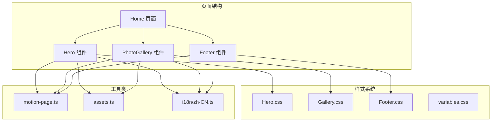
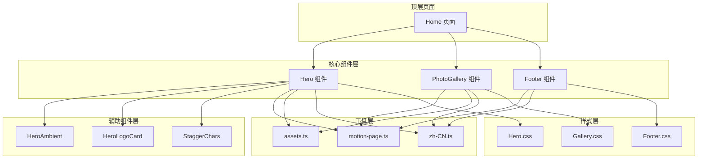
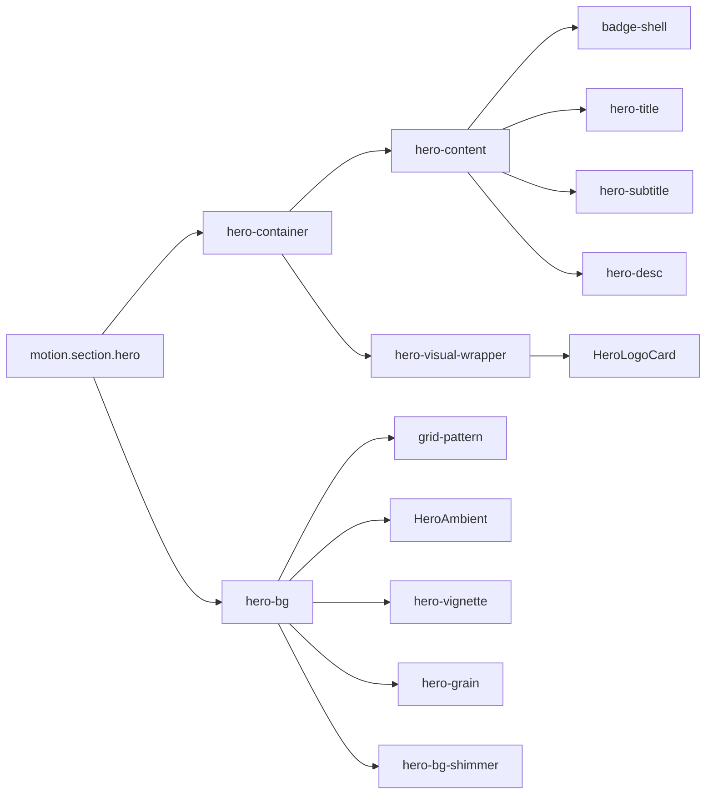
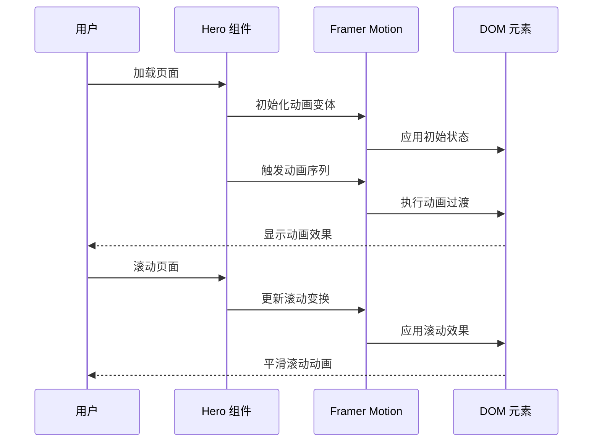
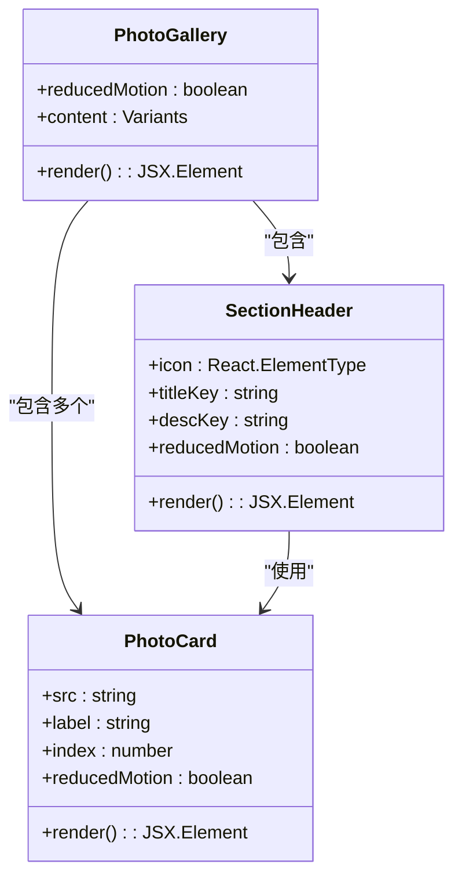
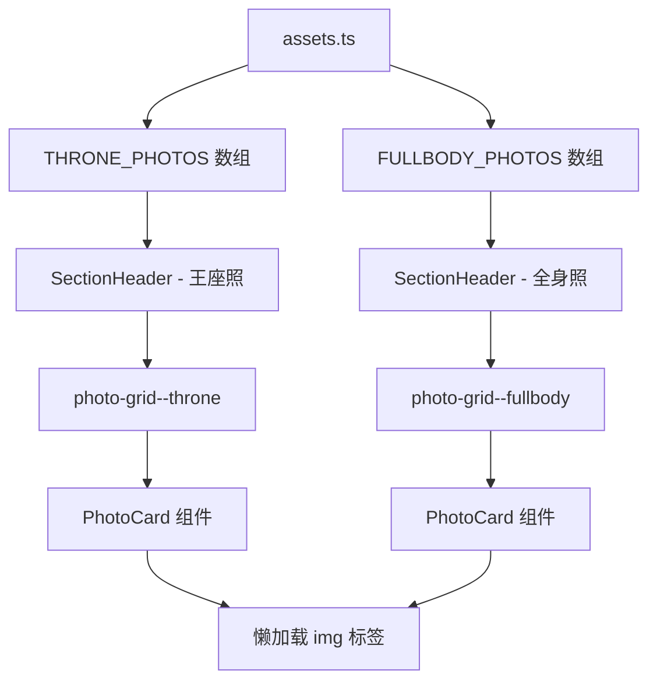
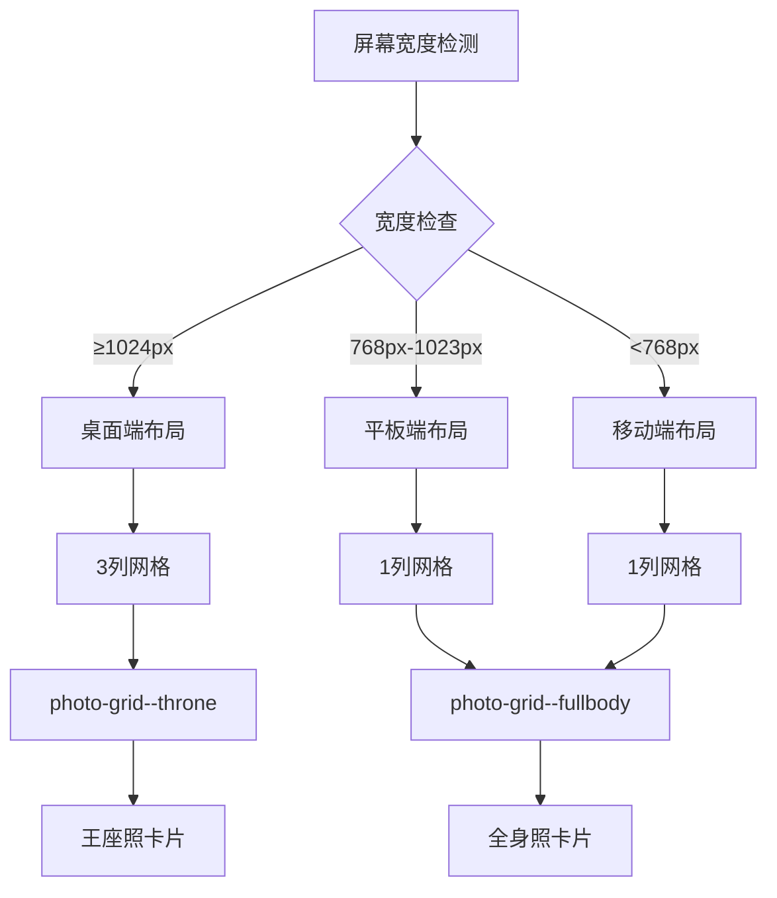
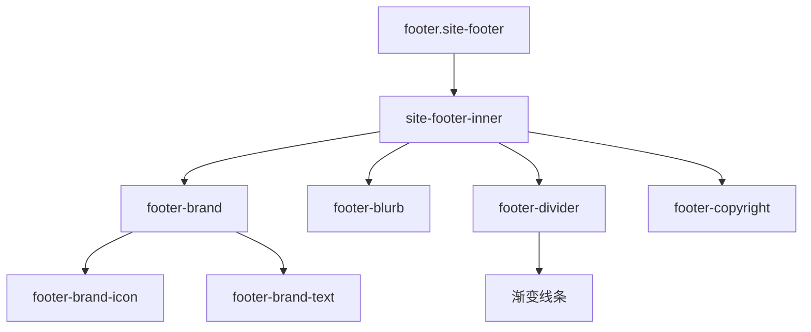
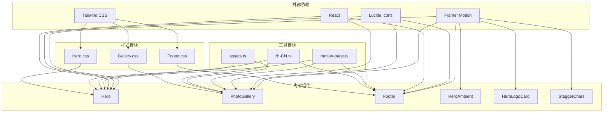

# 内容展示组件

<cite>
**本文档引用的文件**
- [Hero.tsx](file://src/components/Hero.tsx)
- [PhotoGallery.tsx](file://src/components/PhotoGallery.tsx)
- [Footer.tsx](file://src/components/Footer.tsx)
- [HeroAmbient.tsx](file://src/components/HeroAmbient.tsx)
- [HeroLogoCard.tsx](file://src/components/HeroLogoCard.tsx)
- [StaggerChars.tsx](file://src/components/StaggerChars.tsx)
- [assets.ts](file://src/constants/assets.ts)
- [motion-page.ts](file://src/utils/motion-page.ts)
- [Home.tsx](file://src/pages/Home.tsx)
- [Hero.css](file://src/styles/Hero.css)
- [Gallery.css](file://src/styles/Gallery.css)
- [Footer.css](file://src/styles/Footer.css)
- [zh-CN.ts](file://src/i18n/zh-CN.ts)
</cite>

## 目录
1. [简介](#简介)
2. [项目结构](#项目结构)
3. [核心组件](#核心组件)
4. [架构概览](#架构概览)
5. [详细组件分析](#详细组件分析)
6. [依赖关系分析](#依赖关系分析)
7. [性能考虑](#性能考虑)
8. [故障排除指南](#故障排除指南)
9. [结论](#结论)

## 简介

MinLL 项目的页面内容展示组件是一套精心设计的 React 组件集合，专注于创造沉浸式的视觉体验。该组件库包含三个核心组件：Hero 英雄区域、PhotoGallery 作品集相册和 Footer 页脚组件。这些组件通过流畅的动画过渡、响应式设计和精心调校的视觉效果，为用户提供了优雅的浏览体验。

本项目采用现代前端技术栈，结合 Framer Motion 实现流畅的动画效果，使用 Tailwind CSS 进行样式管理，并通过 Vite 构建工具进行优化部署。组件设计注重可访问性、性能优化和跨设备兼容性。

## 项目结构

项目采用模块化的组件架构，每个功能区域都有独立的组件文件和对应的样式文件：

**图表来源**
- [Home.tsx:1-15](file://src/pages/Home.tsx#L1-L15)
- [Hero.tsx:1-316](file://src/components/Hero.tsx#L1-L316)
- [PhotoGallery.tsx:1-162](file://src/components/PhotoGallery.tsx#L1-L162)
- [Footer.tsx:1-42](file://src/components/Footer.tsx#L1-L42)

**章节来源**
- [Home.tsx:1-15](file://src/pages/Home.tsx#L1-L15)
- [Hero.tsx:1-316](file://src/components/Hero.tsx#L1-L316)
- [PhotoGallery.tsx:1-162](file://src/components/PhotoGallery.tsx#L1-L162)
- [Footer.tsx:1-42](file://src/components/Footer.tsx#L1-L42)

## 核心组件

### Hero 英雄区域组件

Hero 组件是整个页面的视觉焦点，负责创建引人注目的首屏体验。它包含了复杂的动画层次、背景效果和交互元素。

**主要特性：**
- 多层背景动画：渐变、光晕、网格图案和颗粒效果
- 3D 视觉元素：动态旋转的徽章和品牌标识
- 流畅的文字动画：字符级的淡入和翻转效果
- 滚动交互：平滑的页面导航指示器
- 响应式设计：适配不同屏幕尺寸

### PhotoGallery 作品集相册组件

PhotoGallery 组件专门用于展示摄影作品，采用网格布局和卡片设计，提供良好的视觉层次和交互体验。

**主要特性：**
- 双分区布局：王座照和全身照两个独立区域
- 智能网格系统：根据屏幕尺寸自动调整列数
- 图片懒加载：优化加载性能和用户体验
- 卡片悬停效果：增强交互反馈
- 国际化支持：多语言标签和描述

### Footer 页脚组件

Footer 组件简洁而优雅，提供品牌信息、标语和版权信息的展示。

**主要特性：**
- 渐变背景：营造深色主题氛围
- 品牌标识：音乐符号和品牌名称
- 简洁布局：信息层次清晰
- 响应式设计：移动端友好

**章节来源**
- [Hero.tsx:25-316](file://src/components/Hero.tsx#L25-L316)
- [PhotoGallery.tsx:95-162](file://src/components/PhotoGallery.tsx#L95-L162)
- [Footer.tsx:10-42](file://src/components/Footer.tsx#L10-L42)

## 架构概览

组件系统采用分层架构设计，每个组件都有明确的职责分工：

**图表来源**
- [Home.tsx:6-14](file://src/pages/Home.tsx#L6-L14)
- [Hero.tsx:8-12](file://src/components/Hero.tsx#L8-L12)
- [PhotoGallery.tsx:4-8](file://src/components/PhotoGallery.tsx#L4-L8)
- [Footer.tsx:4-7](file://src/components/Footer.tsx#L4-L7)

## 详细组件分析

### Hero 组件深度解析

Hero 组件是整个页面的核心视觉组件，实现了复杂而精美的动画效果。

#### 布局结构分析

Hero 组件采用两列布局设计，左侧为内容区域，右侧为视觉展示区：

**图表来源**
- [Hero.tsx:41-231](file://src/components/Hero.tsx#L41-L231)

#### 动画系统架构

Hero 组件使用 Framer Motion 实现多层次的动画效果：

**图表来源**
- [Hero.tsx:37-38](file://src/components/Hero.tsx#L37-L38)
- [Hero.tsx:49-88](file://src/components/Hero.tsx#L49-L88)

#### 响应式设计实现

Hero 组件通过媒体查询实现自适应布局：

| 断点 | 屏幕宽度 | 布局变化 |
|------|----------|----------|
| 默认 | ≥1024px | 两列布局，内容与视觉区域并排 |
| 中等屏 | 768px-1023px | 减少间距，保持两列布局 |
| 移动端 | <768px | 单列布局，内容居中对齐 |

**章节来源**
- [Hero.tsx:12-12](file://src/components/Hero.tsx#L12)
- [Hero.tsx:37-316](file://src/components/Hero.tsx#L37-L316)
- [Hero.css:12-165](file://src/styles/Hero.css#L12-L165)

### PhotoGallery 相册组件详解

PhotoGallery 组件采用双分区设计，分别展示不同类型的摄影作品。

#### 组件架构设计

**图表来源**
- [PhotoGallery.tsx:12-162](file://src/components/PhotoGallery.tsx#L12-L162)

#### 图片管理系统

PhotoGallery 使用集中式的图片管理策略：

**图表来源**
- [assets.ts:11-24](file://src/constants/assets.ts#L11-L24)
- [PhotoGallery.tsx:117-157](file://src/components/PhotoGallery.tsx#L117-L157)

#### 网格布局算法

PhotoGallery 实现了智能的网格布局系统：

**图表来源**
- [Gallery.css:106-132](file://src/styles/Gallery.css#L106-L132)

**章节来源**
- [PhotoGallery.tsx:95-162](file://src/components/PhotoGallery.tsx#L95-L162)
- [assets.ts:11-24](file://src/constants/assets.ts#L11-L24)
- [Gallery.css:100-132](file://src/styles/Gallery.css#L100-L132)

### Footer 页脚组件分析

Footer 组件虽然结构简单，但通过精心设计的样式和动画效果，提供了优雅的收尾体验。

#### 信息组织结构

**图表来源**
- [Footer.tsx:16-40](file://src/components/Footer.tsx#L16-L40)

#### 设计特点

Footer 组件的设计特点包括：
- **渐变背景**：使用透明到深色的渐变营造层次感
- **简洁布局**：信息层次清晰，避免视觉混乱
- **品牌一致性**：保持与整体设计风格的一致性
- **响应式适配**：在小屏幕上自动调整内边距和字体大小

**章节来源**
- [Footer.tsx:10-42](file://src/components/Footer.tsx#L10-L42)
- [Footer.css:3-75](file://src/styles/Footer.css#L3-L75)

## 依赖关系分析

组件间的依赖关系体现了清晰的分层架构：

**图表来源**
- [Hero.tsx:1-12](file://src/components/Hero.tsx#L1-L12)
- [PhotoGallery.tsx:1-9](file://src/components/PhotoGallery.tsx#L1-L9)
- [Footer.tsx:1-8](file://src/components/Footer.tsx#L1-L8)

**章节来源**
- [Hero.tsx:1-24](file://src/components/Hero.tsx#L1-L24)
- [PhotoGallery.tsx:1-9](file://src/components/PhotoGallery.tsx#L1-L9)
- [Footer.tsx:1-8](file://src/components/Footer.tsx#L1-L8)

## 性能考虑

### 动画性能优化

Hero 组件通过多种方式优化动画性能：

1. **减少重绘**：使用 `will-change` 属性提示浏览器优化特定属性
2. **硬件加速**：利用 GPU 加速进行变换和动画
3. **性能感知**：根据用户的 `prefers-reduced-motion` 设置调整动画强度
4. **内存管理**：及时清理动画监听器和事件处理器

### 图片加载优化

PhotoGallery 组件采用了多项图片优化策略：

1. **懒加载机制**：使用 `loading="lazy"` 和 `decoding="async"` 提升加载性能
2. **响应式图片**：根据屏幕尺寸选择合适的图片分辨率
3. **缓存策略**：利用浏览器缓存减少重复加载
4. **占位符**：提供加载状态的视觉反馈

### 内存使用优化

组件系统通过以下方式控制内存使用：

1. **组件卸载**：确保组件卸载时清理所有订阅和定时器
2. **事件委托**：使用事件委托减少事件处理器数量
3. **虚拟滚动**：对于大量内容场景，考虑实现虚拟滚动
4. **状态最小化**：避免存储不必要的状态数据

## 故障排除指南

### 常见布局问题

**问题：Hero 组件在移动设备上显示异常**
- 检查 CSS 媒体查询是否正确应用
- 验证 `hero-container` 的网格属性
- 确认 `perspective` 属性在小屏幕上的表现

**问题：PhotoGallery 网格布局错乱**
- 检查 `photo-grid` 类的 CSS 属性
- 验证 `grid-template-columns` 的设置
- 确认图片容器的 `flex` 属性配置

**问题：Footer 文字溢出**
- 检查 `max-width` 属性设置
- 验证 `text-align` 属性
- 确认 `margin` 和 `padding` 的计算

### 动画相关问题

**问题：动画卡顿或不流畅**
- 检查 `will-change` 属性的使用
- 验证 `transform` 和 `opacity` 的硬件加速
- 确认动画帧率设置合理

**问题：滚动动画不生效**
- 检查 `useScroll` 和 `useTransform` 的绑定
- 验证 `scrollY` 的监听设置
- 确认变换函数的参数范围

### 性能问题诊断

**问题：页面加载缓慢**
- 检查图片资源的压缩和格式
- 验证 CSS 文件的合并和压缩
- 确认 JavaScript 代码的 Tree Shaking

**问题：内存泄漏**
- 检查组件卸载时的状态清理
- 验证事件监听器的移除
- 确认定时器和订阅的清理

**章节来源**
- [Hero.css:12-165](file://src/styles/Hero.css#L12-L165)
- [Gallery.css:106-132](file://src/styles/Gallery.css#L106-L132)
- [Footer.css:15-75](file://src/styles/Footer.css#L15-L75)

## 结论

MinLL 项目的页面内容展示组件展现了现代前端开发的最佳实践。通过精心设计的组件架构、流畅的动画系统和响应式布局，为用户提供了卓越的视觉体验。

### 设计优势

1. **模块化架构**：清晰的组件分离和职责划分
2. **性能优化**：多层面的性能考虑和优化策略
3. **可访问性**：遵循无障碍设计原则
4. **响应式设计**：全面的跨设备适配
5. **国际化支持**：完善的多语言解决方案

### 技术亮点

1. **Framer Motion 集成**：实现了复杂的动画效果
2. **Tailwind CSS 工程化**：提供了灵活的样式管理
3. **TypeScript 类型安全**：增强了代码的可靠性
4. **Vite 构建优化**：提升了开发和构建效率

### 改进建议

1. **组件测试**：增加单元测试和集成测试覆盖率
2. **性能监控**：实现性能指标的实时监控
3. **错误边界**：添加全局错误处理机制
4. **文档完善**：扩展组件 API 文档和使用示例

这套组件系统为类似项目提供了优秀的参考模板，展示了如何在保持代码质量的同时实现出色的用户体验。