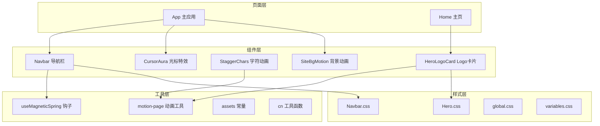
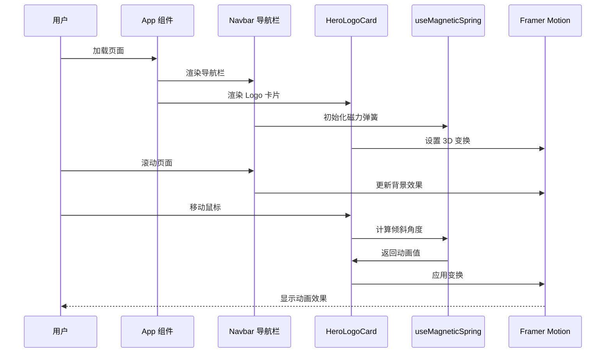
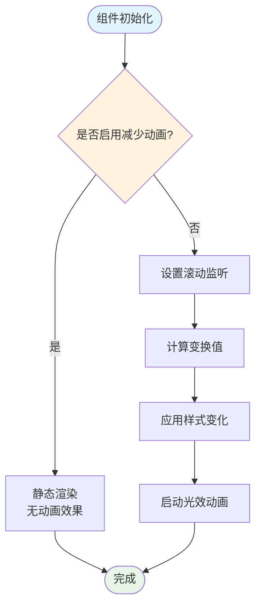
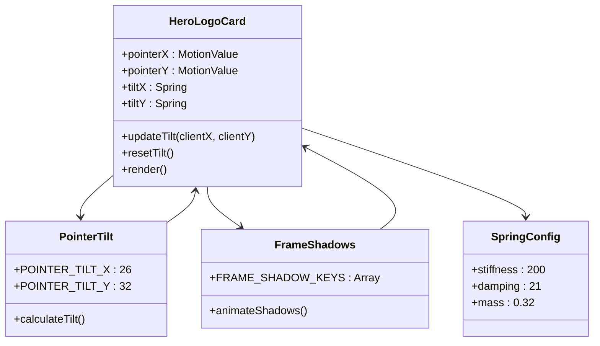
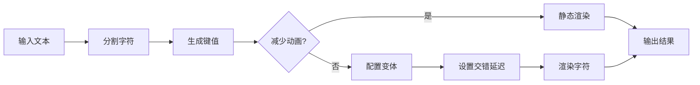
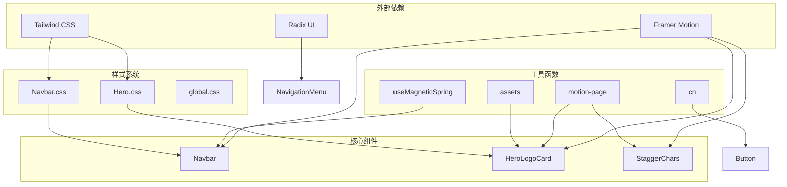

# 导航辅助组件

<cite>
**本文档引用的文件**
- [Navbar.tsx](file://src/components/Navbar.tsx)
- [HeroLogoCard.tsx](file://src/components/HeroLogoCard.tsx)
- [StaggerChars.tsx](file://src/components/StaggerChars.tsx)
- [Navbar.css](file://src/styles/Navbar.css)
- [Hero.css](file://src/styles/Hero.css)
- [useMagneticSpring.ts](file://src/hooks/useMagneticSpring.ts)
- [motion-page.ts](file://src/utils/motion-page.ts)
- [assets.ts](file://src/constants/assets.ts)
- [App.tsx](file://src/App.tsx)
- [Home.tsx](file://src/pages/Home.tsx)
- [button.tsx](file://src/components/ui/button.tsx)
- [navigation-menu.tsx](file://src/components/ui/navigation-menu.tsx)
- [utils.ts](file://src/lib/utils.ts)
</cite>

## 目录
1. [简介](#简介)
2. [项目结构](#项目结构)
3. [核心组件](#核心组件)
4. [架构概览](#架构概览)
5. [详细组件分析](#详细组件分析)
6. [依赖关系分析](#依赖关系分析)
7. [性能考虑](#性能考虑)
8. [故障排除指南](#故障排除指南)
9. [结论](#结论)

## 简介

MinLL 项目的导航和辅助组件是整个用户界面体验的核心组成部分。本文档深入分析了三个关键组件：Navbar 导航栏、HeroLogoCard Logo 卡片和 StaggerChars 字符级动画组件。这些组件共同构建了现代化、响应式的用户体验，结合了流畅的动画效果、精美的视觉设计和优秀的可访问性支持。

项目采用 React + Framer Motion 的技术栈，通过精心设计的状态管理和动画系统，为用户提供了沉浸式的交互体验。组件设计遵循现代前端开发最佳实践，注重性能优化、可维护性和跨浏览器兼容性。

## 项目结构

导航和辅助组件位于 `src/components` 目录下，与样式文件分离，形成了清晰的模块化架构：

**图表来源**
- [Navbar.tsx:1-111](file://src/components/Navbar.tsx#L1-L111)
- [HeroLogoCard.tsx:1-152](file://src/components/HeroLogoCard.tsx#L1-L152)
- [StaggerChars.tsx:1-59](file://src/components/StaggerChars.tsx#L1-L59)

**章节来源**
- [App.tsx:1-70](file://src/App.tsx#L1-L70)
- [Home.tsx:1-15](file://src/pages/Home.tsx#L1-L15)

## 核心组件

### 组件概览

MinLL 项目中的导航和辅助组件主要包含以下三个核心组件：

1. **Navbar 导航栏** - 固定顶部的导航组件，具备滚动效果和磁力动画
2. **HeroLogoCard Logo 卡片** - 3D 视觉效果的 Logo 展示组件
3. **StaggerChars 字符级动画** - 文本分段和逐字符动画组件

每个组件都经过精心设计，具有独特的功能特性和交互模式。

**章节来源**
- [Navbar.tsx:13-111](file://src/components/Navbar.tsx#L13-L111)
- [HeroLogoCard.tsx:20-152](file://src/components/HeroLogoCard.tsx#L20-L152)
- [StaggerChars.tsx:14-59](file://src/components/StaggerChars.tsx#L14-L59)

## 架构概览

导航和辅助组件的整体架构体现了现代 React 应用的最佳实践：

**图表来源**
- [App.tsx:8-67](file://src/App.tsx#L8-L67)
- [Navbar.tsx:13-111](file://src/components/Navbar.tsx#L13-L111)
- [HeroLogoCard.tsx:20-152](file://src/components/HeroLogoCard.tsx#L20-L152)
- [useMagneticSpring.ts:6-33](file://src/hooks/useMagneticSpring.ts#L6-L33)

## 详细组件分析

### Navbar 导航组件

Navbar 是一个固定定位的导航栏组件，具备以下核心特性：

#### 响应式布局设计

导航栏采用流式布局，支持多种屏幕尺寸：
- 桌面端：1400px 最大宽度，左右内边距 40px
- 平板端：1024px 以下自动调整间距
- 移动端：768px 以下使用 20px 内边距

#### 状态管理机制

组件使用多个 Framer Motion 值来管理状态：
- `shellOpaque`: 控制背景透明度（0-0.88）
- `shellBlur`: 控制模糊程度（0-24px）
- `rimAlpha`: 控制边框透明度（0-0.45）

#### 动画系统

**图表来源**
- [Navbar.tsx:14-24](file://src/components/Navbar.tsx#L14-L24)
- [Navbar.tsx:45-57](file://src/components/Navbar.tsx#L45-L57)

#### 交互逻辑

导航栏实现了多种交互效果：
- **滚动效果**：随着页面滚动，背景逐渐变浓，模糊度增加
- **磁力动画**：Logo 在鼠标移动时产生磁性跟随效果
- **悬停反馈**：按钮在悬停时放大 5%，点击时缩小 6%

**章节来源**
- [Navbar.tsx:13-111](file://src/components/Navbar.tsx#L13-L111)
- [Navbar.css:1-73](file://src/styles/Navbar.css#L1-L73)
- [useMagneticSpring.ts:6-33](file://src/hooks/useMagneticSpring.ts#L6-L33)

### HeroLogoCard Logo 卡片组件

HeroLogoCard 是一个复杂的 3D 视觉组件，具有以下特点：

#### 3D 变换系统

组件实现了完整的 3D 变换矩阵：
- **轨道旋转**：围绕 X、Y、Z 轴的持续旋转
- **倾斜效果**：基于鼠标位置计算的倾斜角度
- **渐变动画**：多重阴影和滤镜效果的循环变化

#### 视觉设计元素

**图表来源**
- [HeroLogoCard.tsx:10-18](file://src/components/HeroLogoCard.tsx#L10-L18)
- [HeroLogoCard.tsx:24-28](file://src/components/HeroLogoCard.tsx#L24-L28)
- [HeroLogoCard.tsx:26-47](file://src/components/HeroLogoCard.tsx#L26-L47)

#### 动画序列

组件包含多个独立的动画序列：
1. **轨道动画**：持续的 3D 旋转效果
2. **框架动画**：多重阴影的循环变化
3. **内部动画**：滤镜效果的渐进变化
4. **悬停动画**：缩放和弹簧效果

**章节来源**
- [HeroLogoCard.tsx:20-152](file://src/components/HeroLogoCard.tsx#L20-L152)
- [Hero.css:363-470](file://src/styles/Hero.css#L363-L470)

### StaggerChars 字符级动画组件

StaggerChars 是一个专门用于文本动画的组件，支持逐字符的复杂动画效果：

#### 文本分段算法

组件实现了高效的文本分段机制：
- 将字符串转换为字符数组
- 为每个字符生成唯一键值
- 处理空格字符的特殊显示
- 支持自定义字符类名

#### 动画配置系统

**图表来源**
- [StaggerChars.tsx:23-30](file://src/components/StaggerChars.tsx#L23-L30)
- [StaggerChars.tsx:32-34](file://src/components/StaggerChars.tsx#L32-L34)
- [StaggerChars.tsx:36-42](file://src/components/StaggerChars.tsx#L36-L42)

#### 性能优化策略

组件采用了多项性能优化措施：
- 使用 `useMemo` 缓存字符数组
- 条件渲染减少不必要的 DOM 更新
- 合理的动画配置避免过度重绘
- 优化的键值生成算法

**章节来源**
- [StaggerChars.tsx:14-59](file://src/components/StaggerChars.tsx#L14-L59)
- [motion-page.ts:116-143](file://src/utils/motion-page.ts#L116-L143)

## 依赖关系分析

导航和辅助组件之间的依赖关系体现了清晰的层次结构：

**图表来源**
- [Navbar.tsx:1-11](file://src/components/Navbar.tsx#L1-L11)
- [HeroLogoCard.tsx:1-8](file://src/components/HeroLogoCard.tsx#L1-L8)
- [StaggerChars.tsx:1](file://src/components/StaggerChars.tsx#L1)

### 组件耦合度分析

- **低耦合高内聚**：各组件职责明确，相互独立
- **单向数据流**：组件间通过 props 和 hooks 进行通信
- **可测试性强**：每个组件都可以独立进行单元测试
- **可扩展性好**：遵循开放封闭原则，易于功能扩展

**章节来源**
- [button.tsx:1-63](file://src/components/ui/button.tsx#L1-L63)
- [navigation-menu.tsx:1-169](file://src/components/ui/navigation-menu.tsx#L1-L169)

## 性能考虑

### 动画性能优化

导航和辅助组件在性能方面采用了多项优化策略：

#### 减少动画配置

- **useReducedMotion**：检测系统减少动画偏好，自动降级
- **will-change**：使用硬件加速属性优化渲染
- **transform3d**：优先使用 3D 变换来提升性能

#### 内存管理

- **useMemo 缓存**：缓存昂贵的计算结果
- **useCallback 优化**：避免不必要的函数重新创建
- **清理定时器**：及时清理动画和事件监听器

#### 渲染优化

- **条件渲染**：根据设备能力选择性渲染
- **懒加载**：图片和资源的按需加载
- **虚拟滚动**：大量列表的虚拟化处理

### 性能监控建议

- 使用浏览器开发者工具监控 FPS
- 关注主线程阻塞情况
- 监控内存使用情况
- 定期进行性能基准测试

## 故障排除指南

### 常见问题及解决方案

#### 动画不流畅

**问题症状**：动画卡顿或掉帧
**可能原因**：
- 过多的 DOM 操作
- 复杂的 CSS 过渡
- 频繁的重排重绘

**解决方案**：
- 使用 `will-change` 属性
- 避免在动画中改变布局属性
- 减少动画层级深度

#### 响应式问题

**问题症状**：移动端显示异常
**可能原因**：
- CSS 媒体查询配置错误
- 触摸事件处理不当
- 字体大小适配问题

**解决方案**：
- 检查断点设置
- 添加触摸友好的交互
- 使用相对单位而非绝对像素

#### 可访问性问题

**问题症状**：屏幕阅读器无法正确读取内容
**可能原因**：
- 缺少适当的 ARIA 属性
- 键盘导航支持不足
- 颜色对比度不够

**解决方案**：
- 添加 `aria-label` 和 `aria-describedby`
- 实现键盘快捷键支持
- 确保足够的颜色对比度

### 调试技巧

1. **使用 React DevTools**：检查组件树和状态变化
2. **启用 Framer Motion 调试**：查看动画性能指标
3. **浏览器性能面板**：监控渲染性能
4. **控制台日志**：跟踪事件触发和状态更新

**章节来源**
- [Navbar.tsx:14](file://src/components/Navbar.tsx#L14)
- [HeroLogoCard.tsx:21](file://src/components/HeroLogoCard.tsx#L21)

## 结论

MinLL 项目的导航和辅助组件展现了现代前端开发的最高标准。通过精心设计的架构、优雅的动画效果和完善的可访问性支持，这些组件为用户提供了卓越的交互体验。

### 主要成就

- **技术创新**：成功集成 Framer Motion 实现复杂的 3D 动画效果
- **性能优化**：通过多种技术手段确保流畅的用户体验
- **可维护性**：模块化的架构设计便于长期维护和扩展
- **可访问性**：全面考虑不同用户的需求和能力

### 未来发展方向

1. **进一步优化性能**：探索 Web Workers 和 Service Workers
2. **增强可访问性**：添加更多无障碍功能
3. **跨平台支持**：扩展到移动应用和桌面应用
4. **国际化支持**：完善多语言环境下的组件表现

这些组件不仅为 MinLL 项目提供了强大的技术支持，也为整个前端社区树立了优秀的开发范例。通过深入理解和学习这些组件的设计理念和实现细节，开发者可以构建出更加优秀和用户友好的 Web 应用程序。