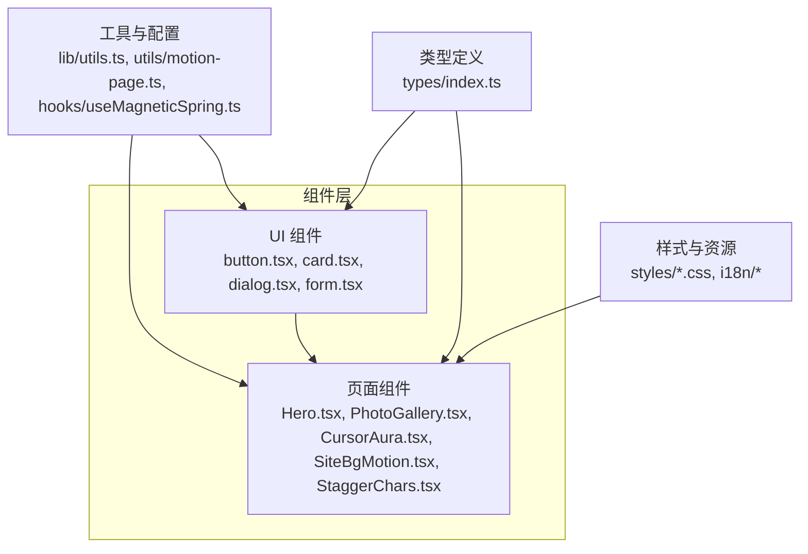
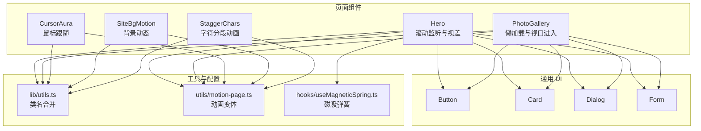
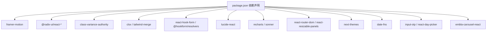

# 核心组件系统

<cite>
**本文引用的文件**
- [README.md](file://README.md)
- [package.json](file://package.json)
- [src/components/ui/button.tsx](file://src/components/ui/button.tsx)
- [src/components/ui/card.tsx](file://src/components/ui/card.tsx)
- [src/components/ui/dialog.tsx](file://src/components/ui/dialog.tsx)
- [src/components/ui/form.tsx](file://src/components/ui/form.tsx)
- [src/components/CursorAura.tsx](file://src/components/CursorAura.tsx)
- [src/components/Hero.tsx](file://src/components/Hero.tsx)
- [src/components/PhotoGallery.tsx](file://src/components/PhotoGallery.tsx)
- [src/components/SiteBgMotion.tsx](file://src/components/SiteBgMotion.tsx)
- [src/components/StaggerChars.tsx](file://src/components/StaggerChars.tsx)
- [src/lib/utils.ts](file://src/lib/utils.ts)
- [src/utils/motion-page.ts](file://src/utils/motion-page.ts)
- [src/hooks/useMagneticSpring.ts](file://src/hooks/useMagneticSpring.ts)
- [src/types/index.ts](file://src/types/index.ts)
</cite>

## 目录
1. [引言](#引言)
2. [项目结构](#项目结构)
3. [核心组件](#核心组件)
4. [架构总览](#架构总览)
5. [详细组件分析](#详细组件分析)
6. [依赖分析](#依赖分析)
7. [性能考虑](#性能考虑)
8. [故障排查指南](#故障排查指南)
9. [结论](#结论)
10. [附录](#附录)

## 引言
本文件系统性梳理 MinLL 项目的组件体系，覆盖视觉特效组件、内容展示组件与交互增强组件三大类。文档从设计理念、实现细节、调用关系与使用模式出发，结合具体代码片段路径与实际应用场景，帮助初学者快速上手，同时为有经验的开发者提供深入的技术参考。所有分析均基于仓库中的源码文件，确保信息准确可追溯。

## 项目结构
MinLL 基于 React + TypeScript + Vite 构建，采用按功能分层的目录组织方式：
- 组件层：src/components 下包含通用 UI 组件（ui 子目录）与页面级组件（如 Hero、PhotoGallery、CursorAura 等）
- 工具与类型：src/lib 提供通用工具函数；src/utils 聚合动画与页面动效配置；src/hooks 提供自定义 Hook
- 类型声明：src/types 定义共享类型占位
- 样式与国际化：src/styles 与 src/i18n 提供样式与多语言支持
- 依赖管理：package.json 明确运行时与开发时依赖

图表来源
- [src/components/ui/button.tsx](file://src/components/ui/button.tsx)
- [src/components/ui/card.tsx](file://src/components/ui/card.tsx)
- [src/components/ui/dialog.tsx](file://src/components/ui/dialog.tsx)
- [src/components/ui/form.tsx](file://src/components/ui/form.tsx)
- [src/components/Hero.tsx](file://src/components/Hero.tsx)
- [src/components/PhotoGallery.tsx](file://src/components/PhotoGallery.tsx)
- [src/components/CursorAura.tsx](file://src/components/CursorAura.tsx)
- [src/components/SiteBgMotion.tsx](file://src/components/SiteBgMotion.tsx)
- [src/components/StaggerChars.tsx](file://src/components/StaggerChars.tsx)
- [src/lib/utils.ts](file://src/lib/utils.ts)
- [src/utils/motion-page.ts](file://src/utils/motion-page.ts)
- [src/hooks/useMagneticSpring.ts](file://src/hooks/useMagneticSpring.ts)
- [src/types/index.ts](file://src/types/index.ts)

章节来源
- [README.md](file://README.md)
- [package.json](file://package.json)

## 核心组件
本节聚焦三类核心组件：通用 UI 组件（按钮、卡片、对话框、表单）、视觉特效组件（光晕指针、站点背景动态、滚动触发动画、字符级分段动画）以及交互增强组件（磁吸弹簧 Hook）。它们共同构成页面的交互体验与视觉表现基础。

- 通用 UI 组件
  - 按钮 Button：通过变体与尺寸的组合实现一致的视觉与交互语义，支持 asChild 以复用语义标签
  - 卡片 Card：提供卡片容器与头部/标题/描述/内容/底部等子组件，统一布局与间距
  - 对话框 Dialog：封装 Radix UI 的对话框原语，提供入口、遮罩、内容、标题、描述与关闭按钮
  - 表单 Form：集成 react-hook-form，提供表单项上下文、标签、控制、描述与错误消息渲染

- 视觉特效组件
  - 光晕指针 CursorAura：跟随鼠标移动的柔光背景，支持“减少动态”模式
  - 站点背景动态 SiteBgMotion：多 blob 的循环平滑动画与噪波动画
  - 英雄区 Hero：滚动驱动的视差背景、网格图案与文字分段动画
  - 字符分段 StaggerChars：将文本拆分为字符级元素，配合变体实现逐字出现效果

- 交互增强组件
  - 磁吸弹簧 useMagneticSpring：基于指针事件计算偏移，使用弹簧物理模拟产生自然回弹

章节来源
- [src/components/ui/button.tsx](file://src/components/ui/button.tsx)
- [src/components/ui/card.tsx](file://src/components/ui/card.tsx)
- [src/components/ui/dialog.tsx](file://src/components/ui/dialog.tsx)
- [src/components/ui/form.tsx](file://src/components/ui/form.tsx)
- [src/components/CursorAura.tsx](file://src/components/CursorAura.tsx)
- [src/components/SiteBgMotion.tsx](file://src/components/SiteBgMotion.tsx)
- [src/components/Hero.tsx](file://src/components/Hero.tsx)
- [src/components/StaggerChars.tsx](file://src/components/StaggerChars.tsx)
- [src/hooks/useMagneticSpring.ts](file://src/hooks/useMagneticSpring.ts)

## 架构总览
下图展示了页面组件与通用 UI 组件、工具模块之间的交互关系，以及动画配置在页面组件中的应用方式。

图表来源
- [src/components/Hero.tsx](file://src/components/Hero.tsx)
- [src/components/PhotoGallery.tsx](file://src/components/PhotoGallery.tsx)
- [src/components/CursorAura.tsx](file://src/components/CursorAura.tsx)
- [src/components/SiteBgMotion.tsx](file://src/components/SiteBgMotion.tsx)
- [src/components/StaggerChars.tsx](file://src/components/StaggerChars.tsx)
- [src/components/ui/button.tsx](file://src/components/ui/button.tsx)
- [src/components/ui/card.tsx](file://src/components/ui/card.tsx)
- [src/components/ui/dialog.tsx](file://src/components/ui/dialog.tsx)
- [src/components/ui/form.tsx](file://src/components/ui/form.tsx)
- [src/lib/utils.ts](file://src/lib/utils.ts)
- [src/utils/motion-page.ts](file://src/utils/motion-page.ts)
- [src/hooks/useMagneticSpring.ts](file://src/hooks/useMagneticSpring.ts)

## 详细组件分析

### 通用 UI 组件
- 按钮 Button
  - 设计理念：通过变体（variant）与尺寸（size）的组合，统一不同语义与密度下的视觉与交互
  - 关键特性：支持 asChild 以复用语义标签；通过数据属性标注 slot/variant/size 便于样式与测试
  - 使用模式：在表单、导航、操作面板中作为基础交互单元
  - 配置项：className、variant、size、asChild；继承原生 button 属性
  - 返回值：渲染为语义标签或包裹元素，最终输出带变体样式的 DOM

- 卡片 Card
  - 设计理念：提供卡片容器与结构化子区域，统一边框、阴影、内边距与网格布局
  - 关键特性：CardHeader 支持动作区栅格布局；CardTitle/CardDescription 提供语义化标题与描述
  - 使用模式：用于展示区块内容、统计卡片、用户信息卡片等
  - 配置项：className；各子组件继承原生 div 属性
  - 返回值：结构化的卡片 DOM 结构

- 对话框 Dialog
  - 设计理念：基于 Radix UI 实现无障碍、可组合的对话框，支持门户挂载与遮罩动画
  - 关键特性：Overlay/Portal/Content 组合；可选关闭按钮；支持头部/尾部/标题/描述
  - 使用模式：模态提示、确认对话、设置面板等
  - 配置项：Root/Trigger/Portal/Overlay/Content/Close/Title/Description/Footer；Content 支持 showCloseButton
  - 返回值：可组合的对话框结构，具备开闭状态动画

- 表单 Form
  - 设计理念：通过 react-hook-form 与上下文提供表单项的统一 ID、描述与错误消息管理
  - 关键特性：FormField/FormItem/FormControl/FormLabel/FormDescription/FormMessage 组合；useFormField 获取字段状态
  - 使用模式：登录、注册、设置、反馈等场景
  - 配置项：FormProvider、ControllerProps、Label 原生属性；FormControl 传递 aria-* 属性
  - 返回值：可访问且可维护的表单结构

章节来源
- [src/components/ui/button.tsx](file://src/components/ui/button.tsx)
- [src/components/ui/card.tsx](file://src/components/ui/card.tsx)
- [src/components/ui/dialog.tsx](file://src/components/ui/dialog.tsx)
- [src/components/ui/form.tsx](file://src/components/ui/form.tsx)

### 视觉特效组件
- 光晕指针 CursorAura
  - 设计理念：在鼠标移动时生成柔光背景，营造跟随感；尊重系统“减少动态”偏好
  - 关键特性：useMotionValue/useSpring 实现平滑跟随；requestAnimationFrame 控制更新频率；mouseleave 回归中心
  - 使用模式：全局背景装饰，适用于首页或沉浸式页面
  - 配置项：无外部 props；内部通过常量 SPRING、HALF 控制物理参数与尺寸
  - 返回值：固定定位的动画元素，无交互事件穿透

- 站点背景动态 SiteBgMotion
  - 设计理念：多 blob 循环平滑动画与噪波动画，增强页面质感
  - 关键特性：BLOBS 数组定义动画序列与周期；repeat 与 ease 实现无限循环
  - 使用模式：全站背景装饰，避免干扰主要内容
  - 配置项：无外部 props；内部通过数组与 duration 控制动画节奏
  - 返回值：多个动画元素节点

- 英雄区 Hero
  - 设计理念：滚动驱动的视差背景与网格图案，配合文字分段动画提升叙事感
  - 关键特性：useScroll/useTransform 计算滚动影响；contentStaggerVariants/fadeUpItemVariants 等变体驱动逐字动画
  - 使用模式：首页首屏展示，承载品牌信息与引导交互
  - 配置项：无外部 props；内部通过 variants 与 transition 控制动画
  - 返回值：包含背景层、内容层与滚动指示器的完整英雄区

- 字符分段 StaggerChars
  - 设计理念：将文本拆分为字符级元素，逐字出现形成强调效果
  - 关键特性：useMemo 缓存字符映射；stagger 控制延迟；display 处理空格渲染
  - 使用模式：标题、标语、描述等需要强调的文字
  - 配置项：text、className、charClassName、reducedMotion、stagger、charVariants、lineVariants
  - 返回值：带动画的字符级 span 结构

章节来源
- [src/components/CursorAura.tsx](file://src/components/CursorAura.tsx)
- [src/components/SiteBgMotion.tsx](file://src/components/SiteBgMotion.tsx)
- [src/components/Hero.tsx](file://src/components/Hero.tsx)
- [src/components/StaggerChars.tsx](file://src/components/StaggerChars.tsx)
- [src/utils/motion-page.ts](file://src/utils/motion-page.ts)

### 交互增强组件
- 磁吸弹簧 useMagneticSpring
  - 设计理念：基于指针事件计算相对中心的偏移，使用弹簧物理模拟产生自然回弹
  - 关键特性：useMotionValue/useSpring 状态管理；onPointerMove/onPointerLeave 事件处理
  - 使用模式：按钮悬停磁吸、图标漂浮、交互反馈等
  - 配置项：strength（默认 0.42）控制偏移强度；返回 ref、x、y、事件处理器
  - 返回值：包含 DOM 引用与动画值的对象

章节来源
- [src/hooks/useMagneticSpring.ts](file://src/hooks/useMagneticSpring.ts)

### 页面级内容展示组件
- 照片画廊 PhotoGallery
  - 设计理念：分区块展示不同类型的图片，结合懒加载与视口进入触发动画
  - 关键特性：SectionHeader 与 PhotoCard 组合；contentStaggerVariants/fadeUpItemVariants 控制入场；viewport once 与 margin 控制触发时机
  - 使用模式：作品集、相册、展示页
  - 配置项：无外部 props；内部通过 shape、index、reducedMotion 控制样式与动画
  - 返回值：两段分区的网格布局，包含标题、描述与图片卡片

章节来源
- [src/components/PhotoGallery.tsx](file://src/components/PhotoGallery.tsx)

## 依赖分析
- 运行时依赖
  - 动画与交互：framer-motion、@radix-ui/react-* 系列
  - 样式与工具：class-variance-authority、clsx、tailwind-merge
  - 表单：react-hook-form、@hookform/resolvers
  - 图标：lucide-react
  - 可视化：recharts、sonner
  - 导航与布局：react-router-dom、react-resizable-panels
  - 主题：next-themes
  - 时间：date-fns
  - 输入：input-otp、react-day-picker
  - 轮播：embla-carousel-react

- 开发时依赖
  - 构建：vite、@vitejs/plugin-react
  - 类型：typescript、@types/react、@types/react-dom
  - Lint：eslint、typescript-eslint
  - 样式：tailwindcss、autoprefixer、postcss

图表来源
- [package.json](file://package.json)

章节来源
- [package.json](file://package.json)

## 性能考虑
- 减少动态模式：多组件通过 useReducedMotion 判断系统偏好，自动降级动画以节省资源
- 懒加载与视口触发：PhotoGallery 使用 whileInView 与 viewport 参数，仅在可见时触发动画，降低初始渲染压力
- 动画节流：CursorAura 使用 requestAnimationFrame 控制更新频率，避免高频重绘
- 类名合并：lib/utils.ts 中的 cn 通过 tailwind-merge 合并类名，减少冲突与冗余样式
- 物理参数优化：SiteBgMotion 与 Hero 的动画周期与缓动函数经过调优，保证流畅度的同时控制帧率
- 文本分段：StaggerChars 将字符串转为字符数组并缓存，避免重复计算

## 故障排查指南
- 对话框无法关闭或遮罩点击无效
  - 检查 DialogContent 是否正确包裹 DialogPrimitive.Content 与 Portal
  - 确认 showCloseButton 与 Close 按钮的事件绑定是否生效
  - 参考路径：[src/components/ui/dialog.tsx](file://src/components/ui/dialog.tsx)

- 表单字段错误未显示
  - 确保 Form、FormField、FormControl、FormMessage 的上下文链路完整
  - 检查 useFormField 是否在 FormItem 内部使用
  - 参考路径：[src/components/ui/form.tsx](file://src/components/ui/form.tsx)

- 英雄区滚动动画不生效
  - 确认 useScroll/useTransform 的目标元素存在且可见
  - 检查 variants 传入顺序与 initial/animate 设置
  - 参考路径：[src/components/Hero.tsx](file://src/components/Hero.tsx)，[src/utils/motion-page.ts](file://src/utils/motion-page.ts)

- 光晕指针不跟随鼠标
  - 检查 useReducedMotion 返回值与事件监听是否被提前清理
  - 确认 requestAnimationFrame 的取消与窗口事件解绑逻辑
  - 参考路径：[src/components/CursorAura.tsx](file://src/components/CursorAura.tsx)

- 磁吸弹簧无响应
  - 确认 ref 绑定到正确的元素，且 pointer 事件未被父级拦截
  - 检查 strength 与 SPRING 参数是否合理
  - 参考路径：[src/hooks/useMagneticSpring.ts](file://src/hooks/useMagneticSpring.ts)

## 结论
MinLL 的组件系统以“可组合、可访问、可维护”为核心设计原则，通过通用 UI 组件提供一致的交互语义，借助动画工具与页面级组件实现丰富的视觉表现，并以 Hook 与工具函数增强交互体验。整体架构清晰、职责分明，既适合快速搭建页面，也便于扩展与定制。

## 附录
- 常用配置与参数速查
  - Button：variant（default/destructive/outline/secondary/ghost/link），size（default/sm/lg/icon/icon-sm/icon-lg），asChild
  - Dialog：showCloseButton（true/false），支持标题/描述/头部/尾部
  - Form：useFormField 返回 id、name、formItemId、formDescriptionId、formMessageId、error 等
  - StaggerChars：text、className、charClassName、reducedMotion、stagger、charVariants、lineVariants
  - useMagneticSpring：strength（默认 0.42），返回 ref、x、y、onPointerMove、onPointerLeave

- 最佳实践
  - 在需要强调的标题与标语中使用 StaggerChars
  - 使用 contentStaggerVariants/fadeUpItemVariants 统一内容入场节奏
  - 在全局装饰中使用 CursorAura 与 SiteBgMotion，注意 reducedMotion 降级
  - 在表单中使用 Form 上下文链路，确保可访问性与错误提示一致性