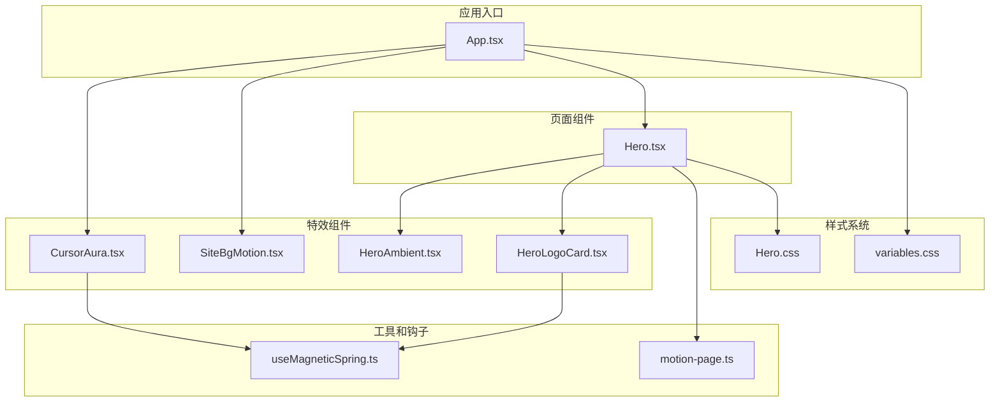
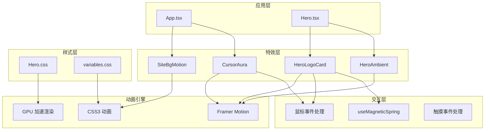
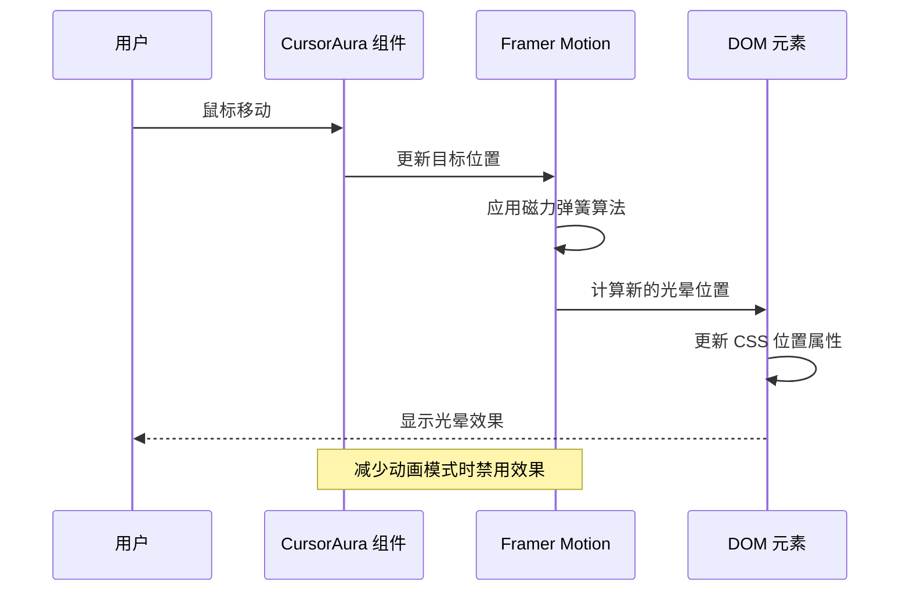
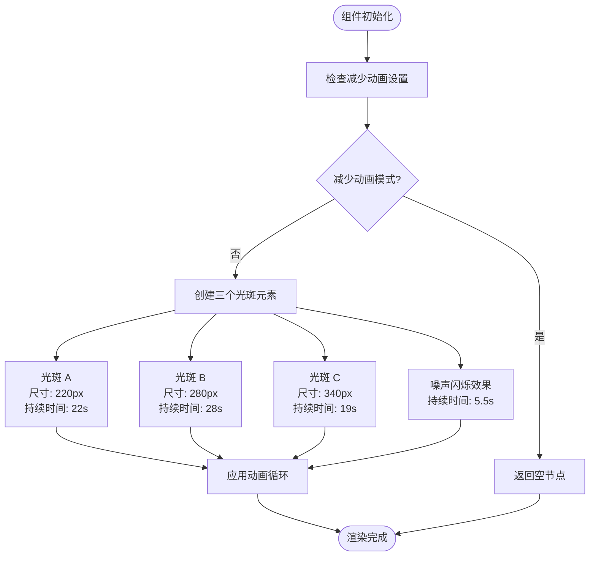
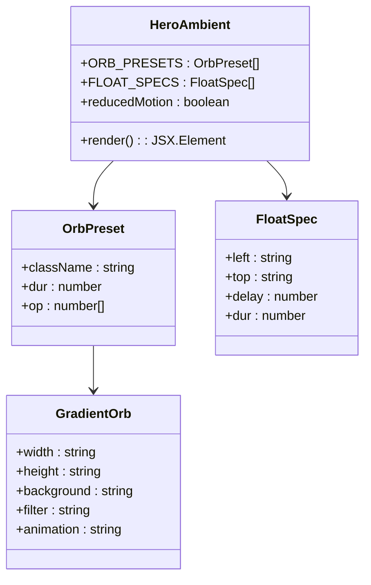
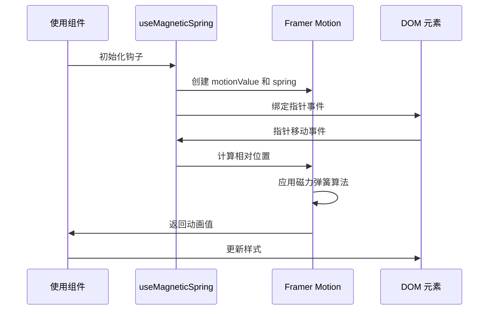
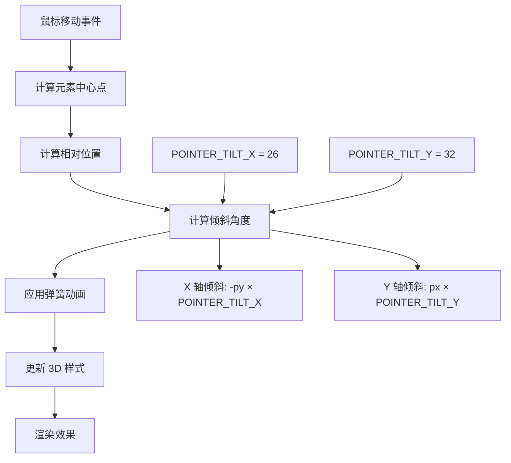
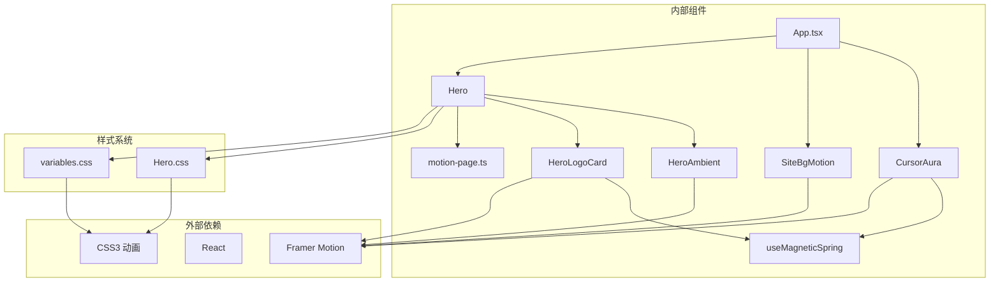

# 视觉特效组件

<cite>
**本文档引用的文件**
- [CursorAura.tsx](file://src/components/CursorAura.tsx)
- [SiteBgMotion.tsx](file://src/components/SiteBgMotion.tsx)
- [HeroAmbient.tsx](file://src/components/HeroAmbient.tsx)
- [useMagneticSpring.ts](file://src/hooks/useMagneticSpring.ts)
- [Hero.tsx](file://src/components/Hero.tsx)
- [HeroLogoCard.tsx](file://src/components/HeroLogoCard.tsx)
- [App.tsx](file://src/App.tsx)
- [Hero.css](file://src/styles/Hero.css)
- [variables.css](file://src/styles/variables.css)
- [motion-page.ts](file://src/utils/motion-page.ts)
</cite>

## 目录
1. [简介](#简介)
2. [项目结构](#项目结构)
3. [核心组件](#核心组件)
4. [架构概览](#架构概览)
5. [详细组件分析](#详细组件分析)
6. [依赖关系分析](#依赖关系分析)
7. [性能考虑](#性能考虑)
8. [故障排除指南](#故障排除指南)
9. [结论](#结论)

## 简介

MinLL 项目的视觉特效组件是一套精心设计的动画系统，旨在为用户提供沉浸式的视觉体验。该系统包含三个主要的特效组件：CursorAura 光晕追踪效果、SiteBgMotion 动态背景系统和 HeroAmbient 英雄区域环境效果。

这些组件通过 Framer Motion 库实现了流畅的动画效果，结合 CSS3 的现代特性，创造出了令人印象深刻的视觉体验。系统特别注重可访问性和性能优化，支持减少动画模式，并提供了多种优化策略来确保在各种设备上的最佳表现。

## 项目结构

视觉特效组件分布在项目的多个目录中，采用模块化的设计原则：

**图表来源**
- [App.tsx:1-70](file://src/App.tsx#L1-L70)
- [CursorAura.tsx:1-69](file://src/components/CursorAura.tsx#L1-L69)
- [SiteBgMotion.tsx:1-60](file://src/components/SiteBgMotion.tsx#L1-L60)
- [HeroAmbient.tsx:1-64](file://src/components/HeroAmbient.tsx#L1-L64)
- [Hero.tsx:1-316](file://src/components/Hero.tsx#L1-L316)

**章节来源**
- [App.tsx:1-70](file://src/App.tsx#L1-L70)
- [Hero.tsx:1-316](file://src/components/Hero.tsx#L1-L316)

## 核心组件

### CursorAura 光晕追踪效果

CursorAura 是一个基于鼠标位置追踪的光晕效果组件，使用了先进的磁力弹簧算法来实现平滑的跟随效果。

### SiteBgMotion 动态背景系统

SiteBgMotion 实现了一个复杂的背景动画系统，包含三个不同大小的漂浮光斑和噪声闪烁效果，营造出梦幻般的背景氛围。

### HeroAmbient 英雄区域环境效果

HeroAmbient 专注于英雄区域的环境营造，通过渐变光球和浮动微粒来增强空间感和氛围感。

**章节来源**
- [CursorAura.tsx:1-69](file://src/components/CursorAura.tsx#L1-L69)
- [SiteBgMotion.tsx:1-60](file://src/components/SiteBgMotion.tsx#L1-L60)
- [HeroAmbient.tsx:1-64](file://src/components/HeroAmbient.tsx#L1-L64)

## 架构概览

视觉特效系统的整体架构采用了分层设计，每个组件都有明确的职责分工：

**图表来源**
- [App.tsx:1-70](file://src/App.tsx#L1-L70)
- [Hero.tsx:1-316](file://src/components/Hero.tsx#L1-L316)
- [CursorAura.tsx:1-69](file://src/components/CursorAura.tsx#L1-L69)
- [SiteBgMotion.tsx:1-60](file://src/components/SiteBgMotion.tsx#L1-L60)
- [HeroAmbient.tsx:1-64](file://src/components/HeroAmbient.tsx#L1-L64)
- [HeroLogoCard.tsx:1-152](file://src/components/HeroLogoCard.tsx#L1-L152)

## 详细组件分析

### CursorAura 光晕追踪效果

#### 实现机制

CursorAura 使用了基于 Framer Motion 的磁力弹簧算法来实现平滑的光晕追踪效果：

**图表来源**
- [CursorAura.tsx:22-48](file://src/components/CursorAura.tsx#L22-L48)

#### 磁力弹簧算法详解

组件使用了精心调优的弹簧参数来实现自然的物理效果：

| 参数 | 值 | 作用 |
|------|-----|------|
| stiffness | 210 | 刚度系数，控制回弹力度 |
| damping | 28 | 阻尼系数，控制震动幅度 |
| mass | 0.55 | 质量，影响惯性效果 |

#### 性能优化策略

1. **requestAnimationFrame 优化**：使用防抖技术避免频繁的 DOM 更新
2. **减少动画模式支持**：检测系统设置自动禁用动画
3. **指针事件处理**：仅在需要时更新位置数据

**章节来源**
- [CursorAura.tsx:1-69](file://src/components/CursorAura.tsx#L1-L69)

### SiteBgMotion 背景动画系统

#### 工作原理

SiteBgMotion 实现了一个多层次的背景动画系统，包含三个不同尺寸的光斑和噪声闪烁效果：

**图表来源**
- [SiteBgMotion.tsx:25-59](file://src/components/SiteBgMotion.tsx#L25-L59)

#### 粒子系统设计

每个光斑都具有独特的动画轨迹和持续时间：

| 光斑 | 尺寸 | 持续时间 | 动画轨迹 |
|------|------|----------|----------|
| A | 220px | 22秒 | X: [0, 8, -6, 0] Y: [0, -12, 8, 0] Scale: [1, 1.08, 1.04, 1] |
| B | 280px | 28秒 | X: [0, -14, 10, 0] Y: [0, 10, -8, 0] Scale: [1, 1.12, 1, 1] |
| C | 340px | 19秒 | X: [0, 18, -12, 0] Y: [0, -6, 14, 0] Scale: [1.04, 1, 1.1, 1.04] |

#### 颜色渐变和性能优化

背景系统使用了纯 CSS 渐变和 GPU 加速技术：
- Radial gradients 实现柔和的光晕效果
- will-change 属性提示浏览器进行优化
- 无限循环动画配合 easeInOut 缓动函数

**章节来源**
- [SiteBgMotion.tsx:1-60](file://src/components/SiteBgMotion.tsx#L1-L60)

### HeroAmbient 英雄区域环境效果

#### 实现分析

HeroAmbient 专注于英雄区域的环境营造，通过渐变光球和浮动微粒来增强空间感：

**图表来源**
- [HeroAmbient.tsx:4-19](file://src/components/HeroAmbient.tsx#L4-L19)

#### 渐变光球系统

组件定义了三个不同尺寸的渐变光球：

| 光球 | 尺寸 | 持续时间 | 透明度范围 |
|------|------|----------|------------|
| Orb-1 | 640px | 13秒 | [0.52, 0.72, 0.52] |
| Orb-2 | 460px | 16秒 | [0.48, 0.68, 0.48] |
| Orb-3 | 340px | 11秒 | [0.55, 0.78, 0.55] |

#### 浮动微粒效果

HeroAmbient 还包含了8个精心定位的浮动微粒：

| 微粒 | 位置 | 延迟 | 持续时间 | 效果 |
|------|------|------|----------|------|
| Dust-1 | 8% 22% | 0s | 9s | Y: [0, -28, 0] Opacity: [0.15, 0.55, 0.15] Scale: [0.85, 1.15, 0.85] |
| Dust-2 | 78% 18% | 1.2s | 11s | Y: [0, -28, 0] Opacity: [0.15, 0.55, 0.15] Scale: [0.85, 1.15, 0.85] |
| ... | ... | ... | ... | ... |

**章节来源**
- [HeroAmbient.tsx:1-64](file://src/components/HeroAmbient.tsx#L1-L64)

### useMagneticSpring 磁力弹簧钩子

#### 设计原理

useMagneticSpring 钩子提供了一个通用的磁力弹簧算法实现，可以应用于任何交互元素：

**图表来源**
- [useMagneticSpring.ts:13-29](file://src/hooks/useMagneticSpring.ts#L13-L29)

#### 参数配置

| 参数 | 默认值 | 作用 |
|------|--------|------|
| strength | 0.42 | 磁力强度系数 |
| stiffness | 220 | 刚度系数 |
| damping | 18 | 阻尼系数 |
| mass | 0.4 | 质量 |

**章节来源**
- [useMagneticSpring.ts:1-33](file://src/hooks/useMagneticSpring.ts#L1-L33)

### HeroLogoCard 3D 交互卡片

#### 3D 倾斜系统

HeroLogoCard 实现了复杂的 3D 倾斜效果，通过鼠标位置计算实现真实的物理反馈：

**图表来源**
- [HeroLogoCard.tsx:30-47](file://src/components/HeroLogoCard.tsx#L30-L47)

#### 弹簧配置优化

| 参数 | 值 | 作用 |
|------|----|------|
| stiffness | 200 | 控制回弹速度 |
| damping | 21 | 控制震动衰减 |
| mass | 0.32 | 影响惯性效果 |

**章节来源**
- [HeroLogoCard.tsx:1-152](file://src/components/HeroLogoCard.tsx#L1-L152)

## 依赖关系分析

视觉特效组件之间的依赖关系体现了清晰的分层架构：

**图表来源**
- [App.tsx:1-70](file://src/App.tsx#L1-L70)
- [Hero.tsx:1-316](file://src/components/Hero.tsx#L1-L316)
- [CursorAura.tsx:1-69](file://src/components/CursorAura.tsx#L1-L69)
- [SiteBgMotion.tsx:1-60](file://src/components/SiteBgMotion.tsx#L1-L60)
- [HeroAmbient.tsx:1-64](file://src/components/HeroAmbient.tsx#L1-L64)
- [HeroLogoCard.tsx:1-152](file://src/components/HeroLogoCard.tsx#L1-L152)

**章节来源**
- [App.tsx:1-70](file://src/App.tsx#L1-L70)
- [Hero.tsx:1-316](file://src/components/Hero.tsx#L1-L316)

## 性能考虑

### 内存优化策略

1. **组件卸载清理**：所有事件监听器都在组件卸载时正确移除
2. **动画资源管理**：使用有限数量的动画实例，避免内存泄漏
3. **样式缓存**：利用 CSS 变量和预计算样式减少重复计算

### 渲染性能优化

1. **GPU 加速**：大量使用 transform 和 opacity 属性启用硬件加速
2. **will-change 提示**：为关键动画元素添加 will-change 属性
3. **减少重绘**：通过合理的 z-index 层级管理避免不必要的重绘

### 动画性能优化

1. **requestAnimationFrame 防抖**：避免高频事件导致的性能问题
2. **减少动画模式支持**：自动检测系统设置并禁用复杂动画
3. **优化的缓动函数**：使用高效的 easeInOut 缓动函数

### 兼容性考虑

1. **CSS Grid 支持**：使用现代布局特性但保持向后兼容
2. **Flexbox 降级**：在不支持的浏览器中提供替代方案
3. **渐进增强**：基础功能在所有浏览器中可用

## 故障排除指南

### 常见性能问题

**问题：动画卡顿**
- 检查是否有过多的 DOM 操作
- 确认是否启用了 GPU 加速
- 验证 CSS 动画的复杂度

**问题：内存泄漏**
- 确认所有事件监听器都已正确移除
- 检查 requestAnimationFrame 是否被取消
- 验证组件卸载时的状态清理

### 兼容性问题

**问题：旧版浏览器不支持**
- 检查 CSS Grid 和 Flexbox 的前缀
- 确认 Framer Motion 的 polyfill 配置
- 验证 CSS 变量的支持情况

**问题：触摸设备响应异常**
- 确认触摸事件处理器的正确绑定
- 检查被动事件监听器的配置
- 验证指针事件的降级处理

### 调试技巧

1. **开发者工具**：使用 Performance 面板分析动画性能
2. **GPU 监控**：检查硬件加速状态
3. **内存分析**：监控组件生命周期中的内存使用

**章节来源**
- [CursorAura.tsx:43-48](file://src/components/CursorAura.tsx#L43-L48)
- [HeroLogoCard.tsx:44-47](file://src/components/HeroLogoCard.tsx#L44-L47)

## 结论

MinLL 项目的视觉特效组件展现了现代前端动画开发的最佳实践。通过精心设计的磁力弹簧算法、多层次的背景系统和沉浸式的环境效果，为用户创造了独特的视觉体验。

系统的主要优势包括：

1. **技术先进性**：采用最新的 Web 动画技术和 GPU 加速
2. **性能优化**：通过多种策略确保在各种设备上的流畅运行
3. **可访问性**：完整支持减少动画模式和无障碍访问
4. **模块化设计**：清晰的组件分离便于维护和扩展
5. **跨平台兼容**：良好的浏览器兼容性和响应式设计

这些组件不仅提供了出色的视觉效果，更重要的是展示了如何在保证性能的前提下实现复杂的动画系统。对于希望学习现代前端动画开发的开发者来说，这是一个非常有价值的参考案例。