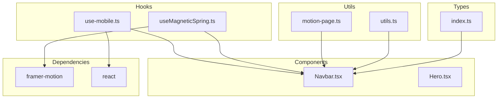
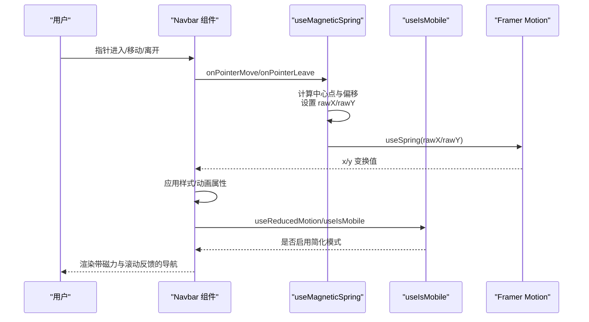
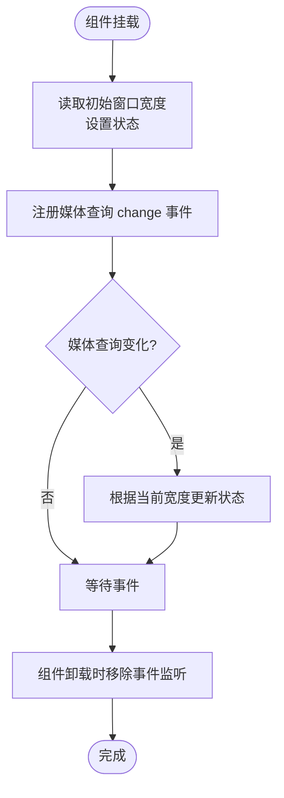
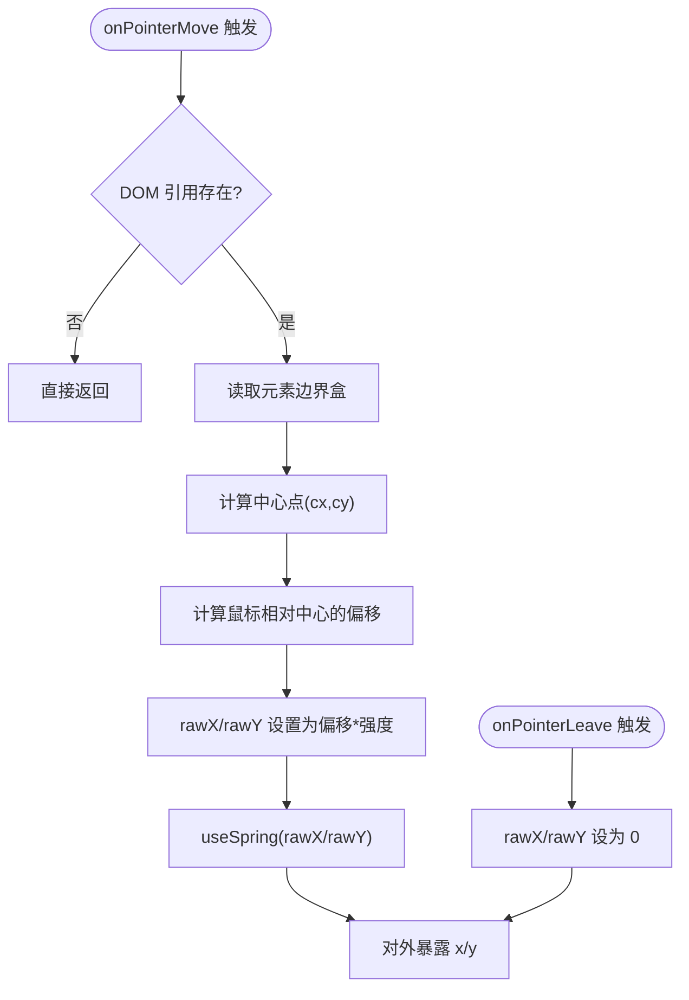
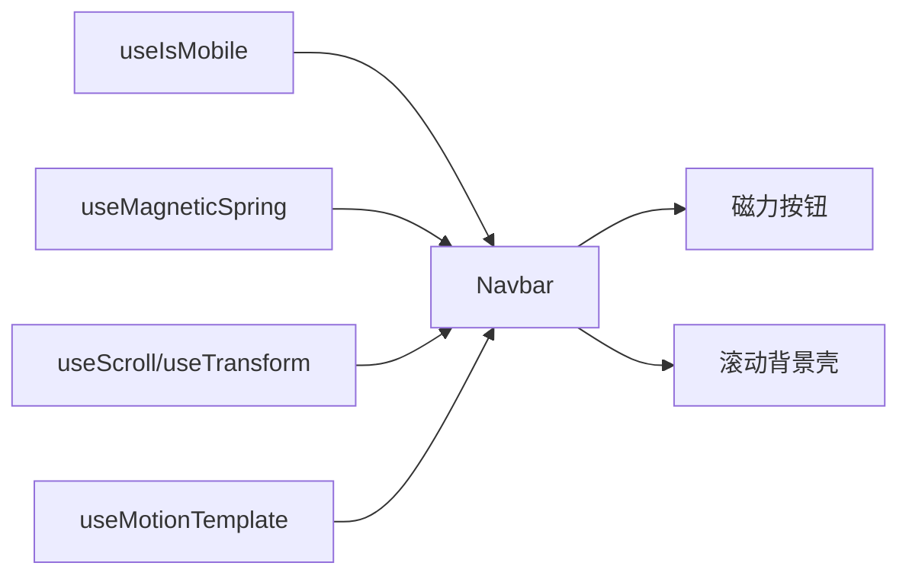
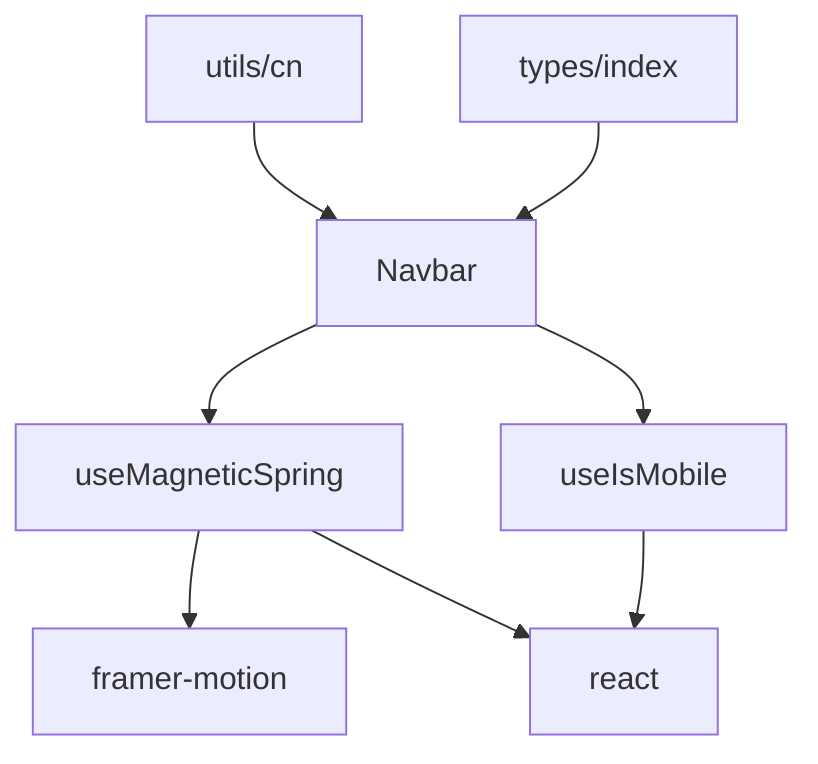

# 自定义 Hook 系统

<cite>
**本文引用的文件**
- [src/hooks/use-mobile.ts](file://src/hooks/use-mobile.ts)
- [src/hooks/useMagneticSpring.ts](file://src/hooks/useMagneticSpring.ts)
- [src/components/Navbar.tsx](file://src/components/Navbar.tsx)
- [src/utils/motion-page.ts](file://src/utils/motion-page.ts)
- [package.json](file://package.json)
- [src/lib/utils.ts](file://src/lib/utils.ts)
- [src/types/index.ts](file://src/types/index.ts)
</cite>

## 目录
1. [简介](#简介)
2. [项目结构](#项目结构)
3. [核心组件](#核心组件)
4. [架构总览](#架构总览)
5. [详细组件分析](#详细组件分析)
6. [依赖分析](#依赖分析)
7. [性能考量](#性能考量)
8. [故障排查指南](#故障排查指南)
9. [结论](#结论)
10. [附录](#附录)

## 简介
本文件系统性梳理 MinLL 项目的自定义 Hook 系统，重点覆盖两类 Hook：移动设备检测 Hook（useIsMobile）与磁力弹簧效果 Hook（useMagneticSpring）。文档从实现原理、数据流、依赖关系、性能优化到使用示例与最佳实践进行完整阐述，并给出与组件系统的集成方式、状态管理策略、测试与调试建议，以及自定义 Hook 的设计原则与扩展指南。

## 项目结构
MinLL 采用按功能分层的组织方式，自定义 Hook 放置于 src/hooks 下，组件位于 src/components，通用工具与样式位于 src/utils 与 src/lib，第三方依赖通过 package.json 管理。该结构有利于 Hook 的复用与组件化集成。

图表来源
- [src/hooks/use-mobile.ts:1-20](file://src/hooks/use-mobile.ts#L1-L20)
- [src/hooks/useMagneticSpring.ts:1-33](file://src/hooks/useMagneticSpring.ts#L1-L33)
- [src/components/Navbar.tsx:1-111](file://src/components/Navbar.tsx#L1-L111)
- [src/utils/motion-page.ts:1-184](file://src/utils/motion-page.ts#L1-L184)
- [src/lib/utils.ts:1-7](file://src/lib/utils.ts#L1-L7)
- [src/types/index.ts:1-3](file://src/types/index.ts#L1-L3)
- [package.json:13-60](file://package.json#L13-L60)

章节来源
- [src/hooks/use-mobile.ts:1-20](file://src/hooks/use-mobile.ts#L1-L20)
- [src/hooks/useMagneticSpring.ts:1-33](file://src/hooks/useMagneticSpring.ts#L1-L33)
- [src/components/Navbar.tsx:1-111](file://src/components/Navbar.tsx#L1-L111)
- [src/utils/motion-page.ts:1-184](file://src/utils/motion-page.ts#L1-L184)
- [src/lib/utils.ts:1-7](file://src/lib/utils.ts#L1-L7)
- [src/types/index.ts:1-3](file://src/types/index.ts#L1-L3)
- [package.json:13-60](file://package.json#L13-L60)

## 核心组件
- 移动设备检测 Hook（useIsMobile）
  - 功能：基于媒体查询与窗口宽度判断是否为移动端，返回布尔值。
  - 关键点：在副作用中监听媒体查询变化，初始化时同步当前状态；清理阶段移除事件监听。
- 磁力弹簧效果 Hook（useMagneticSpring）
  - 功能：为按钮等元素提供“磁吸”跟随指针的位移效果，内部使用 Framer Motion 的 MotionValue 与 Spring 实现平滑动画。
  - 关键点：计算元素中心点，根据鼠标相对中心的距离乘以强度系数驱动 rawX/rawY，再由 spring 值对外暴露；离开时重置为 0。

章节来源
- [src/hooks/use-mobile.ts:5-19](file://src/hooks/use-mobile.ts#L5-L19)
- [src/hooks/useMagneticSpring.ts:6-32](file://src/hooks/useMagneticSpring.ts#L6-L32)

## 架构总览
下图展示 Navbar 组件如何消费两个自定义 Hook，并结合 Framer Motion 的 transform、template 与 reduce-motion 能力，构建出完整的交互与视觉反馈链路。

图表来源
- [src/components/Navbar.tsx:13-111](file://src/components/Navbar.tsx#L13-L111)
- [src/hooks/useMagneticSpring.ts:6-32](file://src/hooks/useMagneticSpring.ts#L6-L32)
- [src/utils/motion-page.ts:1-184](file://src/utils/motion-page.ts#L1-L184)

## 详细组件分析

### 移动设备检测 Hook（useIsMobile）
- 实现要点
  - 使用媒体查询监听器与窗口宽度双重判断，确保初次渲染与响应式切换均正确。
  - 返回值经过二次布尔化，保证外部调用者获得稳定布尔语义。
- 数据流与副作用
  - 初始化时读取当前窗口宽度并设置状态；
  - 监听媒体查询变化事件，动态更新状态；
  - 清理阶段移除事件监听，避免内存泄漏。
- 复用模式
  - 可在任意组件中直接调用，用于条件渲染或行为分支（如简化动画）。
  - 常与 useReducedMotion 配合，统一处理无障碍场景。

图表来源
- [src/hooks/use-mobile.ts:8-16](file://src/hooks/use-mobile.ts#L8-L16)

章节来源
- [src/hooks/use-mobile.ts:5-19](file://src/hooks/use-mobile.ts#L5-L19)

### 磁力弹簧效果 Hook（useMagneticSpring）
- 算法实现
  - 中心计算：通过 DOM 元素的边界盒中心作为参考点。
  - 偏移驱动：鼠标位置与中心的差值乘以强度系数，写入 MotionValue。
  - 平滑输出：MotionValue 通过固定弹簧参数转换为可动画的 x/y。
  - 离开回收：指针离开时将偏移重置为 0。
- 配置参数
  - 强度系数（strength，默认值）：控制磁力敏感度与位移幅度。
  - 内部弹簧参数（stiffness/damping/mass）：固定在模块内，统一磁力动画风格。
- 依赖与耦合
  - 依赖 Framer Motion 的 useMotionValue 与 useSpring。
  - 依赖 React 的 useRef 与 useCallback，确保 DOM 引用与回调稳定。
- 性能优化
  - 使用 useCallback 包裹事件处理器，减少子组件重渲染。
  - 将弹簧参数集中管理，避免重复创建对象导致的不必要重渲染。
  - 在简化模式下禁用指针事件，降低计算量。

图表来源
- [src/hooks/useMagneticSpring.ts:13-29](file://src/hooks/useMagneticSpring.ts#L13-L29)

章节来源
- [src/hooks/useMagneticSpring.ts:6-32](file://src/hooks/useMagneticSpring.ts#L6-L32)

### 组件集成与状态管理
- Navbar 集成
  - 使用 useReducedMotion 判断是否启用简化模式，从而有条件地绑定指针事件与应用样式。
  - 使用 useMagneticSpring 获取 ref、x/y 与事件处理器，并将其应用到目标元素上。
  - 结合 useScroll/useTransform/useMotionTemplate 实现滚动背景与光效的联动。
- 状态管理模式
  - useIsMobile 提供全局级的设备状态，适合在多处组件共享。
  - useMagneticSpring 的状态（x/y）由 Framer Motion 管理，组件仅负责消费与应用。
- 复用模式
  - 将磁力效果封装为 Hook，可在不同按钮、卡片等元素上复用。
  - 通过传入不同的强度参数，适配不同尺寸与交互需求。

图表来源
- [src/components/Navbar.tsx:13-111](file://src/components/Navbar.tsx#L13-L111)
- [src/hooks/useMagneticSpring.ts:6-32](file://src/hooks/useMagneticSpring.ts#L6-L32)
- [src/utils/motion-page.ts:1-184](file://src/utils/motion-page.ts#L1-L184)

章节来源
- [src/components/Navbar.tsx:13-111](file://src/components/Navbar.tsx#L13-L111)

### 使用示例与最佳实践
- 在按钮上启用磁力效果
  - 步骤：引入 Hook，解构出 ref、x、y、onPointerMove、onPointerLeave；将 ref 与事件处理器绑定到目标元素；在样式中应用 x/y。
  - 注意：在简化模式下禁用事件处理器，避免无意义计算。
- 与滚动联动
  - 可结合 useScroll/useTransform/useMotionTemplate，在滚动过程中改变容器背景或边框样式，增强沉浸感。
- 参数调优
  - 强度系数：根据元素尺寸与交互层级调整，避免过大或过小。
  - 弹簧参数：保持一致可提升体验连贯性；如需差异化，建议在 Hook 内部通过配置项或工厂函数提供变体。

章节来源
- [src/components/Navbar.tsx:59-106](file://src/components/Navbar.tsx#L59-L106)
- [src/utils/motion-page.ts:1-184](file://src/utils/motion-page.ts#L1-L184)

## 依赖分析
- 第三方依赖
  - framer-motion：提供 useMotionValue/useSpring/useScroll/useTransform/useMotionTemplate 等能力，支撑磁力与滚动动画。
  - react：提供 useState/useEffect/useRef/useCallback 等基础能力，支撑 Hook 的生命周期与事件处理。
- 内部依赖
  - utils/cn：类名合并工具，便于样式组合。
  - types/index：共享类型占位，便于后续扩展。
- 耦合关系
  - useMagneticSpring 与 Framer Motion 强耦合，但通过 Hook 抽象对外屏蔽细节。
  - useIsMobile 与浏览器环境强耦合，但通过媒体查询与窗口宽度实现跨设备兼容。

图表来源
- [src/hooks/useMagneticSpring.ts:1-2](file://src/hooks/useMagneticSpring.ts#L1-L2)
- [src/hooks/use-mobile.ts:1-1](file://src/hooks/use-mobile.ts#L1-L1)
- [src/components/Navbar.tsx:1-11](file://src/components/Navbar.tsx#L1-L11)
- [src/lib/utils.ts:1-7](file://src/lib/utils.ts#L1-L7)
- [src/types/index.ts:1-3](file://src/types/index.ts#L1-L3)
- [package.json:46-50](file://package.json#L46-L50)

章节来源
- [package.json:13-60](file://package.json#L13-L60)
- [src/hooks/useMagneticSpring.ts:1-2](file://src/hooks/useMagneticSpring.ts#L1-L2)
- [src/hooks/use-mobile.ts:1-1](file://src/hooks/use-mobile.ts#L1-L1)
- [src/lib/utils.ts:1-7](file://src/lib/utils.ts#L1-L7)
- [src/types/index.ts:1-3](file://src/types/index.ts#L1-L3)

## 性能考量
- 事件处理优化
  - 使用 useCallback 包裹事件处理器，减少子组件重渲染。
  - 在简化模式下禁用指针事件，避免不必要的计算。
- 状态与动画
  - 将弹簧参数集中管理，避免每次渲染创建新对象。
  - 合理使用 useMotionValue/useSpring，避免过度频繁的状态写入。
- 渲染与布局
  - 使用 useReducedMotion 与 useIsMobile 控制复杂动画的启用与否，平衡体验与性能。
  - 对于大范围滚动联动，优先使用 transform 与 backdropFilter 等 GPU 友好属性。

## 故障排查指南
- 指针事件无效
  - 检查是否在简化模式下禁用了事件处理器。
  - 确认 DOM 引用已正确传递给 Hook。
- 磁力偏移异常
  - 核对元素的定位与边界盒计算逻辑。
  - 调整强度系数，观察位移幅度是否合理。
- 动画卡顿
  - 检查是否存在频繁的状态写入或不必要的重渲染。
  - 确认未在简化模式下仍强制启用复杂动画。
- 响应式误判
  - 确认媒体查询断点与窗口宽度判断逻辑一致。
  - 在组件卸载后检查事件监听是否被正确清理。

章节来源
- [src/hooks/useMagneticSpring.ts:13-29](file://src/hooks/useMagneticSpring.ts#L13-L29)
- [src/hooks/use-mobile.ts:8-16](file://src/hooks/use-mobile.ts#L8-L16)
- [src/components/Navbar.tsx:14-16](file://src/components/Navbar.tsx#L14-L16)

## 结论
MinLL 的自定义 Hook 系统以简洁、可复用为核心设计目标：useIsMobile 提供稳定的设备状态，useMagneticSpring 提供一致的磁力动画体验。通过与 Framer Motion 的深度协作与合理的性能策略，Hook 能在组件中高效复用并保持良好的用户体验。建议在新增 Hook 时遵循本文的设计原则与扩展指南，确保一致性与可维护性。

## 附录

### Hook 设计原则与扩展指南
- 单一职责：每个 Hook 解决一个明确问题，避免“万能 Hook”。
- 明确输入输出：对外暴露清晰的参数与返回值，便于测试与复用。
- 性能优先：尽量使用 useCallback、useMemo，避免不必要重渲染。
- 可配置性：对关键参数（如强度、弹簧参数）提供默认值与可选配置。
- 可测试性：将纯逻辑抽离为可测试函数，事件与副作用通过外部注入或模拟。
- 文档与类型：为 Hook 提供类型定义与使用说明，便于团队协作。

### 测试方法与调试技巧
- 单元测试
  - 对纯逻辑部分（如中心点计算、强度映射）编写单元测试。
  - 使用测试框架模拟事件与 DOM，验证 Hook 行为。
- 集成测试
  - 在组件中集成 Hook，验证事件绑定与样式应用。
  - 使用简化模式与真实模式对比，确保行为一致。
- 调试技巧
  - 使用浏览器开发者工具监控事件触发频率与 DOM 更新。
  - 在关键路径打印日志（开发环境），确认状态流转。
  - 使用 React DevTools Profiler 分析渲染性能瓶颈。