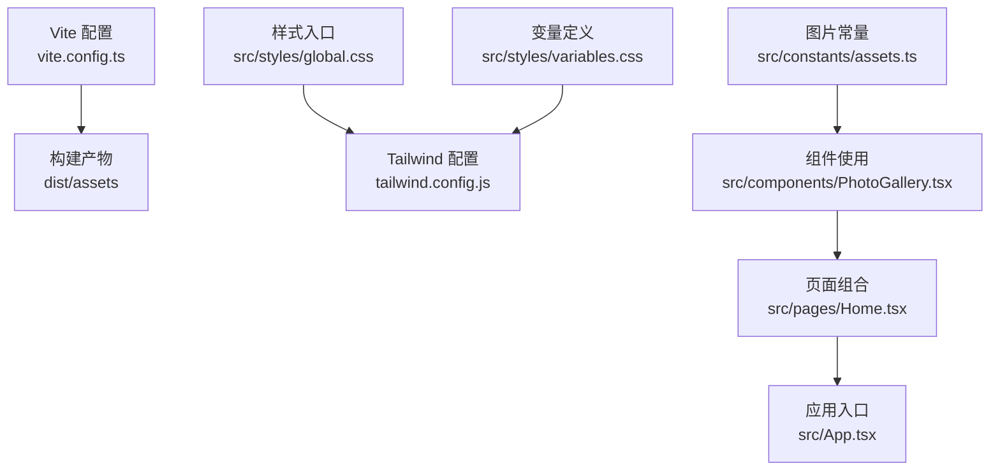
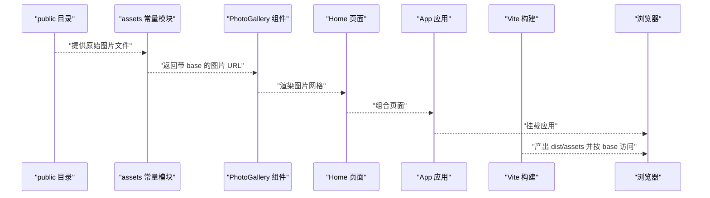
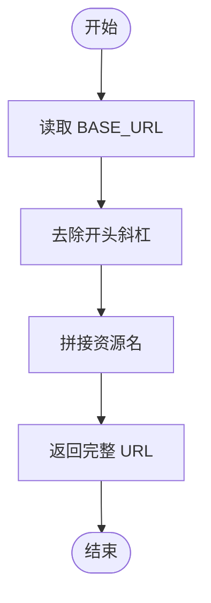
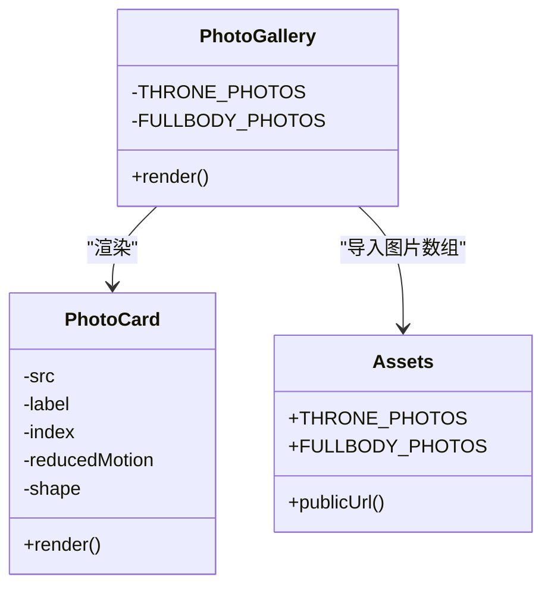
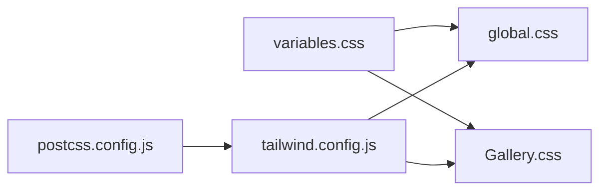
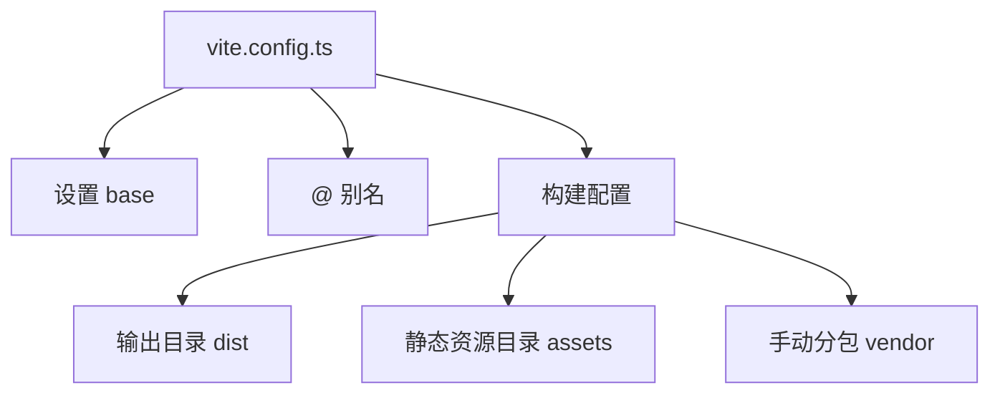
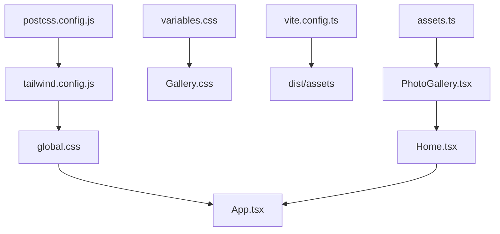

# 资源管理系统

<cite>
**本文引用的文件**
- [package.json](file://package.json)
- [vite.config.ts](file://vite.config.ts)
- [tailwind.config.js](file://tailwind.config.js)
- [postcss.config.js](file://postcss.config.js)
- [src/constants/assets.ts](file://src/constants/assets.ts)
- [src/components/PhotoGallery.tsx](file://src/components/PhotoGallery.tsx)
- [src/styles/Gallery.css](file://src/styles/Gallery.css)
- [src/styles/global.css](file://src/styles/global.css)
- [src/styles/variables.css](file://src/styles/variables.css)
- [src/utils/motion-page.ts](file://src/utils/motion-page.ts)
- [src/pages/Home.tsx](file://src/pages/Home.tsx)
- [src/App.tsx](file://src/App.tsx)
</cite>

## 目录
1. [简介](#简介)
2. [项目结构](#项目结构)
3. [核心组件](#核心组件)
4. [架构总览](#架构总览)
5. [详细组件分析](#详细组件分析)
6. [依赖关系分析](#依赖关系分析)
7. [性能考量](#性能考量)
8. [故障排查指南](#故障排查指南)
9. [结论](#结论)
10. [附录](#附录)

## 简介
本文件系统性梳理 MinLL 项目的资源管理策略，覆盖静态资源处理、图片资源组织与命名规范、资源路径配置、加载优化与懒加载、缓存策略、资源压缩与 CDN 集成建议、性能监控方法、与组件系统的集成与动态加载机制、版本控制与更新策略，以及最佳实践与配置示例。

## 项目结构
MinLL 使用 Vite 构建，资源主要分为三类：
- 源代码中的样式与组件：位于 src 下，通过构建工具打包。
- 样式资源：通过 TailwindCSS 与 PostCSS 处理，变量集中于 variables.css。
- 静态图片资源：放置在 public 目录下，通过常量模块统一解析为带 base 的 URL。

图表来源
- [vite.config.ts:1-26](file://vite.config.ts#L1-L26)
- [tailwind.config.js:1-84](file://tailwind.config.js#L1-L84)
- [src/styles/global.css:1-294](file://src/styles/global.css#L1-L294)
- [src/styles/variables.css:1-75](file://src/styles/variables.css#L1-L75)
- [src/constants/assets.ts:1-24](file://src/constants/assets.ts#L1-L24)
- [src/components/PhotoGallery.tsx:1-166](file://src/components/PhotoGallery.tsx#L1-L166)
- [src/pages/Home.tsx:1-15](file://src/pages/Home.tsx#L1-L15)
- [src/App.tsx:1-70](file://src/App.tsx#L1-L70)

章节来源
- [vite.config.ts:1-26](file://vite.config.ts#L1-L26)
- [tailwind.config.js:1-84](file://tailwind.config.js#L1-L84)
- [postcss.config.js:1-7](file://postcss.config.js#L1-L7)
- [src/styles/global.css:1-294](file://src/styles/global.css#L1-L294)
- [src/styles/variables.css:1-75](file://src/styles/variables.css#L1-L75)
- [src/constants/assets.ts:1-24](file://src/constants/assets.ts#L1-L24)
- [src/components/PhotoGallery.tsx:1-166](file://src/components/PhotoGallery.tsx#L1-L166)
- [src/pages/Home.tsx:1-15](file://src/pages/Home.tsx#L1-L15)
- [src/App.tsx:1-70](file://src/App.tsx#L1-L70)

## 核心组件
- 资源路径解析器：在常量模块中统一解析 public 下的资源路径，结合 Vite 的 base 配置生成最终 URL。
- 图片资源集合：按主题分组导出，如王座照与全身照，便于组件直接消费。
- 组件层的懒加载与解码：在图片元素上启用懒加载与异步解码，提升首屏性能。
- 样式层的全局与变量：通过变量集中管理颜色、阴影、动画曲线等，确保视觉一致性与可维护性。
- 构建层的分包与输出：通过手动分包 vendor 与业务代码，减少重复依赖体积。

章节来源
- [src/constants/assets.ts:1-24](file://src/constants/assets.ts#L1-L24)
- [src/components/PhotoGallery.tsx:1-166](file://src/components/PhotoGallery.tsx#L1-L166)
- [src/styles/Gallery.css:1-238](file://src/styles/Gallery.css#L1-L238)
- [src/styles/global.css:1-294](file://src/styles/global.css#L1-L294)
- [src/styles/variables.css:1-75](file://src/styles/variables.css#L1-L75)
- [vite.config.ts:14-24](file://vite.config.ts#L14-L24)

## 架构总览
资源从 public 导入到常量模块，再由组件消费；样式通过 Tailwind 与变量驱动；构建阶段由 Vite 输出到 dist，并按配置进行分包与资源目录组织。

图表来源
- [src/constants/assets.ts:1-24](file://src/constants/assets.ts#L1-L24)
- [src/components/PhotoGallery.tsx:1-166](file://src/components/PhotoGallery.tsx#L1-L166)
- [src/pages/Home.tsx:1-15](file://src/pages/Home.tsx#L1-L15)
- [src/App.tsx:1-70](file://src/App.tsx#L1-L70)
- [vite.config.ts:7](file://vite.config.ts#L7)

## 详细组件分析

### 资源路径解析与公共目录策略
- 解析逻辑：基于 import.meta.env.BASE_URL 与资源相对路径拼接，保证在不同部署前缀（如 GitHub Pages 的子路径）下正确访问。
- 资源位置：图片放置在 public 目录，构建时由 Vite 复制到输出目录并按 base 重写路径。
- 命名规范：采用语义化命名，如“角色_场景_类型”，例如“qishu_throne.png”“fusheng_life_size_photo.png”。

图表来源
- [src/constants/assets.ts:1-6](file://src/constants/assets.ts#L1-L6)

章节来源
- [src/constants/assets.ts:1-24](file://src/constants/assets.ts#L1-L24)
- [vite.config.ts:7](file://vite.config.ts#L7)

### 图片资源组织与组件集成
- 组织结构：按主题分组（如“on_the_throne_photo”“lift_size_photo”），便于维护与替换。
- 组件消费：PhotoGallery 通过常量模块导入图片数组，循环渲染为网格卡片。
- 懒加载与解码：图片元素启用懒加载与异步解码，降低主线程压力，改善首屏性能。
- 动画与交互：配合 Framer Motion 的变体与视口可见触发，实现入场动画与悬停效果。

图表来源
- [src/components/PhotoGallery.tsx:1-166](file://src/components/PhotoGallery.tsx#L1-L166)
- [src/constants/assets.ts:11-24](file://src/constants/assets.ts#L11-L24)

章节来源
- [src/components/PhotoGallery.tsx:1-166](file://src/components/PhotoGallery.tsx#L1-L166)
- [src/styles/Gallery.css:1-238](file://src/styles/Gallery.css#L1-L238)
- [src/utils/motion-page.ts:1-184](file://src/utils/motion-page.ts#L1-L184)

### 样式与变量体系
- 变量集中：颜色、字体、半径、阴影、动画曲线等均在 variables.css 中定义，全局生效。
- 样式复用：global.css 定义全局排版与基础动画，Gallery.css 专注画廊布局与交互。
- Tailwind 集成：tailwind.config.js 扫描源码并扩展主题，postcss.config.js 配合自动前缀与样式处理。

图表来源
- [src/styles/variables.css:1-75](file://src/styles/variables.css#L1-L75)
- [src/styles/global.css:1-294](file://src/styles/global.css#L1-L294)
- [src/styles/Gallery.css:1-238](file://src/styles/Gallery.css#L1-L238)
- [tailwind.config.js:1-84](file://tailwind.config.js#L1-L84)
- [postcss.config.js:1-7](file://postcss.config.js#L1-L7)

章节来源
- [src/styles/variables.css:1-75](file://src/styles/variables.css#L1-L75)
- [src/styles/global.css:1-294](file://src/styles/global.css#L1-L294)
- [src/styles/Gallery.css:1-238](file://src/styles/Gallery.css#L1-L238)
- [tailwind.config.js:1-84](file://tailwind.config.js#L1-L84)
- [postcss.config.js:1-7](file://postcss.config.js#L1-L7)

### 构建与分包策略
- 基础路径：vite.config.ts 设置 base，适配子路径部署。
- 别名：@ 指向 src，简化导入路径。
- 输出目录：assetsDir 指定静态资源目录，outDir 指定产物根目录。
- 手动分包：将 react 与 react-dom 单独拆分，提升缓存命中率。

图表来源
- [vite.config.ts:1-26](file://vite.config.ts#L1-L26)

章节来源
- [vite.config.ts:1-26](file://vite.config.ts#L1-L26)

## 依赖关系分析
- 组件依赖：PhotoGallery 依赖 assets 常量与样式模块；Home 页面组合多个组件；App 应用挂载页面并承载全局背景与光标效果。
- 样式依赖：Gallery.css 引入 variables.css；global.css 提供全局样式与动画基线。
- 构建依赖：Tailwind 与 PostCSS 作用于样式层；Vite 负责资源复制与打包。

图表来源
- [src/constants/assets.ts:1-24](file://src/constants/assets.ts#L1-L24)
- [src/components/PhotoGallery.tsx:1-166](file://src/components/PhotoGallery.tsx#L1-L166)
- [src/styles/Gallery.css:1-238](file://src/styles/Gallery.css#L1-L238)
- [src/styles/variables.css:1-75](file://src/styles/variables.css#L1-L75)
- [src/styles/global.css:1-294](file://src/styles/global.css#L1-L294)
- [src/pages/Home.tsx:1-15](file://src/pages/Home.tsx#L1-L15)
- [src/App.tsx:1-70](file://src/App.tsx#L1-L70)
- [vite.config.ts:1-26](file://vite.config.ts#L1-L26)
- [tailwind.config.js:1-84](file://tailwind.config.js#L1-L84)
- [postcss.config.js:1-7](file://postcss.config.js#L1-L7)

章节来源
- [src/constants/assets.ts:1-24](file://src/constants/assets.ts#L1-L24)
- [src/components/PhotoGallery.tsx:1-166](file://src/components/PhotoGallery.tsx#L1-L166)
- [src/styles/Gallery.css:1-238](file://src/styles/Gallery.css#L1-L238)
- [src/styles/variables.css:1-75](file://src/styles/variables.css#L1-L75)
- [src/styles/global.css:1-294](file://src/styles/global.css#L1-L294)
- [src/pages/Home.tsx:1-15](file://src/pages/Home.tsx#L1-L15)
- [src/App.tsx:1-70](file://src/App.tsx#L1-L70)
- [vite.config.ts:1-26](file://vite.config.ts#L1-L26)
- [tailwind.config.js:1-84](file://tailwind.config.js#L1-L84)
- [postcss.config.js:1-7](file://postcss.config.js#L1-L7)

## 性能考量
- 懒加载与解码：图片元素启用懒加载与异步解码，降低主线程阻塞，提升首屏速度。
- 视口触发动画：使用视口可见触发的入场动画，避免不必要的初始渲染开销。
- 手动分包：将第三方库独立打包，提高浏览器缓存命中率，缩短二次加载时间。
- 样式体积控制：通过 Tailwind 按需扫描与变量集中管理，减少冗余样式。
- 资源尺寸与格式：建议在构建前对图片进行压缩与格式优化（如 WebP），并在多尺寸下提供合适分辨率以平衡清晰度与体积。

章节来源
- [src/components/PhotoGallery.tsx:43-49](file://src/components/PhotoGallery.tsx#L43-L49)
- [src/utils/motion-page.ts:1-184](file://src/utils/motion-page.ts#L1-L184)
- [vite.config.ts:19-22](file://vite.config.ts#L19-L22)
- [tailwind.config.js:4](file://tailwind.config.js#L4)

## 故障排查指南
- 资源 404 或路径错误
  - 检查 Vite base 配置是否与部署前缀一致。
  - 确认 public 下资源名称与常量模块中引用一致。
  - 章节来源
    - [vite.config.ts:7](file://vite.config.ts#L7)
    - [src/constants/assets.ts:1-6](file://src/constants/assets.ts#L1-L6)
- 图片未懒加载或解码异常
  - 确认图片元素已添加懒加载与异步解码属性。
  - 章节来源
    - [src/components/PhotoGallery.tsx:43-49](file://src/components/PhotoGallery.tsx#L43-L49)
- 样式不生效或变量未解析
  - 检查变量文件是否被正确引入，Tailwind 扫描范围是否包含对应文件。
  - 章节来源
    - [src/styles/variables.css:1-75](file://src/styles/variables.css#L1-L75)
    - [tailwind.config.js:4](file://tailwind.config.js#L4)
- 构建后资源目录不匹配
  - 对齐 outDir 与 assetsDir 配置，确保浏览器访问路径正确。
  - 章节来源
    - [vite.config.ts:15-16](file://vite.config.ts#L15-L16)

## 结论
MinLL 的资源管理体系以 Vite 为基础，结合公共目录与常量模块统一解析路径，组件层通过懒加载与视口动画优化性能，样式层以变量与 Tailwind 实现高内聚低耦合。建议在现有基础上进一步完善图片格式优化、CDN 集成与版本控制策略，以获得更佳的加载体验与可维护性。

## 附录

### 资源路径配置示例
- 在常量模块中统一解析 public 下的资源路径，结合 base 生成最终 URL。
- 示例路径参考：[src/constants/assets.ts:8-23](file://src/constants/assets.ts#L8-L23)

章节来源
- [src/constants/assets.ts:1-24](file://src/constants/assets.ts#L1-L24)
- [vite.config.ts:7](file://vite.config.ts#L7)

### 图片资源组织与命名规范
- 组织结构：按主题分组（如“on_the_throne_photo”“lift_size_photo”）。
- 命名规范：语义化命名，如“角色_场景_类型”。
- 示例参考：[src/constants/assets.ts:11-23](file://src/constants/assets.ts#L11-L23)

章节来源
- [src/constants/assets.ts:11-23](file://src/constants/assets.ts#L11-L23)

### 加载优化与懒加载实现
- 懒加载与解码：在图片元素上启用懒加载与异步解码。
- 视口触发动画：使用视口可见触发入场动画。
- 示例参考：[src/components/PhotoGallery.tsx:43-49](file://src/components/PhotoGallery.tsx#L43-L49)，[src/utils/motion-page.ts:1-184](file://src/utils/motion-page.ts#L1-L184)

章节来源
- [src/components/PhotoGallery.tsx:43-49](file://src/components/PhotoGallery.tsx#L43-L49)
- [src/utils/motion-page.ts:1-184](file://src/utils/motion-page.ts#L1-L184)

### 缓存策略
- 手动分包：将第三方库独立打包，提升缓存命中率。
- 示例参考：[vite.config.ts:19-22](file://vite.config.ts#L19-L22)

章节来源
- [vite.config.ts:19-22](file://vite.config.ts#L19-L22)

### 资源压缩与格式优化
- 建议在构建前对图片进行压缩与格式优化（如 WebP），并提供多尺寸资源以适配不同设备与网络环境。
- 本节为通用建议，无需特定文件引用。

### CDN 集成与性能监控
- CDN 集成：将静态资源托管至 CDN，结合 base 与分包策略提升加载速度。
- 性能监控：建议接入 Web Vitals 或自定义指标采集，监控关键性能指标。
- 本节为通用建议，无需特定文件引用。

### 版本控制与更新策略
- 版本控制：在资源文件名中加入哈希或版本号，结合缓存头策略实现长效缓存与可控更新。
- 更新策略：采用渐进式发布与回滚机制，确保资源更新不影响用户体验。
- 本节为通用建议，无需特定文件引用。