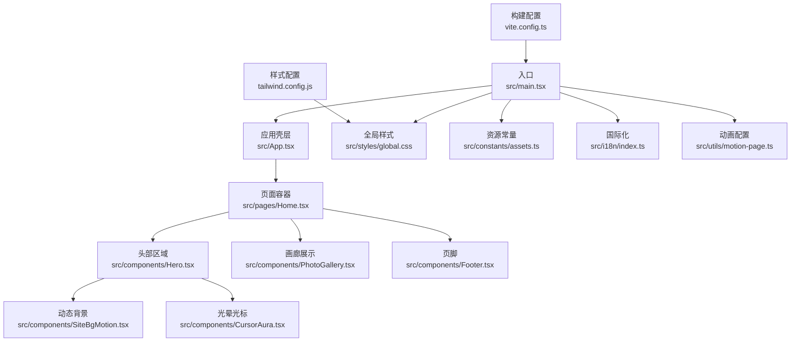
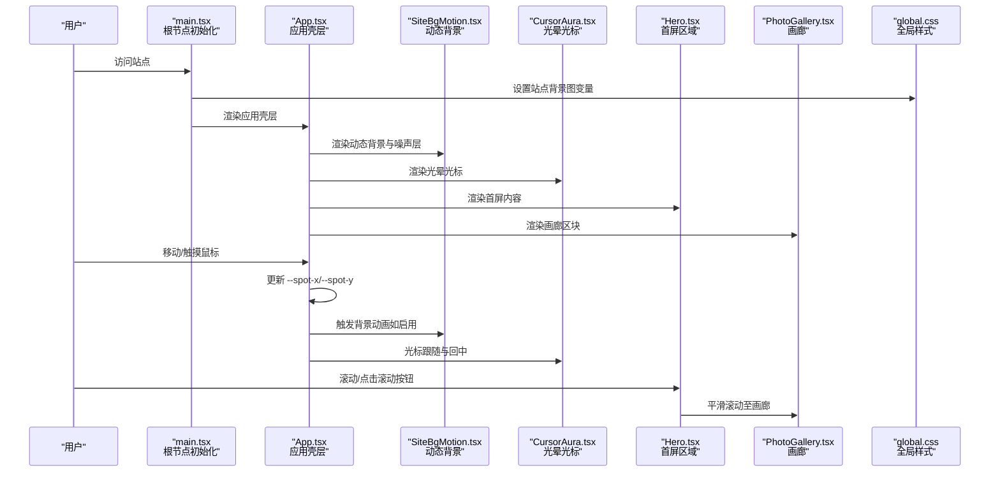
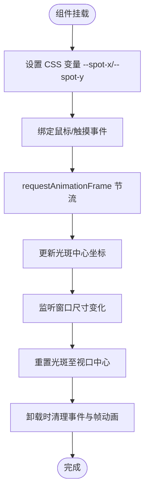
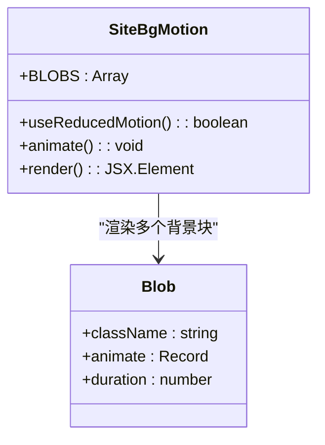
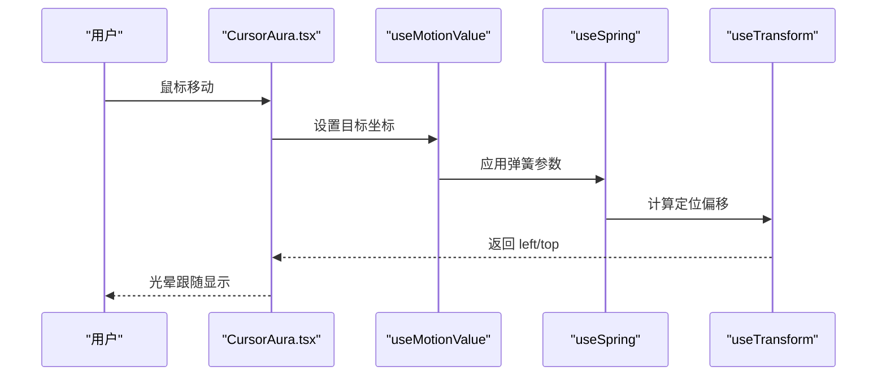
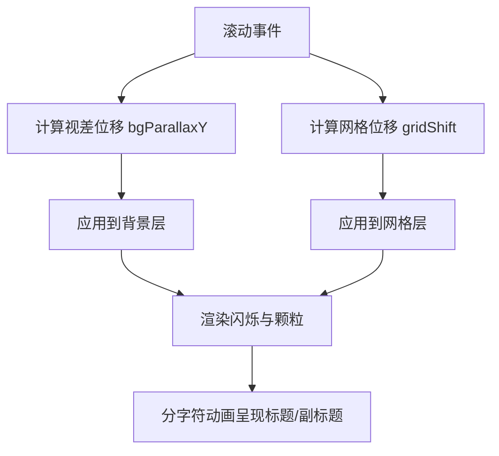
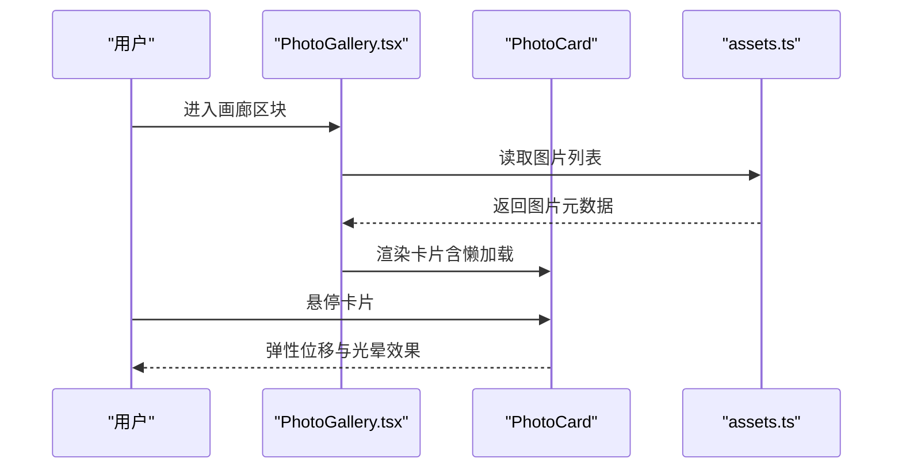
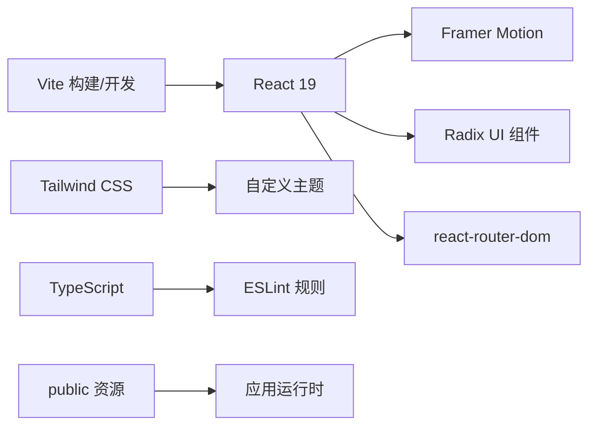

# 项目概述

<cite>
**本文引用的文件**
- [README.md](file://README.md)
- [package.json](file://package.json)
- [vite.config.ts](file://vite.config.ts)
- [tailwind.config.js](file://tailwind.config.js)
- [src/main.tsx](file://src/main.tsx)
- [src/App.tsx](file://src/App.tsx)
- [src/pages/Home.tsx](file://src/pages/Home.tsx)
- [src/components/SiteBgMotion.tsx](file://src/components/SiteBgMotion.tsx)
- [src/components/CursorAura.tsx](file://src/components/CursorAura.tsx)
- [src/components/Hero.tsx](file://src/components/Hero.tsx)
- [src/components/PhotoGallery.tsx](file://src/components/PhotoGallery.tsx)
- [src/i18n/index.ts](file://src/i18n/index.ts)
- [src/constants/assets.ts](file://src/constants/assets.ts)
- [src/utils/motion-page.ts](file://src/utils/motion-page.ts)
- [src/styles/global.css](file://src/styles/global.css)
</cite>

## 目录
1. [引言](#引言)
2. [项目结构](#项目结构)
3. [核心组件](#核心组件)
4. [架构总览](#架构总览)
5. [详细组件分析](#详细组件分析)
6. [依赖关系分析](#依赖关系分析)
7. [性能考量](#性能考量)
8. [故障排查指南](#故障排查指南)
9. [结论](#结论)
10. [附录](#附录)

## 引言
MinLL 是一个基于 React 19 + TypeScript + Vite + Tailwind CSS + Framer Motion 的现代化个人作品集网站，专注于以沉浸式视觉体验展示角色扮演游戏摄影。项目通过动态背景、粒子光晕、视差滚动与分字符动画等技术，构建出具有电影感与交互性的主页；配合图片画廊模块，系统化呈现“王座照”与“全身照”两类摄影主题。同时，项目内置国际化能力与无障碍优化，确保在不同设备与偏好设置下均能提供一致且优雅的浏览体验。

本项目在技术选型上强调开发效率与运行性能：前端框架采用 React 19 以获得更佳的并发与状态管理体验；构建工具使用 Vite，结合按需编译与热更新提升迭代速度；UI 框架采用 Tailwind CSS 与 Radix UI 组合，兼顾可定制性与语义化；动画层由 Framer Motion 提供流畅的物理级动效；国际化通过轻量键路径解析实现，便于扩展多语言。

## 项目结构
项目采用按功能域划分的目录组织方式，核心入口与页面组件位于 src 目录，样式与常量分别集中于 styles 与 constants，工具函数与动画配置位于 utils 与 hooks。整体结构清晰、职责明确，便于维护与扩展。

图表来源
- [src/main.tsx:1-18](file://src/main.tsx#L1-L18)
- [src/App.tsx:1-70](file://src/App.tsx#L1-L70)
- [src/pages/Home.tsx:1-15](file://src/pages/Home.tsx#L1-L15)
- [src/components/Hero.tsx:1-316](file://src/components/Hero.tsx#L1-L316)
- [src/components/PhotoGallery.tsx:1-166](file://src/components/PhotoGallery.tsx#L1-L166)
- [src/components/SiteBgMotion.tsx:1-60](file://src/components/SiteBgMotion.tsx#L1-L60)
- [src/components/CursorAura.tsx:1-69](file://src/components/CursorAura.tsx#L1-L69)
- [src/styles/global.css:1-294](file://src/styles/global.css#L1-L294)
- [src/constants/assets.ts:1-24](file://src/constants/assets.ts#L1-L24)
- [src/i18n/index.ts:1-17](file://src/i18n/index.ts#L1-L17)
- [src/utils/motion-page.ts:1-184](file://src/utils/motion-page.ts#L1-L184)
- [vite.config.ts:1-26](file://vite.config.ts#L1-L26)
- [tailwind.config.js:1-84](file://tailwind.config.js#L1-L84)

章节来源
- [src/main.tsx:1-18](file://src/main.tsx#L1-L18)
- [src/App.tsx:1-70](file://src/App.tsx#L1-L70)
- [vite.config.ts:1-26](file://vite.config.ts#L1-L26)
- [tailwind.config.js:1-84](file://tailwind.config.js#L1-L84)

## 核心组件
- 应用壳层与全局行为
  - 应用壳层负责初始化站点背景图变量、绑定鼠标/触控位置到 CSS 变量，从而驱动全局光斑效果，并挂载导航、主内容与背景动画。
  - 关键点：通过 requestAnimationFrame 节流处理移动事件，避免高频重绘；在窗口尺寸变化时重置中心点，保证光斑始终聚焦于视口中心。
- 动态背景系统
  - 使用 Framer Motion 渲染三片柔和的色块背景与噪声闪烁层，配合无限循环动画营造微妙的呼吸感与层次感。
  - 针对“减少动态效果”的用户偏好，自动降级为静态背景，保障可访问性。
- 光晕光标
  - 基于 Framer Motion 的弹簧系统与 useTransform 实现平滑跟随的光晕元素，鼠标离开视口时自动回中，增强交互连贯性。
- 头部区域（Hero）
  - 结合视差滚动、网格位移与渐变闪烁，构建沉浸式首屏体验；标题与副标题采用分字符动画，逐字以 3D 翻转或上升的方式呈现。
  - 内容区块支持“减少动态效果”模式，自动切换为静态布局。
- 画廊展示（PhotoGallery）
  - 将摄影分为“王座照”与“全身照”两大区块，每张卡片支持悬停弹性位移与渐亮光晕，配合懒加载与异步解码优化性能。
  - 使用 IntersectionObserver 风格的 whileInView 触发，仅在进入视口时渲染，降低初始负载。
- 国际化与无障碍
  - 国际化通过点路径解析实现，若未命中则回退为键名本身；同时遵循 prefers-reduced-motion 与无障碍标签，确保在低干扰模式下仍可完整阅读内容。

章节来源
- [src/App.tsx:1-70](file://src/App.tsx#L1-L70)
- [src/components/SiteBgMotion.tsx:1-60](file://src/components/SiteBgMotion.tsx#L1-L60)
- [src/components/CursorAura.tsx:1-69](file://src/components/CursorAura.tsx#L1-L69)
- [src/components/Hero.tsx:1-316](file://src/components/Hero.tsx#L1-L316)
- [src/components/PhotoGallery.tsx:1-166](file://src/components/PhotoGallery.tsx#L1-L166)
- [src/i18n/index.ts:1-17](file://src/i18n/index.ts#L1-L17)

## 架构总览
从技术栈到运行时的端到端流程如下：

图表来源
- [src/main.tsx:1-18](file://src/main.tsx#L1-L18)
- [src/App.tsx:1-70](file://src/App.tsx#L1-L70)
- [src/components/SiteBgMotion.tsx:1-60](file://src/components/SiteBgMotion.tsx#L1-L60)
- [src/components/CursorAura.tsx:1-69](file://src/components/CursorAura.tsx#L1-L69)
- [src/components/Hero.tsx:1-316](file://src/components/Hero.tsx#L1-L316)
- [src/components/PhotoGallery.tsx:1-166](file://src/components/PhotoGallery.tsx#L1-L166)
- [src/styles/global.css:1-294](file://src/styles/global.css#L1-L294)

## 详细组件分析

### 应用壳层与全局行为（App.tsx）
- 初始化与事件绑定
  - 在挂载阶段设置 CSS 变量 --spot-x 与 --spot-y，用于控制全局光斑中心位置。
  - 使用 requestAnimationFrame 节流处理 mousemove/touchmove，避免频繁重绘。
  - 在窗口 resize 时重置光斑中心，保证在不同分辨率下的视觉一致性。
- 结构组成
  - 背景容器包含动态背景、光斑与光晕层，用于营造深度与氛围。
  - 光标光晕组件提供交互反馈，离开视口时自动回中。
  - 导航栏与主内容区承载页面导航与内容展示。

图表来源
- [src/App.tsx:8-51](file://src/App.tsx#L8-L51)

章节来源
- [src/App.tsx:1-70](file://src/App.tsx#L1-L70)

### 动态背景系统（SiteBgMotion.tsx）
- 设计要点
  - 三片模糊圆形背景（BLOBS）以不同幅度与周期进行平移与缩放，形成柔和的流动感。
  - 噪声闪烁层以低频透明度波动模拟胶片颗粒感，提升画面质感。
  - 当检测到用户启用“减少动态效果”时，自动禁用所有动画，保持静态背景。
- 性能与可访问性
  - 使用 useReducedMotion 与有限的动画时长，避免对性能敏感用户的负担。
  - 通过 will-change 与混合模式优化合成层，减少主线程压力。

图表来源
- [src/components/SiteBgMotion.tsx:1-60](file://src/components/SiteBgMotion.tsx#L1-L60)

章节来源
- [src/components/SiteBgMotion.tsx:1-60](file://src/components/SiteBgMotion.tsx#L1-L60)

### 光晕光标（CursorAura.tsx）
- 交互逻辑
  - 使用 useMotionValue 与 useSpring 实现高精度的跟随与阻尼效果。
  - 通过 useTransform 将中心点转换为定位偏移，确保光晕始终覆盖鼠标位置。
  - 在用户离开视口时回中，避免光标漂移造成的视觉干扰。
- 优化策略
  - 在移动端与低端设备上，优先使用弹簧参数的轻量化配置，保证顺滑度与性能平衡。

图表来源
- [src/components/CursorAura.tsx:13-48](file://src/components/CursorAura.tsx#L13-L48)

章节来源
- [src/components/CursorAura.tsx:1-69](file://src/components/CursorAura.tsx#L1-L69)

### 首屏区域（Hero.tsx）
- 视觉层次
  - 背景层包含视差滚动的主体图层、渐变闪烁、网格图案与颗粒纹理，形成丰富的背景层次。
  - 内容层通过分字符动画实现标题与副标题的逐字呈现，突出品牌信息。
- 交互与可访问性
  - 支持滚动锚点跳转至画廊区域；在“减少动态效果”模式下，所有动画降级为静态展示。
  - 使用无障碍标签与语义化结构，提升屏幕阅读器可用性。

图表来源
- [src/components/Hero.tsx:37-88](file://src/components/Hero.tsx#L37-L88)

章节来源
- [src/components/Hero.tsx:1-316](file://src/components/Hero.tsx#L1-L316)

### 画廊展示（PhotoGallery.tsx）
- 数据与布局
  - 通过常量模块导入“王座照”与“全身照”列表，统一管理图片路径与标签。
  - 使用内容分组与分节标题，配合视口触发的入场动画，提升加载体验。
- 交互细节
  - 卡片在悬停时产生弹性位移与渐亮光晕，增强点击预期与操作反馈。
  - 图片采用懒加载与异步解码，降低首屏阻塞与内存占用。

图表来源
- [src/components/PhotoGallery.tsx:97-165](file://src/components/PhotoGallery.tsx#L97-L165)
- [src/constants/assets.ts:11-24](file://src/constants/assets.ts#L11-L24)

章节来源
- [src/components/PhotoGallery.tsx:1-166](file://src/components/PhotoGallery.tsx#L1-L166)
- [src/constants/assets.ts:1-24](file://src/constants/assets.ts#L1-L24)

### 国际化与样式体系
- 国际化（i18n/index.ts）
  - 通过点路径解析默认中文消息，若未命中则回退为键名，便于开发与调试。
- 样式体系（global.css）
  - 全局重置与字体、滚动条、选择色等基础样式；定义站点背景、光斑、噪声与光晕等关键类。
  - 针对“减少动态效果”媒体查询，自动禁用动画与过渡，保障可访问性。

章节来源
- [src/i18n/index.ts:1-17](file://src/i18n/index.ts#L1-L17)
- [src/styles/global.css:1-294](file://src/styles/global.css#L1-L294)

## 依赖关系分析
- 构建与运行时
  - Vite 作为开发服务器与打包工具，提供快速启动与热更新；别名 @ 指向 src，简化导入路径。
  - React 19 与 React DOM 提供组件模型与渲染能力；路由与表单相关依赖按需引入。
- 样式与主题
  - Tailwind CSS 提供原子化样式能力，tailwind.config.js 扩展颜色、圆角与关键帧，配合插件实现动画与过渡。
- 动画与交互
  - Framer Motion 提供高性能动画与手势能力，结合 useReducedMotion 适配无障碍需求。
- 工具与类型
  - TypeScript 提供强类型检查；ESLint 与相关插件保障代码质量；Radix UI 组件库提供语义化与可访问性基础。

图表来源
- [vite.config.ts:1-26](file://vite.config.ts#L1-L26)
- [package.json:13-60](file://package.json#L13-L60)
- [tailwind.config.js:1-84](file://tailwind.config.js#L1-L84)

章节来源
- [package.json:1-84](file://package.json#L1-L84)
- [vite.config.ts:1-26](file://vite.config.ts#L1-L26)
- [tailwind.config.js:1-84](file://tailwind.config.js#L1-L84)

## 性能考量
- 动画与渲染
  - 使用 requestAnimationFrame 节流处理鼠标/触摸事件，避免高频重绘；在“减少动态效果”模式下禁用动画，显著降低 CPU/GPU 占用。
  - Framer Motion 的弹簧与过渡参数经过调优，兼顾顺滑度与性能；对低端设备建议进一步降低动画时长与复杂度。
- 图片与资源
  - 画廊图片采用懒加载与异步解码，减少首屏阻塞；背景图通过 CSS 变量注入，避免重复请求。
  - 资源路径通过公共基址拼接，适配子路径部署（如 GitHub Pages）。
- 样式与布局
  - Tailwind 原子化类减少自定义样式的体积；全局样式集中管理，避免重复定义。
  - 使用 will-change 与混合模式优化合成层，减少主线程压力。

## 故障排查指南
- 页面空白或样式异常
  - 检查站点基址配置是否正确（vite.config.ts 中 base），确保 public 资源路径与部署前缀一致。
  - 确认全局样式变量已注入（main.tsx 中设置 --site-bg-photo）。
- 动画不生效或卡顿
  - 在系统设置中启用“减少动态效果”时，动画会自动降级为静态；如需恢复，请关闭该选项。
  - 检查 Framer Motion 版本与浏览器兼容性，必要时调整弹簧参数或动画时长。
- 图片加载失败
  - 核对 assets.ts 中的路径拼接逻辑与 public 目录结构，确保文件存在且命名正确。
- 国际化文本未显示
  - 检查 i18n 键路径是否与 zh-CN 定义一致；若未命中，将回退为键名本身，便于定位问题。

章节来源
- [vite.config.ts:7](file://vite.config.ts#L7)
- [src/main.tsx:8-11](file://src/main.tsx#L8-L11)
- [src/constants/assets.ts:2-6](file://src/constants/assets.ts#L2-L6)
- [src/i18n/index.ts:13-16](file://src/i18n/index.ts#L13-L16)

## 结论
MinLL 以 React 19 + TypeScript + Vite + Tailwind CSS + Framer Motion 为核心技术栈，围绕角色扮演游戏摄影打造了具备沉浸式视觉与响应式交互的现代作品集网站。项目在性能、可访问性与可维护性之间取得良好平衡：通过动态背景与分字符动画强化首屏体验，借助画廊模块系统化呈现摄影主题；同时以简洁的国际化与样式体系支撑多语言与多设备场景。对于初学者而言，项目提供了清晰的组件拆分与配置示例；对于有经验的开发者，项目在动画参数、资源加载与无障碍适配方面亦具备参考价值。

## 附录
- 实际使用场景示例
  - 展示角色扮演摄影：在画廊中以“王座照”与“全身照”分类呈现，支持悬停弹性与渐亮光晕，提升观感与交互性。
  - 品牌首屏：通过视差背景、网格闪烁与分字符动画，营造电影感与专业感，引导用户向下浏览至画廊。
  - 无障碍与性能：在“减少动态效果”模式下自动降级动画，在低端设备上保持流畅体验；国际化键路径便于扩展多语言。